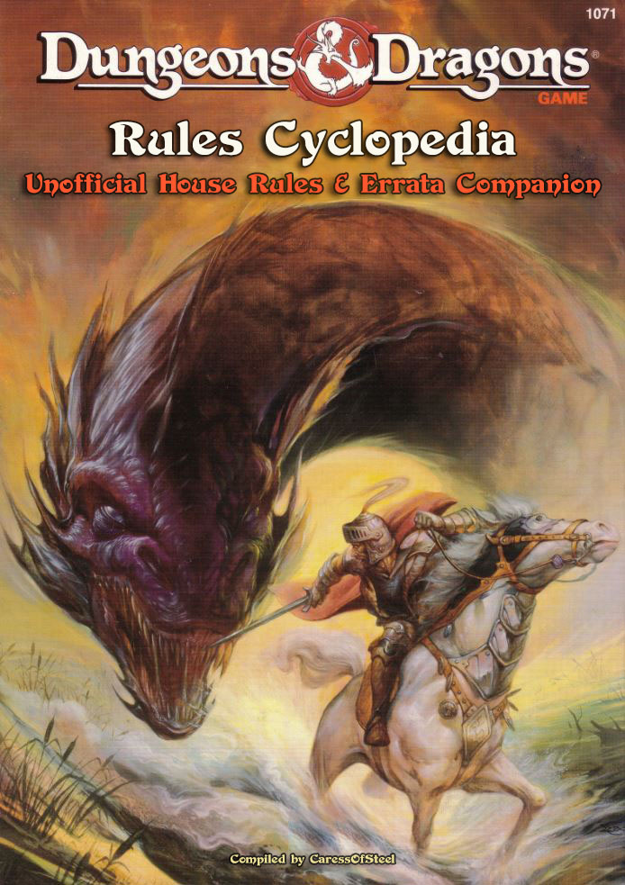
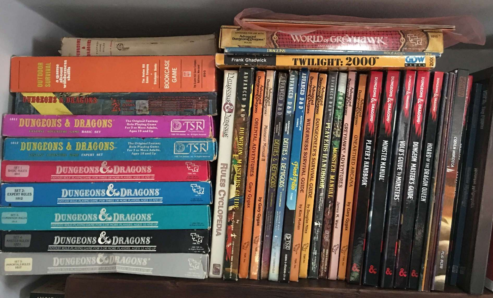
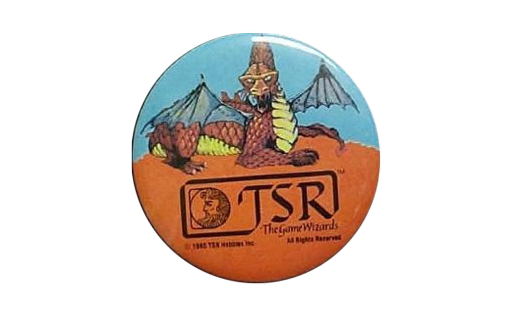

  

# Disclaimer

> **_This is not an official product and is in no way affiliated with TSR or Wizards of the Coast (WotC)._**

# Download

**_Last Updated on 2021.02.12_**

- <a href="https://github.com/caressofsteel/dndrulescyclopedia/blob/master/Unofficial Rules Cyclopedia Companion.pdf">PDF Download</a>
- <a href="https://caressofsteel.github.io/demos/dndrulescyclopedia/">View HTML Version</a>

_The project is created in Markdown and includes the files needed to convert to a PDF or HTML using [Pandoc](https://pandoc.org/) and [MikTex](https://miktex.org/)._

# Introduction

> The complexity of BECMI D&D emerged from a seemingly simple concept. Begin by killing the minions of evil in the dungeons, adventure out into the wilderness, build and empire, encounter gods on the outer planes, then ascend to immortality.. and "win" the game as an Immortal. -- Andrew M., August 18, 2015

This unofficial document — a work in progress — is my personal compilation of rule corrections, clarifications, suggested changes, and other material compiled from various sources to supplement the Dungeons & Dragons Rules Cyclopedia (RC) written by Aaron Allston and released by TSR in 1991. 

For those unaware the RC is a hard cover volume of (almost) all of the D&D rules from the Basic, Expert, Companion, and Master boxed sets of the early 1980s. The only box set not included is the Immortal Rules which was replaced by the [Wrath of the Immortals](https://en.wikipedia.org/wiki/Wrath_of_the_Immortals) box set also written by Allston.

There are various contradictions, errors, and omissions, in the RC which need to be fixed. There are also instances where the rules don't quite cover some situations that may need to be addressed, or there are loose ends or holes in the rules that need patched. Also, I have found that in many places the RC re-words certain descriptions and mechanics that are taken from the Mentzer-edited sets, and when enough care wasn't taken in doing so, the rules were changed from how they are supposed to function.

When possible, rules are gathered from other sources (B/X, AD&D, etc.) and adjusted so they all work together. In some cases, creating extra rules can't be avoided in order to fix issues that exist in the current rules. Suggestions have been added where they may provide value. Sources are cited with page numbers when possible. If a page number is mentioned alone, it is always referring to that page in the RC rather the page of this document.

One of my goals in compiling this unofficial document was to eventually [self-publish](https://www.lulu.com/) an updated version of the Rules Cyclopedia for my own personal use that includes the material contained within this document. With that in mind, I chose to format the document in [Markdown](https://www.markdownguide.org/) so that anyone could easily revise it to their liking and easily export to HTML or PDF.

  

# Official Sources

  

 The following offical texts were used in the creation of this document among many other sources. Several of the topics covered in this document were discussed directly with [Frank Mentzer](https://en.wikipedia.org/wiki/Frank_Mentzer "Creative Advisor to Gary Gygax"), Creative Advisor to Gary Gygax at TSR (1980-1985) and Founder of the [RPGA](https://en.wikipedia.org/wiki/RPGA).

- 1979 1st Edition AD&D Dungeon Master's Guide by Gary Gygax
- 1979 Holmes-edited Dungeons & Dragons rulebook
- 1981 Basic/Expert Binder Rules (Moldvay Cook)
- 1983-1986 Mentzer-edited BECMI Sets
- 1985 Book of Marvelous Magic by Frank Mentzer
- 1991 Classic D&D Game Rulebook 
- 1994 Classic D&D Boxed Set
- 1990s Dragon Magazine
- 1990s Dungeon Magazine
- 2002 Unofficial D&D Rules Cyclopedia Errata
- 2003-06-27 Wizards of the Coast 3rd Edition D&D FAQ
- 2005-05-25 Wizards of the Coast D&D FAQ version 3.5  

Aaron Oliver's extensive [_Rules Cyclopedia Errata & Companion_](http://web.newsguy.com/a_doom/RCerrata/) — which required a major undertaking to reformat properly into [Markdown](https://www.markdownguide.org/basic-syntax/) — was used as the basis for this document. This document also contains material from Jason MacInnes' [_Unofficial Dungeons & Dragons Rules Cyclopedia Errata_](https://www.acaeum.com/library/cyclopedia_errata.pdf), and various other sources.

# The History of Basic D&D

  

> The history of this product below was researched and written by Shannon Appelcline, the editor-in-chief of RPGnet and the author of "Designers & Dragons - a history of the roleplaying industry told one company at a time."

**_The Dungeons & Dragons Rules Cyclopedia (1991), compiled and developed by Aaron Allston was the triumphant finale to the BECMI edition of D&D (1983-85). It was published in November 1991._**

**The End of Basic D&D.** By 1991, Basic D&D was TSR's longest running roleplaying line. TSR traced the history of the game back to the release of the original D&D (1974). Even if you don't count that, the first game labeled as Basic D&D - the J. Eric Holmes Basic Set (July 1977) - appeared five months prior to the release of AD&D's Monster Manual (December 1977). It had since undergone two major revisions: the Tom Moldvay D&D Basic Set (1981), which was part of the B/X release, and which kicked off Basic D&D in its modern form; and the the Frank Mentzer D&D Basic Rules Set (1983), which was the first book in the BECMI revision.

Basic D&D had sold incredibly well at first, back in the late 70s and early 80s. Thanks in large part to the extensive publicity that D&D received from the James Egbert affair, new players were flocking to try out the game, and most of them went to TSR's introductory game - Basic D&D. That interest was in large part what led to the creation of the B/X and BECMI editions of the game, each of which expanded Basic D&D to allow for even more long-term play.

Unfortunately for Basic D&D, the pendulum began to swing toward AD&D as time went on. By the mid-80s, when popular books like Unearthed Arcana (1985) and Oriental Adventures (1985) were released, AD&D was clearly in ascendency, and Basic D&D was increasingly becoming the unwelcome relative who'd overstayed its welcome. The B-series ("Basic") adventures largely ended in 1985. The rest of the BECMI coded adventures finished up in 1987; other than the production of two final introductory adventures, B11: "King's Festival" (1989) and B12: "Queen's Harvest" (1989) a few years later. The "GAZ" line of Known World setting books then stumbled to a halt in 1991, with just one book published in each of the last years.

Although there were some new efforts like the "DDA" adventures (1990-91) and the Hollow World Setting (1990-92), it was clear that Basic D&D's flame was quickly fading.

**A Black Box and a Hardcover Book.** TSR tried to revive Basic D&D one last time in 1991 with a pair of new rules releases. The first was The New Easy to Master Dungeons & Dragons Game(1991), called alternatively the "Black Box edition," the "fifth edition," and "ten-seventy" (its product code, 1070) internally at TSR. It was a boxed D&D set that TSR described as "the first truly introductory version" of the game (as they had with every other "Basic" version of the game). The Black Box used cards to teach the game, something that had been advocated by Lorraine Williams based on the SRA reading programs (1957).

The Black Box is reported to have sold quickly and well. Approximately a half-million copies were purchased worldwide. It was also supplemented by a set of adventures that were almost boardgame-like with their colorful dungeon maps and figures. Unfortunately, the Black Box had one problem, the same problem that D&D "Basic" sets always had: it was limited in level, though it actually went up to 5th level, a bit higher than Basic's 3rd-level standard.

This limitation dovetailed nicely into TSR's other major plan for Basic D&D in 1991. Though the BECMI set of Basic D&D rules had always been well received, everyone thought it was quite troublesome to go through seven booklets totaling 368 pages when trying to track down a specific spell or magic item. Thus TSR decided to compile all of the rules into one hardcover book. The Rules Cyclopedia was the result - and it also offered somewhere for the Black Box players to go when they finished with fifth level.

Ironically, this was reportedly the exact same setup that Gygax had planned for the J. Eric Holmes Basic Set and also for AD&D, way back in 1977.

**The Compilation.** The Rules Cyclopedia is a compilation of the D&D Basic Rules Set (1983), the D&D Expert Rules Set (1983), the D&D Companion Rules (1984), and the D&D Master Rules (1985). It contains not only the rules from those boxed sets, but also the monsters, making the Rules Cyclopedia one of two great sources for Basic D&D monsters, the other being the Creature Catalog(1986, 1993). Rules for skills and magic item creation from the "GAZ" Gazetteers (1987-91) are also included, making the Rules Cyclopedia a truly massive compilation of about a decade's worth of Basic D&D rules.

The Immortals Rules (1986) are notably not included in the Rules Cyclopedia, although it does contain seven pages from the Master Rules that include basic information for immortals, including rules on PCs ascending to those lofty ranks.

Rules on jousting in tournaments and on artifacts were also left out of the Rules Cyclopedia.

**Not an Introductory Book!** Unlike every other iteration of Basic D&D, this one was not intended to be an introductory roleplaying book. It was instead a reference for Basic D&D play, which matched TSR's thinking about the AD&D 2e rules.

Expanding the Known World. The Rules Cyclopedia doesn't expand the Known World in any notable way, but it does include a rather impressive atlas, featuring 16 full color maps, including the maps from the Gazetteers and the world maps from the Master Rules and the Hollow World Campaign Set (1990).

**Future History.** The Black Box rules and the Rules Cyclopedia got some joint support in the form of the "Thunder Rift" series of low-level adventures (1992-93). The Rules Cyclopedia also was supplemented with a few boxed releases, the most notable of which was Wrath of the Immortals (1992), a new set of immortals rules.

However, after the Black Box was revised one more time as The Classic Dungeons & Dragons Game (1994), all support for the line ended. After 22 years (or 19 if you prefer), Basic D&D was finally dead.

**About the Creators.** Though lots of people worked on the Rules Cyclopedia, the two most notable creators are Frank Mentzer, who wrote all the original boxes, and Aaron Allston, who led the Rules Cyclopedia project. Mentzer had left TSR for New Infinities back in 1986, which was likely why he wasn't directly involved in this project. Allston didn't work for TSR at all, but instead had been a freelance RPG writer since 1983. Though he only tended to write one or two books for TSR each year, by the early 90s he was writing the biggest releases for Basic D&D, including the Hollow World Campaign Setting, the D&D Rules Cyclopedia, and Wrath of the Immortals.

# Preface

_This is a game that is fun. It helps you imagine._

> As you whirl around, your sword ready, the huge, red, fire-breathing dragon swoops toward you with a ROAR!

See? Your imagination woke up already. Now imagine: This game may be more fun than any other game you have ever played!

The DUNGEONS & DRAGONS® game is a way for us to imagine together — like watching the same movie, or reading the same book. But _you_ can write the stories, without putting a word on paper — just by playing the D&D® game.

You, along with your friends, will create a great fantasy story, you will put it away after each game, and go back to school or work, but — like a book — the adventure will wait. It's better than a book, though; it will keep going as long as you like.

It is nearly the most popular game ever made. And you will see why, in just a bit.

When you bought some other game or book, did you ever think, "Gee, that's nice, but it's not quite what I thought it would be"? Well, your D&D adventures will be just what you want, because you're the one making them up!

And it's not hard. It takes a little reading and a little thinking, but most of all, it's fun.

It's fun when you discover that nobody loses, and everybody wins! It's fun when you get good at the game . . . for example, knowing what to expect in a kobold cave, and which dragons are on your side.

**And you don't have to put in a coin each time, like many other games.** Once you have these rules, you don't need anything else.

There's more, of course, if you want it: exciting adventures to play, miniature figures of monsters and characters, expert rules for more experienced players, and lots more. But you already have everything you need to start: this package, and your imagination. That will do it.

Ah, yes; it does cost one more thing, which you also have right now — a bit of time. It takes a few minutes to learn the basic rules, and another hour or two to play a full game. You will probably want to spend more time, and might even make it a hobby; millions of people have. But for now, just sit back and imagine.

> Your character stands atop a grassy hill... the sun glints off your golden hair, rippling in the warm breeze ... you absent-mindedly rub the gem-studded hilt of your magic sword, and glance over at the dwarf and elf, bickering as usual about how to load the horses ... the magic-user has memorized her spells, and says she's ready to go ... a dangerous dungeon entrance gapes at you from the mountain nearby, and inside, a fearsome dragon awaits. Time to get moving ...

**Have Fun!**

_Frank Mentzer, February, 1983_

  

