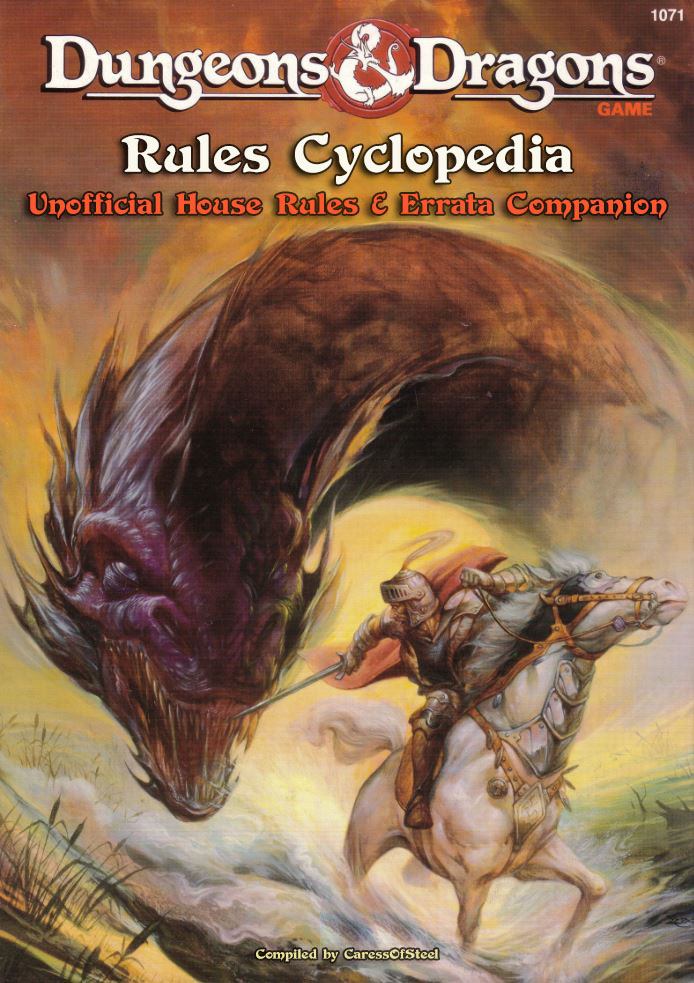
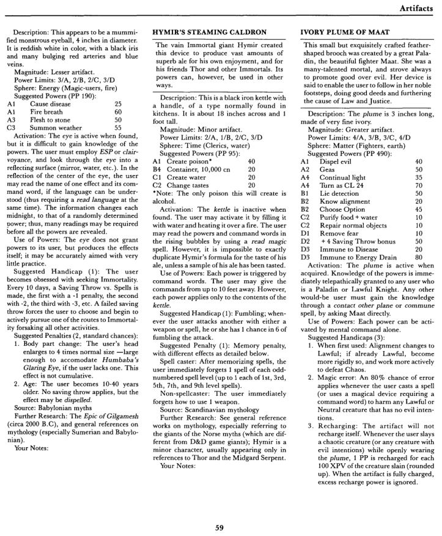

\pagebreak
# Disclaimer

> **_This is not an official product and is in no way affiliated with TSR or Wizards of the Coast (WotC)._**

\pagebreak
# Introduction

**_Last Updated on 2021.02.12_**

> The complexity of BECMI D&D emerged from a seemingly simple concept. Begin by killing the minions of evil in the dungeons, adventure out into the wilderness, build and empire, encounter gods on the outer planes, then ascend to immortality.. and "win" the game as an Immortal. -- Andrew M., August 18, 2015

This unofficial document — a work in progress — is my personal compilation of rule corrections, clarifications, suggested changes, and other material compiled from various sources to supplement the Dungeons & Dragons Rules Cyclopedia (RC) written by Aaron Allston and released by TSR in 1991. 

For those unaware the RC is a hard cover volume of (almost) all of the D&D rules from the Basic, Expert, Companion, and Master boxed sets of the early 1980s. The only box set not included is the Immortal Rules which was replaced by the [Wrath of the Immortals](https://en.wikipedia.org/wiki/Wrath_of_the_Immortals) box set also written by Allston.

There are various contradictions, errors, and omissions, in the RC which need to be fixed. There are also instances where the rules don't quite cover some situations that may need to be addressed, or there are loose ends or holes in the rules that need patched. Also, I have found that in many places the RC re-words certain descriptions and mechanics that are taken from the Mentzer-edited sets, and when enough care wasn't taken in doing so, the rules were changed from how they are supposed to function.

When possible, rules are gathered from other sources (B/X, AD&D, etc.) and adjusted so they all work together. In some cases, creating extra rules can't be avoided in order to fix issues that exist in the current rules. Suggestions have been added where they may provide value. Sources are cited with page numbers when possible. If a page number is mentioned alone, it is always referring to that page in the RC rather the page of this document.

One of my goals in compiling this unofficial document was to eventually [self-publish](https://www.lulu.com/) an updated version of the Rules Cyclopedia for my own personal use that includes the material contained within this document. With that in mind, I chose to format the document in [Markdown](https://www.markdownguide.org/) so that anyone could easily revise it to their liking and easily export to HTML or PDF.


\pagebreak
# Official Sources

{ width=100% }

 The following offical texts were used in the creation of this document among many other sources. Several of the topics covered in this document were discussed directly with [Frank Mentzer](https://en.wikipedia.org/wiki/Frank_Mentzer "Creative Advisor to Gary Gygax"), Creative Advisor to Gary Gygax at TSR (1980-1985) and Founder of the [RPGA](https://en.wikipedia.org/wiki/RPGA).

- 1979 1st Edition AD&D Dungeon Master's Guide by Gary Gygax
- 1979 Holmes-edited Dungeons & Dragons rulebook
- 1981 Basic/Expert Binder Rules (Moldvay Cook)
- 1983-1986 Mentzer-edited BECMI Sets
- 1985 Book of Marvelous Magic by Frank Mentzer
- 1991 Classic D&D Game Rulebook 
- 1994 Classic D&D Boxed Set
- 1990s Dragon Magazine
- 1990s Dungeon Magazine
- 2002 Unofficial D&D Rules Cyclopedia Errata
- 2003-06-27 Wizards of the Coast 3rd Edition D&D FAQ
- 2005-05-25 Wizards of the Coast D&D FAQ version 3.5  

Aaron Oliver's extensive [_Rules Cyclopedia Errata & Companion_](http://web.newsguy.com/a_doom/RCerrata/) — which required a major undertaking to reformat properly into [Markdown](https://www.markdownguide.org/basic-syntax/) — was used as the basis for this document. This document also contains material from Jason MacInnes' [_Unofficial Dungeons & Dragons Rules Cyclopedia Errata_](https://www.acaeum.com/library/cyclopedia_errata.pdf), and various other sources.

\pagebreak
# The History of Basic D&D

{ width=50% }

> The history of this product below was researched and written by Shannon Appelcline, the editor-in-chief of RPGnet and the author of "Designers & Dragons - a history of the roleplaying industry told one company at a time."

**_The Dungeons & Dragons Rules Cyclopedia (1991), compiled and developed by Aaron Allston was the triumphant finale to the BECMI edition of D&D (1983-85). It was published in November 1991._**

**The End of Basic D&D.** By 1991, Basic D&D was TSR's longest running roleplaying line. TSR traced the history of the game back to the release of the original D&D (1974). Even if you don't count that, the first game labeled as Basic D&D - the J. Eric Holmes Basic Set (July 1977) - appeared five months prior to the release of AD&D's Monster Manual (December 1977). It had since undergone two major revisions: the Tom Moldvay D&D Basic Set (1981), which was part of the B/X release, and which kicked off Basic D&D in its modern form; and the the Frank Mentzer D&D Basic Rules Set (1983), which was the first book in the BECMI revision.

Basic D&D had sold incredibly well at first, back in the late 70s and early 80s. Thanks in large part to the extensive publicity that D&D received from the James Egbert affair, new players were flocking to try out the game, and most of them went to TSR's introductory game - Basic D&D. That interest was in large part what led to the creation of the B/X and BECMI editions of the game, each of which expanded Basic D&D to allow for even more long-term play.

Unfortunately for Basic D&D, the pendulum began to swing toward AD&D as time went on. By the mid-80s, when popular books like Unearthed Arcana (1985) and Oriental Adventures (1985) were released, AD&D was clearly in ascendency, and Basic D&D was increasingly becoming the unwelcome relative who'd overstayed its welcome. The B-series ("Basic") adventures largely ended in 1985. The rest of the BECMI coded adventures finished up in 1987; other than the production of two final introductory adventures, B11: "King's Festival" (1989) and B12: "Queen's Harvest" (1989) a few years later. The "GAZ" line of Known World setting books then stumbled to a halt in 1991, with just one book published in each of the last years.

Although there were some new efforts like the "DDA" adventures (1990-91) and the Hollow World Setting (1990-92), it was clear that Basic D&D's flame was quickly fading.

**A Black Box and a Hardcover Book.** TSR tried to revive Basic D&D one last time in 1991 with a pair of new rules releases. The first was The New Easy to Master Dungeons & Dragons Game(1991), called alternatively the "Black Box edition," the "fifth edition," and "ten-seventy" (its product code, 1070) internally at TSR. It was a boxed D&D set that TSR described as "the first truly introductory version" of the game (as they had with every other "Basic" version of the game). The Black Box used cards to teach the game, something that had been advocated by Lorraine Williams based on the SRA reading programs (1957).

The Black Box is reported to have sold quickly and well. Approximately a half-million copies were purchased worldwide. It was also supplemented by a set of adventures that were almost boardgame-like with their colorful dungeon maps and figures. Unfortunately, the Black Box had one problem, the same problem that D&D "Basic" sets always had: it was limited in level, though it actually went up to 5th level, a bit higher than Basic's 3rd-level standard.

This limitation dovetailed nicely into TSR's other major plan for Basic D&D in 1991. Though the BECMI set of Basic D&D rules had always been well received, everyone thought it was quite troublesome to go through seven booklets totaling 368 pages when trying to track down a specific spell or magic item. Thus TSR decided to compile all of the rules into one hardcover book. The Rules Cyclopedia was the result - and it also offered somewhere for the Black Box players to go when they finished with fifth level.

Ironically, this was reportedly the exact same setup that Gygax had planned for the J. Eric Holmes Basic Set and also for AD&D, way back in 1977.

**The Compilation.** The Rules Cyclopedia is a compilation of the D&D Basic Rules Set (1983), the D&D Expert Rules Set (1983), the D&D Companion Rules (1984), and the D&D Master Rules (1985). It contains not only the rules from those boxed sets, but also the monsters, making the Rules Cyclopedia one of two great sources for Basic D&D monsters, the other being the Creature Catalog(1986, 1993). Rules for skills and magic item creation from the "GAZ" Gazetteers (1987-91) are also included, making the Rules Cyclopedia a truly massive compilation of about a decade's worth of Basic D&D rules.

The Immortals Rules (1986) are notably not included in the Rules Cyclopedia, although it does contain seven pages from the Master Rules that include basic information for immortals, including rules on PCs ascending to those lofty ranks.

Rules on jousting in tournaments and on artifacts were also left out of the Rules Cyclopedia.

**Not an Introductory Book!** Unlike every other iteration of Basic D&D, this one was not intended to be an introductory roleplaying book. It was instead a reference for Basic D&D play, which matched TSR's thinking about the AD&D 2e rules.

Expanding the Known World. The Rules Cyclopedia doesn't expand the Known World in any notable way, but it does include a rather impressive atlas, featuring 16 full color maps, including the maps from the Gazetteers and the world maps from the Master Rules and the Hollow World Campaign Set (1990).

**Future History.** The Black Box rules and the Rules Cyclopedia got some joint support in the form of the "Thunder Rift" series of low-level adventures (1992-93). The Rules Cyclopedia also was supplemented with a few boxed releases, the most notable of which was Wrath of the Immortals (1992), a new set of immortals rules.

However, after the Black Box was revised one more time as The Classic Dungeons & Dragons Game (1994), all support for the line ended. After 22 years (or 19 if you prefer), Basic D&D was finally dead.

**About the Creators.** Though lots of people worked on the Rules Cyclopedia, the two most notable creators are Frank Mentzer, who wrote all the original boxes, and Aaron Allston, who led the Rules Cyclopedia project. Mentzer had left TSR for New Infinities back in 1986, which was likely why he wasn't directly involved in this project. Allston didn't work for TSR at all, but instead had been a freelance RPG writer since 1983. Though he only tended to write one or two books for TSR each year, by the early 90s he was writing the biggest releases for Basic D&D, including the Hollow World Campaign Setting, the D&D Rules Cyclopedia, and Wrath of the Immortals.

\pagebreak
# Preface

_This is a game that is fun. It helps you imagine._

> As you whirl around, your sword ready, the huge, red, fire-breathing dragon swoops toward you with a ROAR!

See? Your imagination woke up already. Now imagine: This game may be more fun than any other game you have ever played!

The DUNGEONS & DRAGONS® game is a way for us to imagine together — like watching the same movie, or reading the same book. But _you_ can write the stories, without putting a word on paper — just by playing the D&D® game.

You, along with your friends, will create a great fantasy story, you will put it away after each game, and go back to school or work, but — like a book — the adventure will wait. It's better than a book, though; it will keep going as long as you like.

It is nearly the most popular game ever made. And you will see why, in just a bit.

When you bought some other game or book, did you ever think, "Gee, that's nice, but it's not quite what I thought it would be"? Well, your D&D adventures will be just what you want, because you're the one making them up!

And it's not hard. It takes a little reading and a little thinking, but most of all, it's fun.

It's fun when you discover that nobody loses, and everybody wins! It's fun when you get good at the game . . . for example, knowing what to expect in a kobold cave, and which dragons are on your side.

**And you don't have to put in a coin each time, like many other games.** Once you have these rules, you don't need anything else.

There's more, of course, if you want it: exciting adventures to play, miniature figures of monsters and characters, expert rules for more experienced players, and lots more. But you already have everything you need to start: this package, and your imagination. That will do it.

Ah, yes; it does cost one more thing, which you also have right now — a bit of time. It takes a few minutes to learn the basic rules, and another hour or two to play a full game. You will probably want to spend more time, and might even make it a hobby; millions of people have. But for now, just sit back and imagine.

> Your character stands atop a grassy hill... the sun glints off your golden hair, rippling in the warm breeze ... you absent-mindedly rub the gem-studded hilt of your magic sword, and glance over at the dwarf and elf, bickering as usual about how to load the horses ... the magic-user has memorized her spells, and says she's ready to go ... a dangerous dungeon entrance gapes at you from the mountain nearby, and inside, a fearsome dragon awaits. Time to get moving ...

**Have Fun!**

_Frank Mentzer, February, 1983_

# Page 6-7, Character Creation

{ width=100% }

## Prime Requisite

As stated on page 145, and worth making a note of here, a player can switch his highest score with the Prime Requisite of the class he wants to play (before any other adjustments are made).
 
## Suggested Rules
 
I know everyone probably has their own house rules for creating characters, but I will offer a quick suggestion here. Allow each player to roll up 3 sets of stats and pick which set he wants to use, discarding the rest. 
  
I think many people just start characters out with maximum Hit Points, but that takes away a bit of the fun of rolling them up. And to make that balanced, you would also have to start monsters with maximum hit points for their first Hit Die.. Instead, a good alternate method, borrowed from AD&D Unearthed Arcana, is to roll for your Hit Points and apply any appropriate Constitution modifiers as usual, and then if your starting Hit Points are below the following minimum values for your Hit Die, raise your Hit Points to the minimum. This only applies to the very first roll of a new character's Hit Points, not further rolls after gaining more levels (though [Frank Mentzer](https://en.wikipedia.org/wiki/Frank_Mentzer "Creative Advisor to Gary Gygax") says he always allows a player to re-roll a result of "1" for a Hit Point roll, at any level).
 
| Hit Die | Min. HP
| :---    | :---
| d4      | 3
| d6      | 4
| d8      | 5

# Page 8, Armor Class

## Ascending Armor Class

Basic D&D uses descending Armor Class (AC) aka THAC0 (To Hit Armor Class 0). To convert over to the more modern Ascending AC you'll need to do the following:

- Adjust the armor table and convert armor to give ascending bonuses.
- Roll d20 + your attack bonus and you need to score at least your opponents AC to hit.
- An unarmored human with AC 9 becomes AC 11 in the ascending system:
  - Unarmored Human (Armor Class: 9)
    - 20 - 9 = 11 to hit
  - HobGoblin (Armor Class: 6)
    - 20 - 6 = 14 to hit

| Type 	        | Armor bonus
| :---          | :----  
| Unarmored 	  | Base AC 11
| Leather Armor | +2
| Scale Mail 	  | +3
| Chain Mail 	  | +4
| Banded Mail 	| +5
| Plate Mail 	  | +6
| Suit Armor* 	| +9
| Shield 	      | +1

_\* Full plate armor, fitted for the user. No one can use suit armor made to another person without modifications. Modifying suit armor costs (3 + 1d4) * 10% of the original cost and takes one week._

Next, we convert all character class _to-hit_ tables to _attack bonus by level_ tables using the to-hit AC 9 (unarmored man) column on the attack table.

| Human Attack Bonuses
| :---:

| Level 	    | Fighter 	  | Cleric/Thief  |Magic-user
| :---        | :---:       | :---:         | :---:   
| 1 	        | +1 	        | +1 	          | +1       
| 2 	        | +1 	        | +1 	          | +1       
| 3 	        | +1 	        | +1 	          | +1       
| 4 	        | +3 	        | +1 	          | +1       
| 5 	        | +3 	        | +3 	          | +1       
| 6 	        | +3 	        | +3 	          | +3       
| 7 	        | +5 	        | +3 	          | +3       
| 8 	        | +5 	        | +3 	          | +3       
| 9 	        | +5 	        | +5 	          | +3       
| 10          | +7 	        | +5 	          | +3       
| 11          | +7 	        | +5 	          | +5       
| 12          | +7 	        | +5 	          | +5       
| 13          | +9 	        | +7 	          | +5       
| 14          | +9 	        | +7 	          | +5       
| 15          | +9 	        | +7 	          | +5       
| 16          | +9 	        | +7 	          | +7       
| 17          | +9 	        | +9 	          | +7       
| 18          | +9 	        | +9 	          | +7       
| 19          | +9 	        | +9 	          | +7       
| 20          | +9 	        | +9 	          | +7       
| 21          | +9 	        | +9 	          | +9       
| 22          | +11*        | +9 	          | +9       
| 23          | +11*        | +9 	          | +9       
| 24          | +11*        | +9 	          | +9       
| 25          | +13*        | +9 	          | +9       
| 26          | +13*        | +9 	          | +9       
| 27          | +13*        | +9 	          | +9       
| 28          | +15*        | +9 	          | +9       
| 29          | +15*        | +11*          | +9       
| 30          | +15*        | +11*          | +9       
| 31          | +17*        | +11*          | +9       
| 32          | +17*        | +11*          | +9       
| 33          | +17*        | +13*          | +9       
| 34          | +19*        | +13*          | +9       
| 35          | +19*        | +13*          | +9       
| 36          | +19*        | +15*          | +11*     

_\* Every point character of this level beats his opponents AC is dealt as extra damage in the attack._

| Demi-Human Attack Bonus
| :---:

|Level / Rank (Dwarf) 	| Dwarf 	| Elf 	  | Halfling 	| Level / Rank (Elf/Halfling)
| :---                  | :----:  | :----:  | :----:    | :----:
| 1 	                  | +1 	    | +1 	    | +1         | 1
| 2 	                  | +1 	    | +1 	    | +1         | 2
| 3 	                  | +1 	    | +1 	    | +1         | 3
| 4 	                  | +3 	    | +3 	    | +3         | 4
| 5 	                  | +3 	    | +3 	    | +3         | 5
| 6 	                  | +3 	    | +3 	    | +3         | 6
| 7 	                  | +5 	    | +5 	    | +5         | 7
| 8 	                  | +5 	    | +5 	    | +5         | 8, A
| 9 	                  | +5 	    | +6 	    | +6         | 9, B
| 10                    | +7      | +7 	    | +7         | C
| 11                    | +7      | +8 	    | +8         | D
| 12                    | C 	    | +7 	    | +7         | +7, E
| D 	                  | +8 	    | +7 	    | +7         | F
| E 	                  | +9 	    | +7 	    | +7         | G
| F 	                  | +9 	    | +7 	    | +7         | H
| G 	                  | +9 	    | +7 	    | +7         | I
| H 	                  | +9 	    | +8 	    | +8         | J
| I 	                  | +9 	    | +9 	    | +9         | K
| J 	                  | +10     | +10     | +10        | L
| K 	                  | +11*    | +11*    | +11*       | M
| L 	                  | +12*    |  		    |            |
| M 	                  | +13*    |  		    |            |

_\* Every point character of this level beats his opponents AC is dealt as extra damage in the attack._

| Monster Attack Bonus
| :---:

|HD          | Attack Bonus
| :---:      | :---:
| Normal Man | +0
| Up to 1 	 | +1
| 1+ - 2 	   | +2
| 2+ - 3 	   | +3
| 3+ - 4 	   | +4
| 4+ - 5 	   | +5
| 5+ - 6 	   | +6
| 6+ - 7 	   | +7
| 7+ - 8 	   | +8
| 8+ - 9 	   | +9
| 9+ - 11 	 | +9
| 11+ - 13 	 | +9
| 13+ - 15 	 | +9
| 15+ - 17 	 | +9
| 17+ - 19 	 | +10
| 19+ - 21 	 | +11*
| 21+ - 23 	 | +12*
| 23+ - 25 	 | +13*
| 25+ - 27 	 | +14*
| 27+ - 29 	 | +15*
| 29+ - 31 	 | +16*
| 31+ - 33 	 | +17*
| 33+ - 35 	 | +18*
| 35+ and up | +19*

_\* Every point character of this level beats his opponents AC is dealt as extra damage in the attack._

Naturally characters add their Strength modifier to melee attacks and Dexterity modifier to ranged attacks. The asterisk is something I had to come up with since there wasn't a direct way to convert the rule in Rules Cyclopedia. 

In Rules Cyclopedia, after certain point the _to-hit_ table started saying that **_only misses on natural 1 and add the number shown to damage of the attack_**. Basically, you're such a bad ass that you hardly ever miss, and every time you hit you do extra damage. This isn't exactly the same, but there is the extra damage component. The math most likely doesn't add up, but I'm not worried; the first times this comes up is beyond level 20.

# Page 9, Adjustments for Ability Scores


## High Wisdom and Saving Throws

The bonus or penalty for Wisdom is always applied to Saving Throws vs. Rod, Staff, or Spell, but it can also apply to other Saving Throws too, such as vs. Magic Wands, vs. Death Ray or Poison, or vs. Paralysis or Turn to Stone if the attack is caused by a spell effect or a magic item which produces a spell effect.

## Bonuses and Penalties

The possibility exists for scores to be lower than 3 or greater than 18. For example, some monsters have Intelligence scores that can be higher than 18, or a character could have his Constitution reduced below 3 from magical aging attacks. If you want to determine the appropriate adjustments for such scores, you can use the table found in the Players' Guide to Immortals, page 30:

## Bonuses and Penalties for Ability Scores

| Ability Score     | Adjustment  
| :---              | :---
| 0-5               |
| 1-4               |
| 2-3     	        | -3
| 4-5     	        | -2
| 6-8     	        | -1
| 9-12    	        | No adj.
| 13-15   	        | +1
| 16-17   	        | +2
| 18      	        | +3
| 19-20   	        | +4
| 21-23   	        | +5
| 24-27   	        | +6

The table continues all the way up to 100, but that's far beyond the scope of this document, since there is no way for mortal Player Characters to ever have a score higher than 18, even when using the supreme power of an Artifact. Players Guide to Immortals, page 18, notes, "Mortal ability scores cannot exceed 18, and any increase in excess of this is discarded."

# Page 10, Languages, Charisma Adjustment Table
 
## Languages

Despite what is indicated in this section, Alignment Languages have no written form; this is specifically stated on page 11. To make sense of Alignment Languages, do not consider them to be like mundane languages; they are more a result of the magical connection a character has to the Immortals of his Alignment, which in turn links him to all other intelligent creatures of that Alignment so that communication is possible.

For characters with a high Intelligence, look on page 258 to find a sample list of extra languages to choose from.
 
 
## Charisma Adjustment Table
 
The Charisma Adjustment Table is inconsistent with previous editions. The Charisma Reaction Adjustments were traditionally different than the standard adjustments for ability scores; reaction rolls are made with 2d6, so the adjustments to them are not supposed to be so large.

The tables showing the previous adjustments can be found in the Basic Player's Manual p.36 or 51, or the Master DM's Book p.3, or the Players' Guide to Immortals p.30 (which includes some additional numbers outside the normal ranges, just to be thorough):

```
------------------------------------------
        Charisma Adjustment Table
------------------------------------------
  
  Charisma  Reaction  Maximum No. Retainer
  Score   Adjustment  Retainers   Morale
------------------------------------------
    1           -3         1          3
    2-3         -2         1          4
    4-5         -1         2          5
    6-8         -1         3          6
    9-12      No adj.      4          7
    13-15       +1         5          8
    16-17       +1         6          9
    18          +2         7         10
    19-20       +2         8         11
    21-23       +3         9         12
                    ...
------------------------------------------
```

With that noted, it's probably fine to just use the standard adjustments to avoid complication, and Charisma doesn't need to be more of a "dump stat" than it already is; if someone has a 16 Charisma, let them have the +2 bonus..

# Page 10, Natural Healing Rule

There's space at the bottom of this page, which bears the column about hit points, where we can place the missing natural healing rule:

Each full day of complete rest (no fighting or traveling!) will restore 1d3 hit points. If those resting are interrupted during that day in any way, then no healing will take place.

Or, from the 1994 Edition: Instead restore 1d4 hit points. There's also a mistake on this page, in the third heading under _Maximum Levels and Experience Points_. Score a line through _and elves_ that appears in the first paragraph. Elves can only attain a level of 10.

# Page 14, 18, Clerics/Avengers Turning/Controlling Undead

## Cleric Level Titles
Cleric titles: All level titles were omitted in the Rules Cyclopedia. However, in the cases of thieves and clerics, you may find them still to be of value. Cleric table is below. Thieves' table is on page 2.

| Level   |  Title    
| :---    |   :----   
|1        |  Acolyte  
|2        |  Adept    
|3        |  Priest   
|4        |  Vicar    
|5        |  Curate   
|6        |  Elder    
|7        |  Bishop   
|8        |  Lama     
|9        |  Patriarch

## Turning Undead  
There are a lot of holes that need to be patched in the description of Turning Undead here, and it needs to be altered to be in line with the Control ability of Avengers (p.18, Avengers, paragraph 4), which also needs to be balanced. The following is just taking the actual rules from various places and combining them all so everything works together, with a few slight changes to Clerics.

Notice the _But don't forget, if the monster is turned, it hasn't been destroyed, it may decide to
return soon..._ Now that's nice and vague. From the Basic rule book: _They will stay away 1d10 rounds._ To
determine whether the monsters return when the turning wears off, _make a Reaction roll. If the result of the roll
is 8 or more, the undead return._

## Holy Symbols
 
First off, the third paragraph states that a Cleric does not need a Holy Symbol to Turn Undead, but this was not found in any of the Mentzer sets, and Frank has stated that a Cleric absolutely does need a Holy Symbol in order to Turn Undead. Should a Cleric find himself without a Holy Symbol, he could fabricate a rough one for himself, but Frank suggests this will cause a penalty of -4 to any rolls involved in Turning. There is also the 5 gp "inexpensive Holy Symbol" found on the Adventuring Gear Table in the entry for page 69, which Frank suggests should inflict a -2 penalty to Turning rolls. A character with the appropriate General Skills could create these (e.g., Crafting, Art, Metalworking, etc.). 

The high-quality 25 gp Holy Symbol would be something created by a Cleric's church. As with Holy Water, the specific creation process is never described, so is left up to the DM (perhaps it could be treated similar to creating Magic Items as described in Chapter 16). 
 
## Suggested Rules
  
Chaotic Clerics and Avengers cannot Destroy undead, but they may Control (or "Dominate") them, ONLY on a D result or better. 

For Chaotic Clerics and Avengers, if Control is not chosen (or in the rare case a Lawful Cleric chooses not to Destroy), treat D, D+, or D# results as T, T+, and T# (increasing the number of undead that are Turned). 

Neutral Clerics may only Turn undead, treating the D+ and D# results as above.

I would disregard part of the last paragraph under "Turning Undead" about failing to Turn one specific monster, since Turning isn't a targeted effect; it affects groups of undead in the area. The Basic Dungeon Masters Rulebook, p.21, says, "If an attempt at Turning Undead is successful and more Undead remain, the Cleric may Turn them again. Once a failure to Turn occurs, further attempts by that Cleric will have no effect." The 1991 D&D Game Rulebook, p.7, adds, "Once a cleric fails an attempt to turn undead, all his other attempts during the same battle also fail." This would apply even if new undead of differing types arrive and join the fight. Speaking of which, the 1E AD&D DMG, p.65, has some guidelines for turning groups containing different types of undead. All weaker undead in the group must be Turned before the stronger ones can be Turned. This order should be determined first by the difficulty of the actual Turn attempt (working your way up the Turning Undead Table), and then by the HD of the creatures.

The difficulty of the Turn attempt can vary greatly if the lesser undead are being controlled by some greater undead (see pages 217-218 about Lieges and Pawns). For example, in a mixed  group of undead, a Cleric would have to Turn any free-willed Wraiths before he could Turn Skeletons which were being controlled by a Vampire, because the first Turn attempt against a Pawn is made as if it's against the Liege. Then, because they have fewer HD, the Cleric would have to turn the Skeletons before attempting to Turn the Vampire.

**Range and Area of Effect**

These aspects of Turning are never mentioned, but the D&D FAQ v3.5 gives some details that can easily be imported. page 30 of that FAQ indicates that Turning can potentially affect any undead within a 60' radius of the Cleric, as long as the undead isn't completely shielded from the Cleric by something solid (behind full cover), but otherwise, p.5 of the v3.5 FAQ states that the visibility of the undead or the Cleric is irrelevant for successful Turning.

**Duration of Turn or Control**

On any successful result which required a roll (7, 9, or 11) the undead will be Turned (i.e., they will not touch the Cleric, and will flee as far away from him as possible) for only 1-10 rounds, after which time the undead will return to the area if they make a Reaction Roll of 8 or higher on 2d6 or at the DMs discretion (Basic DMs Rulebook, p.31). For any automatically successful Turn (T or better -- a much more powerful effect) the undead will be Turned (or Controlled, for Chaotic Clerics or Avengers with a D result) for one game turn (10 minutes) per CLERICAL level (not the Avenger's actual level, as stated in his description). The same Reaction Roll applies afterward to see if the undead return to the area. Also note that when the duration of Control ends, the undead flee as if Turned, for a duration as would be normal for the Cleric's level. An undead that is under any kind of Turn effect cannot be Controlled until the duration of the Turn effect ends.

Some undead get Saving Throws against Turning. Other than the ones specifically mentioned in the monster descriptions, also note that on Page 218 it says that undead spellcasters may make a Saving Throw vs. Spells to avoid any T or D result entirely. Many types of undead have the potential to be spellcasters.. When an undead gets a Save against Destruction, it should be applied against Control as well. For undead that get a Saving Throw against T results, it should also apply against non- automatic Turning (i.e., successful rolls of 7, 9, or 11).

# Page 15, Optional Turning Variation
  
I created an alternate dice mechanic for Turning Undead, which simplifies things by using the Hit Dice of the undead instead of its creature type, and has other benefits such as keeping Skeletons and Zombies as viable opponents for a bit longer (normally a 2nd level Cleric can automatically Turn skeletons; that's a bit too easy, too soon in the scope of the full game system). This method also unifies all the mechanics discussed above (Destroy/Dominate), and it pretty easy to implement. Other rules for Turning still apply.
 
 
The Cleric attempting to Turn rolls 2d6
- Add 2 for each Level of the Cleric
- Subtract 2 for each HD/Level of the undead

``` 
-----------------------------------------------------------
 Result  Effect              | Result  Effect
-----------------------------|-----------------------------
     7 = Fail                |    20 = D, 2 Rounds        
     8 = T, 2 Rounds         |    21 = D, 4 Rounds        
     9 = T, 4 Rounds         |    22 = D, 6 Rounds        
    10 = T, 6 Rounds         |    23 = D, 8 Rounds        
    11 = T, 8 Rounds         |    24 = D, 10 Rounds       
    12 = T, 10 Rounds        |    25 = D, 12 Rounds       
    13 = T, 12 Rounds        |    26 = D, 1 Turn          
    14 = T, 1 Turn           |    27 = D, 2 Turns         
    15 = T, 2 Turns          |    28 = D, 3 Turns         
    16 = T, 3 Turns          |    29 = D, 4 Turns         
    17 = T, 4 Turns          |    30 = D, 5 Turns         
    18 = T, 5 Turns          |    31 = D, 6 Turns (1 Hour)
    19 = T, 6 Turns (1 Hour) |   32+ = D+, *          
                             |   56+ = D#, *            
-----------------------------------------------------------
```

```
T : 2d6 HD of undead within 60' are forced to flee for the given duration.
D : 2d6 HD of undead are Destroyed, or Dominated for the additional duration 
then Turned for 1 Hour. If the Cleric chooses not to Destroy or Dominate, 
the additional duration is simply added to the base 1 Hour Turn duration.
D+ : 3D6 HD of undead are affected.
D# : 4d6 HD of undead are affected.
```

* D+/D# Additional durations are number of Turns equal to the result rolled -25.

> Additional notes: Undead are grouped together by HD, not type. In groups of undead with mixed HD, the lower HD ones must be Turned first.

A Cleric who fails a Turning attempt may not make another attempt for 1 Turn (10 minutes).

- Only Lawful Clerics can Destroy.
- Only Chaotic Clerics can Dominate.
- Neutral Clerics can only Turn.

# Page 16, Cleric Class

## Choosing to Travel
 
There are additional details in the Players Companion, p.11-12, for traveling Clerics:
 
### In civilized areas
 
- The Cleric should gain experience points for helping those of the same Alignment.
- Special adventures are frequent, as the problems encountered in other lands often require a great leader (the Cleric) for a successful solution.
- The Cleric often visits local rulers, and may gain special knowledge (rumors, maps, etc.) from them. However, conflicts with powerful land-owning Clerics may arise, and they might banish, exile, or imprison the traveling Cleric if their disagreements can't be resolved.
- The Cleric gains fame, for better or worse. Tales of the Cleric's deeds will remain after the Cleric leaves, and those tales may attract other powerful characters -- and monsters to the Cleric.
 
###  In wilderness areas
 
- The Cleric may discover a long-lost ruin or shrine (a new dungeon) to either destroy or sanctify.
- The Cleric may discover a new race or civilization.
- The tales of the wilderness Cleric's deeds are usually more distorted, so that little truth remains. Myths and legends about the Cleric may arise, for possible misunderstandings at a future time.

# Page 18, Paladin Class

For Paladins, the last line in the 4th requirement should read: _Therefore, a 16th or 17th level paladin can turn
undead with the same ability of a 5th level cleric._ Paladins start at 9th level in D&D. The Avengers column on
the opposite side of the page has the correct values if you want to compare them.

# Page 19-20, Magic-User Class 


## Page 19, Magic-User Spell Progression

After analyzing and comparing the spell progression tables from the Expert Rulebook (p.10) and the Rules Cyclopedia, I've come to the conclusion that the original progression is better. There are several errors in the Magic User Experience Table in regard to spell allotments. Mages don't receive 6th level spells until level 12, so cross out the last "1" in the level 11 row. At levels 13 and 14, mages should have five of the first level spells (if the progression from the Expert boxed set is used).

While the Rules Cyclopedia table's progression is not bad, it makes alterations in order to adjust some minor patterns in the progression, but in doing so, it disrupts some major patterns. It turns out [Frank Mentzer](https://en.wikipedia.org/wiki/Frank_Mentzer "Creative Advisor to Gary Gygax") is self-admittedly a bit of a math freak, and the original progression was quite well-planned; in my opinion it shouldn't have been messed with in the Rules Cyclopedia.

So I recommend using the original progression. Just be sure to make ALL of the changes below if you want to fix the Rules Cyclopedia table:
 
-  At  6th level, 1st level spells = 3
-  At  9th level, 3rd level spells = 2
-  At 10th level, 1st level spells = 4
-  4th level spells = 2
-  At 11th level, 2nd level spells = 4
-  3rd level spells = 4
-  6th level spells = 0
-  At 13th level, 1st level spells = 5
-  At 14th level, 1st level spells = 5

Incidentally, I find it easier to write corrections in the table by placing a hard CD cover behind the page, and using a fine-tip mechanical pencil.

## Page 20, Magic-Users - Higher Experience Levels
 
Some additional notes from the Players Companion, p.19:
 
### For land owning Magic-Users
 
Most Magic-Users with dungeons visit them once each month (or more), gathering any magical treasures that remain. If too much treasure is taken from the monsters, they will probably move out. Occasionally, if done quietly and secretly, the Magic-User may capture some of the monsters for use in magical research and potion making. This must be done carefully, lest the remaining monsters be scared away.
 
Enoch Perserico points out a rule variance for when magic users can build their towers/strongholds. From the Expert rules (both 1981 and 1983), mages can do so when they reach 11th level. The rules here read _Name level_ or 9th level. Enoch speculates this may be a correction rather than an error, to bring the requirement for stronghold creation in line with the other human classes.

### For travelling Magic-Users (Magi)

Item one for the magi suggests that they can assist land-owning magic users with spell/item research _as described in Chapter 3._ That topic is actually covered in Chapter 16, starting on page 250. However, nowhere in Chapter 3, 13 or 16 does it mention how a magus decreases time or increases chance of success. From the Companion rules: Any item or spell research can be completed in half the normal time and with double the chance of success. Also, the original item number two was removed from the list. It stated that the Magus, like the thief, has a chance (determined by the DM) of finding treasure maps, and hearing rare rumors of powerful magic items.
 
# Page 21-22, Thief Class


## Remove Traps
  
Failure to Remove a Trap does NOT automatically trigger the trap. The Mentzer Basic set did not state that it did; see Rules Cyclopedia page 151 for the correct information. If you decide that there's a chance the trap will be triggered by a failed Remove Traps attempt, you could use a mechanic similar to how Pick Pockets works: a simple failure does not trigger the trap, but if the roll was greater than twice what the Thief needed for success (or 00 in any case), the trap could be triggered.
 
## Climb Walls

Some additional details about this ability are found in the Master DM's Book, page 53, where it describes the Thief Abilities granted by Artifacts, noting, "Each of these is identical to the standard thief ability."

For Climb Walls it states, "The rate of climbing is 2 to 20 feet per round, varying because of the sheerness of the surface, available niches and cracks, etc."
 
## Hear Noise
  
The Master DM's Book, page 53, adds some details about this ability, "If the attempt succeeds, the user can pick out individual voices or sounds up to 120 feet away, or half that if there is an intervening barrier (door, curtain, etc.)"

## Optional Thief Skill Adjustments
  
To allow some variance for individual Thieves, and to give low level Thieves a better chance of actually succeeding with their skills, you can allow a Thief to perform his skills at +1 level of ability for each point of Dexterity bonus he has (e.g., a Thief with a 16 Dexterity has a +2 adjustment, so he performs all his Thief Skills as if he were 2 levels higher than his current level). This bonus should only apply to Thieves, and not any other class which gains the use of Thief Skills. The same adjustment would also apply in a negative manner should a Thief ever find himself with a Dexterity below 9..

Alternatively, I have totally re-written the Thief Skill system with more-unified mechanics, a smoother progression, and guidelines for difficulty of various tasks. It also makes things easier for lower-level Theives, with additional guidelines to allow for non- thieves to attempt some of the same things. Further, I greatly expanded with more advanced abilities for high-level Thieves. This revamp has been included in this document.

## Page 22a, Thief Level Titles

| Level   |  Title    
| :---    |   :----   
|1        |  Apprentice
|2        |  Footpad
|3        |  Robber  
|4        |  Burglar   
|5        |  Cutpurse  
|6        |  Sharper 
|7        |  Pilferer  
|8        |  Thief 
|9        |  Master Thief

## Page 22b, Thief Skills
 
A complete rewrite of the Thief Skills for use with the Rules Cyclopedia, or any other flavor of D&D, really. | June 8, 2011 - Version 1.01 - Aaron Oliver

The standard procedure for performing a thief skill is to roll 1d20 and add the thief's level to the roll, trying to meet or exceed the target number for the task being attempted. 
Most skills are also affected by the thief's Dexterity or other ability score adjustments (see each individual skill for details). A natural roll of 1 will always indicate a failure -- usually a "critical failure."
 
Non-thieves may attempt any of these actions too, but creatures without thief training do not get to add their level to the roll, and they often face additional penalties.
   
The DM may assign situational modifiers to most skill checks to cover unusual circumstances, but the player should be made aware when adverse conditions exist that might make performing a skill more difficult than usual.
   
The thief skills are divided into 3 skillsets:
   
   - Stealth involves sneaky forms of movement (Prowl, Climb, Hide).
   - Acuity involves investigative ability and perceptiveness (Decipher, Examine, Sense).
   - Deftness involves delicate precision and eye-hand coordination (Sleight, Disarm, Unlock).
   
### Stealth

This skillset involves moving around in sneaky ways. All these forms of movement may be combined with each other and used simultaneously. Stealth rolls are always modified by the thief's Dexterity adjustment.

Non-thieves attempting these skills must take an extra penalty based on their Encounter Speed (mainly a function of Encumbrance, which itself is heavily influenced by the type of Armor being worn):

```
----------------------
      Non-Thief
    Stealth Penalty
----------------------
  Encounter  
    Speed     Penalty  
----------------------
    40'        0     
    30'       -3     
    20'       -6     
    10'       -9     
    5'        -12     
----------------------
```

Thieves are trained to use these forms of movement despite carrying heavy loads of treasure, as long as they are wearing light leather armor. Should a thief find himself in heavier armor, he too will incur the penalty.

#### Prowl

```
---------------------------------------------
                  Prowl
---------------------------------------------
14  Simple (soft carpet on flat, solid floor)    
17  Easy (smooth, hard floor clear of debris)
20  Routine (rough stone floor with some dirt 
    & debris, or flagstone street)

23  Moderate (uneven or wood floor with moderate 
    dirt & debris, or typical outdoors)

26  Difficult (soft creeky wood, or broken 
    flooring, or outdoors with overgrown 
    vegetation or excessive gravel, leaves, or 
    sticks)

29  Extreme (fresh snow, soft mud, sand, 
    eggshells, surface of water) 

30  Lightstep on Easy surface
32  Lightstep on Routine surface
34  Lightstep on Moderate surface 
36  Lightstep on Difficult surface
38  Lightstep on Extreme surface
--------------------------------------------
```

**_Dexterity adjustment applies to all Prowl rolls._**

The thief learns to move without making the slightest noise. Not only is he careful to keep his footsteps from sounding, but he also must keep his equipment from jingling, rattling, or otherwise making noise as he moves, and he even controls his breathing so that he doesn't give away his position. The speed he can travel on any surface is equal to 4' per round plus 2' per round for each point he rolls above the target number, limited only by his maximum running speed. This skill only needs to be checked once for each 100' traveled.

Note that even if the thief fails to move silently, he will probably still be moving fairly quietly, and background noise may mask any sounds that he does make, so he may not be detected... unless someone is specifically listening for faint noises. The DM may make a judgement based on how bad the roll was -- a critical failure will usually indicate that the thief made some noticeable noise. 

By choosing to move at only half the usual speed, the thief can also leave no tracks, or conceal any tracks that were made, leaving no sign that he passed by. 

Lightstep - The thief gains the seemingly superhuman ability to move quickly and silently across surfaces while exerting very little downward force. While so moving, the thief will not sink significantly into the surface he is moving over, and might not trigger weight-activated traps. The Thief must move fairly quickly to do this (no slower than 40' per round), and he cannot slow down or come to a stop without the effect ending. Maximum movement rate is 40'/round + 2'/round for each point rolled above the target number. Attempting this skill and failing will usually result in the thief making a lot of noise, and potentially falling through some surfaces. This skill must be checked every round it is used.

#### Climb

```
-------------------------------------------------------------- 
                            Climb
--------------------------------------------------------------
6   Simple (Tree, vertical knotted rope)  
11  Easy (rough natural rockface, vertical straight rope)
16  Routine (large block castle wall)  
21  Moderate (rough-cut dungeon wall, small bricked wall)  
26  Difficult (fairly smooth wall)
31  Extreme (polished marble)
32  Underside of Easy surface
36  Underside of Moderate surface
40  Underside of Extreme surface
---------------------------------------------------------------
```

This skill involves both precise movement and the use of muscles to pull oneself up. 

**Strength and Dexterity adjustments apply to Climb rolls.**

The thief learns to climb sheer surfaces as a means of sneaking into places he otherwise couldn't access. Climbing Claws are often worn to aid in this, but highly-skilled thieves become less and less reliant on them, and can climb the sheerest of surfaces using their bare hands.

Climbing Claws (7gp 15cn each) give +1 to climbing checks for each one worn, up to +4 (worn on both hands and both feet). Climbing Claws worn on the feet (strapped to boots) prevent running and cause a -10 penalty to Prowl rolls. Hand-held Claws allow only Small object to be used in the hand, but can be wielded as a cestus.

The rate of moment for climbing on any surface is equal to 2'/round plus a number of feet per round equal to the amount rolled over the target number (up to the character's normal encounter speed). Usually only 1 Climb roll needs to be made for each 100' climbed, but the climber may choose to roll each round until a faster movement rate is achieved, if he wishes.

Any time a climber rolls 5 points less than the target number (or a natural 1 in any case), this indicates that he will slip and fall at the half-way point of his climb. Other failed Climb rolls merely indicate no progress is made.

The DM may adjust the roll for surface or environmental conditions, for example:

- +2        -   Extra handholds/footholds (vines on a wall, or tree with many horizontal branches)
- +3 to -3  -   Wall at favorable/unfavorable angle
- -2        -   Wet surface
- -2 to -4  -   Wind gusts, rain storm, snow storm
- -5        -   Slippery surface (covered in oil, slime, or ice)

#### Hide

```
----------------------
        Hide 
----------------------
24  Hide and move
29  Mindmask
34  Vanish
----------------------
```

This skill involves being in precise control of the body as well as being very aware of the surrounding environment (knowing where the shadows are dark enough) and being aware of nearby observers and when and where they are looking. Both Dexterity and Wisdom adjustments apply to Hide rolls.

The thief, usually wearing dark colors or a cloak, becomes practically invisible by moving into shadows. He learns to precisely control his motions and breathing to be very slow and smooth, to help him avoid detection by his movements or the sound of his breathing. At higher levels the thief may also use his Prowl or Climb skills (and no other types of movement) while Hiding.

If properly prepared with appropriate camouflage, the thief can use this skill in alternate settings, such as in a forest. 

**Mindmask** - A thief learns that precise control of the body includes control of the mind. In addition to controlling his motion and breathing, the thief learns to keep his mind and thoughts very still. Because the thief keeps his true intentions buried deep within his mind (he has learned to hide his thoughts just as he hides his body), he will become undetectable to certain forms of magic, such as Detect Evil, ESP, or other magical effects that try to read his thoughts or intentions. This also allows him to keep a very convincing "poker face" when telling lies or trying to deceive people who use mundane methods of observation. 

**_A successful Mindmask check allows the thief to Hide as well, if he is attempting to do both simultaneously._**

**Vanish** - The thief gains the ability to disappear from plain sight. This is accomplished by creating or taking advantage of some kind of distraction. For example, the thief might use smoke bombs, flash bombs, flaming oil containers, or might fling his cloak toward his opponents or in the opposite direction he moves. In the instant when the opponents are distracted, the thief moves quickly into nearby shadows or behind some cover where he can hide. If the thief succeeds at this skill, the opponents will not have seen or heard where the thief has moved to and hidden -- successful use of Vanish includes moving silently and/or climbing for 1 round to reach a hiding spot, if needed. Once the thief has vanished and hidden himself, he might then use his Prowl or Climb skills on later rounds to change his position while hiding, or to leave the area entirely.

### Acuity

A Thief must learn to survive using his wits and keen senses. A successful thief will develop these abilities to a very high degree. The Acuity skills are the only Thief Skills that are not affected by the thief's Dexterity adjustment.

The DM usually makes all Acuity rolls in secret and describes the result to the player. The player will usually not know, for example, if there really is no trap in the room, or if he simply failed to find it..

#### Decipher

```
-----------------------------------
              Decipher
-----------------------------------
16  Slight Understanding
20  Medium Understanding
24  Full Understanding - Read Magic
-----------------------------------
```

**This skill is modified only by the thief's Intelligence adjustment.**

Included in each set of Thief's Tools are various small code books and language keys which a thief is trained to use to decipher pretty much any writing he may come across. Without access to these tools, a thief can still try to decipher any script, but this will require twice as much time, and the roll is made at -5, since he has to figure things out on his own. Non-thieves may also attempt to work out the meaning of an unfamiliar script with this same penalty, since they are not trained to decipher using the thief's code books.

**Read Magic** - At higher skill levels, the thief learn to decipher even magically coded writings. Primarily this is used to allow him to cast spells from Magic-User scrolls. A thief may attempt to cast a spell from a scroll after he has deciphered it, but there will always be a 10% chance the spell will fail or backfire, due to his incomplete understanding of magic. The thief must decipher each spell individually (if there is more than one spell on a scroll), and there is a -1 penalty to his roll for each level of the spell. Magical texts are all-or-nothing -- the thief either fully understands them or he doesn't understand them at all. If the thief fails to decipher a spell or piece of magical writing, it is beyond his grasp, and he may not attempt to decipher it again until he gains a level. A critical failure might leave the thief believing that he fully understand the magical writing when he actually has it completely wrong (it might be a completely different spell, for example, and he will only find this out when he casts it...).

```
The time required to decipher "one paragraph" of text (or one spell) is dependant on how 
high the thief rolls over his target number:

   +0 (or failed attempt) 30 minutes
   +1 25 minutes
   +2 20 minutes
   +3 15 minutes
   +4 10 minutes
   +5 8 minutes
   +6 6 minutes
   +7 4 minutes 
   +8 2 minutes
   +9 (or more) 1 minute
```

The time spent studying a text does not have to be continuous; for example, the thief can work on deciphering a certain text for 10 minutes one day, then 10 more minute the next day. As the character devotes the needed time to studying the text, the DM will reveal knowledge of the text progressively for each level of understanding below the roll. For example, if a thief finds a coded text and rolls a 26 to decipher it, this indicates he will have slight understanding of the text after studying it for 1 minute (he determines that it contains instructions to locate a treasure, perhaps gaining some vague idea of the general location). After studying it for a total of 6 minutes he will gain medium understanding of the text (he figures out that the treasure is located somewhere near a certain town, and gets a general idea of how to reach that town). After studying it for a total of 20 minutes he will have full understanding of the text (he knows the directions to the town and the specific location of the treasure within the town). A critical failure can result in the thief getting information completely wrong.

A thief may attempt to decipher non-magical texts as many times as he wants, but he will get diminishing returns.. The second attempt at a text will be rolled at -2 and will require 2x the time. The 3rd attempt will be at -3 and require 3x the time, etc. Once a thief gains a level, he may try to decipher any text again at the base chance.

#### Examine

```
----------------------------------
              Examine
----------------------------------
18  Detect Large Hidden Feature
21  Detect Small Hidden Feature 
24  Appraise
27  Detect Poison
30  Detect with Certainty 
31  Rapid Examination: -1 minute
32  Rapid Examination: -2 minutes
33  Rapid Examination: -3 minutes
34  Rapid Examination: -4 minutes 
35  Rapid Examination: -5 minutes
36  Rapid Examination: -6 minutes
37  Rapid Examination: -7 minutes
38  Rapid Examination: -8 minutes
39  Rapid Examination: -9 minutes
40  Rapid Examination: -10 minutes
----------------------------------
```

The thief learns to make detailed, methodic examinations in order to discover properties of objects or to uncover hidden features. This skill is modified only by the thief's Intelligence adjustment. 

Examinations usually take 10 minutes to complete for an area up to 20' x 20'. The thief may repeat the attempt as many times as he wishes. He will normally need his toolkit to make a proper examination, as it includes such things as magnifying lenses, tiny probing wires, a small mirror on a stick, and various reagents for testing substances. A thief without his toolkit (or other creatures without the training to use thief's tools) will suffer a -5 penalty to the roll, except when searching for Large Hidden Features. Elves gain +3 when searching for secret doors, and Dwarfs gain +3 when searching for large stonework constructions/traps/sliding walls.

A "Large Hidden Feature" is a secret door or a large trap such as a pit trap. This can also include certain obvious traps such as trip wires and swinging blades that aren't expertly concealed. Anyone may search for these, and there is no penalty for not using thief's tools.
    
A "Small Hidden Feature" is usually a trap, but the thief might also uncover other seemingly unnoticeable features, such as slight scuff marks on a floor, footprints, or a small secret compartment in a desk. If the thief finds a trap, he will know the difficulty rating of the device (Simple, Easy, Routine, Moderate, Difficult, or Extreme) within a range of 4. For example, he might know the trap's difficulty is either Easy, Routine, Moderate, or Difficult, with equal chance for each. For every point he rolls higher than his target number, the possible range decreases by 1. If the function of the trap is not obvious, the thief may need to make a separate Appraise roll to determine exactly what the trap does or how it works, though this is not required in order to disarm a trap.

**Appraise** - The thief may make an accurate measure of some non-magical item. This can include knowing the precise difficulty level of a lock or trap, or making a fairly accurate estimate of the value of gems, jewelry, or other items (also revealing if such items are fakes or forgeries). The higher the roll, the more accurate the appraisal will be. If Appraising a relatively small object, the base time needed is only 5 minutes.

This skill does not allow a thief to determine the "magical value" or other properties of magic items, nor does it allow him to determine if the item is magical at all. 

**Detect Poison** - The thief may detect any type of poison. The testing process will take 10 minutes to complete, but several different substances may be examined at the same time.

**Detect with Certainty** - If an examination turns up nothing, a thief usually only knows that nothing was found, so he will be uncertain if he failed in his detection attempt or if there is truly nothing to find. However, if his roll meets this skill level, he will be certain of his conclusions based on his skill and experience (he can know there definitely is no trap, no poison, etc.). However, if this skill level is within reach and he rolls a critical failure (natural 1), he will feel certain there is nothing to find... even if there is. 

**Rapid Examination** - The thief becomes so experienced at making examinations, he can sometimes make discoveries much more rapidly than usual. Any time the Examine roll reaches these levels, the total time needed is decreased by the amount indicated in the table, with the minimum time required for any examination being 1 round.

#### Sense

```
--------------------------
          Sense 
--------------------------
18  Hear faint noise 30'
20  Assess Opponent
22  Hear faint noise 60'
24  Sense Valuable
26  Hear faint noise 120'
28  Sense Solid Objects
30  Focused Hearing 30'
32  Sense Magic         
34  Navigate Blind      
36  Focused Hearing 60' 
38  Fight Blind         
40  Sense Curse 
-------------------------
```

A thief learns to develop all his senses, including his intuition/6th sense, to a degree far beyond most other creatures. This skill has some of the most varied effects, as there are many different senses a thief can use to sense many different types of things. The thief will usually select one type of thing to use his senses on (an area, a creature, an object, etc.) and the DM will roll and read the results accordingly then describe them to the player. Sense rolls are modified by the Wisdom adjustment only, and non-thieves may use this table without additional penalty. To use this skill, the thief must generally stand still and concentrate for at least 1 round. Demi-humans naturally have heightened senses compared to humans, and gain +3 to Sense rolls.

If a thief fails at a Sense roll, additional rolls will usually not give him additional information, as he will continue to believe his first impression. Critical failures will usually result in the thief believing something completely wrong.

It is more difficult to achieve certainty of things a thief detects with such delicate senses and intuition rather than when he's making detailed examinations, but a thief may Sense with Certainty at any skill level by rolling 10 points higher than the target number (see the "Detect with Certainty" ability for the Examine skill, above). For example, a thief attempting to Hear Noise who rolls a 32 could know for certain that there is nothing to hear within 60'. Remember that if this skill level is within reach, a critical failure will cause the thief to believe that the findings of his senses are certain when they are not.

**Hear Faint Noise** - The thief learns to pick up very faint sounds (such as the sound of someone breathing) at great distances. This doesn't necessarily allow the thief to precisely pinpoint the source of a sound.. The environment around the thief will need to be fairly quiet in order for this skill to be effective. An intervening barrier, such as a door, will reduce the usual range by half.

**Focused Hearing** - The thief learns to focus in on specific sounds in the area despite being in a noisy environment. For example, he can focus on listening to a quiet conversation across the room in a noisy tavern.. It is not required for the thief to be able to see the lips of the speaker (though that is helpful and can allow lipreading), but the range is reduced by half if the thief doesn't have a clear line-of-sight to his target, including instances where there is an intervening barrier such as a door. By using this ability, a thief can pretty accurately determine exactly where sounds are coming from, and can track invisible creatures by focusing in on the sound of their movement and breathing.

**Assess Opponent** - The thief learns to pick up visual and non-visual clues to get an accurate reading of an opponent. The detail of the information ascertained will be based on how high the Sense roll is over the target number. A basic success will reveal basic information, such as whether the opponent is, for example, "less powerful," "about as powerful," or "more powerful" than the thief (useful if the thief is looking for a victim to steal from). The thief might also try to get a sense of whether an opponent is "strong" or "weak" (in regard to how many HP the opponent has lost). Or he may try to get a reading of the opponent's "poker face" to determine if someone is being honest or hiding something. For each 5 points the roll is higher than the target, the information will be progressively more specific (the opponent may be determined to be "slightly more powerful," "moderately more powerful," or "greatly more powerful," for example). If the opponent is using an ability such as Mindmask, the thief will have to subtract the opponent's level from his roll. A critical failure (natural 1) will result in the thief getting a completely false impression ("Whoa! That kobold is 36th level!!" or "Pfft, that dragon is weak. We can totally take him."), though it shouldn't be obvious that the impression is wrong.. Attempting multiple reads on the same opponent will usually not allow the thief to gather more information about the opponent's current circumstance.

**Sense Valuable** - The thief just seems to have a "nose for treasure" and can often sense valuable items, even when they are disguised or hidden among non-valuable items. This does not allow the thief to know the actual value of an item (that requires an Appraise roll with the Examine skill), but he can often sense which items are relatively more valuable than others (for example, if he sees some pieces of jewelry on display in a window, he can instinctively determine which is the most valuable). However, fake items that are designed to look valuable cannot be differentiated with this skill -- the thief may sense that a fake gem is as valuable as it would appear to be (Appraise is again required to determine the actual value). Additionally, this will not allow a thief to sense the "magical value" of an item -- although magical items are of great value, the thief may not pick up on that value unless the item if of exceptional craftsmanship or encrusted with gems. 

**Sense Magic** - As the thief's skill increases, he becomes able to sense even the magical value of items, allowing him to truly find some of the most valuable objects. For example, by using this skill he might be able to pick out a magical arrow among non-magical ones. The thief will also be able to sense magic in a more general nature when he's concentrating (he can know that something about a door is magical, for example), but he will not be able to differentiate between cursed and non-cursed magic items -- they will seem equally valuable to him. 

**Sense Curse** - At the highest skill levels, a master thief's ability to sense valuables becomes so sharp that he can even sense the presence of a dormant curse within a magic item, thereby allowing him to avoid being deceived into thinking the item is more valuable than it actually is. 

**Sense Solid Objects** - The thief starts to become very aware of his surroundings, to the extent that he can perceive changes in air flow or the way sounds bounce in order to sense where solid objects are and are not. This can allow the thief to zero in on invisible objects by sensing that something solid is there, or to determine that illusionary things aren't real by sensing that nothing solid is there. The thief will not usually be able to zero in on mobile invisible creatures, as he must concentrate in one general direction to use this ability. The effective range of this ability is 5', plus 5' per point rolled over the target number, to a maximum of 40'. 

**Navigate Blind** - The thief's sense of his surroundings becomes so heightened that he may navigate even when he cannot see the area around him. When concentrating, his sense of the location of solid objects begins to encompass a much wider area around himself (again at a range of 5' + 5' per point rolled over this ability, up to 40' max). The rate he may safely move is equal to 5' per round plus 5' per round for each point rolled above this ability, up to his maximum encounter speed (running speed may not be used). The thief will be able to sense invisible creatures moving around him, but he can not do it quickly enough to effectively attack or defend against them. 

**Fight Blind** - The thief's sense of his surroundings becomes so sharp that he can almost see creatures moving around him when he can't actually see them. Even when blind or in complete darkness, the thief can fight with no penalty, using sound, vibrations in the air, and intuition to judge the positions of quickly-moving opponents. Once the thief "locks in" on an opponent, he can easily keep track of that opponent's position during the fight. The thief will need to make separate rolls for each opponent, but can keep trying until he succeeds.

### Deftness

This skillset involves precise manipulation of objects and hand-eye coordination. All Deftness skills are modified by the thief's Dexterity adjustment. These skills require special training -- untrained individuals attempting them take an additional -5 penalty.   

#### Sleight

```
-------------------------------------------
                Sleight
-------------------------------------------
15  Successful if not under observation
20  Successful even if under observation
-------------------------------------------
```

Using sleight of hand and surreptitious movements, the thief may remove objects from (or place objects into) other people's pockets, or may steal items from shops without being detected when people are around him. The main difficulty factor with this skill is the level of the victim; the roll is penalized by -1 for each level or HD of the victim or person who is in a position to see the thief's actions. If someone in the area is suspicious of the thief and is actively keeping a close eye on him, it becomes more difficult to pull this off, but a highly- skilled thief can succeed at this skill even when under suspicion and direct observation. For example, the thief can palm objects or use slight of hand to trick someone at the nutshell game, place poison into a drink, or cheat at cards. Any roll 5 points lower than the target number indicates that the thief was caught in the act. Other failed rolls merely indicate the thief was unsuccessful in his attempt, or he had to abort the attempt to avoid being detected. 

#### Unlock

```
-----------------------------------------------
                    Unlock
-----------------------------------------------
16  (01-20%)  Simple lock ....... 6 GP, 3 HP
19  (21-50%)  Easy lock ........ 10 GP, 5 HP 
22  (51-70%)  Routine lock ..... 20 GP, 10 HP
25  (71-85%)  Moderate lock .... 50 GP, 25 HP
28  (86-95%)  Difficult lock .. 100 GP, 50 HP
31  (96-100%) Extreme lock .... 200 GP, 100 HP
-----------------------------------------------
```

This skill involved not just the precision needed to pick a lock, but also the knowledge of various types of locking mechanism. The roll is modified by both Dexterity and Intelligence adjustments.

The thief may attempt to pick or open any type of lock (or to lock an unlocked one), ranging from a simple skeleton-keyed lock to a combination lock or an extremely intricate clockwork mechanism. The thief might not know the exact difficulty rating of a lock (if it's not obvious) unless he first uses his Examine skill to appraise it. The Unlock skill cannot be used if the thief finds himself without his lockpick kit, however, if the thief is able to find something he can use for improvised lockpicks, he may attempt the skill with a -5 penalty. 

The table above includes percent chances for random determination of encountered locks, and a typical purchase price and Hit Point value for each lock type (most locks are going to be made of sturdy metal, so might take only 1/10th normal damage from most attacks).

See section below for Time Required and Repeated Attempts.   

#### Disarm

```
----------------------------
          Disarm
----------------------------
16  (01-30%)  Simple trap
20  (31-54%)  Easy trap
24  (55-73%)  Routine trap
28  (74-87%)  Moderate trap
32  (88-96%)  Difficult trap
36  (97-100%) Extreme trap
----------------------------
```

This skill requires a steady hand in addition to knowledge of different types of traps. Both Dexterity and Intelligence adjustment apply to the roll.

The thief may disable traps of virtually any type (though the trap usually has to be detected first), as long as he has his toolkit. Without his toolkit, the thief may be able to improvise, but will suffer a -5 penalty to his Disarm roll.

The table above shows the relative rarity of each type of trap. Normally the DM will assign a difficulty level for each trap using his own judgement. If he doesn't wish to bother with such details, he can he set the difficulty of a trap by random roll. The thief may not always know the exact difficulty rating of a trap (if it's not obvious), though his Examine skill can be used to reveal such things.

### Unlock & Disarm

#### Time Required and Repeated Attempts

The time required to pick a lock or disarm a trap is dependant on how high the thief rolls over his target number:

```
+0 (or failed attempt) 5 minutes
+1  4 minutes
+2  3 minutes
+3  2 minutes
+4  1 minutes 
+5  5 rounds
+6  4 rounds
+7  3 rounds
+8  2 rounds
+9  (or more) 1 round
```

If the thief fails at picking a lock or disarming a trap, it may be because he lacks proper understanding of the device, or he may have missed or forgotten some detail in his attempt. He may try again by basically "going through the entire checklist of procedures."

On the second attempt, he will suffer a -2 penalty to the roll, and the attempt will take 2x as long as normal. Should that attempt fail, he may try again with a -3 penalty and at 3x the time required. 

The next attempt would be at -4 and 4x the time required. He may continue this as long as he wishes.. At some point he just has to admit that the device is beyond his skill. 

Once he gains a level and increases his skill and understanding, he can try the same lock again at the base chance. If his roll is ever 10 points lower than the target number (or a natural roll of 1 in any case), he either jammed the lock (preventing any further attempts) or triggered the trap.

# Page 24-25, Dwarf/Elf Languages

Languages: This applies to page 25 as well. The rules state the following point more clearly in other books.
Dwarves and elves can speak the additional languages listed, just like the rules state. However, they can't
read or write them. To do so they must expend their additional intelligence slots or general skills to pick
those languages (as detailed in the '94 boxed set).

# Page 25-26, Elf Class

## Hit Dice

The boxed text indicates that an Elf gains +1 HP at level 10. This was taken from what I believe to be a misprint in the Master Player's book, page 12, where the footnote text said, "add 1 hp at 10th level." However, all other sources in the Expert and Companion set say that the Elf gains +2 hp at 10th level. And note that the Class Details section of this page says that the Elf should gain +2 HP at level 10, as does the Maximum Hit Points table on page 129. So +2 should be the correct value.
 
## Detection 

It was omitted here that Elves detect Secret Doors on a roll of 1-2 on a d6 (see p.147).
 
# Page 26, Elf Spell Progression
 
Elves: Enoch Peserico notes a discrepancy here for the Experience Table for their spells. He's noticed the table is not the same as in the 1983 Expert boxed set; on that table, elves did not achieve 5th level spells until level 10. Actually, this table is from the 1981 Expert binder rules. However, Enoch cites the 1983 table being used in GAZ 5 "The Elves of Alfheim" and Gaz 13 "The Shadow Elves". This, as well as other revisions in the 1983 edition for magic users/clerics, suggests this 1981 table is incorrectly used. To adjust the table in the Cyclopedia, use this table.

The Elf's spell table in the Rules Cyclopedia seems to have just been copied from the Magic-User section, but that is different from the Elf's spell progression found in the Expert Rulebook and Master Players' Book. I believe the previous progression is better, and it helps differentiate Elves by not giving them as many higher-level spells as Magic-Users who devote ALL their time to studying magic.

Expert Rulebook, p.18 (or Master Player's Book, p.12):

```
-----------------------
  Elf Spell Progression
-----------------------
  Level Spells / Level
 1  2  3  4  5  6
-----------------------
 1  1  -  -  -  -
 2  2  -  -  -  -
 3  2  1  -  -  -
 4  2  2  -  -  -
 5  2  2  1  -  -
 6  3  2  2  -  -
 7  3  3  2  1  -
 8  4  3  2  2  -
 9  4  4  3  2  -
10  5  4  3  2  1
-----------------------
```

# Page 26-27, Halfling Class

## Combat Bonuses

In the combat bonuses table, the plus one to individual initiative also applies to the group if they are comprised only of halflings.

## Language
 
The list of common languages on page 258 shows that there is a Halfling language, but the description for Halflings never indicates they can speak any additional languages. Apparently in game accessory GAZ8, The Five Shires, it is explained that the Halfling language is, in fact, a "dead language" and is not commonly spoken by Halflings. Normally Halflings will just adopt the local "Common Tongue" from wherever they live, for use as their standard language. 

# Page 28, Druid Class

The Druid class is quite underpowered as written. Druids take on heavy limitations when converting from Cleric, yet they don't really gain enough benefits to balance it out.

Here are some simple suggestions that can be used to give the Druid the power boost he needs. These options will make the Druid MUCH more feared and effective in his role as a guardian of nature. Further, these modifications can make the Druid a viable class through lower levels; you can optionally allow Druid characters to start at level 1 rather than converting to Druid from a Cleric at level 9.

1. Allow some simple cutting/piercing weapons, such as flint Daggers, stone Hand Axes, wooden Spears, thorn Blowguns, and possibly even bows and flint-head arrows (the Druid would need  such tools when living in the forest, so allow stone in its natural form to be used, but still  no refined metals. While on the subject, I think Druids would prefer using gems or gold as  currency, as opposed to any highly-refined metal coins...).

2. Allow Scale Mail armor if it is entirely constructed from natural materials (shells, tree  bark, or dragon's scales, for example). The construction of such armor would likely be a long  and expensive process (collecting dragon's scales being no easy matter).

3. Allow Druids to have much more unrestricted use of poisons (they are a bit outside of the law as it is). They will logically have great knowledge of the plants used in creating such poisons and can take General Skills to reflect this (e.g., Alchemy), allowing them to create many different types of poison with effects ranging from paralysis, sleep, and death (not to mention the creation of antidotes for poisons and other natural cures for many types of afflictions).

4. Give Druids the Speak With Animals ability (p.31). Mystics gain this ability at level 6;  Druids, who are supposed to be guardians of nature, deserve to have it too. If you allow Druid  characters to start at 1st level, then this ability should be gained upon reaching 6th level  (perhaps requiring 1-2 months of meditation at that time).

5. Apply the rule in the last paragraph of "Higher Experience Levels" for Elves (p.26) for the Druid in his home forest. This should only be applied to 9th level Druids who have set up their home in an area of the forest which they will protect (and again requiring 1-2 months of meditation). As a side note, I think this would mean a Druid would have to travel at least 5 miles away from his home when he's hunting animals for food... otherwise he'd be killing the animal friends who would be expecting protection from him. Actually, those animals might even help him hunt.

6. Allow access to some Magic-User spells (gained by the usual meditation). Also, it seems an anomaly that a Druid does not gain the 7th level Weather Control spell until he is level 17, but for Magic-Users it is a 6th level spell which may be cast by level 12. Nature is supposed to be the realm of the Druid, so I suggest dropping the level of Weather Control for Druid characters to 6th level. This will require several other weather-related spells to be dropped in level accordingly. Additionally, although the Rules Cyclopedia says, "A druid cannot cast any spell that affects good or evil," I would just disregard that; although the spell names may say "Protection from Evil" or "Dispel Evil," they really aren't about good and evil. The Protection spells will protect you from anyone who is hostile toward you, and Dispel Evil affects enchanted, undead, and extra-planar creatures (all unnatural things, which a Druid rightly should be able to Dispel), so there is no real need to deny a Druid these spells. Though I would note that _a Druid should NEVER be allowed to cast Animate Dead_, for any reason (you could allow the spell to cast in reverse though -- see the entry for p.36 about Animate Dead). With all that said, here are my suggested changes to the Druid spell list, including the recommended Magic-User spells to allow (adding 4 new spells at each level; feel free to tinker around with the list if you feel other spells would be more appropriate).
 
## Spells 

### **1st level**
- Analyze (but not on any item with metal parts)
- Read Languages (including clearly interpreting any animal markings)
- Ventriloquism (for making creepy forest noises to frighten away intruders)
- Sleep (outdoors only, accompanied by foggy mist or poppies appearing...)

### **2nd level** 
- Entangle
- Locate Object (great for finding rare plants)
- Web
- Phantasmal Force (more creepy forest effects)

### **3rd level** 
- Infravision
- Clairvoyance (through animals only)
- Water Breathing
- [add Control Temperature 10' Radius]

### **4th level** 
- Confusion (accompanied by fog so people get lost in the woods)
- Growth of Plants
- Hallucinatory Terrain (outdoors only)
- Polymorph Self (into natural creatures only)
- [add Control Winds] 
- [remove Control Temperature 10' Radius]

###  **5th level** 
- Cloudkill (death fog -- outdoors only, and is not absorbed by vegetation) 
- Contact Outer Plane 
- Hold Monster
- Woodform (which will create actual living trees and plants)
- [add Summon Weather]
- [remove Control Winds]

### **6th level** 
- Invisible Stalker
- Lower Water
- Projected Image (still more creepiness)
- Reincarnation
- [add Weather Control]
- [remove Summon Weather]

### **7th level** 
- Charm Plant 
- Create Normal Monsters (natural creatures only)
- Lore (nonmetal objects only) 
- Shapechange (from 9th level; natural forms only)
- Sword (in the form of a spirit animal, but with the same combat effects)
- [remove Weather Control]
  
## Higher Experience Levels

The original intent for these ascension battles has been lost by the Rules Cyclopedia's re- wording. It's more clearly described (though not in great detail) in the Players Companion, Page 14, "When the character gains enough XP to reach 30th level, one of the Nine must be found and fought by unarmed combat. If the character loses, 30th level is NOT gained (but a new challenge may be issued every 3 months)."

Adding in a few more details, these battles are fought honorably; Druids view this as the natural way of things (survival of the fittest). So, spells may NOT be used; only unarmed combat. Magic items are not allowed, though Druids can wear normal armor if they wish (and each Druid might even have a set of ceremonial skins/armor that he wears during these battles).

A high-level Druid's XP total only indicates his POTENTIAL level; in order to gain the actual level, he has to prove himself worthy by winning one of these challenges. If he loses the combat, he does NOT actually lose any XP. If he wins the combat THEN he gains the level, and his opponent loses a level (and all the benefits of that level), but the opponent does not lose any XP.

The character could continue gaining XP even if his level progression is halted. He could still gain new General Skills and Weapon Mastery at the appropriate XP totals. Also see the entry for page 129 about Maximum Rate of Experience Gain, which applies when your XP total doesn't match your level.

# Page 29-31, Mystic Class

## Page 29, Stats

### Prime Requisite
 
Instead of basing the Mystic's XP bonus solely on Strength (just like a Fighter), I recommend basing it on both the Mystic's Prime Requisites: Strength and Dexterity (just like a Halfling). So if either of these ability scores is 13 or greater, the character gains a 5% bonus to XP earned. If both these scores are 13 or greater, the XP bonus is 10%.
 
### Minimum Scores
 
The Masters set never mentioned any minimum scores needed in order to play a Mystic. But then again, it didn't even state the Prime Requisite for Mystics, and was only presenting a basic framework for Mystic characters, whereas the Rules Cyclopedia fleshes them out more and integrates them as a fully-developed class. That said, I firmly believe setting required minimum scores of 13 in both Wisdom and Dexterity is inappropriate for Classic D&D. As with Demi-Humans, I recommend the character only be required to have scores of 9 or better in the appropriate abilities in order to play a Mystic.
 
### Hit Dice
 
In the Master's Set, Mystics actually got 16d6 Hit Dice, since they were listed as  "monsters" with guidelines given to allow them as Player Characters. The Rules Cyclopedia,  developing them more, followed the precedent of all other human classes by limiting them to 9  HD, then adding a set amount of HP for each level after that. But only giving them +2 HP per level past 9 short-changes them from where they should be. I recommend instead giving them +3 HP per level after 9, up to level 16. This will more closely follow the original progression.

## Page 30, Multiple Attacks

### Multiple Attacks

Another change from the Masters set, Mystics are NOT supposed to get their listed number of attacks when attacking with anything other than their bare hands. You can see this by looking at the description of the 7th level Mystic in the Monster section on page 195, where the number of attacks is listed as, "1 weapon or 2 hands." Mystics ARE supposed to gain the Fighter's Multiple Attacks option, which does apply to attacks with weapons (but not their unarmed attacks) as described on page 104. This will first be available at 12th level when 2 attacks per round are available. Since Mystics can't advance past 16th level, they would never gain more attacks.. However, you could allow them to continue to gain more attacks as they gain more XP past their maximum level (as Demi-Humans do). A Mystic would gain more attacks at the same XP totals a Fighter normally would (i.e., 3 attacks at 2,040,000 XP, and 4 attacks at 3,480,000 XP).

## Page 31a, Finishing Details

Though the Rules Cyclopedia mostly does a good job bringing everything together into a fleshed out Mystic character class, the basic guidelines for doing so in the Master's Set concluded with, "Whenever developing a new character class, remember to keep the abilities of these new characters in balance with those of the other classes." The Mystic, as a "monster" in the Master's set, made potent allies or opponents for high-level characters, but when developing them into a character class, some changes do need to be made to keep them balanced against the other classes. The following section contains a couple of suggestions in that regard, along with several other finishing details.
 
### Hand Attacks
  
The Mystic's unarmed attacks are the main concern when balancing them against the other classes; at the higher levels they really get out of control. For example, the average damage a 20-36th level Magic-User can do with a Fireball is 70, and although it affects multiple targets, they each get a Saving throw for half damage. A 16th level Mystic can inflict an average of 78 points of damage every round with his bare hands! This can be brought into balance by placing limits on how the Mystic can make use of his multiple unarmed attacks. 

Here are my suggestions..
 
A Mystic may make up to his total number of unarmed attacks each round UNTIL he scores a hit. For example, a 9th level Mystic may make up to 3 unarmed attacks each round. If he hits with his first attack, he may make no further attacks. If he misses with the first swing, THEN he may make his second attack, and so on. Note that a hit is not actually scored if the attack is Deflected by the opponent (see Weapon Mastery and Deflect in the entry for pages 80-81). However, as with the Fighter's Multiple Attack option, if the Mystic can hit his opponent with an attack roll of 2 (after all modifiers), then he may make up to his maximum number of attacks on that target even after scoring a hit. In circumstances where the Mystic must give up a number of attacks during a round, the attacks are first taken from his maximum number of attacks. For example, using some of the fighting styles detailed in the next entry, a Mystic has to give up an attack each time he successfully Deflects. So if a 7th level Mystic (maximum of 2 attacks per round) Deflected one of his opponent's attacks, the Mystic would still be left with 1 attack available when his next attack step came up. 
 
Also, when using his Martial Arts, a Mystic may make no other type of attacks during the round (he can't make an additional off-hand Strike attack, for example). The Mystic's unarmed attacks will not combine with the Fighter Combat Options either (e.g., Smash, Parry, Disarm); those are only available when fighting with weapons or normal unarmed Strikes.

With these changes, the 16th level Mystic will now do an average of 19.5 damage each round (much more balanced against other high-level characters), but will still have vastly improved chances of hitting, since he gets up to 4 swings.

I'd also suggest that a Mystic, when using his unarmed attacks, could choose to inflict damage as if he were any level lower. For example, a 16th level Mystic could choose to inflict only 1d4 damage with his unarmed attack (like a 1st level Mystic does), rather than 3d12 damage, in case he doesn't want to kill his opponent.
 
### Acrobatics
  
At the top of page 31, the Rules Cyclopedia offers the suggestion of simply having the Mystic make a Dexterity Check to use his Acrobatics ability. I recommend following that suggestion. Otherwise, someone who has taken the Acrobatics General Skill could perform some of the same things as the Mystic, but with a better chance of success. The Mystic must take on a hefty -20% XP penalty for his Acrobatics ability, and the formula given here for Acrobatics will practically always produce a chance that is lower than the Mystic's chance of just making a simple Dexterity check. The Mystic would be better off taking the cheaper General Skill instead!

The DM can always modify the chances if he deems the difficulty of the action calls for it, but for most Acrobatic feats, the Dexterity Check should be fine and is much less complicated.

I also offer some additional optional abilities available to Acrobatic Mystics, to make sure this ability is superior to the inexpensive Acrobatics General Skill. Some of these are based on abilities from the original D&D Blackmoor Monk and the Gremlin class from PC2 Top Ballista.

#### Jumping

No matter how fast a non-Acrobatic Mystic can move, he can jump no farther than the maximum distances achievable by other unencumbered characters with a 120' movement rate (see the entry for page 88 about Jumping &amp; Leaping). An Acrobatic Mystic, however, has special  training allowing him, on a successful Acrobatics Check, to make impressive jumps based on his  FULL movement rate (encumbrance permitting). He can do flips, run along walls, pole-vault off  a staff, or any other similar action needed to achieve such distances.

#### Tumbling

As with the Acrobatics General Skill, the Mystic can fall up to 10 feet without sustaining injury. On a successful check, he can ignore the first 10' of a fall by tumbling to minimize damage to himself. As he gains levels, he can fall even greater distances without sustaining injury. At 5th level, he can ignore the first 20' of a fall. This increases to 30' at 9th level, and 40' at 13th level. The Mystic will be able to control his descent by catching, swinging from, or otherwise slowing his fall by using any nearby wall, ledge, branch, or other object.

#### Dodging

The Acrobatic Mystic has the same ability to Dodge as with the Dodge General Skill. He can gain a -2 bonus to his AC against up to 3 attacks per round by making a successful Acrobatics Check. As the Mystic gains levels, his Dodge becomes effective against more attacks each round. At 6th level the bonus is effective against up to 4 attacks per round. This increases to 5 attacks per round at 12th level. All other aspects of the Dodge General Skill apply; see the entry for page 83-85 for details.

### Thief Abilities
  
As I have seen suggested elsewhere, I recommend giving the Mystic the Hear Noise ability rather than Find Traps and Remove Traps. This seems more appropriate for Mystics, and keeps them from diminishing the usefulness of the Thief class.
 
### Movement Rate
  
There's no mention of how fast an ENCUMBERED Mystic can move.. Extrapolating from how encumbrance affects other characters' movement rates, you can use this table, multiplying the Mystic's unencumbered MV by these factors:
    
```
-------------------------------------------------    
Enc (cn) MV Multiplier    
-------------------------------------------------
0 - 400 1
401 - 800.75
801 - 1200 .5
1201 - 1600 .25
1601 - 2400 .125
2401 + 0
-------------------------------------------------
```

### Blankout
  
When using this ability, the Mystic is not just invisible; he's completely undetectable. [Frank Mentzer](https://en.wikipedia.org/wiki/Frank_Mentzer "Creative Advisor to Gary Gygax") has said that the Mystic should be considered utterly silent, and the Master DM's Book, page 33, notes that the Mystic cannot even be magically detected. 
 
### Higher Experience Levels
  
 The battles to gain higher levels are supposed to work in the same way as for Druids (see the topic about Higher Experience Levels in the entry for page 28 about Druids). In these challenges Mystics may not use any of the Mystic Abilities (namely, Blankout and Gentle Touch). They may use all their unarmed fighting abilities though.
 
## Page 31b, Fighting Style Summary
  
The Mystic's unarmed attacks can hold their own against basic weapons, but when Weapon Mastery is used, the Mystic will find that his unarmed attacks are quite inferior through the lower to mid levels, when he could just as easily be using a sword along with Weapon Mastery to gain many benefits.

The Rules Cyclopedia didn't include the information, but the Master's set listed four styles of martial arts fighting for Mystics. The styles were only basically outlined, and left for the DM to develop. 

Based on that information in the Master's Set, I've fleshed out the four fighting styles so that the Mystic's unarmed attacks become a more desirable choice even when Weapon Mastery is in play (though you can also use this option even if you're not otherwise using Weapon Mastery). 

A Mystic must declare which style he is using during the Intentions Step. All his attacks that round must use the same style. If no other choice is declared, Offensive is the default style.

Most of the styles are based on a certain weapon (including a cheesy-sounding name for each style), and will use Weapon Mastery special effects of that weapon. These special effects will automatically function at a level of Mastery based on the Mystic's Experience Level:
 
```
-------------------------------------------------    
Mystic  Mastery 
Level   Effect
-------------------------------------------------    
1       Basic
3       Skilled
7       Expert
11      Master
15      Grand Master
-------------------------------------------------    
```

_The Mystic may also cause Despair when using his Martial Arts, as described for Weapon Mastery on page 77._
 
### The Styles


#### Offensive - Way of the Focused Fist 
   
```
----------------------------------------------
Damage    Special Effects
----------------------------------------------
Full     Can damage weapon-immune creatures
----------------------------------------------
```

This aggressive style of fighting causes damage by striking blows with the hand, foot, head, elbow, and other parts of the body. Use of offensive style can break boards and bricks. The Mystic launches direct attacks upon his opponent, doing increasing damage as he gains skill. By focusing his chi into his strikes, the Mystic can even damage creatures that are immune to normal weapons.

- Use the standard hand attack table for this style. Also use the table on page 30 for hitting weapon-immune creatures (and do not apply that table to the other styles below, but remember that many special effects below do not need to inflict damage on such creatures in order to affect them).

#### Wrestling - Way of the Binding Bola 

```
---------------------------------------------------------
lvl.  Damage    Special Effects
---------------------------------------------------------
1     1d2       Strangle(20), Entangle
3     1d3       Strangle(20), Entangle, Save -1
7     1d3+1     Strangle(19-20), Entangle, Save -2
11    1d3+2     Strangle(18-20), Entangle, Save -3 
15    1d3+3     Strangle(17-20), Entangle, Save -4
---------------------------------------------------------
```

This aggressive style of fighting is used to incapacitate a foe through lock holds (such as half nelsons), counter leverage, and nerve pinches. The Mystic strikes at specific pressure points, sometimes attempting to grasp and hold on to his opponent. Some masters of this style may be able to paralyse a foe so that the victim need not be held further.

- The Mystic gains all the special abilities of the Bola (ignore the Secondary target information for the Bola), and inflicts the same damage as a Bola. The attack is always made against the standard AC of the target. The victim gets his usual Saving Throw with bonus to avoid special effects, as indicated in the Bola & Whip table. Special results will only last for one round unless the Mystic actively maintains the hold. This 'one round' effect is the result of a nerve pinch or pressure point attack from the Mystic, so cannot occur if the Mystic inflicts no damage. In that case (or when fighting creatures that may have no pressure points or nerves, such as a skeleton), the Mystic must maintain the hold to have any special effect.

For as long as the Mystic wishes to maintain a hold, he must continue using this style and must give up one of his attacks each round. A held victim may break the hold with the usual Saving Throw at the end of his Hand-To-Hand phase each round, however, as long as the Mystic is holding him, the victim suffers additional penalties (for full details, see entry for page 113 about being Entangled). 

- A victim being held with an Entangle result is treated as Fully Entangled (-4 to Saving Throws, opponents get +4 to hit him). 

- A victim being held with a Slow result is treated as Partially Entangled (-2 to Hit Rolls and Saving Throws, opponents get +2 to hit him). 

- A victim being held with a Delay result will not be able to concentrate, but has no additional penalties aside from the loss of initiative each round.

These extra penalties will end as soon as the Mystic releases the victim or the victim breaks free. 

- If a Strangle result is achieved, the Mystic must give up all further attacks to maintain the hold until the victim is dead (unless the Mystic wishes to release the hold sooner, in which case the standard Paralysis occurs). 
   
While maintaining any hold, if the Mystic is attacked by anyone he is not holding, treat the Mystic as if he is Prone against the new attacker (see page 150). If the Mystic has no more attacks available while he's maintaining a hold, he also loses his Dexterity adjustment to AC against the new attacker. However, if the Mystic does have enough attacks available, he can attack the new opponent while holding the old one, and might even score a hold on the new opponent as well.

#### Defensive - Way of the Sweeping Staff

```   
----------------------------------------------
lvl.  Damage  Special Effects
----------------------------------------------
1     Half    -2 AC
3     (Round  -2 AC, Deflect (1)
7     Up)     -2 AC, Deflect (2)
11            -2 AC, Deflect (3)
15            -2 AC, Deflect (4)
----------------------------------------------
```

With this reactive style, the Mystic moves in continuous, flowing motions, dodging or blocking attacks and turning them aside. The Mystic becomes a difficult target, and at higher levels can Deflect many incoming attacks by making circular sweeps with his hands. 

- When using this style, the Mystic gains a -2 AC bonus and the Deflect abilities of a Staff. This style, like a Staff, is Two-Handed; the Mystic will always lose initiative to opponents who are using One-Handed attacks (this style usually involves waiting and reacting to an attack, by dodging or turning the attack aside). 

- The Mystic may still make his usual unarmed attacks, but will inflict only half normal hand damage (round up). If the Mystic successfully Deflects any number of attacks, then during his next attack step he must give up one of his attacks for each attack he deflected.
    
#### Throwing - Way of the Hooking Halberd

```
----------------------------------------------
lvl.  Damage  Special Effects
----------------------------------------------
1       1     Hook, Disarm
3             Hook(Save -1), Disarm(Save +1)
5       2
7             Hook(Save -2), Disarm(Save +2), Deflect(1)
9       3
11            Hook(Save -3), Disarm(Save +3), Deflect(1)
13      4
15            Hook(Save -4), Disarm(Save +4), Deflect(2)
----------------------------------------------
```

This reactive style turns the momentum of the attacker against him by tripping, pushing, or throwing the opponent. As the Mystic strikes, he grasps at the opponent (or the opponent's weapon) and attempts to push, pull, or throw the opponent (or weapon) to the ground. Successful use of this style can allow a Mystic to Disarm, or leave the opponent Prone and unable to properly defend himself on the following round. The Mystic can also occasionally Deflect an attack by pushing it aside.

- The Mystic gains the special abilities of the Halberd. This style, like a Halberd, is Two-Handed; the Mystic will always lose initiative to opponents who are using One-Handed attacks (this style usually involves waiting and reacting to an attack, by using the attacker's momentum against him). When using the Hook attack, the Mystic will only inflict damage equal to his total number of hand attacks. If the Mystic successfully Deflects any number of attacks, then during his next attack step he must give up one of his attacks for each attack he deflected.
 
### Martial Arts Matches
 
 When Mystics fight each other, the mechanics of Dominance come into play depending on which style each Mystic (secretly) selects during the Intentions step.
 
- Offensive > Wrestling 
- Wrestling > Defensive 
- Defensive > Throwing 
- Throwing  > Offensive
- Offensive = Defensive
- Wrestling = Throwing

If a Mystic has chosen the style dominant to his opponent's style, he gains +2 to hit. If he hits, his opponent must make a Saving Throw vs Spells; if the Save fails, the attack inflicts double damage and the victim receives a -2 penalty to any Saving Throws against that attack (including Deflect attempts).
 
If a Mystic has chosen a style that is weak against his opponent's style, he receives a -2 to hit. If he hits, his opponent gets to make a Saving Throw vs Spells; if the Save succeeds, the attack only inflicts half damage (round down) and the opponent gains a +2 to any Saving Throws against that attack (including Deflect attempts).
 
# Page 32, Spellcasting

{ width=100% }

## Casting Spells
 
A spellcaster only needs one free hand to cast a spell. This was stated in D&D Adventure Module X12, Skarda's Mirror (by Aaron Allston), on p.29, and also on p.47 of the D&D FAQ. 

Thus, a caster can hold a dagger or staff or other weapon, and still cast his spells. It's not unreasonable, though, to say that very powerful (high-level) spells will require that both the caster's hands be free to gesture. 

It's important to note that in order to target something with a ranged spell, the caster MUST be able to SEE the target, or at least some part of the target. Spells with an area of effect, on the other hand, can easily affect targets the caster can't see.

When casting a spell, to state it explicitly, the spellcaster must be able to gesture and speak freely, and he must stand completely still and may not perform any other action that round aside from casting the spell. Taking any damage that round, failing any Saving Throw, losing initiative, or even being shoved before the spell is completed will disrupt and lose the spell. Compare this against activating a magical item (see entry for p.228).
 
## Concentration
 
Ok, this really needs a clear definition, since the term is used all over the place, often with very different requirements. Concentration will count as your action (often referred to as your "attack") for the round, but doesn't necessarily stop you from moving. The exception to it counting as your "action," is for the Fly spell, in which case the concentration is used in place of your movement instead, and does NOT prevent you from taking an action (see p.114 about aerial combat). This can be applied to any other effect that requires concentration for movement, such as levitation or items that move you magically (e.g., Broom of Flying) -- instead of the concentration counting as your action, it replaces your normal movement.

Otherwise, the concentration counts as your action, and unless the description for a certain effect specifies that your movement is restricted (indicating that it's a more intense concentration), you can still move normally. Note that this does NOT include running, because after running you can't perform an action that round, including concentration. Also note that most effects requiring concentration will not be negated by a temporary loss of concentration, unless the description indicates otherwise (i.e., any interruption in concentration will disrupt a spell being cast, or cause the loss of control of an Elemental, but taking a hit while you are concentrating on activating a magical item usually won't prevent the activation of the item from happening).
 
## Touch Range Spells

To clear up any possible confusion, and allow a bit more lenience for casting these spells, I suggest the following rules, adapted from the description of Touch Dispel (see entry for Page 48):
 
Upon casting any Touch Range spell, if the caster doesn't touch his target right away, the spell remains on the caster's fingertips (most likely on only ONE of his hands, not both, unless he decides otherwise) until a valid target object is touched (touching a door won't release a Cure Light Wounds spell, since a door is not a valid target of that spell). Touching any valid creature or object releases the effect; it cannot be suppressed (so don't scratch your nose after casting Cause Serious Wounds). The effect can be Dispelled if not immediately released. The spell effect vanishes from the fingertips in one Turn if not used within that time. The spell also vanishes if the caster casts another Touch Range spell (the new spell effect replaces the old one, even if the caster tries to place the new effect on a different hand). Other spells may be cast normally. Detecting Magic will most certainly reveal a caster who has a Touch Range spell prepared (glowing hand!)

Making an attempt to touch an opponent during the same round the spell is cast can be considered part of the standard process of casting the spell. On subsequent rounds, if he has not released the charge, the spellcaster can use an unarmed strike (see Unarmed Combat, p.110)  to deliver the Touch Ranged spell to a target at the same time as inflicting damage for the  unarmed attack (D&D FAQ p.48). The touch attack is always made against the target's normal AC.

# Page 33, [-] SPELLBOOK [-]

## Page 33, Reversible Spells
 
Whether or not you have to be of 4th level to Reverse spells has changed from edition to edition.

I would suggest that for the Rules Cyclopedia, because a level limitation isn't mentioned anywhere, you can just assume there is no level limitation. Then it will work the same as in very early editions of D&D, and allow low-level Chaotic Clerics to use the "evil" versions of their spells right away.

Adding to the notes on the next page (p.34) about spell reversal being restricted by a Cleric's Alignment, remember to apply this additional statement from the Expert Rulebook, p.3,  "Neutral Clerics may choose to cast the normal or the reversed forms, but the Cleric must continue using the forms first chosen, and is not free to change from one to the other."

I would treat each spell individually in regard to this. In other words, if a Neutral Cleric first casts Cure Light Wounds in standard form, then that is the form he must continue using. If later, that same Cleric first casts Remove Fear in reversed form, then he must always use the reversed form of that particular spell. If Neutral Clerics had to choose either standard or reversed form, and apply that to all of their spells, that would upset the balance of Neutrality by shifting them too far toward either Law or Chaos..

Note, however, that a few reversed Cleric spells are not "evil" versions of a "good" spell. For example, "Free Person" is the reverse of "Hold Person." The reversal of such spells probably shouldn't be restricted by alignment. These spells include Hold Person, Quest, Barrier, and Dispel Magic (see the entry for page 48 about Dispel Magic/Touch Dispel), and for Druids, the Dissolve spell (see entry for page 42).
 
## Page 34, Cure Light Wounds, Light
 
### Cure Light Wounds
  
Similarly to how this spell can cure paralysis or the effects of being stunned, you may also want to allow it to remove the effects of Exhaustion (see page 88). If used in this way, it won't also cure damage or remove paralysis, but will reduce the amount of time the character needs to rest by 2-7 turns. If this reduces the required rest time to 0 or less, all effects of Exhaustion end immediately.

Note that these additional effects are not limited to the Cure Light Wounds spell -- Cure Serious Wounds or Cure Critical Wounds could also be used to remove paralysis, for example.
 
### Light (and Continual Light)
 
There are different modes of operation for the Light spells that may need further explanation.
 
First off, apparently there are NO SHADOWS in an area affected by this spell.. The last paragraph in the description of a Halfling's Hiding ability on p.27 implies this. It is more strongly stated in the 1991 D&D Game Rulebook, p.11, "Also, if someone casts a magical Light spell in an area where the Halfling is 'frozen' in the shadows, the shadows disappear and the Halfling's presence is automatically discovered." However, since there are two ways to cast the spell (either on an object or as an area effect), and since a popular practice is casting a Light spell on a small object, and then covering that object when the light needs to be hidden (which wouldn't work if there were no shadows...), you can allow the two modes to operate differently. When the spell is cast as a stationary area effect, there will simply be no shadows in that area, and the light will seem to exist without any light-casting source. Hiding in the shadows will obviously be impossible in such an area.

Whenever the spell is cast on a small object or at a creature's eyes, it will cause a bright glow to surround the object (if the object is not too large), or cause a glowing ball of pure light (about a foot in diameter) to be attached to the object at the target point. This light source WILL cast shadows as it illuminates the surrounding area. The object can be covered to hide the light, and this variation will not automatically ruin hiding attempts. However, I only recommend allowing this functionality for the Light spell, and not for Continual Light. If Continual Light is cast on an object or at a creature's eyes, it will still create the brightly-glowing light source as above, but it will also create the area effect (centered on the source point) which will penetrate solid objects and cast no shadows in the area, making it impossible to hide the light without magical means. I recommend this because the Continual Light spell has an unlimited duration and better range than Light. It would make it far too easy for anyone and everyone to carry around bright, everlasting light sources that remain easy to conceal, and which are freely created with a low-level spell.

As for the reverse of the spell, Darkness, notice that it mentions infravision can penetrate the area when cast as an area effect, but if cast at a creature's eyes, it will blind the creature (creatures with infravision are not excluded from this blinding). Also, it's not specifically stated in the spell description, but the functionality of casting Darkness on an object (so that the spell effect moves as the object moves) can be inferred from reading the effect of the Onyx Dragon's breath on page 171. So again, I would suggest allowing the different modes of the spell to work a bit differently. I offer the following suggestions.. 
 
When cast as a stationary area effect, it will function as stated. When cast on an object or at a creature's eyes, it will create a tiny point that absorbs all light (even magical light) in the area around it. You might think of this as a mini, magical Black Hole effect; all light in the area will be gathered into that one point, and no light will escape outward from that point, so no light will be visible to anyone within the darkened area. If that point is attached to a creature's eyes, the creature might see that one bright point of light in a field of darkness. For creatures with infravision, that point of light would prevent the infravision from functioning, explaining why they are blinded in this case.
 
Whenever either of these spells is cast at a creature's eyes and the creature makes its Saving Throw, the spell "misses" and becomes an area effect version of the spell, centered where the creature was standing.
 
Read the individual spell descriptions of Continual Light and Continual Darkness to note some other differences in functionality, e.g., Continual Darkness blocks all infavision (it may diffuse heat in the area), and only the Cleric's version of Continual Light is as bright as full daylight.
 
Another issue that comes up is how the Light and Darkness spells interact with each other. Here are my suggestions:
 
If a Light spell is cast as an area effect so that its volume contains the center point of any existing Darkness spell, both spells will be negated. The same applies to a Darkness spell cast as an area effect so that its volume contains the center point of any already existing Light spell. This works on a one-to-one basis; each Light spell will only negate one Darkness spell, and vice-versa.
 
A Light spell cannot negate a Continual Darkness spell in this manner, nor can a Darkness spell negate a Continual Light. No spell is negated in these cases (or in such cases where a mobile Light spell passes through a Darkness area), and both spell effects will remain active for their usual durations, but one effect will temporarily overpower the other.
 
A Darkness spell will overpower a Light spell, sucking up all magical light within the Darkness volume. A Continual Light spell will overpower a standard Darkness though, perhaps being dimmed within the Darkness radius to the level of a standard Light spell. But a Continual Darkness spell will overpower even a Continual Light.

### Page 35, Protection from Evil, Hold Person, Snake Charm

### Resist Fire, Cold

For the spells Resist Cold and Resist Fire, I suggest noting that the minus one point per hit die be applied after the
saving throw. Mathematically this is an important decision (it's better for the players this way). Although it is implied by their use of "Furthermore", it's not actually stated when to apply it.

### Protection From Evil
 
The Rules Cyclopedia has inconsistencies between the Cleric and Magic-User versions of this spell in regard to how the protection is broken against Enchanted creatures (check the last paragraph here and in the Magic-User spell on page 45). Actually, this aspect of the spell has changed in every edition of the game and has never been consistent from edition to edition.. The Cleric version of the spell in the Rules Cyclopedia describes the functionality I'd recommend using, but the wording is pretty messed up.. 
 
For both the Cleric and Magic-User versions of this spell, I recommend using what is written in the 1991 D&D Game Rulebook, page 32, "If the caster attacks an enchanted creature during the spell's duration, the effect changes slightly. Enchanted creatures are then able to touch the caster, but the attack roll and saving throw adjustments still apply for the spell's duration."
 
I would chose this as the best revision, and it is also more consistent with the 10' radius version of the spell.
 
### Hold Person
 
The Basic DM's Rulebook, page 17, is more specific in noting that the spell will not affect any creature with 5 or more Hit Dice. However, I believe this is only meant to apply toward humanoid monsters, not humans or demi-humans. So a PC can be affected by this spell regardless of his level.

[Frank Mentzer](https://en.wikipedia.org/wiki/Frank_Mentzer "Creative Advisor to Gary Gygax") suggests that the reverse version of the spell, Free Person, will remove any form of magical paralysis (usually produced by spells, magic items, or spell-like abilities), but not paralysis that is based on poison (usually the result of attacks by certain creatures, such as a Carrion Crawler). Free Person has the same targeting limitations as Hold Person; it affects up to 4 humanoids with less than 5 HD, as noted above.
 
### Snake Charm
 
This spell is so specific that it is almost never used. I suggest expanding it to "Animal Charm" so that it is capable of affecting all types of animals, normal or giant-sized, in the same manner that it affects snakes.
 
## Page 36a, Remove Curse, Striking

**_(see entry for page 50 for Remove Curse)_**
 
###  Striking
 
The Players's Guide to Immortals, p.20, states, "This effect is limited in application to non-living objects, and cannot be used to give damage bonuses to to the attack of any type of creature (including those of the non-living variety, such as golems)." This also indicates that the target of the Striking spell doesn't strictly have to be a "weapon."
 
## Page 36b, Animate Dead

The rules for creating skeletons and zombies work fine when you are dealing with normal- sized humanoid corpses, but when you start trying to animate the bodies of very large or non- humanoid monsters, the results are not the same.

Some basic guidelines can be derived by taking examples from the Master DM's book, p.44, "Zombie Minotaur," and the 1986 Creature Catalog, p.84, "Undead Dragon," and also by looking at normal Skeletons and zombies.

```
            Zombies                                  Skeletons
            ------------------------------------     ------------------------------------

AC:        Usually 1 point better than the            Usually 2 points better than the
            original monster. If the creature         original monster. Same rules as
            had special defenses (speed) or           for zombies apply here.
            natural armor (thick scales) that
            is now rotting away, the zombie's
            AC may actually be 1-6 points worse.

HD:        1/2 the HD of the original monster,        1/2 HD of original monster, rounded
            rounded up. Minimum of 2 HD, unless       down. May be as low as 1/3 to 1/4 HD
            monster is very small (rat zombie?).      of original. Usual minimum of 1 HD.

Move:      Typically the same as the original.        About 2/3 of the original creature's
            Flight will usually be lost, however.     movement, with a minimum of 60'(20').

Attacks:   Zombies will have at least one claw        Skeletons normally attack only with
            attack. Some natural attacks may          weapons, but some natural attacks
            carry over, along with weapon use.        may carry over.

Damage:    Usually 1-8 per claw. Other natural        Reduce damage to 1/2 or less
            attacks may have their damage reduced     for any natural attacks they are
            to 1/2 or less (rotting muscles).         able to use (no muscles!).

Save As:   Fighter of 1/2 the zombie's HD.            Fighter of 1/2 the skeleton's HD.


Turn As:   (suggested) For every 2 HD above the standard HD (which is 2 for zombie,
            1 for skeleton), bump them up 1 level on the Turning Undead chart:

            Zombie of:    Turns As:                   Skeleton of:   Turns As:
            -----------------------                   ------------------------
              2-3 HD      Zombie                        1-2 HD        Skeleton
              4-5 HD      Ghoul                         3-4 HD        Zombie
              6-7 HD      Wight                         5-6 HD        Ghoul
              8-9 HD      Wraith                        7-8 HD        Wight
              10+ HD      Specter                        9+ HD        Wraith
            -----------------------                   ------------------------
```

These undead also gain the following characteristics:

```
Morale: 12
Intelligence: 1
Alignment: Chaotic
Immunity to attacks that only affect the living (such as poison) and spells that affect the 
mind (sleep, charm, hold, discord, insanity, feeblemind, etc.)
```

Since it's not stated anywhere, you may want to impose a limitation on this spell so that it only affects once-living creatures that were composed of flesh and blood and bones (this will exclude insects and lowlife and plant monsters, etc.).
   
Finally, since this spell is generally considered chaotic, you can allow it to be cast in reverse form, as "De-Animate Dead." This will instantly de-animate skeletons and zombies (no Saving Throw) in the area of effect (a 60' radius). The number of HD affected is 3x the Cleric's level.

## Page 37, Dispel Magic, Protection from Evil 10' Radius, Create Food, Insect Plague

**_(for Dispel Magic, see entry for page 48b)_**
**_(for Protection from Evil 10' Radius, see entry for page 49)_**

### Create Food
   
This spell can first be cast at level 10 (not 8), so the description should say, "For every level of the Cleric above 10th, the spell creates food for 12 additional men and mounts." 
   
On page 125 we find that a mount consumes the same food as 2 men. The functionality of this spell would be more clearly stated by saying that the spell produces enough food for 36 men, and for each level of the Cleric above 10th, food for an additional 36 men is created. Mounts will simply eat as much as 2 men.
   
See the table on page 125 for a complete rundown of how much food is produced according to the level of the Cleric.

### Insect Plague
   
This spell is very vaguely described in regard to what the exact effects are. Along with the description in the Rules Cyclopedia, you can use these effects which are mostly from the AD&D version of the spell:   

When this spell is cast by the Cleric, a horde of creeping, hopping, and flying insects gather and swarm in a thick cloud. In an environment free of normal insects, the spell fails. The insects obscure vision, limiting it to 10 feet. Spellcasting within the cloud is impossible. Although the insects inflict no actual damage to creatures, their bites can cause much irritation and discomfort. Invisibility is no protection. All creatures with 3 or fewer Hit Dice will automatically move at their fastest possible speed in a random direction until they are more than 120 yards away from the insects. This urge to flee is an extraordinary fear effect.

Heavy smoke drives off insects within its bounds. Fire also drives insects away. For example, a Wall of Fire in a ring shape keeps a subsequently cast Insect Plague outside its confines, but a Fireball spell simply clears insects from its blast area for one round. A single torch is ineffective against this vast horde of insects. Lightning, cold, or ice are likewise ineffective, while a strong wind that covers the entire plague area disperses the insects and ends the spell.

## Page 38, Raise Dead, Truesight, Barrier, Cureall
      
### Raise Dead

The Unofficial Errata points out that Raise Dead should read, "A 10th level Cleric can raise a body that has been dead for up to four days. For each level of the Cleric above 10th, add four days to this time. Thus, a 12th level Cleric can raise bodies that have been dead for up to twelve days."
   
### Truesight

> "This effect also reveals the exact Hit Dice of those seen," - Players' Guide to Immortals, Page 21.

Although the duration of "1 turn + 1 round per level of caster" may seem a bit odd, [Frank Mentzer](https://en.wikipedia.org/wiki/Frank_Mentzer "Creative Advisor to Gary Gygax") has verified that it is not a misprint.

### Barrier

Since this spell is meant to be a "barrier" rather than a direct attack spell, it is recommended that (as with other barrier-type spells such as Wall of Fire) this spell cannot be cast in a space occupied by another object or creature. 

### Cureall

In keeping with this spell's stated effect of curing anything, it can be used to restore a petrified character to flesh.

Additionally, the Players' Guide to Immortals, p.19, states that this spell can cure a maximum of 6 Hit Points per level of the caster. So if cast by a 12th level Cleric, it could cure 72 points of damage at most, while a 36th level caster could use it to cure up to 216 points of damage. 

These notes also apply to the Heal spell.

I'd also recommend using 1d6-1 (0-5) HP as the amount that is left uncured, just so the possibility exists that the spell can actually "cure all" damage. 

Frank Mentzer suggests that this spell will cure 100% of all damage for any recipient with up to 3 levels or Hit Dice. 

## Page 39, Speak with Monsters, Earthquake, Raise Dead Fully, Holy Word, Restore

### Speak With Monsters

> "If the creator of this effect attacks the recipient while conversing, the effect ends immediately." - Players' Guide to Immortals, page 20.

### Earthquake

The Players' Guide to Immortals, p.19, specifies:

> "The exact amount of crushing damage inflicted upon a creature engulfed by a crack is 101-200 points of damage (1d100 + 100) per round."

### Holy Word

The effect of this spell on level 13+ creatures seems more harsh than its effect on level 9-12 creatures. I recommend swapping those effects, but also including the Deafness effect for all lower level creatures too, as shown here:

```
---------------------------------------------------------
                    Holy Word Effects
---------------------------------------------------------
  Victim's 
  Level or HD   Effect
---------------------------------------------------------
  Up to 5      Killed 
    6-8        Stunned 2d10 Turns + Deafened 1d6 Turns
    9-12       Stunned 1d10 Rounds + Deafened 1d6 Turns
    13+        Deafened 1d6 Turns
---------------------------------------------------------
```

### Raise Dead Fully
   
[Frank Mentzer](https://en.wikipedia.org/wiki/Frank_Mentzer "Creative Advisor to Gary Gygax") has specified that this spell does affect a creature based on Hit Dice, not Levels. A 36th level character or Lich, for example, would have only 9 HD, so would make the Saving Throw at -4 if attacked with Obliterate or Raise Dead Fully.

### Restore

Restore is a bit more useful than indicated here, and can optionally be made even more so. 

This spell can be used to restore one lost sense (see Revener, p.202), but as with restoring lost levels of experience, the Cleric should temporarily take on the loss himself for 2-20 days! So this spell will probably not be the first choice to use in cases where some other spell can restore the loss (e.g., Cure Blindness, Remove Curse, Cureall).

You may optionally allow this spell to be used to restore 10 years of magical aging (see entry for page 143 about Magical Aging), but again, the Cleric will temporarily suffer the effects of whatever he restores.

Conversely, the reverse version of this spell should be able to inflict anything that the standard version can restore. So a Chaotic Cleric might use this spell to age a victim 10 years, or to drain one of the victim's senses (refer again to Revener to find the details of this). 

As with the usual reversed version, casting any of these afflictions will not adversely affect the Cleric, and the victim touched gets no Saving Throw.

See the entry for page 154 about Energy Drain for further notes regarding this spell.

## Page 40, Wish

See the entry for page 61 for additional notes about Wish.

## Page 41, Faerie Fire

The Player's Companion, p.14, originally said, "The object or creature need only be detected in some way (such as by Detect Magic) to be the target of this spell."

The Rules Cyclopedia changed that to say "Detect Invisible," which actually weakens the spell. Going by the earlier wording, this spell allows targeting of creatures which cannot actually be seen (as long as they are somehow detected) which is normally not possible (see the entry for page 45 about Detect Magic). I would stick with the earlier functionality to make this spell more useful. Additionally, due to that exceptional nature, Faerie Fire might even allow further spells to target an otherwise-invisible creature (the glowing outline is much more specific than with Detect Magic).

## Page 42, Dissolve

For some reason, the Rules Cyclopedia has removed the ability for Druids to reverse this spell. The Master Players' Book, p.5, clearly shows that this spell is reversable (as the 5th level Magic-User spell is) for Druids, stating, "The reverse of this spell, Harden, changes the same volume of mud to rock, but permanently. A victim in the mud may make a Saving Throw vs. Spells to avoid being trapped."

## Page 43, Anti-Animal Shell, Creeping Doom

### Anti-Animal Shell

The Rules Cyclopedia shouldn't have specified "animal intelligence or less" as strictly "0-2" here, because animals can have varying Intelligence scores, some higher than 2. The same applies to the Hold Animal spell on page 42.

### Creeping Doom

Although it rightly should be quite powerful, Creeping Doom is really past the point of being unbalanced: it has a long duration, a potentially huge area of effect, is mobile, and does massive damage every round to everything in the area with no Saving Throw allowed. I suggest changing the functionality in a way that will balance it out nicely, yet still allow it to be powerful.

Namely, allow the spell, as usual, to do 1 point of damage for every 10 insects in the swarm (round to the nearest 10 insects), but this should be the TOTAL damage inflicted each round, and can be divided in any way the caster chooses among any creatures within the area of effect. This way the caster can even direct the insects to avoid attacking an ally (or himself!) who is within the area of effect.

During any round in which the caster is not directing the insects to attack in a certain way, the swarm will divide its damage as equally as possible among all creatures within the area -- though Small creatures should take a smaller percent of the damage and Large creatures should take a larger percent (more insects would naturally be crawling over the larger targets). 

Example: a halfling, a human, an ogre, and a dragon walk into a bar filled with a Creeping Doom spell. The DM decides the halfling should take 1/2 a "share" of Doom damage, the human takes 1 share (standard), the ogre takes 1.5 shares, and the dragon takes 2 shares (for a total of 5 shares). Having been hit with some fire attacks, the Creeping Doom has 900 insects remaining, so it can do a total of 90 damage this round. Divide the total damage by the number of shares, then multiply that result by the appropriate number of shares each creature receives to determine how much damage is inflicted. So 90/5 = 18, meaning the halfling takes 9 damage, the human takes 18, the ogre takes 27, and the dragon takes 36. Of course, if the caster decides to command the insects to attack in a specific way, he could have all 900 insects attack any one of the targets, or divide the damage in any other way he chooses.

In regard to causing damage to the Creeping Doom, I suggest a straight "1 insect killed for each 1 point of fire damage dealt to the swarm." This means a Fireball spell will no longer kill a flat 100 insects. However, the Creeping Doom is not allowed to make Saving Throws so it will always suffer full damage from such fire attacks.

## Page 44, Scrolls and Spellbooks

Here is a clarification of how the rules work:

Scrolls are "magically charged" transcriptions of spells. They can be cast right off the scroll, releasing their charge and causing the spell to fade from the scroll. This only involves reading the scroll aloud, not actually casting the spell (i.e., no hand gestures are needed), so it's more like activating a magic item than casting a spell, so is not interruptible in the same way as normal spellcasting (by loss of concentration, taking any damage, or missing any saving throw, for example).

When a Magic-User copies a spell from a scroll into his spellbook, he is converting it into a memorizible code. The process of copying a spell from a scroll requires the magic to be released from the scroll so that the Magic-User can reverse-engineer the formula; this also causes the charge to be released and the spell to fade from the scroll. The new transcription in the spellbook will be "passive" and can no longer be cast just by reading it -- it must then be memorized to be cast. Likewise, further copying of the spell will not cause it to fade from the spellbook, and the new copy will also be "passive."

Each Magic-User will have his own code for writing spells in his spellbook. Only the Magic- User who copied the spell into his spellbook is able to read it without the use of a Read Magic spell. With the help of Read Magic, another Magic-User can copy a spell from someone else's spellbook into his own, converting it into his own code so that he can then memorize it. I recommend that this process takes time and money, which makes it no simple matter to freely trade or steal spells from the spellbooks of other Magic-Users (see the entry for page 255 about Spell Research).

**_Also see the entry for page 235 about Scrolls._**

## Page 45, Detect Magic, Light, Magic Missile, Protection from Evil

**_(for Light, see entry for page 34)_**
**_(for Protection from Evil, see entry for page 35)_**

### Detect Magic

The word "visible" was added to Detect Magic's description, but it is not found in the 1983 Basic set or in the 1991 D&D Game Rulebook, nor in any Clerical description of Detect Magic. I believe this was just sloppy editing in the Rules Cyclopedia, and by "visible," they actually mean, "within the caster's line of sight," (see the example they give about a magical item in a treasure chest).

So yes, the caster will see a glow given off by items and creatures which are magically invisible. However, while this might reveal the presence of an invisible creature (which would at least allow you to attack it, with the usual penalties), the glow would not be specific enough to allow exact targeting of that creature for the purpose of most targeted spells (you normally have to see your actual target for such spells, not just a vague glow around the target).

### Magic Missile

The duration of "1 round" is a misprint, carried over from the spell description in the Basic Player's Manual. The actual duration is supposed to be "1 turn," as can be seen on p.35 of the Basic Player's Manual, and also more specifically on p.38 of that book, under the topic "Types of Spells," where it says, "a Magic Missile spell creates a glowing arrow that follows the magic-user around, either until it is shot or until a turn passes (10 minutes)." [Frank Mentzer](https://en.wikipedia.org/wiki/Frank_Mentzer "Creative Advisor to Gary Gygax") stated that this is the correct functionality. The "1 Turn" duration is also found the earlier Moldvay revision of D&D.

But with that duration, I think Magic Missile will need some other stated limitation in order to keep it balanced. One option is to make the spell more like it was in some early versions of D&D, and consider it as summoning up some magical arrows for the caster to use (the Holmes-edited rules actually required a Hit Roll for each missile!), with a more standard rate of fire of 1 Missile per round (helping to keep it from getting overpowered at higher levels). Also, in order to make the spell more useful at lower levels (it IS a 1st level spell), I suggest starting it out with more than a single Missile. 

Here is my suggested alteration for the spell..
   
```   
Magic Missile

Range: 150'
Duration: 10 minutes
Effect: Creates 1 missile, +1 additional missile per level of the caster

A Magic Missile is a glowing arrow, created and shot by magic. It has no solid form and 
cannot be touched, but will inflict 2-7 (1d6+1) damage to any creature or object it 
strikes.

After the spell is cast, the arrow appears next to the spellcaster and hovers there 
(moving with him) until the spell duration ends or the spellcaster causes it to shoot.
The missile may be shot immediately upon casting the spell, or during the Missile Fire
portion of any following round. 

A Magic Missile never misses, automatically hitting any one visible target the 
spellcaster specifies (either by brief concentration, or by simply pointing at a target 
and willing the arrow to strike). The target gets no Saving Throw.

At the beginning of the round after a Magic Missile is shot, it will be replaced by a new
arrow, which will also hover next to the spellcaster until shot. This will happen a 
number of times equal to the 1 replacement arrow after he fires the original one). 

No more than one missile will appear each round. Additional castings of the spell will
simply add to the number of replacement missiles in reserve. 
```

## Page 46, Sleep, Detect Invisible, Invisibility


### Sleep

Some additional details describing the effect of a Sleep spell are found in the Basic DM's Rulebook, p.21:

Undead are not affected, nor are magical or fantastic creatures (such as gargoyle, medusa, etc.). A victim cannot be 'partially asleep.' For example, the spell is used against 5 Tiger Beetles (3+1 HD). You roll 14 (on 2d8). Four of the monsters fall asleep while the fifth attacks the party. The 'extra 2 Hit Dice' rolled are not used. If cast at a mixed group of creatures, the spell will affect the smallest ones first. Example: The spell is cast at a group of 3 bugbears (3+1 HD) and 2 ogres (4+1 HD). You roll 12 on 2d8. All three bugbears fall asleep, but the ogres are not affected.

I think the part about "magical or fantastic creatures" not being effected was just a broad statement meant for the Basic level of play, since monster categories such as Constructs (of which the Gargoyle is one) aren't named until later sets. [Frank Mentzer](https://en.wikipedia.org/wiki/Frank_Mentzer "Creative Advisor to Gary Gygax") has clarified that all Planar Creatures -- those who originally come from Planes other then the Prime -- should also be immune. The Medusa actually falls into this category.


### Detect Invisible
   
The description here comes from the Basic Players Manual, page 41, so does not include the additional information about this spell that came from references in later sets. The Truesight spell (p.38) notes, "the Cleric can clearly see all hidden, invisible, and ethereal objects and creatures as with the Magic-User Detect Invisible spell."  Rules Cyclopedia page 263 notes that, "An ethereal traveler cannot see into the Prime Plane unless he uses a Detect Invisible spell (or similar magical effect)." Also see the Potions of Blending and Sight for some additional hints at the utility of Detect Invisible.

So Detect Invisible actually allows the caster to see into (or out of) the Ethereal Plane, thus allowing him to detect not only Ethereal creatures, but also creatures and objects that are not visible because they are hidden in darkness, for example. [Frank Mentzer](https://en.wikipedia.org/wiki/Frank_Mentzer "Creative Advisor to Gary Gygax") has verified that this is the intended functionality, and the AD&D version of Detect Invisible also functions similarly. 

I visualize this as if the caster is seeing the area around him overlaid with the image of the Ethereal Plane, which appears as a ghostly white shadow image of the Prime plane. An invisible object or creature would stand out because the caster could see the ghostly shadow image of something that otherwise wasn't visible because of magic or darkness. 
   
### Invisibility

[Frank Mentzer](https://en.wikipedia.org/wiki/Frank_Mentzer "Creative Advisor to Gary Gygax") has stated that any object picked up by an invisible creature will also become invisible. 

He also suggests that in addition to attacking or casting a spell, using any other magic (including magic items) will cancel invisibility.

## Page 47, Mirror Image, Phantasmal Force, Web

### Mirror Image

The images are treated as actual "targets," and so can thwart spells that would normally never miss, such as Magic Missile. Even Touch Range spells will dissipate from the caster's hand if one of the images is touched (D&D FAQ v3.5, p.34-35). 

### Phantasmal Force

The spell's stated effect is not very clear in some ways. My interpretation is that the illusion has to fit within a 20' cube, but that cube can move around within the range of the spell. So illusionary monsters could be directed by the Magic-User to walk around within the 240' range, but if the caster were creating the illusion of more than one monster, those monsters couldn't be more than 20' apart, because the spell can't affect a larger area than that.

Also, I recommend that the caster should be able to walk at half normal movement while concentrating on the spell, just as with the Wand of Illusion on page 236.
   
### Web

The exact effect of being caught in a Web spell is not really noted. Also, no Saving Throw is mentioned here, but that would make the spell too powerful. Apply the following rule, from the 1991 D&D Game Rulebook, p.34, "Targets can make only one Saving Throw vs. Spells to escape a web. Once stuck, they must fight their way out." 

The Player's Guide to Immortals, p.21, gives a more-detailed chart for how long it takes a creature to break free of the Web:

```
--------------------------

  Strength  Time Required
--------------------------
    0      Spell duration
  1-3       5-30 turns
  4-8       3-18 turns
  9-12      2-8 turns
  13-15      1-4 turns
  16-17      5-30 rounds
  18         4 rounds
  19-20       3 rounds
  21-23       2 rounds
  24-27       1 round
        ...
--------------------------
```

For some specific effects that can be applied to characters who fall victim to this spell, see the entry for page 113 about the effects of being fully entangled.

A Web effect is normally going to block all Missile Fire through the area. 

Note that if a creature is caught in the middle of this spell's area of effect, it would be pretty difficult for creatures outside the area to attack the trapped creature without becoming entangled themselves, unless they have very long thrusting weapons. 

## Page 48a, Fireball, Fly, Haste, Hold Person

**_(for Hold Person, see entry for page 35)_**

### Fireball

The first sentence of Fireball in the Basic DM'S Rulebook, p.18, contains a few extra words that aren't found in other sources, but are actually rather important, "This spell creates a missile of fire which explodes into a ball of fire of 20' radius when it reaches the desired range or strikes a target." The extra few words (about the desired range) indicate that a Fireball doesn't actually have to strike a target to explode; it can also explode in an unoccupied location at a range the Magic-User chooses, within 240'. Most players probably know this, but there is the actual rule that states it.

### Fly

The Basic Dungeon Masters rulebook, page 18, contains one additional note that says the exact duration of the spell is not known to anyone but the DM (who makes the roll secretly).

As with the Levitate spell, you might want to state that a character can only carry a normal amount of weight while flying, or no more than 2,400 cn.

### Haste

See p.147 in the Rules Cyclopedia for more effects of being Hasted/Slowed, and also see the entry for page 147 in this document.

## Page 48b, Dispel Magic

Dispel Magic needs a revamp in order to bring all the different/contradictory rules together. For example, under "Spells of Variable Power Levels," p.252, the last two sentences say, "Also, when beginning to create magical items, become familiar with the Dispel Magic spell description (in Chapter 3). It describes what happens to permanent items when struck with Dispel Magic spells." However, on page 48 it just says, "Dispel Magic will not affect a magical item (such as a scroll, a magical sword, etc.)." But then on p.255, it states under "Dispel Magic Attacks" that a magical item (a magical flying ship, no less) CAN be deactivated for 1-10 rounds if a Dispel Magic spell successfully affects it.

So, bringing all these rules together, and mostly using the Dispel Magic/Touch Dispel description from the Master DM's Book, p.6, along with a little inspiration from Anti-Magic effects on p.143, here's my suggestion for the spell:

### Dispel Magic

This spell is an extremely powerful tool when used by high-level casters. Note the following guidelines for its use.

When a Dispel is cast, its impact on each spell effect within the area must be considered. Any spell effect created by another character of a level equal to or less than the caster of the Dispel is automatically and instantly destroyed. A spell effect created by a higher level caster might not be destroyed but the chance of the dispel failing is only 5% per difference in the casters' levels. 

**_Special note: Dispel Magic cannot dispel Curses, Quests, or Geas effects._**Z

Although Dispel Magic can't destroy magical items in its area of effect, it CAN affect a magical item's ability to produce spells or spell-like effects (a weapon's pluses are not affected). A magic item may resist the dispel effect equal to its inherent magic level as defined below. If the Dispel Magic is successful, the item cannot be activated for 1-10 rounds, although it remains magical. Also apply the rules below for a magical item inside a non-magical container; within a Dispel's area of effect, a magical item in a backpack is less likely to be affected than an item out in the open. You would normally only need to check an item if a character intends to use it within 10 rounds (so you don't end up rolling for every magical item a character is carrying). For any item to be affected, it must be completely within Dispel's 20' x 20' x 20' volume. 

Note that Dispel Magic spells produced from a Ring of Spell Storage are treated as if the caster were 5th level (if a Magic-User spell) or 8th level (if a Clerical spell). A staff of dispelling produces its effect as if a 15th-level caster. It has the additional power of destroying temporary magical items, and even temporarily deactivating permanent magical items, if it touches the object.

The DM may decide to optionally add this effect to the spell use. The caster could then cast Dispel Magic in concentrated form, so that it remains on the caster's fingertips until an object is touched. This altered form is called a Touch Dispel, and is treated as if a reversed spell, even though the effect is not the reverse. A Magic-User must memorize the spell in this special form for it to be usable in this way; a Cleric may alter the casting of any Dispel Magic already memorized. 

Touching any creature or object releases the effect. The Touch Dispel cannot be suppressed. The effect can itself be dispelled if not immediately released. The spell effect vanishes from the fingertips in one turn if not used within that time. The touch dispel also vanishes if the caster attempts to cast another spell (both spells are negated).

Touch Dispel can affect only one magical item. If two or more items are touched at the same instant, the one affected is determined randomly.

Touch Dispel is subject to the same chance of failure as the normal form of the spell (5% per level difference against items made by higher-level casters).

### Effects on Items

A Touch Dispel may destroy any temporary magical item or temporarily deactivate any permanent magical item. A magic item may resist the dispel effect equal to its inherent magic level as defined below.

A magical item within a non-magical container can be affected if the container is touched, but the container doubles the level of the magical item. Multiple non-magical containers each double the magical item's level. Touch Dispel can never be transmitted more than 5 feet through such multiple containers. For example, a potion is normally found in a vial. If the potion liquid is touched, its listed value of 6th level is used, but if the vial is touched, the potion within is treated as 12th-level magic. If the vial is within a backpack and that backpack is touched, the magic is treated as 24th level.

- If a non-magical container holds two or more magical items, only one item can be affected by a Touch Dispel applied to the container. The item affected is determined randomly.
- If a magical container is subjected to a Touch Dispel, it is the recipient of the effect, and any items it contains are not affected.

### Specific Item Notes

#### Potion

Treat as 6th-level magic. If the Touch Dispel succeeds, the magic is destroyed, leaving a flavored, colored, non-magical liquid.

#### Scroll

A scroll is given an effective level equal to the spellcaster level at which the highest-level spell contained may first he cast (but a minimum of 6th level; see entry for Page 235 about Scrolls). Success destroys all the spells on the scroll, but not the parchment itself; failure means that no change occurs. Individual spells cannot be removed in this way; all the spells either remain or vanish.

#### Wand or Staff

These charged items are treated as 12th-level magic. If the Touch Dispel succeeds, the item is deactivated (becomes non-magical) for 1-10 rounds, AND a number of charges equal to the caster's level are drained from the item. If the number of charges reaches zero, the magic is gone, leaving a non-magical item.

#### Permanent Item

This category includes rods, rings, armor, shields, and weapons. If the item creator's level is known, that level is used. Otherwise permanent items are treated as 18th level magic, unless the item description specifies otherwise. In addition, one level is gained per plus and per each additional power. If the Touch Dispel succeeds, the item is deactivated (becomes non-magical) for 1-10 rounds. The item's powers resume after this duration.

#### Miscellaneous Magic

If the item creator's level is known, that level is used. Otherwise treat it as a permanent item (18th level) unless the DM decides it is an ancient or powerful item (for example, Undersea Boat, Elemental Summoning devices, Efreeti Bottle, Slate of Identification, Wheel of Fourtune, etc.) in which case treat it as 36th-level magic. If the item has a number of charges, apply the procedure given for wands and staves, above. If not charged, it is a permanent item. If the item is destroyed in the course of its one and only use (such as an egg of wonder), it is considered to have one charge.

#### Undead

The description for the Animate Dead spell indicates that animated Skeletons and Zombies can be destroyed by Dispel Magic. If the level of the animator is known, that level is used as the creature's inherent magic level for the purpose of resisting the Dispel. Otherwise, Skeletons and Zombies should be treated as a minimum of 8th level magic if animated by a Cleric, or 9th level if animated by a Magic-User (these are the minimum levels needed to cast Animate Dead). Only animated Skeletons and Zombies are susceptible to Dispel; more powerful types of undead are unaffected.

#### Created Creatures

Any creatures created by spells such as Create Normal Monsters, Create Magical Monsters, Create Any Monster, or Create Normal Animals can be dispelled like any other spell effect. They can also be blocked by Protection From Evil or Anti-Magic Shell spell effects (see the last paragraph of the Create Any Monster spell, page 59).

#### Constructs

You might allow Dispel Magic to affect magically animated Constructs as well, since these are akin to "permanent magic items." As is usual, a standard Dispel would only prevent a Construct from activating spell-like abilities for 1-10 rounds, while a Touch Dispel could temporarily deactivate the Construct, causing it to remain motionless for 1-10 rounds. If the Construct creator's level is known, that level is used as the creature's inherent magic level. Constructs should be treated as a minimum of 18th level, or the HD of the Construct, whichever is greater.

**_The Undead Beholder is the only listed construct that should be immune to Dispel Magic; see 
the entry for page 253._**

## Page 49, Protection from Evil 10' Radius, Confusion, Dimension Door

### Protection from Evil 10' Radius

There are some uncertainties in the wording of this spell, but [Frank Mentzer](https://en.wikipedia.org/wiki/Frank_Mentzer "Creative Advisor to Gary Gygax") has given clarifications as to how it should function. 

First, for determining what creatures are affected, it works just like the Invisibility 10' Radius spell (top of the same page); ALL creatures within 10' of the caster at the time of casting are protected. If a creature moves more than 10' away from the caster, he will lose his protection, and cannot regain it by returning to the area. Note that the "10' radius" only describes the area for determining who is protected by the spell; it's is not an actual barrier that prevents any enemies from entering the area.

Next, you should just disregard the statement that says the spell protects against attacks from monsters of a different alignment than the caster. That functionality was from earlier versions of D&D, and (based on [Frank Mentzer](https://en.wikipedia.org/wiki/Frank_Mentzer "Creative Advisor to Gary Gygax")'s comments) was probably accidentally slipped into the Expert Rulebook by an editor, then carried over into the Rules Cyclopedia. The definition of "evil" for this spell is much broader, similarly to the Detect Evil spell (i.e., from the caster's perspective, any creature that wants to harm him is evil).

So, the -1 penalty to hit will apply to ALL attacks (as correctly stated later in the spell) made by non-protected creatures against those who are protected. The +1 bonus likewise applies to all Saving Throws resulting from effects produced by non-protected creatures, or other environmental hazards.

Note that the spell will NOT protect any of the protected creatures from each other. If an enemy is inside the area of effect when the spell is cast, it becomes one of the protected creatures, meaning it can freely attack any of the other protected creatures without penalty!

All other aspects of the spell remain the same (e.g., a non-protected Enchanted creature is prevented from touching the protected creatures, unless it is first attacked by one of them).

### Confusion

The description of the Confusion spell is a bit confusing!

A few mechanics can be borrowed from the Sleep spell. The DM should roll 3d6 to find the total number of creatures that will be affected. The spell will then affect that many creatures at a time, maximum, if they are within the stationary area of effect, starting with the lowest HD creatures. If creatures move into or out of the affected area, they become included/excluded from the spell's effect.

### Dimension Door

The description of this spell may be a bit unclear, making it sound like a limited version of the Teleport spell, but the duration of "1 round" rather than "instantaneous" indicates that it functions differently. This can be explained by saying that it actually creates a small portal (a "Dimension Door," as the name states) that will remain open for one round, or until one creature steps through it.

When used on an unwilling recipient, the caster causes the portal to appear right on top of the target. If the target creature makes its Saving Throw, that indicates the creature jumped away before the portal fully formed. However, the portal will remain open for one full round, leaving the possibility that it could still be used.

The caster could likewise cause the portal to appear right on top of himself, leaving no chance for anyone to stop him from entering it once the spell is successfully cast. The "1 round" duration also leaves the possibility that this spell can be made permanent (via the Permanence spell).

## Page 50, Polymorph Spells, Remove Curse

### Polymorph Self, Other

The rules never specifically say whether or not these spells affect the equipment carried by the recipient. Taken from AD&D, "When the polymorph occurs, the caster's equipment, if any, melds into the new form (in particularly challenging campaigns, the DM may allow protective devices, such as a ring of protection, to continue operating effectively)." This can also be applied to any shape-changing spell or potion (growth, diminution, elemental form, etc.), unless the effect description specifically says otherwise (as with the Potion of Gaseous Form).

For some guidelines on what magical equipment might continue to function, see the entry for Page 150b about Changing Form.

Also, the Polymorph Self spell doesn't state this, but you should borrow from the description of Shapechange, p.60, "The caster may change shape at will during the spell's duration; each change requires a full round of concentration." This can also be inferred because the potion of Polymorph Self likewise states that the user can change shape once per round.
   
### Remove Curse

The Player's Guide to Immortals, p.20, states that this spell is ineffective if the creator or caster of the Curse has (or had) more Hit Dice (or levels) than the caster of Remove Curse.

## Page 51, Wall of Fire, Animate Dead, Dissolve

### Wall of Fire

The extremely limited duration of this spell makes it a rather undesirable choice. It is suggested that the duration be extended to "Concentration + 1 Turn." i.e., The spell will last for as long as the caster maintains concentration on it, and once his concentration is broken or stopped (for whatever reason), the spell will continue to function for 1 Turn after that.

### Animate Dead

(See the entry for page 36.)

Note that the description for Animate Dead here was just copied from the Cleric section, so substitute "Magic-User" each time the description says "Cleric." Also keep in mind that a Magic-User wouldn't view animating the dead in quite the same way as a Cleric would; the Magic-User's Animate Dead spell in the Expert rulebook didn't contain the last sentence that applies to Lawful Clerics being careful about the use of this spell. That doesn't mean a Lawful Magic-User wouldn't have other reasons, such as respect for the dead or the living relatives, for being careful about the use of this spell, but he probably wouldn't view it as "evil" in the same way a Cleric might.

### Dissolve

From the Unofficial Errata, 

> "The spell's range, as first noted in its description, is 120'. 

The second value mentioned later in its description, 240', is incorrect." It's actually the Druid version of the spell that has a 240' range.

## Page 52, Hold Monster, Telekinesis, Passwall, Wall of Stone, Woodform


### Hold Monster

[Frank Mentzer](https://en.wikipedia.org/wiki/Frank_Mentzer "Creative Advisor to Gary Gygax") has stated that this spell, like the Hold Person spell, is supposed to affect up to 4 creatures when cast at a group (i.e., the caster selects the number of creatures affected, up to 4), not a random roll of "1d4" creatures.

### Telekinesis

It is suggested that the duration of this spell be extended to "1 Round per level of the Caster," since "6 rounds" is too limited in comparison to the Ring of Telekinesis, which, although it isn't as effective, has an unlimited duration.

### Passwall

A character who gets trapped in a reappearing Passwall effect doesn't actually die instantly. Since the spell doesn't affect living matter, the stone reappears around him, trapping him in place. He will then suffocate normally, unless somehow freed (by another Passwall or a Dissolve spell, etc.). 

To determine how long it takes the unfortunate character to suffocate, use the rules for drowning on page 89-90.

Also, the Player's Guide to Immortals, page 20, says, "Though this can never in itself inflict damage, this may cause a collapse of surrounding matter and the collapse may have damaging effects. The chance of collapse is equal to the percentage of the supporting base material removed by the effect."
   
### Wall of Stone

The notes about Stoneform in the entry for page 54 apply here as well; this spell produces the same volume of stone.

### Woodform

Based on the "Wall, Wooden" listed on page 137, a structure created by a Woodform spell should have 30 Hit Points for each spell used. See the notes about Stoneform in the entry for Page 54 for details (the Rules Cyclopedia makes the same miscalculation here). Also see page 115-116 for notes on damaging wood structures.

## Page 53, Disintegrate, Lower Water

### Disintegrate

If a creature is Disintegrated, its equipment is unaffected (D&D FAQ, p.56).
   
### Lower Water

> "The maximum depth of the 'hole' in the water is 500 feet." - Players' Guide to Immortals, Page 19.

## Page 54, Stone to Flesh, Stoneform, Wall of Iron

### Stone to Flesh

Everyone understands the use of this spell to restore a petrified character, but what would happen if you turn normal stone to flesh? I suggest that it simply creates an Ochre Jelly (p.198), which is described as a giant amoeba, which is a single-celled organism, and a cell counts as flesh. Of course, the Jelly will likely attack the closest living creature... but that's still a way to get past stone walls..

If the volume of stone is much less than a full 10' x 10' x 10', just use the stats for the smaller Jellies (in the case of a human-sized statue that was mistaken for a petrified character and became the recipient of this spell, for example). 

See the entry for page 154 for further notes on petrification.

### Stoneform

The last paragraph should be mostly disregarded..  A wall does have an AC of -4 against missile attacks, and an AC of 6 against melee attacks, but to determine the Hit Points, you can't JUST look at the thickness of the wall... you have to consider the total volume. The Rules Cyclopedia makes the mistake of saying that a stone wall will have 100 Hit Points for each 1' of thickness, but it is getting that information from page 137 by noting that a 5' thick stone wall has 500 HP.. HOWEVER, it is a 20' high wall that is 100' long that has a total of 500 HP! A mere 10' section of that wall (20' x 5' x 10', which equals 1000 cubic feet -- the same volume of stone this spell will create) would have 50 Hit Points. So a Stoneform spell should create a volume of stone that has 50 Hit Points. When sections are joined together with multiple Stoneform spells each section will have 50 Hit Points. If you used 10 Stoneform spells to create the same 100' length of wall as listed on page 137, it would indeed have a total of 500 Hit Points.

See page 115-116 for notes on damaging stone structures.

### Wall of Iron

The Players Companion book, p.21, states that the thickness of the wall should be 2" not 2' (two inches, not two feet). Also check the Ironform spell (p.55) which uses the same dimensions.

The information about structural damage is actually on pages 115-116, not page 118, however, there is really no information about damaging an iron structure. The description of Wall of Iron from the Players Companion, Page 21, says, "The wall can only be damaged by battering. Giants inflict 1 point of battering damage per blow, and certain other creatures might damage it in other ways." This seems to indicate that all battering attacks will only inflict 1 point of damage per blow (including attacks from siege weapons, such as rams or catapults). Most other attacks and spells aren't even going to dent a wall of solid iron. 

The table on page 137 shows that a typical wall has an AC of -4 against missile attacks, and an AC of 6 against melee attacks.

## Page 55, Ironform, Lore, Mass Invisibility, Power Word Stun, Statue

### Ironform

The Fortifications Table does not actually give details about iron structures. I would just ignore the figures given here, and treat each separate Ironform spell the same as a Wall of Iron (see above), giving each section of a structure (i.e., each section that was created by a separate Ironform spell) Hit Points equal to the caster's level. The structure takes damage only from battering attacks, which do 1 point of damage per blow.

The table on page 137 shows that a typical wall has an AC of -4 against missile attacks, and an AC of 6 against melee attacks.

### Lore

In the second paragraph, the number of days needed to complete the spell is not supposed to be rolled randomly on 1d100, but rather chosen by the DM. The Players Companion book, page 22, notes, "the spell may take 1-100 days to complete, depending on the number of details already known." I would also suggest adopting restrictions such as from the AD&D spell Legend Lore, "During the casting, the wizard cannot engage in activities other than the routine: eating, sleeping, etc." [Frank Mentzer](https://en.wikipedia.org/wiki/Frank_Mentzer "Creative Advisor to Gary Gygax") also indicates that use of this spell (for things other than an object being held) often involves research at the library or other information sources.

### Mass Invisibility

The Rules Cyclopedia omits a small note from the The Players Companion, page 22, which states that a horse is treated as 2 men when determining the number of creatures affected.

### Power Word Stun

In the Players Companion, page 22, there was an error in the listed "Duration" of the spell, saying "Turns" rather than "Rounds." The paragraph describing the spell's effect, however, stated the duration in "Rounds" twice. The Rules Cyclopedia kept the error and also copied it into the description of the spell. [Frank Mentzer](https://en.wikipedia.org/wiki/Frank_Mentzer "Creative Advisor to Gary Gygax") has stated that the duration is, in fact, supposed to be in Rounds, not Turns.

### Statue

> "The AC -4 given for the statue form supersedes the character's Armor Class, for better or worse." - Player's Guide to Immortals, page 20.
   
The Rules Cyclopedia is a little vague in the last sentence. The Players Companion, page 23, actually says, "The caster receives +2 to initiative when changing form." Basically, if the caster declares that he is changing form during the Intentions step (see entry for page 102a about Order of Combat), he gets a +2 to his initiative roll. Changing form does count as the players action for the round though, so he won't be able to suddenly change back from statue form and then attack in the same round.
   
Additionally, I suggest that certain effects from spells and equipment could continue to function even in petrified form; see the entry for page 150b about Changing Form.

## Page 58, Polymorph any Object

Completely disregard the last paragraph. It was not found in the Players Companion book, and as [Frank Mentzer](https://en.wikipedia.org/wiki/Frank_Mentzer "Creative Advisor to Gary Gygax") said, it wimps the spell out.

## Page 59, Gate, Heal

### Gate

The name of a resident of the Plane is not needed when opening a Gate to the Ethereal, Astral, or Elemental Planes; it's only needed when opening a Gate to an Outer Plane  (Players Companion, page 26).

### Heal

See the entry for Page 38 for additional notes about Cureall, which apply to Heal as well.

## Page 60, Shapechange

As noted here, when the caster is in the form of a bipedal humaniod, he can cast spells from his memory. However, there was a phrase added, "he can't cast from scrolls or his spell book," which didn't appear in the original spell description from the Players Companion. I believe this to be the result of sloppy editing, and should be ignored for a couple reasons.
   
First, you don't "cast" spells from scrolls or spellbooks at all. A scroll is a magic item that is used by reading it, which releases a magical charge. And a spellbook is studied in order to memorize spells; you can't cast spells directly from it.
   
Also (to paraphrase [Frank Mentzer](https://en.wikipedia.org/wiki/Frank_Mentzer "Creative Advisor to Gary Gygax")), if the Magic-User is able to cast spells when in the form of a bipedal humanoid, then he is considered a bipedal humanoid Magic-User. This indicates that he can still use magic items restricted to the Magic-User class, including scrolls.

## Page 61, Wish

Some of the information here was obviously copied from the Cleric version of the spell. The correct information for Magic-Users can be found in the Master Players Book, page 10. A Magic- User must have an 18 Intelligence (not Wisdom) to cast Wish. And unlike Clerics, a Magic-User may cast Wish starting at level 33 (not 36).

The Rules Cyclopedia also left out some guidelines that were found in the Master Players' Book, "A Wish can be used, if the DM desires, to gain the use of a magic item for a short time. Generally, any magic item gained is borrowed from somewhere else, not created. Artifacts are beyond the power of Wishes. The caster may usually produce any item up to +5 enchantment. The item will remain for only 1-6 turns."

Also, the paragraph that begins, "If one character casts a Wish to change another's character class," is supposed to be part of the preceding paragraph, and is supposed to be about changing another's RACE. There is no mention that it is possible to change Class alone with a Wish; it's only discussed as a side effect of changing the character's race. It is also noted, "Once a character's race is changed, two Wishes are needed to reverse the effect, and further changes each require double the previous number of Wishes used (4, 8, 16, etc.)."

In regard to things that are normally unchangeable "even with a Wish," the Master Players' Book adds, "However, multiple Wishes may succeed (DM's choice) where one Wish would not." 

The Book of Marvelous Magic, page 2, also notes that a Wish can be used to identify a magic item, revealing all command words for the item at once. The true nature of a cursed item, however, will not be revealed (see notes about cursed items in the entry for page 228).

As an option, similarly to how Wishing for treasure costs the caster Experience Points, you might want to charge the caster like 5,000 xp (or more) for casting other powerful, permanent Wish spells (though it's probably not necessary for Wishes with temporary effects), especially in the case of allowing a spellcaster to use multiple Wishes to permanently raise his ability scores.. So, for example, if the caster wanted to raise a score from 14 to 15, he could be charged 5,000 xp for each Wish spell he casts in the process, for a total cost of 75,000 xp.

# Page 62-63, Equipment

## Money

The money conversion chart is not as clear as it could be. It's more clear if you write down these values next to the abbreviations:

```
Platinum pieces = pp = 5 gp
Gold pieces     = gp = 1 gp
Electrum pieces = ep = 1/2 gp
Silver pieces   = sp = 1/10 gp
Copper pieces   = cp = 1/100 gp
```

## Encumbrance

The Rules Cyclopedia kind of glosses over the explanation for encumbrance. The Expert Rulebook, Page 21, says, "Note that the encumbrance of an item is not always the same as the weight. It includes how awkward the item is to carry. A 10' wooden pole, for example (encumbrance 100 cn), weighs about 40 cn but cannot be as easily carried as 40 coins."

## Missile Fire Devices

As stated in item "a" of the Weapon Table Notes on page 63, the encumbrance of a standard load of ammunition is included in the listed encumbrance of each Missile Device. This was the convention used, for simplicity, back in the Expert Rulebook, but it only makes things more confusing now, especially with the even-more-confusing Ammunition Table on page 63. Separating the weapon and ammunition encumbrance values and revising the Ammunition Table will make things easier to keep track of. 
   
Additionally, the cost of a load of Arrows or Quarrels includes a Quiver, the cost of a Sling includes 30 stones, and the cost of a Blowgun includes 5 darts.. I'll separate those costs as well, though I think a Sling should remain 2 GP, even without stones. 
   
Also, the listed encumbrance of sling stones can't be correct.. A Sling plus 30 stones weights 20 cn. According to the values given in the Ammunition Table, a load of 30 stones weighs 6 cn, meaning the sling must weigh 14 cn.. I'll adjust these weights with more reasonable numbers.

For easy reference, here are the values that should be corrected in the Weapon Table:

```
------------------------------
  Weapon            Cost  Enc.
------------------------------
  Bow, Short               10
  Bow, Long                20
  Crossbow, Light          40
  Crossbow, Heavy          70
  Sling               2     3
  Blowgun, up to 2'   2     5
  Blowgun, 2'+        5    14
------------------------------
```

And here's a revised Ammunition Table:

```
------------------------------------------------------------
                      Ammunition Table
------------------------------------------------------------
                  Cost    Enc.    Standard  Load    Load
  Type            Each    Each      Load    Cost    Enc.
------------------------------------------------------------
  Blowgun Dart    2 sp   1/5 cn       5     1 gp     1 cn 
  Arrow           2 sp   1/2 cn      20     5 gp*   10 cn   
  Silver Arrow    5 gp   1/2 cn       -     -        - 
  Quarrel         3 sp   1/3 cn      30    10 gp*   10 cn      
  Silver Quarrel  5 gp   1/3 cn       -     -        -
  Sling Stone     2 cp   1/2 cn      30     1 gp**  17 cn** 
  Silver Pellet   1 gp   1/2 cn       -     -        -
------------------------------------------------------------
* Load Cost includes the price of a Quiver. A loaded Quiver only weighs 10 cn.
** Load Cost includes the price of a cheap Beltpouch, which also adds 2 cn to the Load Enc.
```

## Missing Weapons

```
------------------------------------------------------
Item          Damage    Range   Cost    Enc.    Notes
------------------------------------------------------
Flail         1d6         -       5      40     c,M
Morning Star  1d6+1       -       5      30     M
------------------------------------------------------
```

# Page 62-66, etc. Fixing Weapon Size Restrictions

There are numerous contradictions and ambiguities in the restriction of weapons based on size for Demi-Humans, so some house rules are needed here.

I'll just state the recommended changes and new rules first, then give a description of why I've made these changes, and some examples of how they work.

Remember that:

- Humans and Elves can use any size weapon, up to Large.
- Dwarves can use any size weapon up to Medium.
- Halflings can only use size Small weapons.

## Changes

On the Weapon Tables, p.62, and the Weapon Mastery tables, p.78-79, change the Spear and Bastard Sword to size Medium weapons, and change the Short Bow and Javelin to size Small weapons.

Just to add credibility to these changes, the 1991 Dungeons & Dragons Game Rulebook, p.13, lists Spear as size Medium, and Short Bow as Small. And I'll cite AD&D as having the Bastard Sword as size Medium, which makes sense, because it is lighter and more balanced than a two- handed sword. I have no reference for the Javelin, but things will work out better if the Javelin is considered size Small, since it quite light, and usable by small races. Weapon "sizes" didn't even appear until the Master's set, in the Weapon Mastery table, and aside from limiting what race can use a weapon, the size of a weapon affects little else.. So these are just minor changes.

## New Rules

One-Handed weapons that are one size larger than normally allowed for a race, may be used with two hands, and are treated as a Two-Handed weapon for that race (always lose initiative against One-Handed weapons).

Two-Handed weapons which are one size larger than normally allowed, may be used as a Two- Handed weapon with -3 to hit, and will lose initiative even against other Two-Handed weapons that are being wielded normally.

With those changes, everything will work out. You can apply these rules to other small races as well, or even to humans that find Giant-Sized weapons.

Now, here are all the problems that these changes will fix..

A lot of the weapon restrictions for Dwarves and Halflings are ambiguous or contradictory.

**Examples**

- Rules Cyclopedia p.26 says A Halfling can use any small melee weapon and may use Short Bows and Light Crossbows. It also says Halflings can Set Spear vs. Charge.

- Rules Cyclopedia p.62 lists Spear as a Large weapon (Halflings can't use large weapons) and also lists the Bastard Sword as Large, but the note on p.62 for a Bastard Sword in 1H mode says that Halflings and other small creatures CAN use it. The short bow has the 2H note, which says Halflings can't use it.

- Rules Cyclopedia p.64, the description of a Light Crossbow says that Halflings cannot use it.

- Rules Cyclopedia p.66, the descriptions of a Bastard Sword says that Halflings cannot use it.

Likewise, a Dwarf is only supposed to be able to use Medium-sized weapons or smaller, but on p.65 in the description of Polearms (which are Large, Two-Handed weapons), it says Dwarves can use them... it also says Dwarves get a -3 penalty to hit with them.

Also remember a Spear is listed as a size Large weapon... which should prevent a Dwarf from using it, even though Dwarves can also Set Spear vs. Charge.

So... I tried to tie up these loose ends while changing as little as possible to the rules, and this system makes everything fit into place nicely.

**Some specific weapon notes**

The Lance is a Large, One-Handed weapon, but can only be used from horseback, so these rules don't apply to it (see the page 64 entry for Lance).

For Small creatures, a Light Crossbow can be used Two-Handed, but reloads as a Heavy Crossbow (no -3 to hit for them though, because it normally can be fired One-Handed, even though it takes two hands to reload).

The Bastard Sword has two different modes of use. It's treated as two separate weapons on the Weapon Mastery table, so just determine which mode (1H or 2H) is being attempted, and apply the appropriate rule. A Bastard sword used by a Small creature in 1H mode requires Two Hands to use, but doesn't suffer the initiative loss penalty (this is a special property of the Bastard Sword, even in 2H mode). But if the Small creature shifts its grip and tries to use it in 2H mode (using more of the blade's weight in the swing) he gets the -3 to hit and loss of initiative penalties (This was partially inspired by some Sage Advice columns from Dragon Magazine about Small creatures using a Bastard Sword in AD&D).

**For the former contradictions**

- A Dwarf can use a Spear normally, no problem.
- A Dwarf can also use Polearms the same as before, with the -3 penalty to hit (the -3 penalty in my new rules was taken directly from the Dwarf's use of the Polearm).
- A Halfling can use a Spear Two-Handed, and thus can Set it vs. a Charge. I'd rule that he couldn't throw it though, but he could use it One-Handed when mounted; basically, the Spear is now used like a Lance for Halflings (see entry for page 67).
- A Halfling can use a Bastard Sword in 1H mode, using both his hands, and as usual for a Bastard Sword, he doesn't automatically lose initiative.
- And a Halfling can use a Light Crossbow, but unless he has 18 Strength, he can only fire it once every 2 rounds (reloads Two-Handed, as if it were a Heavy Crossbow for him).
   
BUT, this does open up a few additional possibilities for Halflings and Dwarves (and Goblins, and Kobolds...):

- A Halfling can use a normal sword as a human would use a Two-Handed sword.
- A Dwarf could use a Two-Handed sword with a -3 penalty to hit, just as he uses a Polearm.
- A Halfling could use a Battle Axe(!), Two-Handed with a -3 penalty to hit (Battle Axe being a size Medium, Two-Handed weapon).
- And a Dwarf could try to fire a Longbow, with a -3 penalty.

I don't have any problems with this... as it would still be very rare, I think, and it's not going to unbalance the game or anything.

Now the question may come up about Weapon Mastery. Demi-Humans get Basic mastery with all weapons that aren't restricted from their class. So if a Halfling had no choice but to pick up a Battle Axe, or the Dwarf had to try to take a shot with a Longbow, what Mastery would apply?

Well, I don't have any problems with allowing them to still have their Basic Mastery with any weapon they can actually try to use.. When you think about it, even a Halfling lives twice as long as a human, so if a human Fighter were starting out at 1st Level at age 18, then a Halfling might be starting out at 1st Level at age 36.

It only takes one week to gain Basic Mastery of a weapon. It's pretty easy to imagine that during his 36 years, a Halfing may have taken 1 week to play around with a Battle Axe, even though he never expects to use it again. Surely there might be Halfling lumberjacks? heh

Remember that these rules in no way apply to the class-based weapon restrictions for human classes, like Magic-Users and Thieves.

# Page 63, Blackjack

The third paragraph gives an example indicating that a character using a Blackjack can attempt to hit his opponent's head in combat by taking a -4 penalty To Hit. This was not stated in the Player's Companion, p.5, where it says the Blackjack must target the head or neck, but the attack is made against the normal Armor Class of the victim, so I recommend not using the -4 penalty. Further, the Companion set did not indicate that a metal helm or low AC would make a creature immune to the special effects of the Blackjack. A successful Hit Roll is supposed to indicate that the target's armor has been bypassed or overcome, and if that happens then the special effects should apply, so I recommend not using this change either.

Next, since the Blackjack is almost a throw-away weapon when Weapon Mastery is used (Weapon Mastery choices are much better spent on other weapons, and a character can just attempt to make an unarmed Strike to knockout an opponent instead of spending training on a Blackjack), I recommend making a change. Instead of using the values given in the Weapon Mastery table for the increasing penalties to the victim's Saving Throw (ranging from -1 to -4 at Grand Master level), apply a penalty equal to the actual damage inflicted by the Blackjack, including any magical bonuses of the weapon, but not including the wielder's Strength bonuses to damage.

For example, at Basic level the Blackjack will inflict 1-2 damage. This will cause the victim struck in the head to make his Saving Throw with a -1 to -2 penalty, depending on the damage rolled for the Blackjack. This value can even be doubled by a Thief's Backstab..

Remember the victim will still get the standard bonus to his Saving Throw based on his level, as is usual for the Blackjack. 

# Page 64, Bola, Holy Water, Lance

## Bola

The Bola uses Non-Standard Targeting; see the entry for page 105 about Non-Standard Targeting. However, no damage can be inflicted if the Hit Roll is not high enough to hit the standard AC of the target.

From the Master Player's Book, page 17, "If the target of a bola attack gains an Armor Class bonus for cover, the bonus also applies to the victim's saving throw against the bola's effects, making it easier to avoid them."

"Bolas are awkward to carry and may become tangled. for each additional bola carried, the encumbrance of the bolas triples: first bola = 5 cn, second bola = 15 cn, third bola = 45 cn, etc."

Note how the Rules Cyclopedia changed the wording of the last paragraph. An example of the correct interpretation (as verified by [Frank Mentzer](https://en.wikipedia.org/wiki/Frank_Mentzer "Creative Advisor to Gary Gygax")): if a character is carrying 2 bolas, the first one counts as 5 cn and the second one counts as 15 cn, for a total of 20 cn.

## Holy Water

The Master Player's Book, p.19, indicates that Holy Water can also damage "evil enchanted creatures." It's the DM's option to decide what creatures might be included. Evil planar creatures such as the Malfera or Efreeti are obvious candidates for this, but other common evil enchanted creatures, such as a Gargoyle, probably wouldn't be included.

## Lance
   
The description of the Lance here gets a little vague in some places. Just remember that:

A lance may normally ONLY be used from the back of a mount. It only requires one hand to wield when mounted.

The one exception is that it may be Set vs. a Charge while on foot. When used in this way, it should really be treated as a Two-Handed weapon.

In the case of a flying mount, the lance may either be attached to the saddle or not attached. If it is attached, you can't gain defense bonuses from it. If it's not attached, you can't let go of it without losing it.. 

# Page 65, Net, Burning Oil, Rock/Tossed Object

## Net

The Net uses Non-Standard Targeting; see the entry for page 105 about Non-Standard Targeting. 
   

## Oil, Burning

A flask of oil, when broken or poured out on the floor (intentionally, or as the result of a missed throw at a monster, etc.) will form a puddle 3' in diameter (or if poured out carefully, a total of 9 square feet in any shape). If lit by fire, it will burn for 10 rounds. Anything standing in or attempting to cross the burning oil will take 1d8 damage per round of exposure. Also apply the Ignite rule from page 80. Yes, if you are wearing flammable clothing, you might burn for longer than the standard 2 rounds for being covered in oil, at reduced damage. Once the oil burns out though, if your clothes caught fire, the flames can be extinguish after one full round by beating at them or rolling on the ground.

These rules were pieced together from various sources.

Note that a flask of oil does not need to penetrate armor in order to be effective; see the entry for page 105 about Non-Standard Targeting.

## Rock, Thrown

Thrown Rocks (along with flasks of oil and holy water) fall under the category of "Tossed Object" in the Weapon Mastery table. I recommend broadening that category to include all miscellaneous objects that are used as weapons of opportunity. This could include anything that that a PC uses to attack with that isn't a proper weapon, ranging from rocks, sticks, mugs, table knives, frying pans, tools, torches (see the entry for page 66 about Torches), etc.

The damage for any of these objects should really be no higher than 1d2 (so reduce the damage listed for a Thrown Rock on the Weapons Table, p.62). Since these aren't proper weapons, they aren't specifically restricted based on character class. For example, a desperate Magic-User could pick up a rock, walking stick, torch, or utility knife and fight with it. Of course, a Cleric still isn't allowed to use any edged weapons..

When using a miscellaneous object as a weapon, everyone is treated as having Basic Mastery (refer to the Tossed Object entry in the Weapon Mastery table, p.79), but note that it is not possible to train to higher Mastery levels with any of these objects.

Although the entry in the Weapon Mastery table says, "Tossed Object," these items can also be used to make melee attacks (which will probably happen more often than tossing them). Rocks, flasks of oil/holy water, or pretty much any such miscellaneous object can be held in the hand and used as a melee weapon, but not every one of these objects will make an effective missile weapon. For example, a utility knife used as a weapon would would fall within the "Tossed Objects" listing in the Weapon Mastery table, but it would not be properly weighted for effective throwing, so could only be used in melee.

If some object is large enough to do up to 3 points of damage (or is much larger than size Small), I would no longer allow it to fall within this category, and instead treat it as an actual weapon that is smaller than full-sized. For example, a broken chair leg that is heavy enough to do 1-3 damage should be treated as a small Club, and any knife that is capable of doing 1-3 damage would be a small Dagger.. Weapon Mastery would then apply, along with class-based weapon restrictions. 

An exception to this would be a miscellaneous object that is large enough to be wielded Two-Handed. In this case just apply the rules for Nonstandard Weapon Use from the last paragraph on page 66 of the Rules Cyclopedia. A shovel, for example, might be wielded with both hands, doing 2-3 damage (1d2 + 1), but would incur the usual penalties for two-handed weapon use.

# Page 65-66, Shield Weapons

Shield Weapons shouldn't be treated as shields; they are actually weapons that can give Weapon Mastery defense bonuses to your Armor Class. This will help tie up some of the lose ends regarding Shield Weapons.

For example, normally a Thief can't use a shield, yet the description of Shield Weapons indicates that Thieves can use them. Mystics are not mentioned here, but I think this was an oversight because Mystics weren't an official character class in the Master's Set, when Shield Weapons were introduced. However, Mystics also normally aren't allowed to use a shield, because they rely completely on their discipline for protection. But because Mystics learn to use ALL weapons, Shield Weapons should be allowed, just as they are for Thieves, with the following addendums:

Thieves are restricted from using the Tusked Shield, because it is a Two-Handed melee weapon.

When wielded by a Mystic or Thief, a Shield Weapon must be used as the primary weapon, not as an off-hand weapon. These characters may not use another weapon while using a Shield Weapon (in the case of two-weapon combat). 

When a Shield Weapon is being used as a character's only weapon and no off-hand attack is being made, the character may still make one extra attack per round if the Shield Weapon has at least 2 blades which haven't broken off -- a second blade is needed to gain an extra attack after the normal attack(s) with the Shield Weapon. This also applies to Tusked Shields. A Horned Shield used alone, though, won't get an extra attack per round, because it only has one spike.

A Halfling, as per the rules for Weapon Size Restrictions (see entry for page 62-66), must use both hands to properly wield a Sword Shield because it is size Medium. He would then get two attacks per round (like human using a Tusked Shield) as long as there are at least two blades on the shield, as stated above.

Shield Weapons are also noted as being awkward. This makes them more difficult to defend with than a standard shield. And take note that on the Weapon Mastery table (p.77-78) it is indicated that a standard shield may not be used when using these weapons (they are not marked with the "star in a circle" symbol). It is possible to use two Shield Weapons at the same time though, but you would not be able to gain the AC bonus from both Shield Weapons during a round, and you would still gain only one extra attack each round (one attack from each weapon).

As with any other weapon, I would apply the suggested rule from the entry for page 110 that says when using any two weapons at the same time, one of them must be size Small. This will mean that when using the Sword Shield (size Medium), your other weapon will have to be size Small.

One thing to keep in mind is that since Shield Weapons are treated as weapons rather than shields, a Shield Weapon's defensive bonuses are considered Weapon Mastery defense bonuses rather than armor. So in the case of a magical Shield Weapon, the magical bonus should not be applied to the users Armor Class, but only to Hit Rolls and damage rolls with the Shield Weapon. The magical bonus is also added to rolls when checking for breakage, as noted in the third paragraph on page 66, though the last sentence of that paragraph should read, "In addition to magical modifiers, modify the roll by -1 per 10 points of maximum damage possible from the foe's attack."

If all the blades have broken off any Shield Weapon, any further breakage will result in the weapon becoming completely unusable, even for defending.

In the Master's Set, the number of blades on each Shield Weapon was specifically listed in the Weapon Mastery Table. For the most part, the number of blades on each shield Weapon is made clear in the descriptions in the Rules Cyclopedia, but there may be some question about the Tusked Shield. It has a total of 1-5 blades (the center spike is treated just like another blade).

See the entry for page 110 about Two Weapons Combat and further notes about Weapon Mastery defense bonuses from Shield Weapons.

# Page 66, Staff, Torch, Whip

## Staff

Despite the statement that a Staff may be used by all classes, Thieves are prohibited from using any two-handed melee weapons, so may not use a Staff (the statement was carried over from page 19 of the Master Players' Book, which [Frank Mentzer](https://en.wikipedia.org/wiki/Frank_Mentzer "Creative Advisor to Gary Gygax") says was in error).

## Torch

I recommend ignoring the second paragraph, which states that Weapon Mastery with a Club is also Mastery with a Torch. The Torch is less than half the weight of a Club, the Club is size Medium while the Torch is size Small, and using an unlit torch as a bludgeon only inflicts 1-2 damage... so a Torch really isn't big enough to be considered a true Club, it wouldn't be used in quite the same manner, and it probably wouldn't stand up to combat as well (especially for deflecting blows).

Instead, I think the Torch should be placed into the category of a miscellaneous object used as a weapon, rather than being a true weapon. See the entry for page 65 about Thrown Rocks and miscellaneous Tossed Objects as weapons, and consider a Torch to fall within that category.

Note that when lit, a torch can be used inflict 1-4 points of non-modifiable fire damage. For example, Strength adjustments should not modify fire damage (but can still apply to the Hit Roll -- this type of attack involves holding the lit torch against your opponent rather than rapidly striking him), nor should fire damage be adjusted, doubled, or halved by effects such as Backstab, Smash, etc. If the character prefers to use the torch as a bludgeon (doing 1-2 normal damage) rather the trying to burn the opponent, then such adjustments can apply. If thrown, a flaming torch likewise does standard Tossed Object damage (1-2) rather than fire damage, but it can ignite flammable materials as well.

## Whip

The Whip uses Non-Standard Targeting, but only when attacking to entangle; see the entry for page 105 about Non-Standard Targeting. 

As with the Bola and Net, a victim who is Entangled, Slowed, or Delayed gets to make a new Saving Throw each round at the end of his Hand-to-Hand phase (see pages 80-81 for further details on these effects).

# Page 67, Spear

## Spear

As an optional rule, a spear may also be used for the Lance Attack maneuver when the wielder is mounted (see entry for page 104 about the Lance Attack). This would allow a Halfling to use the spear to perform a Lance Attack, since he is too small to use a lance. If you use this, then allow Halflings to use the spear with one hand while mounted, like a lance is used (see the entry for page 64, The Lance), even though a Halfling will normally need two hands to use a spear (see entry for page 62-66 about Weapon Size Restrictions).

# Page 68, Armor, Barding

 > Note: any set of magical armor will weigh only half as much as normal (see entry for page 242). This includes barding, but not shields. 

I'd recommend that wearing Suit Armor should negate all Dexterity adjustments, such as bonuses to Armor Class or Missile Fire. This would include negating Dexterity penalties to your Armor Class or Missile Fire too, since your ability dodge is not even going to come into play when you are standing there in a sheath of metal, and you already get a -5 penalty to Missile Fire when wearing Suit Armor (except when using a crossbow).

 This next suggestion starts to go further into house-rule territory, but it's a quick one, so I'll throw it in. Continuing with the above idea, as an option, you might decide to limit Dexterity adjustments for other heavy armor types too.. 
 
 This will slightly offset the issue where Platemail armor is unquestionably the best for everyone who can wear it, and even a suit of magical Chainmail +1 is a throw-away item, because a normal suit of Platemail will be better in every case.. 
 
 You can either limit just the Dexterity adjustments, or you can limit the Dexterity score itself (i.e., a person with a Dexterity of 16 or more will have his Dexterity reduced to 15 whenever he's wearing a suit of Platemail). Also included in this table are figures for how long it takes to put on a suit of armor. This can become important in situations where a character is in a hurry to get into (or out of) his armor, such as when being attacked in the middle of the night or needing to shed armor quickly when sinking in a lake.. 
 
 The numbers I used follow the method given in the AD&D Wilderness Survival Guide, p.65, adjusted to conform to the armor system in Classic D&D (except Suit Armor, which is already covered on this page in the Rules Cyclopedia).

```
------------------------------------------------------- 
  Armor Type  Max Dex Adj.  Effective Dex  Time needed  
                  +/-          Min/Max       to don*
-------------------------------------------------------
  Suit Armor       0            9  12        2 Turns
  Plate Mail       1            6  15        7 Rounds
  Banded Mail      2            4  17        4 Rounds
  Chain Mail       3            3  18        3 Rounds
  Scale Mail    no limit       no limit      2 Rounds
  Leather       no limit       no limit      1 Round
-------------------------------------------------------
  * armor can be removed in half this time
-------------------------------------------------------
```

The Dexterity limitations work on the assumption that a heavy suit of armor will somewhat slow and restrict the movements of the wearer. That would include slowing and restricting any clumsy movements (we'll assume that if a clumsy person moves more slowly, he won't fumble around as much). So if a person with a very high Dexterity were wearing Platemail, he could only receive a +1 bonus for anything using Dexterity adjustments, and conversely, if a person with a very low Dexterity were wearing Platemail, he would, at worst, have a -1 penalty applied. If you limit the Dexterity score itself, it will also apply toward Dexterity checks and the use of Dexterity-based skills, etc.

As you can see, for characters with very high Dexterity it becomes advantageous to use Banded or even Chainmail, which will also reduce their overall encumbrance. And characters with very low Dexterity will gain an advantage from wearing Platemail, which will slow their movements down enough to stabilize them a bit. 

And while it might be reasonable to say that a person with a 5 Dexterity could wear Suit Armor and become more stable (gaining an effective Dexterity of 9) in typical situations or when making certain Dexterity checks (to avoid being Disarmed, thrown from a horse, or losing his balance on shaky ground, for example), remember that wearing such heavy armor would cause some Dexterity checks to be HEAVILY penalized (such as when trying to walk across a tight- rope).

## Barding

In the Sage Advice column from Dragon Magazine #123, someone asked what is the point of leather barding when a horse's natural AC is already 7. The sage suggested decreasing the AC value of each set of barding by 1 point. [Frank Mentzer](https://en.wikipedia.org/wiki/Frank_Mentzer "Creative Advisor to Gary Gygax") approves of this suggestion as well.

Based on that, here is a revised table for barding, though I chose to leave Joust armor at its unaltered value, since AC 0 is already quite good.

```
----------------------------
        Barding Table
----------------------------
      Barding   Cost   Enc.
  AC   Type     (gp)   (cn)
----------------------------

  6   Leather    40    250
  5   Scale      75    400
  4   Chain     150    600
  3   Banded    400  1,500 
  2   Plate     500  3,000
  1   Field     600  4,000
  0   Joust     700  5,000
----------------------------
```

Finally, contrary to what was stated in previous versions of this document, I now believe the numbers given in the barding example for how much a Griffon can carry are correct. I believe the error actually occurs in the monster description itself; see the entry for page 181.

\pagebreak
# Page 69, Adventuring Gear Table


\pagebreak


\pagebreak


\pagebreak


_Source: Dragon Magazine, March 1993, Issue #191_

On this page in the Rules Cyclopedia, the description of the Hammer (small utility hammer) says that it does 1d3 damage if used as a weapon, and can be wielded by anyone who can use a War Hammer.. I suggest just ignoring all of that. See the entry for page 65 about Thrown Rocks and miscellaneous Tossed Objects as weapons, and consider utility hammers (along with wooden mallets) to fall within that category.

> Note that on page 62, the Rules Cyclopedia states that new characters can be assumed to already own two or three sets of plain clothes, a pair of shoes, a belt, and a belt-pouch.

# Page 70, War Horse

The Rules Cyclopedia indicates that both the rider and War Horse can attack during the same round, but the Mentzer Expert Rulebook, p.3,  says that the rider MAY NOT make an attack when guiding the horse to attack. The earlier Cook-edited edition of the Expert set, though, also says that both the rider and the horse may attack.

So I would stick with the Rules Cyclopedia on this, but remember that attacking from horseback requires a Riding Skill check (see entry for page 83-85). You could also require a separate Riding Skill check to correctly guide the horse to attack during a round!

# Page 71-72, Water Vessels

This section is a bit messy. I never actually used any of this though. I think the main things you need to know are:

Consult the individual vessel descriptions to get the correct capacities (most of the capacities in the table are wrong).

On p.72 the cost to convert a sailing ship to a Troop Transport is supposed to be 1/3 of the cost of the ship, not 1/2 (although if you use 1/2, then the cost of the Troop Transport in the table is correct.. but the Expert Rulebook says the cost is 1/3, and the footnote in this table says 1/3 too).

# Page 75a, Weapon Mastery

## Weapon Mastery by Experience Level Table

I suggest scribbling down "Mystics/" next to Fighters in this chart (Mystics, after all, are constantly training to fight with and without weapons, so give them the same starting weapon slots as Fighters).

Also, "All Others" isn't really all others... Demi-Humans are different. You can scribble down "DH" in the right side of the chart and draw an arrow pointing to the paragraph directly to the right of it, where it says Demi-Humans train at levels 4 and 8 (and 12 for Dwarves). Ya know what? That chart sucks. I'm just gonna make a new one that will hopefully be easier to read:

\pagebreak

```
---------------------------------------------------------------
            Weapon Choices Gained by Experience Level
---------------------------------------------------------------
      |                   Other
Level |  Fighter  Mystic  Human   Halfling    Elf     Dwarf
------|--------------------------------------------------------
  1   |     4       4       2    [Basic skill in all weapons]
  3   |     1       1       1
------|--------------------------------------------------------
  4   |                               1        1        1
  6   |     1       1       1
------|--------------------------------------------------------
  8   |                               1*       1        1
  9   |     1       1       1
------|--------------------------------------------------------
  10  |                                        *
  11  |     1       1       1
------|--------------------------------------------------------
  12  |                                                 1*
  15  |     1       1       1
------|--------------------------------------------------------
  16  |             *           
  19  |     1               
------|-------------------------------------------------------- 
  23  |     1               1
  27  |     1               
------|-------------------------------------------------------- 
  30  |     1               1
  33  |     1               
------|-------------------------------------------------------- 
  36  |     1*              1*
------|--------------------------------------------------------

* Gain 1 choice every 300,000 XP after this level.
--------------------------------------------------------------
```

Notice that I've increased the amount of XP needed to gain new Weapon Choices after maximum level to 300,000. I strongly recommend making this change. Gaining new Weapon Choices every 200,000 XP is far too easy, and will result in Weapon Mastery for Demi-Humans getting really out of control, since they reach their maximum levels so much sooner than humans. Using 300,000 XP will work out almost perfectly, giving Demi-Humans approximately the same number of Weapon Choices as Fighters of comparable XP totals.
   
## Misc Errata

Under "What to do with Weapon Choices," completely disregard the second paragraph about having to spend extra Weapon Choices to learn both modes of using a Bastard Sword; this was not found in the Masters set. Training with a Bastard Sword should result in equal Mastery when using it in either mode. The Bastard Sword is balanced against the other swords because it has the versatility of different modes, at a cost of doing less maximum damage and having poorer special abilities than standard swords. If you take away that versatility by requiring extra training to use both modes (treating it as two separate weapons), then the Bastard Sword becomes rather pointless (no pun intended!).

This should also apply to the Blowgun and Net as well; these weapons can come in both 1H and 2H varieties, but any weapon training should cover the use of both forms.

There are a couple places here where the Rules Cyclopedia re-words things and loses the original intent (which can be found on page 15 of the Master Players' Book).

The first sentence under "Training" seems to indicate that Basic skill in a weapon can be automatically gained. This is only true for starting characters selecting their starting weapons. After that, gaining Basic skill of new weapons is not automatic, but has a chance of success as found in the Table on page 76.

On page 76, the section "Unskilled Weapon Use" gets the original intent muddled. You do not have "unskilled characters;" you have characters who are unskilled in specific weapons.

# Page 75b, Optional Weapon Mastery Variation

This is a variation of Weapon Mastery training which makes things a bit simpler and helps keep things more balanced.  

This method aims to prevent characters from reaching the hugely-unbalancing higher Mastery ranks so easily, while promoting more diversity in weapon selection rather than exclusively focusing on only one weapon (unless the player really wants that). Also, to make it more granular, training points will be gained every level rather than having them suddenly appear every 3 or 4 levels.

Every time a character gains a level (and every +300,000 XP after maximum level), he gets the following number of Weapon Training Points:

- Fighters and Mystics: 4
- Magic-Users: 2
- Other Classes: 3

These numbers also represent the number of weapons a character at 1st level will already have Basic skill with (regular Training Points aren't given at 1st level), except Demi-Humans start with Basic Mastery in all weapons they can use. So, as with the standard rules, Fighters and Mystics start with Basic Mastery of 4 weapons of their choice, Magic-Users start with Basic Mastery of 2 weapons, and now Clerics and Thieves start out with Basic Mastery of 3 weapons.

When a character has accumulated enough Training Points, he can spend them to progress up the Mastery levels as follows:

```
------------------------------------------     
    Level of        Points     Cumulative
  Mastery Sought   Required   Points Spent
------------------------------------------
  
  Basic                5           5  
  Skilled             10          15 
  Expert              20          35 
  Master              30          65 
  Grand Master        40         105 
------------------------------------------
```

Cumulative Points are only shown as a reference. To go from Basic to Skilled would require spending 10 points, then later to go from Skilled to Expert would require 20 Points. 

All other times and costs and details of training still apply. Failing in a training attempt will not "use up" a player's Training Points; he will lose the money and game time indicated, but he can attempt the training again, as stated in the rules for training. Once the training is successful and the new rank is gained, then the Points are "spent." Otherwise a character can save his points for future use; it can be advantageous to keep some points in reserve in case you find a new magical weapon and want to train to use it properly, but it might also be advantageous to train with your current weapons so as to gain immediate benefits..

# Page 76, Weapon Mastery

## Applying Benefits

A suggestion regarding damage: a Weapon Master should be allowed to deal damage as if his Mastery were of any lower rank he chooses. For example, someone with Expert Mastery of a weapon could choose to do damage as if he only had Basic Mastery. He could even choose to do damage as if he were Unskilled with the weapon (doing half damage), in case he really wants to avoid killing his opponent.

## Opponent Type and Damage Bonuses

In the second paragraph it states that a creature using a preloaded light crossbow (one- handed) would be considered target type H. I don't think this is correct. The Master Player's Book, p.16, states, "Opponents using weapons held in the hand and swung or thrown (including sling and bola, but excluding all other missile fire devices) ... are designated 'H' (Hand- held)." A preloaded light crossbow can be fired as a one-handed weapon, but the user should still be considered target type M (Missile/Monster) when using it.

The third paragraph gives the example of a Wererat that could fit into either target category, and states that such a creature is treated as whichever target type is most favorable for the creature. Note that this does NOT apply to a human who could alternate between attacking with a weapon in one hand, and a bare-fisted strike with his other hand. A human is always considered target type H when using any hand weapon, and will only be target type M if using a bow or crossbow, or if he is completely unarmed.

Also note that as soon as a creature drops its weapon, the target type can immediately change, and the creature will also immediately lose any benefits from the weapon. For example, someone who is skilled with a Hand Axe gets an AC bonus from Weapon Mastery every round. If he throws the axe at an opponent, he immediately loses the AC bonus against any further attacks, and will probably change to target type M against those attacks, unless he's holding a weapon in his other hand..

Finally, I would treat any target that is incapable of defending itself (paralyzed, asleep, tied up, or being attacked by surprise from behind, for example) as whichever target type is most favorable to the ATTACKER; it shouldn't really matter if such a target is holding a weapon or not, since the target won't be able to defend against the attack anyway, and the attacker can take the time to use whichever mode of attack is most deadly.

## Attack Roll Bonuses

These are a bit too high. Getting Hit Roll bonuses for your Weapon Mastery is nice, but I would recommend halving these values to keep things reasonable. Also, the values in the Rules Cyclopedia were slightly changed from those in the Master Players' Book, page 17. I used the Master Set values, though it only makes a very minor difference when halving them (+2 instead of +1 at Expert level vs. Secondary Target).

The revised chart would look like this:

```
----------------------------------
        Attack Roll Bonuses
----------------------------------

  Level of    Bonus vs  Bonus vs
  Mastery     Primary   Secondary
----------------------------------
  Unskilled     -1*       -1*
  Basic          0         0
  Skilled       +1        +1
  Expert        +2        +2
  Master        +3        +2
  Grand Master  +4        +3
----------------------------------
   
* applies to missile weapons only
----------------------------------
```

# Page 77, Despair Effect

Under "When to Roll for Despair," I would make a note after the second item, and clarify that the weapon user has to deflect AT LEAST TWO attacks in one round to qualify for this... because it's not really all that impressive to parry a single blow..

# Page 78-79, Weapon Mastery Table

Change Bastard Sword and Spear to size Medium weapons, and change the Short Bow and Javelin to size Small (see entry for page 62-66).

The Tossed Object Listing can include all miscellaneous objects that are used as weapons of opportunity (See the entry for page 65 about Thrown Rocks). Alter the damage for the Stone in accordance with this, making it 1d2.

In the middle column of the top page of the Weapon Mastery table, the Shield Weapons and Staff all have Primary and Secondary damage values listed, yet all these weapons have no Secondary Target Type -- they are all P=A weapons. I believe the Secondary Target information was included in error, and should just be ignored. Use the Primary Target damage values in all cases for these weapons.

## Cestus
   
Something is wrong with the damage progression of the Cestus. When going from Expert to Master the damage does not increase, and for the Secondary Target type the maximum damage actually decreases! To smooth out the progression, these values are better:

```
   ---------------------------
   Cestus Damage Progression
   ---------------------------
   Lvl.    Damage
   ---------------------------

      BS       1d3
      SK       1d4+1
      EX       2d4
      MS    	P:2d4+2  S:1d6+2
      GM    	P:2d4+4  S:1d6+4
   ---------------------------
```
      
## Poleaxe

I really recommend increasing the damage of the Poleaxe just a bit, because it is, overall, quite underpowered. Compare it to the Pike: the Pike weighs less, costs less, has better additional abilities, and still does more maximum damage than the Poleaxe.. This can be balanced out by giving the Poleaxe an additional +1 to damage at Skilled, Expert, and Master ranks (it already pulls ahead at Grand Master). This will make it, on average, the most damaging standard polearm, but it balances out by being the one with the weakest special abilities. 

For convenience:

```
   ----------------------------
   Poleaxe Damage Progression
   ----------------------------
   Lvl.    Damage
   ----------------------------
   BS      1d10
   SK      1d10+4
   EX      1d10+7
   MS    P:1d10+11  S:1d10+9
   GM    P:1d8+16   S:1d8+12
   ----------------------------
```

## Knife Shield

Though the Knife Shield is breakable and costs 65gp, it doesn't have enough negatives to offset its advantages. It is size Small and weighs less than a normal shield, but it works just as well, providing an AC bonus against all incoming attacks. And it grants a free extra attack (with no penalty) which does a good amount of damage. 

To help balance that out a bit, I really recommend that the Knife Shield's defense bonus should only apply against a limited number of attacks each round (as with all other weapons except the Tusked Shield):

```
   ----------------------------
   Knife Shield
   ----------------------------
   Lvl.   Defense
   ---------------
   BS   A:-1AC/1
   SK   A:-1AC/1
   EX   A:-2AC/2
   MS   A:-2AC/2
   GM   A:-2AC/2
   ----------------------------
```

## War Hammer
   
I believe the War Hammer should actually have a Primary Target type of M instead of H. All other bashing-type weapons (hammers/axes/clubs) use P=M, and also the War Hammer gains a defense bonus against M.

## Sword, Normal
   
In keeping with the other suggestions in this document to tone down Weapon Mastery so that it's not so unbalancing, I recommend decreasing the damage values for the Normal Sword. I've compared the average damage values to other weapons, and they do end up being just a bit too high -- though not as much as you might first think. The 1d12 at Skilled level is actually fine, since it averages out as the same amount of increase that most other weapons get by gaining a flat +2. Past that point, though, the average damage values do make a larger jump than what is seen in comparable weapons. 

Don't worry about decreasing the damage values a bit; there will still be no other one- handed weapons that can do more damage than the Normal Sword... and it has great defensive abilities as well.

I recommend using these values for damage, which I arrived at by analyzing the damage ranges and average damage values in the progressions for the Bastard Sword and Battle Axe, to keep the Normal Sword "where it should be" in comparison: 

```
   -----------------------------------
      Sword Damage Progression
   -----------------------------------
      Lvl.    Damage
   -----------------------------------
      BS       1d8
      SK       1d12
      EX       1d12+2
      MS       P:1d12+6   S:1d10+5
      GM       P:1d12+8   S:1d10+6
   -----------------------------------
```

# Page 80-81, Special Effect Descriptions

Note that many effects from Weapon Mastery are meant to apply toward creatures of about the same size as the attacker or smaller. Creatures larger than an Ogre may not be affected by some of these special effects, even if not specifically noted. 

## Blowgun

In the Special Effect Table for Blowgun, you can make a note that the loss of a % of Hit Points is the loss of that % of FULL Hit Points. They left out the paragraph that describes this effect. Player's Companion, p.3, states, "Percentage of Hit Points: The victim loses this percentage of original (fully healed) hit points. This may cause death if the victim is already damaged."

## Deflect

 The Deflect ability is over-powered. It's too easy to do, and completely free to use. You can balance it out with these suggested rules, which give players the option to decide whether or not they want to try to Deflect any attack, knowing they might have to go on the defensive until they can get an opening to attack again.

 First, a character must decide if he will attempt to Deflect as soon as an opponent's hit is rolled, before damage is determined. The incoming attack doesn't necessarily have to be targeting the character himself; a character could also be allowed to Deflect attacks that are made against others if they are within 5' of him. A character may only attempt one Deflect for each incoming attack. Failing in the Deflect attempt still "uses up" the Deflect. 

If a character SUCCESSFULLY Deflects any number of attacks in a round, then during his next attack step he must skip his attack, and may only perform defensive maneuvers instead, such as Parry, Deflect, or Fighting Withdrawal. If a character Deflects attacks from an opponent which he is capable of making Multiple Attacks against, then during his next attack step he must skip one of his Multiple Attacks for each attack he successfully Deflected. "Multiple Attacks" here can include the second attack gained when fighting with two weapons. In this case, the character (if he successfully Deflects one attack) will have to skip his primary attack when his next attack step comes up (even if it isn't until the next round). Remember to apply the appropriate penalties to his second attack (see page 110 about Two Weapons Combat).
A weapon used to Deflect might also break. When an attack is successfully Deflected, damage for the attack is still rolled -- against the Deflecting weapon. If the total damage is over 10 points for a single attack, check for breakage as described in the entry for page 145b (this will be a Saving Throw vs. Normal or Crushing Blow, depending on the size of the opponent). In the case of a Mystic Deflecting such high-damage blows with his bare hands, you can opt to have him make a second Saving Throw vs. Death Ray, applying a -1 to the Save for each full 10 points of damage the attack would have inflicted. On a failed roll, the Mystic must skip one additional attack during his next attack step (if he has any attacks remaining).

## Delay

As with the other entangling effects (Entangle or Slow), I recommend that a Delay effect caused by an entangling weapon (Bola, Net, or Whip) has a continuous effect until the victim makes a successful Saving Throw at the end of his Hand-To-Hand phase. Delay effects caused by other weapons only last for 1 round.

## Disarm
   
The last sentence describing this effect says that for each level of Mastery the attacker has above Basic, the victim gets a +1 penalty to his Dexterity check. However, the Weapon Mastery table already lists the increasing penalties with each level of Mastery in regard to the Sword and Short Sword (and they don't follow this progression). The Halberd is the only other weapon with Disarm, and it does not show increasing values or any extra penalties to the victim's Dexterity check. So this progression of a +1 penalty for each level above Basic should only apply to the Halberd.
   
As noted on page 105, a Disarmed creature may either switch to a different carried weapon (suffering the loss of initiative for the next round), or may retrieve the dropped weapon (requiring a Retreat maneuver).

## Entangle

This should also cause the penalties for being Fully Entangled (see entry for page 113).

## Ignite

See the entry for page 65 about Burning Oil. You can usually beat out the flames of an Ignited item after one full round.
   
## Slow

As with Stun, the victim gets a new Saving Throw each round at the end of the Hand-to-Hand phase. This effect should also cause the penalties for being Partially Entangled (see entry for page 113).

## Strangle

To clear up any possible confusion, the wording from the Players Companion says, "If freed, the victim remains effectively paralyzed for 2-12 rounds." i.e., the paralysis only occurs if the victim already failed his Save vs. Death Ray but was then freed from the Bola by someone else. 

## Stun

The Saving Throw made by a Stunned character each round is made at the end of the Hand-to- Hand Combat phase (Players Companion, p.3).

Note that this Stun effect is slightly weaker than the Stun effects described on page 150, which are typically caused by powerful monster attacks or magic (which cause 4 point penalties to Armor Class and Saving Throws). The other standard effects of being Stunned still apply here though: the victim can't concentrate, cast spells, use magical items, or use general skills. Any Weapon Mastery above Basic is reduced to Basic.

# Page 81, Other Polearms

Many of the optional polearm variations are unbalanced. Some of them simply function exactly like one of the standard polearms, but with extra abilities added. That just makes the standard polearms obsolete.. I've made slight changes here and there to make sure no polearm is totally better than any other, but kept each distinct by giving them different mixes of abilities.

This table shouldn't be difficult to read, since it mostly follows the descriptions of these weapons in the Rules Cyclopedia. Also, this assumes you've increased the damage for the Poleaxe by +1 at Skilled, Expert, and Master levels, as recommended in the entry for pages 78- 79.

1. Note that the polearms are numbered 1-10, which is handy if you need to roll one randomly (when generating a magical item, for example). 
2. The weight and cost of these miscellaneous polearms are the same as for the Halberd.

```  
   ---------------------------------------------------------------------------------
                                    Other Polearms
   ---------------------------------------------------------------------------------
      Weapon         Damage Defense Special
   ---------------------------------------------------------------------------------
   1. Bardiche       Hal    Hal     Disarm(Hal), Deflect(Pik), Set
   2. Bill           Pax    Pax     Deflect(Hal), Hook(Hal)
   3. Gisarme        Pik    Hal     Deflect(Pik), Hook(Hal)
   4. Glaive         Pik    Pax     Deflect(Hal), Double Damage(Dag), Set
   5. Lochaber Axe   Hal    Hal     Hook/Disarm(Hal), Stun(Spe) 
   6. Partizan       Pik    Pik     Disarm(Hal), Set
   7. Ranseur        Hal    Hal     Deflect/Disarm(Hal), Set
   8. Spetum         Hal    Pik     Deflect(Pik), Disarm(Hal), Set
   9. Spontoon       Spe    Pik     Deflect(Hal), Double Damage(Dag), Stun(Spe), Set
   1. Voulge         Pik+2  Pax     Deflect(Hal), Double Damage(Dag)
   ---------------------------------------------------------------------------------
      Hal=Halberd  Pax=Poleax  Pik=Pike  Spe=Spear  Dag=Dagger
   ---------------------------------------------------------------------------------
```


# Page 83-85, Skills

For Art, Craft, Labor, Science, and Profession, you can use the City Encounters table on Page 98 as a nice list of specific choices for these skills.

There is additional information about Specialists on page 133 which can also apply to characters with the appropriate General Skills.

## Blind Shooting

First, I believe this should really be a Wisdom skill rather than a Dexterity skill; it's not about being nimble and quick, it's about being calm and perceptive.
   
Next, I'm just going to recommend that successful use of this skill provides a +3 bonus To Hit in situations where the character is blind or cannot see the target (this will only partially offset the usual large penalties suffered for those situations). 
   
This skill could also be used for making melee attacks, not just "shooting." In either case I'd suggest that the use of the skill should at least require the character to give up Initiative while he listens for his opponent's position. 

## Endurance

I recommend that the running speed associated with using this skill should be limited to a maximum of twice the character's normal Encounter Speed. A marathon runner has to pace himself, and can't just run at top speed for hours!

## Escape

Since part of this skill emulates a Thief Ability (picking locks) I really recommend that this requires 2 Skill Slots to learn (to keep from devaluing the Thief class). A successful Skill Check could allow the character to then make a standard Open Locks roll as if he were a Thief of the same level (of course, this will require a set of lock picks). 

## Healing

DM's might want to impose a limitation and rule that to use this skill, a player must carry around a "doctor's kit" with the appropriate supplies. Check the Adventuring Gear Table in the entry for page 69, and have the player purchase a knapsack and fill it with such things as surgical tools (utility knife, hammer, & hand drill), plenty of bandages, medicines/herbs (substitute salt, garlic, wolvesbane, & holy water), a tinderbox & candles, a waterskin with clean water, wine for antiseptic, a belt for tourniquets, clean gloves, a magnifying glass, an iron spike for cauterizing, a sewing kit, some twine, etc. The kit should be rather encumbering; it is meant to help balance the fact that this skill is really quite potent. Characters with this skill are basically doctors. When bandaging simple wounds, the entire kit might not be required, but make sure there is always some cost associated with using this skill.

## Quick Draw

This skill allows a player to nock and fire an arrow with a +2 to initiative (and to be clear, the term "nock and fire an arrow" would seem to exclude this skill from applying to crossbows). This doesn't actually indicate that it will negate the usual automatic loss of initiative when using a bow (because it's a two-handed weapon) against opponents using one- handed weapons. The bonus would apply when rolling for initiative against opponents who were also using bows or other two-handed weapons. Also see the Optional Order of Combat in the entry for page 102b, which lets all missile attacks happen before any melee attacks are made.

## Riding

Take note that the description here points out what happens to riders who DON'T have this skill.. The important implication being that everyone must make a Riding skill check in order to attack with a weapon while mounted.. Characters with this skill who are riding an animal they aren't specifically skilled with must make the roll with a +4 penalty. Characters who don't have the Riding skill must make a Dexterity check with a +8 penalty, or they can't attack while mounted! So I'm guessing everyone is going to want to take the Riding skill now..

## Stealth
   
It would be simpler to just treat this skill as granting the Thief ability to Move Silently, at a cost of 2 skill slots. Handle this the same as the Escape skill (see above).

## Wrestling

Instead of merely gaining the lame +1 to Wrestling Rating (which requires a skill check), I recommend that each Wrestling Skill a character takes will actually increase his Wrestling Mastery by one level (see page 113, and the entry for Pages 112-114 in this document). This way, a character will gain not only a +1 to Wrestling Rating for each Wrestling skill he takes (this is already shown on the Wrestling Mastery table on Page 113 -- just ignore the skill description here about getting a +1 on a successful check), but he will also gain the other benefits shown in the Wrestling Mastery table (increased damage and penalties to a pinned victim's Wrestling Roll).
   
Keep in mind that any character can use the Basic level of Wrestling without taking this skill. If a Character takes this skill one time, he will be at Skilled level on the Wrestling Mastery table. If he takes this skill twice, he is then an Expert, and so on.

# Page 82a, Supplamental Skills

This is a list of skills from official sources that can be used to supplement the general skill list in the Rules Cyclopedia. I have altered some of these, especially skills from PC3 The Sea People, because they were written to apply to underwater use, but above-water versions of the same skills could exist.

Here are the source supplements these skills are taken from:

- PC2 - Top Ballista
- PC3 - The Sea People
- GAZ1 - Karameikos
- GAZ11 - Darokin
- GAZ13 - The Shadow Elves 

## STRENGTH

### Axe Proficiency

The character is proficient in the use of axes and knows the proper techniques to make efficient, powerful axe cuts. Many Dwarves have this skill, as do warriors from other cultures which favor the use of axes over swords.
   
The character can use an axe to cut down trees or chop wood quickly and efficiently. In combat the character gets an automatic +1 to hit and damage when using any axe to make Hand- To-Hand attacks (this includes the Hand Axe, Battle Axe, and Pole Axe). 

On a successful Skill Check, the character can apply this bonus when throwing an axe as well. This does not grant the ability to throw an axe if the weapon cannot normally be thrown, nor does the skill provide any Weapon Mastery levels or allow a character to use a weapon in combat that is normally restricted. 

### Tackle (Adapted from the underwater Ram skill, PC3)

This is the ability to ram into an opponent using the shoulders and head. While it's an effective attack, the attacker always takes damage from it! This skill is available to any creature with a Move Per Round of 40' or more. Slower creatures may combine this with the Dart skill.

The character moves forward at full speed before attempting to hit his opponent, and he must have moved a distance of at least half his move speed to carry out this attack. If a Tackle was declared on a previous round but the character did not have enough movement to reach the target, then any movement at all in the next round qualifies the character for a Tackle attack. 

The attack is made at the end of the character's movement phase, and if a successful hit is made the character makes a Tackle Skill Check. On a successful Check, the character hits his target for damage equal to half of the character's Strength (round up), +1 for every point the skill has been improved. The Tackling character takes 1d4 points of damage. 

A failed roll means the character takes one point of damage for every point by which the roll was failed, and the target takes damage equal to the character's Strength bonus.

Set Spear vs. Charge may be used against this attack.

## CONSTITUTION

### Drinking (GAZ13)

A talent for absorbing alcoholic beverages without being affected. The first failure means your character is drunk; he passes out on the second failed check.

### Sleeping (PC3)

The habit of being able to sleep through anything. A successful Check means your character manages to sleep through a fight. This is a useful skill for spell casters needing rest. 

### Slow Respiration (GAZ13)

A successful check means your character survives in a reduced space with limited air (such as after a cave-in). A check is needed for each day of imprisonment, with a cumulative penalty of -1 for each day the character has been trapped. The same could be applied when your character is underwater, with a penalty of -1 for each minute (6 rounds) of immersion. These checks are made after the character can no longer hold his breath normally (see Rules Cyclopedia p.90). A failed roll in either situation means the character suffocates and dies. 

### Stamina, Running 

_Adapted from Stamina skill in GAZ13, but split into 2 separate skills_

The ability to continue arduous physical activity for long periods. The character can run twice as long -- 60 rounds (10 minutes) -- without becoming exhausted, and receives a +2 bonus on any Constitution-based checks concerning resistance to fatigue from extended periods of exertion. 

### Stamina, Hiking

The ability to to endure physical hardship. In non-combat situations the character moves as though encumbered at one class lower than his actual encumbrance, and receives a +2 bonus on any Constitution-based checks concerning resistance to effects of adverse weather.

## DEXTERITY

### Climbing (GAZ11)

This skill can be most valuable in a variety of situations. Although it is not as versatile as a thief's ability to climb walls and similar sheer surfaces, the Climbing skill makes a character far more agile in ascending trees and cliffs which offer plentiful hand and toe holds. 

### Dart (PC3)

Using this skill a character can travel at twice normal speed for one round. A Skill Check is is required every round. It makes Tackle attacks possible for slower moving characters and is useful in chase and pursuit situations. After 10 rounds of darting or attempting to dart (characters are still expending energy), an Endurance Skill Check is required each round or the character is no longer able to Dart. To avoid making an Endurance Check a character must have rested for a full turn before attempting to Dart. I'd recommend that each round of attempting to Dart counts as 2 rounds of exertion for the purpose of determining when Exhaustion sets in.

### Dismount Rider (PC2)

On a successful Check a character can attempt to dismount an enemy. The character inflicts normal damage and the target must make a successful Riding Check to avoid being dismounted. The difference between the levels or HD of the two characters is used as a modifier when attempting to dismount an enemy, and when trying to avoid being dismounted.

### Dodge (PC3)

This skill can be used only by unencumbered characters (carrying 400 cn or less). It allows a character to dodge out of the way of an attack, effectively improving AC by -2 on a successful Check. A roll of 20 means that the character has dodged the wrong way and will automatically take double damage from an attack. 
   
I recommend that this skill is only effective against up to 3 attacks per round, though only one skill check is needed during the Intentions step (when the character must announce that he is Dodging). If the check is successful, the character gains a -2 AC bonus against the first 3 attacks upon him that round. If the character rolls a 20, he will take double damage from the first attack that hits him that round. 
   
To use this skill, the character must be able to move around freely, and can't be entangled or underwater, for example. Furthermore, since the character must react to his opponents' attacks, he must give up initiative during any round he uses this skill. The character also cannot apply the Dodge bonus against any attack that he doesn't see coming.

Improving this skill by spending an additional skill slot could give the character a mere 1 point increase to his skill level, but could also allow him to Dodge against 1 additional attack each round.

### Fighting Instinct (PC3)

The reaction of compulsively attacking first in order to gain an advantage in combat. Successful use gives a +2 bonus to Initiative in hand-to-hand combat. 

### Juggling (GAZ13)

A character with this skill can juggle three objects of similar shape and size. A skill check is required to juggle more objects, with a -1 penalty for every object more than four, or objects of varying weights.

### Monster Riding (adapted from Sea Monster Riding, PC3)

A successful use of this skill allows a character to ride a monster (as the Riding Skill). The Check is, however, subject to a -1 penalty for each HD of difference between the character and the monster (if the monster is the tougher of the two). A Check may be needed if the monster takes damage, with failure meaning the character loses control.

### Rapid Fire (GAZ13)

A successful Check enables a character to fire a bow twice instead of once. Each shot is made with a penalty of -3 to hit. The first arrow is fired according to which side wins initiative, the second arrow is always fired at the end of the round. 

### Rope Use (GAZ13)

The aptitude for making knots and nets. With a successful Check a character can use a lasso to get a solid hold on an object or creature. 

### Surprise (PC3)

The ability to surprise opponents. It can be used to attack, or to avoid a conflict. Successful use of this skill gives a +1 to surprise. 

## WISDOM

### Animal Empathy (adapted from Fish Empathy, PC3)

A character with this skill can communicate empathically with one type of animal (including giant varieties) within a range of 100 feet. This skill also gives a +2 bonus to Riding the chosen type of animal.

### Cure Spell Conversion

This is a special discipline practiced by some Clerics.
  
On a successful skill check, a Cleric may cast any memorized Cure spell without it vanishing from his memory -- instead, he must select another memorized spell of equal or greater level, and that spell will vanish from his memory as if it were cast. 
   
On a failed skill check, the actual Cure spell that was cast will vanish from the Cleric's memory instead of selected spell.
   
The Cure spells this skill applies to are: Cure Light Wounds, Cure Serious Wounds, and Cure Critical Wounds, though use of this skill doesn't restrict them from being cast in reversed form.

### Direction Sense (PC2) 

Direction Sense is the ability to know which way is up (so to speak) in totally unfamiliar surroundings or in very limited visibility (fog, thick jungle, and the like). It differs from Navigation. Navigation requires clear external cues (where the moss is on trees, where the stars are in the sky), whereas Direction Sense is pure gut feeling and intuition. Which way is up and down, east and west, north and south, can be detected on a successful Wisdom Ability Check. 

### First Aid (PC2)

The ability to perform simple medical aid. A successful Check allows a character to restore 1d4 hit points to any wounded character or creature. This skill may not be used on a wounded character more than once. If the character is subsequently restored to full hit points, and then wounded again, first aid may again be applied. A roll of 20 when using this skill results in the patient taking 1d4 points of damage. 

### Monster Empathy (adapted from Sea Monster Empathy, PC3)

The character chooses a particular monster and is able to sense and communicate basic feelings with it. A Check is needed for each attempt, and is penalized by -1 for each HD of difference between the character and the monster (if the monster is the tougher of the two). This skill can give a +2 bonus to Monster Riding.

### Natural Healing (PC2)

A character with this skill is knowledgeable in the use of plant and herbal cures. On a successful Natural Healing Check, any character who has been poisoned is allowed a second Saving Throw at -2. It also allows a character to naturally heal 2 hit points per day of rest, on a successful Check. 

### Water Divining (PC2)

This is the ability to sense underground deposits of water in areas which appear barren or devoid of it. It is a skill greatly prized among desert dwellers and those who live in arid land, steppes or savanna. The creature using this skill must work at ground level. The user can only sense water directly underneath it. However, a preliminary Check allows it to detect signs of terrain fruitful for subterranean water up to a mile away. It is up to the DM to decide whether there is actually any water in the locale. 

## INTELLIGENCE

### Area Knowledge (PC3)

The character has extensive knowledge of recent events and local geography. A successful Check on this skill allows a character to remember a piece of useful information or to know where to go to contact a useful NPC. 

### Know Market Value (PC3)

A character with this skill automatically knows the market value of goods, including weapons, equipment, gems, etc. A successful Check allows the approximate value of special goods like magical items and treasures to be evaluated.

### Plant Manipulation (adapted from Coral Manipluation, PC3)

Knowledge of the process of plant and tree formation. It includes training in how to speed up the life cycles of plants, and how to form them into pleasing and exotic shapes. A character with this skill can sense the approximate thickness and strength of plants and wood structures on a successful Skill Check. 

## CHARISMA

### Allure (PC3)

A character with this skill appears to be exceptionally beautiful or handsome and desirable to a member of the opposite sex. Your character may direct this skill at any character of the opposite sex regardless of race. On a successful Check, a character will be favorably disposed toward you, willing to offer help and advice, but not to endanger his people or himself in any major way. Requests for aid in a fight are okay; requests to attack comrades or do something dangerous like wrestle a bear are not. The allurement lasts as long as your character does not attack or harm the your admirer in any way.

### Fortunetelling (GAZ1)

This skill includes knowledge of a variety of methods of divination, mostly fake. The character with Fortunetelling is usually familiar with numerous devices and methods, such as cards, palm reading, interpreting bird flight, and so forth. At the very least, the character is familiar enough with these practices to appear to be an authentic soothsayer. Some predictions by such characters are accurate, though the skill confers no magical powers. If the skill check is a 1 or 2, the character using the skill has a flash of insight and is able to make an accurate prediction based on the method used. If the check succeeds with any other number, the character simply invents a prediction that the client believes. If the check fails, any prediction made is not believed by the client. Note that Persuasion modifiers can be applied with the fortunetelling skill if the DM allows it.

### Gain Trust (PC3)

With this skill a character can gain the trust of NPCs through a combination of courtesy, respect for traditions, and honorable behavior. In routine situations, a successful use of this skill is sufficient. In dangerous or threatening situations, or where the NPC has reason to distrust the character, the DM should apply penalties to the Check. When two races are involved, modifiers should also be applied based on how dissimilar the cultures are. 

### Toadying (PC3)

This skill is useful for sucking up to more powerful characters. It allows the character to ingratiate himself by agreeing with an NPC and by generally polishing an NPC's ego. Failure at this skill can have interesting repercussions, as it makes the character sound highly insincere and sarcastic. This skill also lets a character plead for his life, or to avoid some other punishment.

## Thief Skills*

For the following Thief skills, I recommend that a non-Thief character has to first make a successful Skill Check before he can even attempt to make the % roll for the Thief Ability. Also, anyone who already has one of these skills (i.e., a character who has already spent 2 skill slots to gain the general skill, OR a Thief who already has these skills as part of his class) may improve his skill at the usual cost of 1 skill slot, in which case a successful Skill Check could allow the character to make the % check for the Thief Ability as if he were 3 levels higher. 

For example, any 4th level character who improved his Find Traps ability by taking the general skill (as noted above), may make his Find Traps % check as if he were a 7th level Thief (assuming he passed his general skill check). Of course, characters who already have the general skill could instead choose to increase it normally if they prefer, gaining a +3 modifier to the skill, but no bonus levels when making the % check.

### Find Traps* (PC3)

The ability to detect traps after observing a room or area. This skill costs two skill slots, but gives the character the Thief's Find/Remove Traps abilities, used at the same level as the character. 

### Hear Noise* (PC3)

This skill costs two skill slots, but allows a character to Hear Noises as though a thief of the same level.

### Hide in Shadows* (PC3)

This skill costs two skill slots, but allows a character to hide in dark, shadowed places as though a Thief of the same level. 
 
### Hide in Woodlands* (adapted from Hide in Corals, PC3)

This skill costs two skill slots, but allows a character to hide among foliage as though a Thief of the same level Hiding in Shadows. 

# Page 86b, Gaining Skills

## Improving Skills

Gaining a paltry +1 for each additional skill slot you spend in order to improve a skill would be a ripoff, when you could instead spend the slot on a whole new skill. It is suggested that each additional slot you spend on a skill should give a +3 modifier to that skill instead of +1.

## Learning More Skills

The calculations used in the table for Demi-Humans gaining more skills after their maximum level, are really not right.. They are based on the idea that once a Demi-Human passes his maximum level, he will start equating Attack Ranks to Levels, so it assumes a new skill should be gained every 4 Attack Ranks. The problem with that idea is that Attack Ranks are much harder to gain than standard levels -- generally about twice as hard. That's why the table lists such huge amounts, averaging 1 million XP, for Demi-Humans to gain new skills. They should really be gaining a new skill every 2 Attack Ranks instead of every 4.
   
Additionally, the table doesn't show how human classes will gain skills after maximum level, but it's actually pretty easy to figure out the progression by checking the XP levels of when they gain skills up to that point.

Here is the corrected and inclusive table:

```
-------------------------------------------------
        New Skills After Maximum Level
-------------------------------------------------
 After max    Gains another   Then another skill
 level, a:      skill at:     for every gain of:
-------------------------------------------------
 Cleric       3,000,000 XP      +400,000 XP
 Fighter      3,600,000 XP      +480,000 XP
 Magic-User   4,500,000 XP      +600,000 XP
 Thief        3,520,000 XP      +480,000 XP
 Mystic       1,200,000 XP      +480,000 XP
 Dwarf        AR: D,F,H,J,L     +400,000 XP
 Elf          AR: D,F,H,J,L     +500,000 XP
 Halfling     AR: B,D,F,H,J     +600,000 XP
-------------------------------------------------
```
_Adapted from PC3_

As time goes by, characters may gain new skills or improve existing ones. A character starts with four initial skills (modified by Intelligence); at 5th level he gains an extra skill choice, at 9th level he gains an extra choice, and so on.Learning more skills takes time. At 1st level, players indicate to the DM which new skill their characters are studying. Characters gain the new skill when they reach 5th level. At that time, the DM must be informed of the next skill choice.

A new skill can be studied only if a teacher can be found. This can be another player character, or any NPC with the skill who is known to the character. This may be a professional teacher, a tribal elder, or simply someone who knows the skill and is willing to teach it to the player character. A reaction roll or Charisma Check is then made to see whether the PC is accepted for training. Modifiers should be freely applied for monetary payments, gifts, or the local reputation of the PC: a heroic character who has beaten off a vampire attack will be more highly regarded than a character who is suspected of working with the vampires.

If a PC or NPC cannot be found to teach a character, then a quest is in order. This may be as simple as visiting a nearby city, or as arduous as finding a far-away hidden monastery.

# Page 86c, Optional General Skill Variation

As with my Weapon Mastery training variation (entry for p.75b), a more granular system works well in regard to gaining General Skills, instead of the standard method of just gaining a whole new skill every 4 levels. So basically forget the suggestions I just made above, and use this system instead!
   
In this system, a character will gain 4 Skill Training Points (plus or minus Intelligence adjustment) every time he gains a level (and every +300,000 XP after maximum level).

A character starting at 1st level simply gains that number of fully-developed Skills, with each skill being at a level equal to the appropriate ability score.

The points gained each level are spent by applying them to any General Skill desired (subject to DM approval), with each 1 Skill Training Point increasing a General Skill by 1 point (so new Skills will always start at 1 and build up gradually over time), up to the level of the ability score that Skill is based on. Raising the General Skill higher than your ability score requires 2 Training Points for each point of increase of the Skill.

For example, if you have an Intelligence of 12, you can spend 12 skill points over time to get an Intelligence-based skill up to 12. But after that, it will take 2 Skill Training Points to raise the skill to 13, then 2 more to get it to 14, etc.

Any General Skill which is described as requiring "two slots" will require double the usual number of Skill Training Points for each 1 point increase in the skill.

A skill is considered to be "learned" (rather than just "being studied") when it gets to 10. Before that point, any use of the skill (even simple uses) should require a Skill Check. Most skills can be learned up to 12 easily just by reading books, practicing, and casually learning from other people willing to share their knowledge. Improving a skill beyond that may require a special trainer. 

A character may spend only 1 Skill Training Point per week, as long as he reasonably has access to a trainer, or a library where he can read about the subject, or even another character with the skill who can give pointers along the way.. Unlike the intense, focused training for Weapon Mastery, General Skills can thus be learned relatively easily, gradually over time. Such training can even happen during weeks when characters are going on adventures, during any available spare time (read your training manual while you're riding a horse to the dungeon). If a character wants to take time off from everything else and do nothing but train or attend classes, maybe he could spend 2 of his Skill Training Points per week on General Skills..
  
# Page 88, Exhaustion, Overland Movement, Jumping & Leaping

## Exhaustion

Just a clarification: where it says, "the character must subtract 2 from all attack damage rolls," to be more clear it should say, "must subtract 2 from all Hit Rolls and Damage Rolls" (Basic Players Manual, p.56).

Also, I would apply a penalty of -1 level of Weapon Mastery to exhausted characters (Basic Mastery stays at Basic), and a -2 Penalty to Wrestling Rating as well.

If you'd like to vary the number of rounds a character can exert himself before becoming exhausted (rather than blanketing everyone with the same "30 round" limit), I'd recommend that a character can run, or otherwise exert himself (this could even apply to combat), for a number of rounds equal to his Hit Dice plus twice his Constitution score (Con x 2 + HD) before becoming exhausted. Remember that most characters, regardless of level, can only have a maximum of 9 HD.

A character's "exertion counter" is normally reset by resting for the remainder of the Turn after a battle; the Basic Players Manual, page 56, says, "A battle normally lasts only a minute or two, but is counted as a full turn because your characters rest afterward, clean up their equipment, and do other assumed normal actions."

If characters don't (or can't) take the time to rest in this manner, just keep adding up the rounds until they become Exhausted. If they are merely moving at their Encounter Speed, that doesn't count as exertion, but it also doesn't count as rest. Once they become Exhausted, they will have to rest for 30 minutes to get rid of the Exhaustion penalties.


## Traveling Rates by Terrain Table

Many of the numbers on this table are wrong and do not agree with the stated method of determining overland movement rates. You should probably just disregard the whole table, along with the statement on page 89 that says the DM should choose the one terrain type that dominates the party's travel and base the entire day's movement on that one terrain type. The method given on page 41 of the Expert Rulebook shows that movement should be calculated for each terrain type separately. I'll outline the entire procedure below.

Divide the normal speed (feet per turn) of the slowest party member by 5. This is the number of miles the party will travel per day in clear terrain. It might be helpful to think of this as the party's "movement points."

A party can move through several types of terrain as long as it has enough movement to do so. All movement should be rounded to the nearest mile.

As the party moves through different terrain types, subtract an amount of miles from their daily movement ("movement points") based on how far they travel in each terrain, modified as shown on the Terrain Effects on Movement Table, and stated more simply like this:

- Travel on Trail/Road costs only 2 movement points for each 3 miles traveled.
- Travel on Clear/City/Grassland costs 1 movement point for each 1 mile traveled.
- Travel on Forest/Hill/Desert/Broken costs 3 movement points for each 2 miles traveled.
- Travel on Mountain/Swamp/Jungle/Ice costs 2 movement points for each 1 mile traveled.


## Jumping & Leaping

This is not actually covered anywhere in Classic D&D, but I have found a need to determine how far or high a character can jump, and have arrived at some good numbers that work out well.

I recommend that:

- A character can make a running long jump of a distance equal to 1/10th his Running Speed in feet per round. 
  - If he does not have a run of at least 10', he may only make a standing long jump of half that distance. 
- A character can make a vertical jump of a height equal to 1/10th his Encounter Speed in feet per round. 
  - If he doesn't have a run of at least 10', he may only make a standing jump of half that height.
- The character's entire body is considered to be above this height when the jump is made.

So, for example, an unencumbered character with a Running Speed of 120 feet per round could make a running long jump of 12' or a standing long jump of 6' in distance. His encounter speed would be 40 feet per round, so he could make a running high jump of 4' or a standing high jump of 2' in height. These distances are the maximum most characters will be able to achieve. Also, (borrowed from the d20 SRD), a character can extend his arms upward a distance of half his height during the jump. Thus, a character can reach upward a distance equal to the height of the jump plus 1.5 times his own height. So in the example above, if a 6' tall character made the running high jump of 4', he could reach something that was 13 feet above him (6' + 3' + 4').

Note that these distances are always measures in feet; do not increase them to yards for outdoor movement! 

# Page 89, Forced March, Swimming

## Overland Movement Rates

The Forced March rule was omitted.

> Forced March: If necessary, you may increase the number of miles traveled in a day by using a Forced March. If you use this option, the characters move 50% further than the normal day's movement (24 miles per day increases to 36, 36 increases to 54, and so forth). However, the whole day after the forced march must be spent resting." - Expert Rulebook, Page 21.

## By Swimming (and Drowning)

It's noted that a character carrying more than 400 cn encumbrance will sink. Some specific details about how fast he will sink can be found in Creature Crucible PC3, The Sea People, page 4, where it states that any creature wearing armor will sink a number of feet equal to its encumbrance penalty each round (using indoor running speed, since underwater movement is measured in feet). So for example, a human that can normally run 120' per round can only run 90' per round when wearing Platemail (as long as he's not carrying even more weight in equipment), so he sinks at a rate of 30' per round (120 - 90 = 30).

It's also noted that any creature who is treading water suffers a -2 penalty to all Hit Rolls. This would apply to creatures swimming at the surface of the water while trying to fight; if they are fighting below the water, use the rules for Underwater Combat on page 115.

# Page 92, Surprise

The information about evasion described under "One Group Is Surprised" is taken from the Expert Rulebook, page 41, but is supposed to apply only to WILDERNESS encounters, not dungeon encounters. 

The Expert Rulebook notes, "Encounters in the wilderness are handled much the same as those in a dungeon. The main differences are in encounter distance and evasion. ..."

**Surprise** This is handled the same as in the D&D Basic set, except that if either group is surprised, the encounter distance is 10-40 yards. If three or more creatures surprise a party, they may have moved into a circle around the party."

**Evasion** Any group may always avoid an encounter if it surprises another group."

In the wilderness, a surprise encounter can mean that you haven't even seen the enemy, because of the greater distances involved. In a dungeon, a surprise encounter can mean walking around the corner and getting caught completely off-guard by an enemy standing right there. So the information about automatically evading (with the surprised party not even being aware of the other group) should only be applied in the wilderness.

# Page 93, Encounters & Reactions

{ width=100% }

## Encounter Distance Table

Make a note by the dagger symbol footnote, that those distances are also used for Surprise.
   
## Monster Reactions Table

The table in the Rules Cyclopedia is not really well-explained, and is improperly weighted to make the monsters attack. It is also inconsistent with previous editions. 
   
Using the correct values from the table on page 22 of the Basic Dungeon Masters Rulebook, I created the following table to show how monster reactions are supposed to be resolved:

```
 _______________________________________________________________________
|      |                      |                            |            |
| 2d6  |     First roll       |        Second Roll         | Third Roll |
|______|______________________|____________________________|____________|
|      |                      |                            |            |
|      | Attack on a 2;       | Attack; or if adjustment   |            |
| 2-5  | otherwise roll again | was positive roll again    |  Attack    |
|      | with -3 adjustment   | at base chance             |            |
|------|----------------------|----------------------------|------------|
|      | Uncertain;           | Uncertain;                 |            |
| 6-8  | roll again           | roll again                 |  Leave     |
|      | at base chance       | at base chance             |            |
|------|----------------------|----------------------------|------------|
|      | Friendly on a 12;    | Friendly; or if adjustment |            |
| 9-12 | otherwise roll again | was negative roll again    |  Friendly  |
|      | with +3 adjustment   | at base chance             |            |
|______|______________________|____________________________|____________|
```

For "roll again" results, wait 1 or more rounds, and consider character actions, the speaker's Charisma, and the overall situation before rolling again.

All the other notes for adjustments still apply.

# Page 99, Evasion

Some corrections need to be made here.

First, note that a creature can't go to running speed (and so evasion is impossible) if, at the beginning of its Movement phase, it is within melee range of an enemy who is capable of attacking, in which case movement restrictions for combat apply (see page 103 about movement during combat). But remember if the enemy is chasing the character and has just moved at running speed, it won't be able to attack that round, so the character is still free to move away at running speed. 

When one group decides to evade (excepting surprise situations in the wilderness -- see the entry for page 92), they will usually get a 1 round head start (at running speed) before the other group can react and begin pursuit (see Basic DM's Rulebook, p.16), unless, for some reason, the other group was already planning to go directly to running speed that round.

In the Evasion Checklist, SKIP step 4. You do not check the Evasion Table except as noted in the last paragraph on page 99 (i.e., you only make an evasion check whenever the evaders are out of sight of the pursuers; otherwise you just jump straight to step 5 in the checklist and track each party's movement at running speed each round). Remember to apply the rules for Exhaustion (page 88) after 30 rounds of running.

In the Evasion Table, the modifier for "Pursuers have scouts in place" is listed as "- 15%." That contradicts what is said in the text to the left of the table, where the modifier is said to be "-10%." However, I think BOTH these are incorrect and this isn't supposed to be a modifier at all.. The Expert Rulebook, p.42, doesn't list this modifier, and only states, just as the Rules Cyclopedia does, "If the pursuing group has sent out small groups of scouts, evasion is more difficult." This is only describing the fact that small groups of pursuers have a better chance of tracking a group of evaders (as already reflected in the Evasion Table), and as stated in this section, a large group of creatures can break up into smaller groups, with each group checking separately on the Evasion Table.

When determining if monsters decide to pursue or continue pursuit, the Rules Cyclopedia changes the "reaction roll" that was used in the Basic DM's Rulebook (which was just a roll of 9 or more on 2d6), to now be a standard Morale Check for the monsters. I would just advise going ahead and playing it the way the Rules Cyclopedia has it.
   
The Basic DM's Rulebook, p.17, also listed additional modifiers to use for this roll. But note that the Rules Cyclopedia, p.103, says that adjustments to a Morale Check should never exceed a bonus of +2 or a penalty of -2. The adjustments listed in the Basic DM's Rulebook were much larger, possibly because there was no additional adjustment for the monsters' own bravery/cowardice when making the reaction roll of 9, as there will now be when making a standard Morale Check. You can still apply the adjustments if you want, but I have decreased each adjustment by one point, to fit in with the Rules Cyclopedia method. Remember that these adjustments apply to the Morale Score itself, not to the dice roll:
   
**When deciding to pursue**

```
-1 if any monsters have been slain.
 0 if any monster has been hit but not slain.
+1 if no monsters have been hit.
+2 if the monsters are hunting the players.
```

You can also integrate the following information from Basic DM's Rulebook, p.17, into the paragraph entitled "The pursuers decide to give up the chase" (I've substituted Morale Checks for reaction rolls):

Length of Pursuit: If nothing is dropped to cause them to stop, monsters will pursue for any length of time, as determined by further Morale Checks. After each 5 rounds of pursuit, make a Morale Check and apply the same adjustments to Morale for wounds as originally made (- 1, 0, +1). In addition, add +1 if the number of monsters is greater than the number of characters. If the adjusted Morale Check is successful, the monsters will continue to pursue (or search for) the characters. However, monsters will usually give up pursuit after 1-2 hours if the party has not been found, and will rarely continue searching longer than a day (8 hours) unless some valuable item was stolen by the characters.

# Page 102a, Combat

## Order of Combat

The first important thing to note, is that there should be an additional step at the beginning of the Combat Sequence Checklist. You can pencil it in at the very top: "State Intentions First!" (see Basic DM's Rulebook, p.3) This has been left out of the Rules Cyclopedia, but it's a crucial step. Before initiative is rolled, all players must state what their characters intend to do during the round. The DM should give an indication of what the monsters appear to be doing as well. This solves so many potential questions that may come up, such as interrupting spellcasting, Setting a Spear vs. Charge, getting in an attack on someone who is making a Fighting Withdrawal/Retreat, or allowing a Fighter who loses initiative to Parry, etc.

Note that the players don't have to be completely specific about their intentions, since choosing their targets doesn't happen till later in the round. They should just state if they are casting a Magic Missile spell, or drawing their sword and moving toward the monsters, or getting their bow and preparing to fire, or running and hiding in the shadows like a sniveling coward, etc.

One additional thing I would add here, is to apply any existing Area Effects at the beginning of the round, just after the Intentions step. Area Effects would include such spells as Barrier, Creeping Doom, Confusion, Cloudkill, or effects such as burning oil or an Insect Swarm, or automatic damage from being Swallowed by certain monsters. If a creature starts his round within an Area Effect, apply the effect to him before he can otherwise act (notably, this will make spellcasting impossible in most cases for someone taking automatic damage each round). Any creature not already in the Area Effect at the beginning of the round, but that later enters the area (or the area moves around him), will be affected at that time (probably during a Movement phase).
   
## Movement during Combat

On page 102, the first paragraph says you can't RUN 20 feet and then attack.. That would indicate using RUNNING speed, which is 3 times your normal encounter speed (you'd have to be encumbered with 1,201 cn or more before 20 feet qualifies as Running Speed though... which is not unlikely for heavily-armored fighters. The Rules Cyclopedia should have used "120 feet" in this example so it would have been more clear). It's important to differentiate Running speed from Encounter speed, because you CAN actually move your Encounter Speed and still make an attack, as stated correctly in the rules under "Movement" on page 103.

The second paragraph says a character can move up to 5 feet WHILE he is fighting, and this does not count as an action. It's saying that once you are ALREADY in hand-to-hand combat, you can move 5 feet (ONLY) without having to use a special maneuver. Moving more than 5 feet while you are in hand-to-hand combat will require a Fighting Withdrawal or a Retreat (see entry for Page 104). 

Consider this 5' step to be a free action that can be taken once per round as part of making a melee attack. It must be taken at the beginning of your Hand-To-Hand phase, and only if you are actually making a melee attack. 

To set down a definition, for the purpose of determining if your movement is restricted as above, you are considered to be "in hand-to-hand combat" when you begin the your Movement phase positioned within 5 feet of one or more hostile opponents who are capable of attacking (opponents are considered "capable of attacking" even if they have already attacked this round, but not if they have just moved at Running Speed, for example, which prevents them from making any attacks during the round). 

Also, if during your Movement phase you step within 5' of such an opponent, you must end your movement immediately, as you are now considered to be in hand-to-hand combat with that opponent. This does not apply if you are moving by use of a Retreat or Fighting Withdrawal. However, when using a Retreat, if you pass through and leave an area within 5' of any such opponents, you are then considered to be Retreating from those opponents as well.

## Individual Initiative

The Optional Dexterity Adjustment for Individual Initiative is different than the standard adjustments for ability scores (because getting a +3 bonus to a d6 roll is way too much, and even a +2 should be very rare).

From the Basic Player's Manual, p.61 (or Master DM's Book, p.3):

```
----------------------
  Dexterity Adjustment
    to Initiative
----------------------

    3         -2
    4-5        -1
    6-8        -1
    9-12     No adj.
  13-15       +1
  16-17       +1
    18         +2
----------------------
```

Note that if you use this optional rule, it is going to unbalance Initiative for the vast majority of monsters the players will face, unless you are going to go to the trouble of determining the Dexterity score for every single monster you meet. I would recommend you only use these modifiers in relation to other PC's to determine who moves first during their turn or when fighting each other. The adjustments could also be used when fighting an NPC whose Dexterity score is known.

Halflings, though, should get their +1 to Individual Initiative in every circumstance, because it is a racial ability.

# Page 102b, Optional Order of Combat

This is a revision to the Combat Sequence Checklist. This option is found on page 11 of the Player's Guide to Immortals, but it states that it can be used by mortals as well. I really recommend using this method; I consider it superior to the standard, basic combat sequence (though the basic method does work well enough if you aren't interested in having better strategic options, and want to quickly run a battle with many participants). 

As the Immortals set describes, "This combat sequence separates swifter actions from slower melee combat, providing the possibility of disrupting spells by causing damage to the caster." Specifically, all Movement and Missile Fire will happen before any Spells are cast or Melee attacks are made.

To describe how this sequence works, we need to single out the "Swift" actions. To do that, we first have to divide the Magic step into two parts. So now, the main actions a character can take each round, revised from the current checklist, are: 

```
   1. Movement
   2. Missile Combat
   3. Magic
      (I).  Use Magic Items
      (II). Cast Spells or use Spell-Like abilities
   4. Hand-to-Hand Combat
   
   Steps 2, 3, and 4(I) are Swift actions.  
   Steps 4(II) and 5 are slower actions.
```

The remainder of the Combat Sequence Checklist remains the same, including the Intentions and Morale steps; I'm just not counting them as actions for the purpose of this explanation.

Using this method, the side that won Initiative performs all its Swift actions, in order. Then the side that lost Initiative performs its Swift Actions, in order. Next, the side that won Initiative performs its remaining actions, in order. Then the side that lost Initiative performs its remaining actions, in order.

[Frank Mentzer](https://en.wikipedia.org/wiki/Frank_Mentzer "Creative Advisor to Gary Gygax") has mentioned that one further detail should be included: the option to "Delay" actions, so that you can see what others are doing before you act. I've made this idea into the following rule:

The winner of Initiative may, at any point before completing some (or all) of his Swift actions, state that he wants to Delay them. His remaining Swift actions are then completed, in the appropriate order, along with his usual remaining actions later in the round.

A Delay can be useful in many situations. An archer might want to wait for an enemy to move into range. A Fighter will want to stay within melee range of his opponent, in which case he needs to move to the position his opponent ends at, not the position the opponent starts at. In fact, a Fighter in Hand-to-Hand combat who wins Initiative will almost always want to Delay his Movement until after his opponent has moved, in case his opponent makes a Fighting Withdrawal. However, in cases where the opponent starts out at a distance, it can be better for the Fighter to move first and close to melee range to restrict his opponent's movement.

## Movement Options

Since each creature's Movement is now going to happen before any Melee attacks are made, characters can be allowed to move around more freely without being unfair to one side or the other. I've created some options to allow this.

Unlike with the Basic Order of Combat, a character doesn't have to end his movement immediately upon coming within 5' of an opponent, and can also move normally during his Movement phase even if he started the round in Hand-to-Hand combat. However, unless the character is properly performing a Fighting Withdrawal or Retreat, he might trigger a Parting Blow or Misstep.

First, to set down a definition, a "Melee Zone" is any area within 5 feet of an opponent who is capable of attacking you this round.

## Parting Blow

If you exit an opponent's Melee Zone and you are not properly using a Fighting Withdrawal or Retreat, they have the option to make a Parting Blow against you. If they choose to do so, their Hand-to-Hand phase (including their usual 5' step) starts immediately -- early and out of turn -- at any point they choose up until you finish your current movement. Later in the round when their Hand-to-Hand step comes up normally, if they have any unused multiple attacks, they can continue their Hand-to-Hand phase at that time.

## Misstep

Starting from the beginning of your Movement phase, if you move more than 5' after being within an opponent's Melee Zone (even if you are moving further into their Melee Zone), you have made a Misstep. You suffer the same penalties as if you are Retreating from that opponent (i.e., they may attack you with a +2 To Hit, you lose any defensive bonuses from a shield or Weapon Mastery, and you cannot attack them in return). This Misstep penalty does not apply if you are properly making a Fighting Withdrawal or Retreat, nor does it apply to creatures that are using a special form of movement such as riding, flying, or jumping.

## Special Combat Movement

If a creature is riding a mount (or cart, or magical device) or flying (or swimming underwater, as this is similar to flying in 3 dimensions), the creature may make a Pass at its opponent instead of following the standard attack routine of Movement then Melee. The attacker moves any distance toward its opponent, then strikes and continues moving away. As soon as the opponent is within range, the attacker may make its normal melee attack(s) rather than waiting for its Hand-to-Hand phase to come up (by which time it will be out of range). A creature with multiple attacks may or may not be able to make all of its attacks against a single opponent while making a Pass (DM's judgement, depending on the creature and just what attacks are being used), but can often attack multiple opponents along its path.
   
Of course, each opponent will usually be able to make a Parting Blow as the creature moves by..

This is based on how the Lance Attack (p.104) and Aerial Combat (p.114) function. Much of the Aerial Combat information on page 114 regarding weapon length, missile fire, and spellcasting is also applicable when riding non-flying mounts.

# Page 103, Adjustments to the Morale Check

See entry for page 99 if you would like to use optional modifiers to the rolls regarding 
Evasion.

# Page 104, Maneuvers

The chart at the top of the page is wacked.

- Fighting Withdrawal and Retreat happen during the Movement phase. 
- Lance Attack (and other Charge or Swoop attacks) should happen during the    
  attacker's movement phase.
- Set Spear vs. Charge gets its attack during the opponent's movement phase. 
- Parry is in effect for the entire round.

Note that all these maneuvers are actually announced during the Intentions step (see entry 
for page 102a about Order of Combat).

Also, for the maneuvers in the chart with asterisks, it's useful to note, from the Players Companion Book, p.18 (with slight alterations):

Fighter Combat Options are useable by:

1. Name Level Paladins, Knights, or Avengers.
2. Name Level, Land Owning Fighters who swear fealty to a ruler.
3. Name Level Demi-Humans who become Knights within or outside of their clan.
4. Demi-Humans with enough experience points to have the required Attack Ranks.
5. Name Level Mystics.

Other human classes may not use these maneuvers (including Fighters who do not achieve any special status) because they require special study of the art of hand-to-hand combat.

## Fighting Withdrawal

The rate of movement for a Fighting Withdrawal is, "up to 1/2 of your normal Encounter Speed," NOT "5 feet" (Basic Player's Manual, p. 60). Also I would note that you don't have to be completely withdrawing from all combat.. You could, for example, make a Fighting Withdrawal from your current opponent, and step within range of a different opponent which you could then attack, HOWEVER, you may as well have performed a Retreat, because you will be turning your back on your original opponent, which might give him the same opportunity to attack you from behind (+2 to hit, and no shield modifier to AC). On the other hand, if you did the same Fighting Withdrawal toward a different opponent (backing away from your original opponent toward a new one) and then didn't turn your back on the original one, then the new opponent could attack you from behind.. This maneuver is mainly ideal for backing toward your allies or an escape route.

Rather than following the guidelines here that state a Withdrawing character gets to attack at the end of the enemy's movement phase (assuming the enemy follows the character), I recommend instead following the Order of Combat from the Immortals set (see entry for page 102b), in which case the Withdrawing character will have the opportunity to attack on his usual Hand-to-Hand phase.

## Retreat

By study of the Basic Player's Manual, p. 60, I think the bonuses gained when attacking a Retreating character should only be used by the opponent(s) that are actually being Retreated from (i.e., the opponent(s) that were in hand-to-hand combat with the Retreating character -- but possibly including other opponents who are standing near them as well). Just because the character is Retreating from one opponent, that doesn't mean he's Retreating from EVERY opponent on the battlefield.. In fact, he could possibly be moving TOWARD a different opponent in the battle, and therefore still be able to make an attack during his turn if he comes within range of the new opponent (since he's moving no faster than his normal encounter speed). The Retreating character will NOT be able to attack any of the opponents he was Retreating from, however, even if they follow him (he's totally left himself open and turned his back to them, and they can easily stay at his flank).

Also note that the Retreating character, in addition to losing the benefit of his shield, won't be able to use any Weapon Mastery defenses against any opponent he is Retreating from.

Remember to strictly enforce the qualifications for using these defensive maneuvers (both Fighting Withdrawal and Retreat): A character must begin the round in Hand-to-Hand combat, and (as noted in the Basic Players Manual, p.60) a character may NOT use these maneuvers if not declared during the Intentions step. This means you can't use a Fighting Withdrawal if you start the round 10' away from your opponent, even if you know he is going to move to melee range (if you have just successfully Withdrawn from him last round, for example). Otherwise, if using the Optional Order of Combat from the Immortals set (in which all Movement happens before Hand-to-Hand attacks, and the character with Initiative can Delay his Movement until after the opponent moves), it would become impossible in this situation to ever attack an opponent (Hand-to-Hand) who continually declares a Fighting Withdrawal. But if you enforce the qualifications above, then it all comes down to the Initiative roll; if the character wins Initiative he'll easily escape at his full movement rate. If he loses Initiative his opponent will move next to him, and Movement restrictions will kick in, leaving only the 5' of combat movement available.

## Lance Attack

The first sentence of the second paragraph is wrong, according to the Master Player's Book, p.16, which states, "Hit Roll Bonuses: The only weapon unaffected by ability score modifications is the lance, the use of which is completely dependent on a mount."
   
Rather than strictly apply this to the lance, consider it an effect of using the Lance Attack maneuver, since a lance may also be Set vs. a Charge, or thrust like a spear if the mount hasn't charged 20 yards. In those cases Strength bonuses should apply, but when performing the Lance Attack, hitting and damaging really are more dependent on the mount.
   
You may optionally also allow a Spear to be used for performing a Lance Attack, in which case this maneuver will also be available to Halflings (see entry for page 67 about the Spear).

## Set Spear vs. Charge

The description here is vague, muddled, and even redefines what qualifies as a Charge 
Attack. Gathering from various places in the Rules Cyclopedia and the Expert Rulebook, here is 
the actual definition of a Charge Attack:

**CHARGE** If a monster with this special attack can run toward its opponent for 20 yards (20 feet indoors) in one round, it inflicts double damage if it hits. A monster cannot charge in certain types of terrain: broken, heavy, forest, jungle, mountain, swamp, etc.

A Set Spear vs. Charge can ONLY be used against that special attack (or against the Lance Attack), not against any monster that happens to be running toward you. The required distance of 20 yards/feet must be moved all in one round. Monsters only have the Charge Attack if it's listed in their description.

Remember that a Set Spear vs. Charge will replace your normal attack, so you can't attack again when your hand-to-hand phase comes up (the set Spear gets its attack during the opponent's Movement phase).

The other possible problem (having to declare your Set vs. Charge before your opponent moves) is cleared up if you correctly use the Intentions step which was omitted from the Rules Cyclopedia (see entry for page 102a about Order of Combat). The DM should indicate during the Intentions Step that the monster is about to charge.

## Multiple Attacks

The phrase, "In melee combat," is used in the second paragraph, but then the third paragraph indicates that Multiple Attacks can apply to thrown weapons as well. The other allowed attacks are the Lance Attack and the Disarm maneuver.
   
As I suggested for Mystics when using their Multiple Hand Attacks (see entry for page 31b), I would allow Fighters with Multiple Attacks to make up to their full number of attacks each round until they score a hit, even if the opponent can't be hit on a roll of 2. In cases where the opponent can be hit with a roll of 2, then all of the Multiple Attacks attacks can be used, as usual.

## Smash

It's probably a good idea to place a limit so that when a Smash is performed, the character's Weapon Mastery should be counted as no higher than Basic level, since this is a brute force attack.
   
I also really recommend that whenever a character is employing the Smash maneuver, it must be his only attack for the round; he must give up all multiple attacks including any additional off-hand attacks.
   
And take note that the Strength score is added on as bonus damage on top of the base damage for the weapon; such bonus damage is never multiplied by effects that cause double damage (on page 105, steps 7 and 8 in the Attack Roll Checklist clearly state this).

## Parry

> ... Oh my gosh, this maneuver doesn't have any errors!! ;)

## New Maneuver - Shove

I wanted a nice way to allow creatures to shove each other back or out of the way, so I came up with this system. It's based around the Open Doors mechanic. You could also easily adapt this system for use when opening doors as well, to give larger creatures a better chance, and smaller creatures less chance, of forcing a door open. A typical stuck door has a Resist rating of 5 with this system.

A Shove replaces a creature's normal attack, and is counted as a Two-Handed attack (incurring the standard loss of Initiative penalty), but the hands don't necessarily have to be empty since this can take the form of a kick or ram. The attacker will not be able to otherwise use any objects he's holding though, so will lose any defensive bonuses from a Shield or Weapon Mastery. 

The Shove attack can be made either during the attackers Hand-to-Hand Phase, or at the end of his Movement Phase. The attacker must make a Hit Roll against the defender, not counting the base Armor Class of any armor worn by the defender (all other modifiers such as shield, magic, and Dexterity still apply). 

If contact is made, no damage is inflicted. Instead, the attacker then rolls a die based on his size, and must achieve a result based on the defender's size. Modifications apply. Base numbers are shown below:

```
-------------------------------------
 
           Shoving Table
-------------------------------------

 Size                Attack   Resist 
-------------------------------------
Tiny    (under 2')    d2       1
Small   (2' to 4')    d4       2
Medium  (4' to 7')    d6       3
Large   (7' to 12')   d8       4
Giant   (12' to 25')  d10      5
Immense (over 25')    d12      6
-------------------------------------
```

The Strength adjustment of the attacker is applied to his roll. Give a +1 if the attacker runs at least 10 feet before hitting.

The resistance value of the defender is calculated as follows.
- Start with the Resist number from the table based on the size of the defender.
- Add 1/2 the defender's Hit Dice (round up, but creatures below 1/2 HD count as 0 HD).
- Apply any adjustments for the defender's Strength.
- Give +1 if the defender is on more than 2 legs or is prone/crawling.

If the attacker rolls this number or higher, he may move to the position the defender was standing, and may shove the defender 5 feet away. The attacker may choose the direction he shoves the defender, and can even pull the defender backwards at an angle (not straight into himself), though if the attacker had a running start, the direction of the shove must be mostly forward. 

Any spellcasting or concentration by the defender will be disrupted at this point (a failed shove attempt can mean the spellcaster twisted aside and his spell was not disrupted, despite the shover's attack roll succeeding -- no damage was inflicted and the spellcaster wasn't actually pushed anywhere). 

If the shove occurs during the defender's Movement Phase, then that Movement Phase is immediately ended (this can happen when using the Optional Order of Combat described on page 102b).
   
If the attacker rolls double the required number, then he can push the defender 10 feet, and the defender must also make a Saving Throw vs Paralysis at -2 or fall down (prone).

Rolling 4 times that number results in a 15' shove and -4 to the defender's Saving Throw.

## New Maneuver - Guard (for Basic Order of Combat only)

While the Optional Order of Combat allows for more strategic options, I recognize that the standard Order of Combat can be faster to use, especially for large battles. But there are trade-offs when using the basic method, as some situations won't seem to work out right.. So here is an optional maneuver to help fix some of those situations (again, this should only be allowed when using the standard Order of Combat).

A character who wins initiative has the option to perform a Guard, if he declared his intent to make a melee attack during the Intentions step. Rather than attacking during his hand-to-hand phase (in case no opponent is within range then), he Guards his current position and waits for his opponents to move. Then, if an opponent moves within range, he can attack it at the end of the opponent's movement phase. Only melee attacks may be used for the Guard, and this maneuver may not be used if the character is otherwise restricted from making an attack.
   
This is basically the same as how the attack works after a Fighting Withdrawal if the opponent follows the Withdrawing character. 
   
Anyone familiar with the old Gold Box AD&D Computer Games (Secret of the Silver Blades, etc.) will recognize this maneuver..

One additional note I would add, when using the standard Order of Combat, the winner of Initiative (only) should be allowed to voluntarily give up initiative for strategic reasons, if desired. In terms of game mechanics (especially when multiple combatants are involved), just convert the initiative roll of anyone who wants to "Delay" into a negative number, and run the initiative order as usual, from highest to lowest.

# Page 105, The Attack Roll

The rule here that says, "A natural roll of 20 always hits," is not accurate, if you go by the Mentzer-edited rules. That rule as stated in the Rules Cyclopedia (a 20 ALWAYS hitting) was present in some editions of the game, and is probably a very popular "house rule," but it does not appear in that form in the 1983-1986 D&D rules which the Rules Cyclopedia was derived from (or in 1E AD&D for that matter).

The Expert Rulebook, page 29, describes it like this:

```
"Unless the target is invulnerable to normal weapons, or a number greater than 20 is needed 
and there are no bonuses, a roll of 20 will always hit, and a roll of 1 will always miss.

"A natural 20 without bonuses will not hit creatures that require a Hit Roll of greater 
than 20."
```

To state it clearly, even if you have penalties to your attack roll, a natural roll of 20 will always hit any Armor Class that doesn't require a roll higher than 20 on your Hit Roll chart. In order to hit Armor Classes that require a Hit Roll greater than 20, you will need bonuses to your attack roll.

Also remember that the number 20 repeats 5 times on the Hit Roll charts, so a natural 20 can still hit 5 Armor Classes better than a 19 without bonuses. In fact, for almost every situation, handling this rule either way will have the same results.. It will only make a difference in very rare circumstances.
   
## Note on Double Damage/Half Damage

There are many effects in the game that result in "Double Damage." While this mechanic was never explicitly explained in the previous editions, the wording of some magic items implied that ONLY the damage for the WEAPON is doubled, and not any other damage bonuses (using terms like "double normal damage" or "twice the amount rolled"). The Rules Cyclopedia is more specific in indicating that only the normal damage for the weapon is doubled, and then any additional damage modifiers (e.g., magic or Strength bonuses) are added to the total. On page 105, steps 7 and 8 on the Attack Roll Checklist clearly state this. For more examples, read the description of Backstab on page 23, and Lance Attack and Set Spear vs. Ch

## Non-Standard Targeting

There are situation where, rather than trying to hit and damage an opponent, you just need to make solid contact. This applies, for example, if you're trying to entangle your opponent (with a Net, Whip, or Bola), douse him with oil/holy water, or touch him with a Torch after dousing him in oil. In these situation you don't need to get past the target's armor for the attack to be effective.
   
For those type of attacks, ignore the standard Armor Class of any armor the target is wearing (this will usually result in a base AC of 9, but not always; consider a Mystic or a monster wearing Barding...). Apply all the other usual adjustments to the AC of the target.
   
The usual adjustments include: any magical bonuses of the armor being worn, shield bonuses, other magical bonuses from protective magical items or spells, Dexterity adjustments, and Weapon Mastery defense bonuses (which can include the use of Deflect). If a Missile Attack is being made, then include all the usual modifiers for that too (e.g., Cover). 

Note that even when using non-standard targeting, if the Hit Roll is high enough to hit the standard AC of the target as well, then normal damage can also be inflicted in addition to other effects. Example: if you shoot a flaming arrow at a target that is doused in oil, you only need to hit the non-standard AC to ignite the target. If you also roll high enough to hit the standard AC of the target, then you also inflict standard arrow damage.

A different method is also needed in cases where you want to target an item possessed by your opponent. Some common examples might include attacks by such things as a Rod of Cancellation, Staff of Dispelling, Touch Dispel, Rust Monster attacks upon equipment, or simply trying to break an item being carried by an opponent (in which case, consult the entry for page 145 to find rules for item breakage). The Disarm maneuver, however, targets the opponent himself rather than his weapon..
   
The only guidance I found in the Rules Cyclopedia in regard to this is for the Rod of Cancellation, p.237, which says, "The target is treated as having an Armor Class of 9. The DM may adjust the Armor Class of an item if it is being used in combat (such as when trying to hit a sword)."

So consider any item being targeted to have a base AC of 9, then apply all the usual adjustments (listed above) except as noted below:

```
----------------------------------------------------------
               Hitting an Opponent's Items
----------------------------------------------------------

   Target    Base AC   Do not adjust for:                 
----------------------------------------------------------
   Armor        9                                         
   (Worn)                                                 
----------------------------------------------------------
   Shield       9      Normal shield bonus (a)
  (Wielded)            Magic armor bonuses                
----------------------------------------------------------
   Weapon       9      That weapon's Mastery defenses (b) 
  (Wielded)            Magic armor bonuses                
----------------------------------------------------------
  Other item    9 (c)  Magic armor bonuses                
(Worn/Carried)                                            
----------------------------------------------------------        

(a) But DO adjust for the shield's magical bonus, if any. 

(b) This includes the Deflect ability. In fact, if the opponent made a successful Deflect with the weapon you are targeting, that would still indicate a successful hit on that weapon. So it's probably a bad idea for anyone to try to Deflect attacks from a Rust Monster that is targeting his metal weapon. However, if the opponent uses a different weapon (an off-hand weapon) to Deflect, that doesn't necessarily indicate the off-hand weapon was "hit," since it wasn't being targeted by the attack..

(c) As a rule of thumb, this assumes an item of at least 9 inches in length or width. For each inch smaller, the item will be 1 AC lower. So an item that is 3 inches in length would have a base AC of 3. A tiny object of less than 1 inch in length (an earring, for example) might have a base AC of 0. Additional penalties will apply if you're using Missile fire to hit such an object (see the entry for page 108 about Missile Fire Size Adjustments). ```
```

# Page 106-107, Alternate Hit Roll System

This is a plug-in system for removing all the charts and tables from Hit Rolls.
   
The Hit Roll vs. Armor Class Charts are bulky and cumbersome and time-consuming to reference when in the middle of a battle. I also never liked the mental math that was involved when using the THAC0 vs. Armor Class method. So I've come up with the following system to calculate Hit Rolls. It replaces all the Hit Roll vs. Armor Class tables (for every character and monsters in the game) with one simple chart and a few easy formulas. 

It also looks at Armor Class in reverse, so that the higher your Armor Rating, the harder you are to hit; it seems more intuitive that way. This system takes more words to explain because you don't have all the charts to look at, but once you ditch the charts and start using this system, things flow very quickly and easily in combat.

I know other people have come up with similar systems; however, I believe mine to be the only one that completely covers all possibilities and correctly correlates to the Hit Roll charts at all levels of play. In fact, even the THAC0 method breaks down at the high and low ends of the Hit Roll charts..

The advantages to this system are that you don't have to reference any charts or make many calculations during combat (other than adding all your bonuses to your Hit Roll), and also, since it's a plug-in system, you don't have to change any of the current rules; you still determine your Armor Class as usual. All you need to do is just keep track of two new numbers. I'll call them Armor Rating (so as not to actually replace Armor Class) and Hit Roll Modifier (which replaces the need to use a Hit Roll vs. Armor Class chart).

AR (Armor Rating) is basically AC, only expressed as the actual number you need to roll in order to hit.

To get your AR, just subtract your AC from 20, and make a note of it on your character sheet next to your AC. The same applies to Monsters: to find their AR, use 20 - AC.

To get your HRM (Hit Roll Modifier), you can just subtract your THAC0 from 20 (but at high levels, be sure you're using your correct THAC0 and not just reading straight from the Hit Roll chart). Make a note of your HRM on your character sheet too.
   
For Monsters up to 10 HD, it's simple to determine their HRM: just use their HD. If they have a '+' after their HD, then their HRM = HD + 1.

Or, to accurately find anything's HRM, use the following table:

\pagebreak
```
-----------------------------------------------------
            All-Inclusive Hit Roll Chart
-----------------------------------------------------
 Magic-  Cleric/  Fighter/Mystic/
  User    Thief      Demi-Human    Monster       HRM
-----------------------------------------------------
                                 Normal human    +0
  1-5      1-4      1-3            up to 1       +1
---------------------------------- 1+ to 2 ----- +2
  6-10     5-8      4-6            2+ to 3       +3
---------------------------------- 3+ to 4 ----- +4
 11-15     9-12     7-9    A       4+ to 5       +5
-------------------------- B ----- 5+ to 6 ----- +6
 16-20    13-16    10-12   C       6+ to 7       +7
-------------------------- D ----- 7+ to 8 ----- +8
 21-25    17-20    13-15   E       8+ to 9       +9
-------------------------- F ----- 9+ to 11 --- +10
 26-30    21-24    16-18   G      11+ to 13     +11
-------------------------- H ---- 13+ to 15 --- +12
 31-35    25-28    19-21   I      15+ to 17     +13
-------------------------- J ---- 17+ to 19 --- +14
  36      29-32    22-24   K      19+ to 21     +15
-------------------------- L ---- 21+ to 23 --- +16
          33-35    25-27   M      23+ to 25     +17
--------------------------------- 25+ to 27 --- +18
           36      28-30          27+ to 29     +19
--------------------------------- 29+ to 31 --- +20
                   31-33          31+ to 33     +21
--------------------------------- 33+ to 35 --- +22
                   34-36          35+ and up    +23
-----------------------------------------------------
```

Once you have your AR and HRM, it's easy to determine if you hit in combat. You make your Hit Roll and apply all the usual adjustments, then add your HRM to the total. The final total tells you what AR you hit (and of course, you hit any lower AR too).

```
--------
Example:

An Ogre attacks a Fighter in Platemail: 
Ogre is 4+1 HD, so its HRM = +5 
Platemail is AC 3, so AR = 17 (a quick 20 - AC) 
So the Ogre hits if it rolls a 12 or higher (12 +5 = 17)
Fast and simple, and no charts required.
--------
```

It's important to calculate all other adjustments to your Hit Roll before you add your HRM, because that total is adjusted as follows:

- If your Hit Roll + adjustments = 1 or less, you get a -4 penalty to the total.

- If your Hit Roll + adjustments = 20 or more, you get a +4 bonus to the total.

In extreme circumstances, your Hit Roll + adjustments might even total 30 or higher. In that case, you get an additional +4 bonus (for a total of +8). The bonus for getting a 20 does NOT count toward getting a 30 though; you have to reach the 30 with just your Hit Roll + standard adjustments. Like the hit Roll tables, this pattern can (even though it's really unnecessary) be extrapolated indefinitely, adding another +4 bonus for every 10 points.

```
--------
Example:

A 5th level Fighter (+3 HRM) with a +1 Strength bonus and a +2 sword.
He makes a hit roll of 18; after adding his Hit Roll bonuses, he comes up with 21.
Since he reached 20 (or higher) before adding his HRM, he gets +4 bonus points.
So after adding his HRM to that, his total is 28, meaning he hit AR 28 (equal to AC -8).
You can check the Hit Roll charts and see that's correct.
--------
```

Next, to correctly account for the "natural 20" rule according to the Expert Set (see entry for page 105 above), use the following rule:

On a natural roll of 20, despite the presence of any negative modifiers, you will always hit at least an AR equal to your HRM + 24 Also remember that a natural roll of 1 will always miss, no matter what.

Finally, we need a way to account for the "Extra Damage" option explained on page 108 (if you choose not to use the extra damage rule, just count any attack with a final adjusted total of 1 or less as a miss). To calculate extra damage, you'll need to keep another number in mind. I'll call this your Overpower Level, or OL. It represents being so skilled that you can completely overpower any AR of that level or lower. Your OL is equal to your HRM - 4.

If any target has an AR equal to or less than your OL, you miss only on a natural roll of 1, and you do bonus damage equal to your OL - AR of target (with a maximum of +10 bonus damage).

```
--------
Example:

A 30th level Fighter, from the chart, has a +19 HRM, so his OL is 15 (HRM - 4). 
He attacks a Kobold that has a 13 AR (AC 7). 
That AR is equal to or below his OL, so he will always hit unless he rolls a natural 1. 
Additionally, he'll do 2 points of bonus damage: 15 (his OL) - 13 (Kobold's AR) = 2.
--------
```
   
In extremely rare circumstances, even more bonus damage can be attained. When really vulnerable targets are hit by really powerful attackers, a second Overpower Level, or OL2, can come into play. Your OL2 is equal to your OL - 14. If a target has an AR lower than your OL2, you can do additional bonus damage equal to your OL2 - AR of target. Again there is a maximum of +10 additional bonus damage, but this is added to the +10 points of bonus damage you got from your first OL (for a maximum of +20 bonus damage at this level).
   
And again (but absolutely unnecessary), this pattern can be extrapolated indefinitely, with each progressive OL being 14 points below the last, and each granting an additional maximum of +10 bonus damage.

Some of this may seem a bit complicated because I'm allowing for every situation that is covered (and implied) by the original Hit Roll tables, however, the basic things you need to know in order to use this system are actually pretty simple. I'll summarize them below, but first I want to include this paragraph from the Master DM's Book, p.11, because it's important to apply adjustments in the proper places, especially with this system.
   
   
## Modifying Hit Rolls or Armor Class

All adjustments to attack ability should be applied to the Hit Roll of the attacker, but any defensive effects should cause adjustments to the Armor Class of the target. Strength, Dexterity, magic, range to the target, and other factors may affect the Hit Roll. Armor, cover, magic, etc. affect the Armor Class of the target. Whenever an adjustment could be applied either way, apply it to the Armor Class of the target.


## Here's the basic summary of everything:

You don't have to change any game mechanics; you just look at the numbers in an easier way. You determine your standard AC number as usual, and still keep track if it on your character sheet. Just also make a note of your Armor Rating and your Hit Roll Modifier.

- AR  20 - AC
- HRM  20 - THAC0 (or use the chart)

In combat:

- Hit Roll + standard adjustments + HRM  AR you hit

Before adding HRM:

- If Hit Roll + adjustments  1 or less, you get a -4 penalty
- If Hit Roll + adjustments  20 or more, you get a +4 bonus
- A natural 20 will always hit at least an AR equal to your HRM + 24

For optional extra damage, note your Overpower Level:

- OL  HRM - 4
- You will hit any AR equal to or lower than your OL unless you roll a natural 1
- You do bonus damage equal to your OL - AR of target (maximum of +10 damage)

# Page 108, Attack Roll Modifiers

## Attack Roll Modifiers

In the Attack Roll Modifiers Table, "Larger than man-sized monster attacks halfling" should be -2, not -1 (this error was probably copied from the same error in the Basic DM's Rulebook, p.16), though technically this is an adjustment to the Halfling's Armor Class, not to the attacker's hit roll.

There is also room in the chart just above that to pencil in: "Blind -6"

For the footnote in the table regarding attacking from behind, not only do you ignore the opponent's shield, you also ignore any Weapon Mastery defense bonuses he might have.


## Missile Fire - Cover Adjustments

There are two problems here.. The first is that the numbers given for Hard Cover in the table become too high. The second is that if you account only for cover and not for the size of the target, things get weird.

Here's an example to illustrate this: A 10' tall Ogre is standing beside a 3' tall Halfling. The Ogre is standing behind a 5' tall boulder, giving him 50% Hard Cover, while the Halfling is standing on top of the boulder. Using the table here, anyone trying to hit the 5' of exposed Ogre with Missile Fire would be at -4 to hit, but anyone shooting at the 3' of Halfling would have no penalty to hit.. The part of the Ogre that is exposed is a much larger target, but for some reason is much harder to hit..
   
This can be fixed by first reducing the modifiers for Hard Cover. The table here was inherited from the Master Players' Book, p.17, which is in disagreement with the original rules for Cover in the Basic Players Manual, p.60, where it's stated that cover adjustments range from -1 to -4 -- which represents Full Cover. Keeping close to those numbers, I find the best-written rules for handling cover are from the 1991 D&D Game Rulebook, page 26:
   
An attacker suffers a -1 penalty to hit for each quarter of the target's body that is protected by cover. If the attacker's missile weapon cannot penetrate the cover, subtract an additional -1. If the target's cover adjustment totals -5 points, the target is completely hidden behind something the attacker's missile weapon cannot penetrate. No attack is possible. If a character who is completely hidden chooses to use a missile attack, he must expose at least a quarter of his body to attack.
   
Expressed as a table, it now looks like this:
   
```
---------------------------------------
       Missile Target Cover Table
---------------------------------------
 
 Target has:  Soft Cover:  Hard Cover:
---------------------------------------
 1/4 cover       -1           -2
 1/2 cover       -2           -3
 3/4 cover       -3           -4
 Full cover      -4        Can't hit
---------------------------------------
```
## Missile Fire - Size Adjustments

The second part of the fix is to add an adjustment to Missile Fire based on the size of the target. I found some base numbers to work with in the 1979 Holmes-edited rulebook, page 19, where it lists adjustments based on target size which were used when throwing flasks of oil... but the same principle can be applied to all forms of Missile Fire.

```
====================================
      Missile Target Size Table 
====================================
 Target Size           Example    Adj.
====================================
 under 1'              Bat        -3
 1' to 2'   (Tiny)     Pixie      -2
 2' to 4'   (Small)    Halfling   -1
 4' to 7'   (Medium)   Human       0
 7' to 12'  (Large)    Ogre       +1
 12' to 25' (Giant)    Giant      +2
 over 25'   (Immense)  Dragon     +3
====================================
```

Generally, a cover adjustment will outweigh a size adjustment. So an Ogre with 1/2 cover (-2 total adjustment) would still be slightly harder to hit than a Halfling with no cover (-1 adjustment) -- the Ogre has the option to quickly duck behind the cover as he's being shot at, while the Halfling is stuck out in the open.

## Targets Within 5'

Note that it specifically refers to missile DEVICES here, which seems to indicate that hand-hurled weapons CAN actually be thrown effectively at targets within 5'. The notes about Missile Fire in the Mentzer sets also seem to support this interpretation.

## Partial Targets (Optional)
   
In my opinion, this is not a good optional rule to use. Even though a round is 10 seconds long, it only takes a few seconds to actually launch a missile attack; the target doesn't need to be visible for the entire 10 seconds in order to be effectively targeted. Just stick to using a Cover modifier of -1 to -4 in situations like this, at the DM's judgement.
  
A good optional rule can be derived from here though; you could allow any Cover modifiers to apply toward appropriate Saving Throws. For example, If you are 3/4 shielded behind solid cover when a Dragon uses a breath weapon on you, you could gain a +4 bonus to your Saving Throw. Note that most magical effects will be at full strength if even part of the target is visible... so the DM must decide if Cover will offer any protection in each case.

# Page 110, Two Weapons Combat

Two Weapon Combat was only rudimentarily mentioned in the Master Players' Book (page 19). The Rules Cyclopedia has expanded the rules, stating them in terms of "first attack" and "second attack," and saying that the attacker can decide each round which weapon he uses first and which he uses second. However, this results in things becoming complicated when describing how Two Weapon Combat interacts with Multiple Attacks and Weapon Mastery, because effective Weapon Mastery ranks can change during each round of combat depending on which weapon is used first..

I believe things can be much simplified by instead basing Two Weapon Combat on the use of a character's Primary Hand and Off Hand (a player may, if he wishes, specify that his character is right or left handed).

This way you only need to state that any off-hand attack will suffer a -4 penalty to hit and -1 level of Weapon Mastery (excepting those weapons which suffer no off-hand penalty). A character can make one off-hand attack in addition to his primary attack(s). A character holding a weapon in each hand can swap which weapon is held in which hand by giving up initiative for the round.

Now it becomes much easier to keep track of Mastery levels and to describe how Two Weapon Combat interacts with Multiple Attacks (instead of taking up half a page, as it does in the Rules Cyclopedia): A character with multiple attacks can make up to his allowed number of attacks with his primary weapon, and may also make one off-hand attack, as usual.

_Now some specific notes on using Two Weapon combat._

I strongly recommend that when attacking with two weapons at a time, at least one of them has to be size Small (either the primary weapon or the off-hand weapon; it doesn't matter which).

Also, I recommend that a character who attacks with two weapons at a time should be treated as if he's using a Two-Handed attack (i.e., he will lose initiative against opponents who use one-handed attacks). I think this follows the reasoning behind other 2H attacks: you are able to inflict more damage, but this is balanced because you have a slower attack routine. Alternately, you could say only his second attack happens last in the round.

This even applies when making extra attacks with weapons (or unarmed Strikes) that suffer no off-hand penalties (e.g., Shield Weapons or Cestus). However, it does not apply if you aren't actually making both Primary and Off-Hand attacks in a round, such as when using a Shield Weapon only for defensive bonuses, or when attacking with an off-hand weapon instead of the primary one (the player must state during the Intentions step if he's planning on making such attacks or not).

Furthermore, I recommend that the -1 level of Weapon Mastery penalty SHOULD be applied even if the character only has Basic Mastery of his off-hand weapon (the guideline here that says "Basic stays at Basic" wasn't given in the Master's set). This will mean that a character with Basic Mastery of his off-hand weapon will only inflict half damage with it (as if using it at Unskilled level). This won't apply to the weapons that don't suffer off-hand penalties, but it will otherwise help keep Two Weapon fighting from becoming overpowered.

Defense bonuses and special abilities of the weapons being used should not have cumulative effects. The player must chose which weapon's defense bonuses or special abilities to use during a round. Though he could, for example, use the AC bonus from his off-hand weapon along with the Disarm ability of his primary weapon; he just can't combine abilities that are present in both weapons. 

In other words, using the example given of a character attacking with Expert Mastery for his primary attack with a normal sword (H:-2AC/2, Deflect 2, disarm save +1), and Skilled Mastery for his off-hand attack with a short sword (H:-1AC/1, Deflect 1, disarm save +1), he would not get H:-3AC/1, nor 3 Deflects, nor Disarm with a +2 to save, or any other combination thereof. If he uses a defense bonuses or special ability from one of his weapons, he can't use the same defense bonus or special ability from his other weapon that round.

Generally, a player would chose to use the defense bonus of the weapon with the higher effective Mastery, but that may not always be the case when the off-hand weapon has bonuses against a certain target type and the primary weapon does not.

This should also be applied to Shield Weapons (see entry for pages 65-66 about Shield Weapons); the wielder of a Shield Weapon may either use the defensive bonus of the Shield Weapon or that of his primary weapon, but not both during the same round. Shield Weapons should be treated as weapons, not as shields, because they basically provide a free second attack and have no off-hand Weapon Mastery penalties, so limiting them in this way seems appropriate. 

# Page 111-112, Striking

The first small section about Unarmed Combat (starting on p.110) is the simple method from the Expert Rulebook, which says unarmed attacks do a base of 1 point of damage. This can be used if you don't want to bother with the more complex rules for Striking and Wrestling that follow. If you use the complex rules, just keep in mind that the base damage for Striking is 0 rather than 1.

You could also allow the players to choose which type of strike they are making each time they attack unarmed; they could choose to make a basic damaging attack (with the base of 1 damage and no other effects), or they can go for the more skillful Striking attack (base of 0 damage, but with special effects and Mastery potential).

## Restrictions

I would allow Stun results (but not Knockout) even if the attacker if only half the size of the victim (but no smaller than that). This way a Halfling can Stun a human; a hard kick to the shin or punch to the gut (or other sensitive area within reach of a Halfling!) could certainly Stun a human for a time.

## Stun Effects

Since the Stun result for Striking is more like a Weapon Mastery effect, I recommend using the lesser (2 point) Stun penalties as listed on page 81. Otherwise, the Stun from being hit with a bare fist would be more powerful than the Stun from being hit with a Blackjack or Two- Handed Sword..

## Optional Rules for Striking

### Punching: 

You may want to further specify that knockouts can only be achieved from strikes to the opponent's head (and see the restrictions mentioned in the entry for page 63). Also, the opponent will only suffer the longer-duration stun if he fails the usual Saving Throw vs. Death Ray at +4. As with knockouts, characters with less than 4 HD cannot achieve the longer- duration stuns.

In regard to Two Weapon Combat (see page 110), I would also make sure to specify that any non-punching attacks (head-butt, kick, elbow, etc.) must be treated as the character's Primary attack. "Off-hand" kick attacks, for example, should not be allowed, and a character can't use his primary weapon's Mastery options when he's making such an attack (he'll be using the Mastery options for Striking as his primary attack instead). Of course, off-hand punches are allowed if the character has an empty off hand, but this suffers all the usual penalties for Two-Weapon fighting.

### Tough Opponents

This should only apply to MONSTERS with more Hit Dice than the attacker, because there's no reason a 4th level Fighter couldn't knock out a 5th level Magic-User.

### Objects in Hand

There is no down side to using this tactic, so everyone would be using it freely, all the time.. So I recommend a -2 penalty to Hit when Striking with an object in hand. The 'object' could include a typical weapon, such as when a character punches someone while holding sword in the same hand. 

### Fighter Combat Options, Smash

This also incurs the usual loss of initiative penalty. I also recommend that it must be the character's only attack for the round; he must give up all multiple attacks including any additional off-hand attacks. 

## Boxing Mastery Table

The Boxing Unarmed Combat Mastery Table values for damage need some alteration. First off, the base damage for Striking at Basic Mastery is supposed to be 0, as stated in the Striking Procedure Checklist on page 111 (just as in the Companion set). The following modified progression works better for Striking (based mostly on the way damage for the blackjack progresses). You can treat this damage as "bonus damage" and allow the attacker to use all or none of it, as described in optional rule #3 about "pulling the punch."

```
----------------------------
Striking Damage Progression
----------------------------

Lvl.  Bonus Damage
----------------------------
 BS       0
 SK      +2
 EX      +3
 MS     P:+5  S:+4
 GM     P:+6  S:+5
----------------------------
```

Also, I really think the Primary Target Type for Striking should be M (which includes unarmed humans) rather than H (weapon-users). Boxing should be more effective against an unarmed opponent rather than one swinging a sword..

# Page 112-114, Wrestling

## Initiative, Armed vs. Unarmed

This rule is rather vague and doesn't work well, and should probably just be ignored. Just remember that Wrestling is a "2H" attack, and will always lose initiative against opponents who use 1H attacks.

## Preparing for Wrestling

In the Wrestling Rating Checklist, step 1 should actually say "Divide the character's Hit Dice by two, rounding up," (as indicated in the last paragraph under this section). This is a revision in the Rules Cyclopedia, since the Companion set said to use the character's Level, but I agree with this revision; using HD keeps things more balanced.

And note that for step 3, the unmodified AC is always counted as 9 for Mystics.

Also, the next-to-last paragraph in this section is not quite right where it says, "Remember, magic bonuses and Dexterity adjustments do not apply to Wrestling Rating." Dexterity adjustments DO apply to your Wrestling Rating; they just don't apply when finding your unmodified Armor Class.

I also suggest that any special penalties to a creature's Armor Class should be applied in reverse to the creature's Wrestling Rating. For example, a Stunned creature suffers a +4 penalty to his AC. This should cause a -4 Penalty to his Wrestling Rating. Note that being Prone or Entangled won't affect Wrestling Rating because they don't affect AC; they instead give opponents a bonus to their attack rolls.

## Wrestling Procedure

Important: it states here that if a character is doing something other than Wrestling, he does not get to add his Wrestling Rating (WR) to his Wrestling roll when defending against a Wrestler. This was not stated in the Companion set and I think it should be ignored. And keep in mind that unintelligent creatures will always use their natural attacks rather than try to Wrestle... so they would never add their WR to their Wrestling roll, meaning they will always be easily defeated by Wrestling, no matter how big they are (it would be as if they didn't even have a WR). A creature's WR is an indication of how difficult it is to Wrestle whether or not it is actually attempting to Wrestle in return, so its WR should always be added to its Wrestling roll.

That said, I think the idea behind this rule (someone who is not focusing on Wrestling will be easier to overcome) is a very good one. What I recommend is to use the same modifier as listed on page 113 under "Wrestlers Being Attacked." It shows that if a character is trying to do something else (in this case, hold on to a different person) when a wrestler attacks him, he gets a -4 penalty to his WR when defending against that wrestler. This -4 modifier to WR could apply to any creature that is doing something other than Wrestling when it's defending against a wrestler.

## Wrestling Effects

There is a change here saying that a pinned character may continue to Wrestle with a -3 penalty to his Wrestling Rating. The Players Companion, page 7, simply stated, "A Pinned character can do nothing." Here I recommend sticking with the Companion set information. The Pinned creature is at the mercy of the pinner, and only has a chance to escape (by rolling a natural 20) if the pinner attempts to inflict damage. Of course, the pinner also cannot do anything else while holding the victim.. Though another person could, for example, tie up the pinned creature while the pinner holds it.

However, if the pinned creature has multiple attacks, and all of its attacks have not been disabled (see Optional Rule 3, below), then it could still choose to Wrestle with the -3 penalty rather than making its remaining normal attacks. This penalty can increase depending on the Wrestling Mastery of the pinner.

## Wrestling Mastery Table

The Wrestling Unarmed Combat Mastery Table has messed-up values for damage. It looks like it was mostly just copied from the Striking Table, which is really odd. The second paragraph of the middle column on page 113 states (as in the Companion set) that a pinning character can inflict 1-6 points of damage, at the "Basic level" of Mastery. However, I'm going to recommend that the damage at Basic level should start at 1-4 points (already the same as stabbing someone with a dagger), plus Strength adjustments.
   
I've created a new damage progression for Wrestling to fit with this, but first I want to say that I don't think Wrestling should be included with true Weapon Mastery. Wrestling is completely different from all other attacks used in Weapon Mastery (even unarmed Striking is basically the same as a standard melee attack).
   
What I'm suggesting is that Wrestling should be a General Skill only. The standard (Basic) level of Wrestling can be used by anyone, but to train to higher ranks you have to take the Wrestling General Skill (see entry for pages 83-85 for details on this).

Now, to fix the Mastery table for Wrestling, first change the "Primary Target type" to "A" (All), since it doesn't at all make sense to have wrestlers deal different amounts of damage based on whether or not the pinned victim is holding a weapon..
   
The following table creates a smooth progression, increasing the average pinning damage by 1 point for each step along the way (most weapons typically increase their average damage by 2 points for each step, but again, Wrestling shouldn't really follow the same pattern as a weapon -- especially when treating it as a General Skill).

\pagebreak
```
----------------------------
Wrestling Damage Progression
----------------------------
Lvl.    Damage
----------------------------
 BS      1d4
 SK      1d6
 EX      1d8
 MS      1d10
 GM      1d12
----------------------------
```

## Multiple Wrestlers

There is a problem here with the rules for Group Wrestling: basing the bonus to the group Wrestling Rating completely upon comparative Hit Dice of the members of the group can produce strange results. 
  
I'm going to just recommend ditching all the calculations for Group Wrestling (they just complicate things and don't work well), and simply have each individual in the group make a separate Wrestling Roll against their single opponent. Each successful roll against the same opponent will move that opponent down the usual progression of Grab, Takedown, and Pin, so 3 wrestlers working together could potentially Pin an opponent in a single round.
   
In cases where the defending creature decides to wrestle back (rather than just defend against the group of wrestlers) and actually scores a grab upon one member of the group, remember that this will give him a -4 penalty when defending against the other wrestlers, as noted above. 

## Wrestlers Being Attacked

Next, the second paragraph under "Wrestlers Being Attacked" wasn't covered in the Companion Set, and I recommend changing it a bit. I suggest that any character who is actively Wrestling (whether he's the grabber or the grabbed) should be treated as if he is Prone (see page 150) against attacks from people he is not Wrestling. And as stated here, his Dexterity adjustment is not applied to his AC as long as he chooses to focus on Wrestling.
   
In the case of a creature who is only trying to defend against a wrestler and not Wrestle in return, he will instead incur the standard penalties for being grabbed, taken down, or pinned (see the entry for page 113, below).

Additionally, you can allow a Wrestler who has grabbed, taken down, or pinned an opponent to attempt other actions and attacks without fully releasing the opponent he's holding (e.g., if he's grabbed someone from behind then wants to slit their throat... or if he wants to try to keep hold of his victim while fighting off another opponent). The following should apply:

- He's still basically treated as a Wrestler (for Initiative purposes, etc.).

- If he's Pinned a victim, that victim automatically reverts to being merely Taken Down.

- The only actions available to him are the same actions which are currently available to the victim he's grabbed or taken down (as described in Wrestling Effects).

- He gets the standard bonus to hit his held victim (see Effects of Being Restrained, below). Or he may attack other opponents, but is treated as if he's Prone against them, as usual.

- Since he's not focusing on Wrestling, he gets the usual -4 penalty to WR. If he wins Wrestling Rolls against his victim, it only means he maintains the current hold. The victim gets its usual defensive Wrestling Roll at the end of its Hand-To-Hand phase to try to escape, no matter what other action it may be taking that round (though it will also suffer the -4 penalty to WR if it's doing something other than Wrestling).

## Optional Rules for Wrestling

Opponents with Multiple Attacks: I would allow each pinner to negate TWO attacks instead of just one; a pinner would usually disable both of his opponent's arms, for example. If a pinned opponent still has some multiple attacks available, rather than using those attacks it could instead try to Wrestle with a -3 penalty to WR (as stated above under "Wrestling Effects").

# Page 113, Effects of Being Restrained

Many effects in the game might cause some kind of entanglement/entrapment, but there are never any standard rules to apply to characters in such conditions. 

While a better place for this information might be the Special Character Conditions section on p.150, I'm putting it here since the effects of Wrestling are described here, and they are a good base to start with. 
   
To come up with these numbers I looked at similar conditions, such as being Prone, Stunned, or Paralyzed -- conditions which indicate a loss of mobility. Also, several monsters in the Creature Catalog have attack forms which bind or hold a character, and they all pretty much give the same standard -4 penalty to the victim's attack roll, so that's a good number to work with.
   
So, the following effects can be applied when such situations come up and no other specific penalties are stated. These extra modifiers should also be applied to creatures who are being Wrestled, in addition to the effects already listed.
   
If someone is partially entangled, or grabbed by a wrestler, in addition to the other effects stated for being grabbed, he receives a -2 penalty to all Attack Rolls and Saving Throws, and opponents gain a +2 bonus to hit him. Weapon Mastery suffers a penalty of -1 level (but reducing it no lower than Basic). If movement is even possible, it will be at 1/3 the normal rate.

If someone is fully entangled (by a Web spell for example), taken down by a wrestler, or held in some form of binding attack by a monster (such as a continuous tentacle or hug attack), in addition to the other effects stated for being taken down, he receives a -4 penalty to all Attack Rolls and Saving Throws, and opponents gain a +4 bonus to hit him. Weapon Mastery suffers a penalty of -2 levels (but reducing it no lower than Basic). Any movement will likely be impossible, which will also negate the character's Dexterity adjustment to AC (for better or worse).
   
If someone is completely bound/tied up, or pinned by a wrestler, he will basically suffer penalties as if he were if Paralyzed. # Page 150 describes the effects of Paralysis. Note that monsters with multiple attacks might still be able to use some of those attacks when pinned (see optional rule 3 on p.114), in which case, apply the above penalties for being 'taken down' to those attacks.
   
Some of the effects for Wrestling may not apply to all forms of entanglement. For example, if a character is not actively being entangled/grappled by some creature, and he can manage to get one hand free, he would be able to cast spells and activate magical items; but when there is some creature actively grappling with or binding a character, that prevents the needed concentration.

# Page 115a, Naval Combat

The last paragraph under Naval Combat says that "attacks inflict 1 point of hull damage for every 5 points of normal damage." This should be changed to "1 point of hull damage for every 2 points of normal damage." The 1 point per 5 was just the simple rule from the Expert Rulebook, which was used before more detailed rules were given in the Master's set. It should now be changed to be in line with the more-developed rules which are found under Siege Combat on pages 115-116 of the Rules Cyclopedia. Ships are not as strong as stone (which takes 1/5 damage), and should be treated as wooden structures, taking 1/2 damage. You can also apply all the specific rules for special attacks that are listed in the Siege Combat section.

Also, the roll for ramming damage by a small galley against a ship should be 1d4+4 x 10.

# Page 115b, Structural Damage

The Rules Cyclopedia left out some important information about creature attacks.

Master Player's Book, p.26:

**Creature Attacks**

Any creature may attack a wooden target, but wooden structures take only half damage from any physical attack. If the creature can eat wood, full damage is inflicted.

Only creatures equal to or larger than an Ogre may inflict damage on stone constructions through physical attack. Stone constructions take only 1 point of damage for every 5 points inflicted, rounding up. If the creature can burrow through stone, full damage is caused. Any creature who cannot burrow through stone and is not using a weapon, takes 1-6 points of damage each time it attacks.

Missile attacks are effective only against wooden and stone structures when fired by a siege weapon or thrown by an ogre-sized or larger creature.

The very last paragraph on page 115 about Structural Damage should probably be ignored; it could cause confusion because it seems to indicate that damage ranges for some attacks are listed by how much structural damage they inflict, but as the first paragraph under the bold topic "Structural Damage" states, all listed damage ranges (including for siege weapons) are for attacks against creatures; to do damage against structures, the damage is reduced according to the same formulas above (and on page 116 in the Special Attacks Checklist).

... Ok! We've made it out of the Combat Section!

# Page 125, Clerics and the Create Food Spell Table

Despite what was written in a Sage advice column from Dragon Magazine (issue #187, page 41) which I had cited in previous versions of this document, the Create Food Table on this page in the Rules Cyclopedia is completely correct.
   
Confusion arises because of the wording of the Create Food spell (see the entry for page 37 for clarification).

# Page 129, Maximum Rate of Experience Gain, Paths to Immortality

## Maximum Rate of Experience Gain

[Frank Mentzer](https://en.wikipedia.org/wiki/Frank_Mentzer "Creative Advisor to Gary Gygax") has offered some great comments on this situation:
   
> It produces the Bofanork Paradox [sometimes referred to as Bofanorc Syndrome]: You have to go do some adventuring to be allowed to train to the next level, so the simplest method is to go boff an orc. 
  
> Ah, but what makes Bofanork a Paradox? This: when you need a one-orc encounter to level up, the DM always decides to stick to big, complex, epic stuff. You can't find a low-level one-shot encounter of any sort. It's almost as if the DM knew you only needed 1 XP... 
  
> In this special situation I'd recommend that the DM permit the PC to acquire normal XP for such an expedition, and then return and train for the next level... etc. etc. until the level and XP match up once again."
   
So in special situations where a PC acquires enough XP to gain 2 levels or more, you can optionally allow to him to keep all of that XP (rather than stopping him 1 XP short of the next level) as long as you strictly enforce the rule that a character can only gain 1 level per adventure.

## Paths to Immortality

Although the second paragraph states that you can attempt to gain immortality after reaching level 26 or greater, this section was copied from the Player's Companion, p.2, and is incorrect by the later revisions in the Master's set (the Companion set only ran characters up to level 25). You can find the revised rules in the Rules Cyclopedia, p.222, where it states that characters much reach level 30 to be a candidate for immortality.

# Page 130, Creating High-Level Characters

## Step 2: Generate Ability Scores

The Second Method given here (60+5d6 points to assign as desired) does not generate the suggested range of 60-90 points, and will give an average total which is slightly higher than the expected average for that range. Since this is already a very liberal method of generating powerful characters, I recommend using 54+6d6 instead, which will produce the proper range and average. I'd also suggest that this method should only be used for very high-level characters, such as level 15 or higher.
   
The First Method is more conservative, and probably better for generating characters of lower levels, such as levels 3-8.
   
Here is a more moderate method for generating characters around levels 9-14: Roll up a character by the normal method (generating stats by rolls of 3d6 in order), then make one more roll of 3d6 to get a number of additional points the player can add to whichever stat(s) he chooses.

## Step 6: Find Total Hit Points

The boxed text says that an Elf gains +1 HP at level 10, but he should actually gain +2 HP (see the entry for page 25).

## Step 8: Find Magical Equipment

I've developed the system here a bit more so that rare, powerful items are going to have a higher price..

In step A, you get the item's base price, which is basically the low number on the Weapon Item Prices Table on the next page. Then adjust the base price according to the item's rarity (as indicated by how difficult it normally is to roll the item as treasure):

Check each step that would be needed to randomly roll up that item.

- For each step where a 2% chance is needed to roll the item, double the base price.
- For each step where a 1% chance is needed to roll the item, triple the base price.

Here's an example. Say you wanted a Ring of Protection +2 for the High-Level character you were creating. Looking at the table for rings on p.229, you see that it only takes a roll of 46-48 on the d100 to get that item, so it's not considered rare. The base price from the table on p.131 for a ring is 10,000. So the total cost after adding the base price for each plus, would be:

    10,000 + (10,000 x 2)  30,000

But if you want a Ring of Protection +3, that requires a roll of 49-50 on the Rings Table.. That's only a 2% chance, so the item is rare, and you have to double the base price. The cost would be:

    20,000 + (20,000 x 3)  80,000

There is only a 1% chance of rolling a Ring of Protection +4, so the base price is tripled, making the cost:

    30,000 + (30,000 x 4)  150,000

The multiplications to the base price are cumulative for each step along the way too... If you wanted to get a two-handed sword +5 with Slicing: you have a 1% chance of rolling the +5, and a 2% chance to roll Slicing on the talent table, so the base price alone would be (5,000 x 3 x 2)  30,000.


Also, in step C, for permanent items that produce spell effects, if the effect is usable:

- Once per round, add base price x 5 to the cost.
- Once per turn, add base price x 4 to the cost.
- Three times per day, add base price x 3 to the cost.
- Once per day, add base price x 2 to the cost.
- Less than once a day, add base price x 1 to the cost.

# Page 131, Spell Books:

Note that the last paragraph under this topic indicates that when using scrolls, Elves have a 10% chance of failure if the spell is of a level the character is not capable of memorizing. The Master DM's Book, p.5, contains a further statement in regard to this, saying, "The same rule should apply to Magic-Users."

# Page 132, Retainers

## Hiring Retainers

For step 4, the Basic Dungeon Masters Rulebook has additional information:
  
"When the rate of pay is offered and the job described, you should roll 2d6 to see if the retainer accepts the job. You may adjust the roll by +1 for good pay, or by -1 for a poor offer. Charisma adjustments should also apply."
   
"If the characters are too poor to afford the proper pay of a retainer, you may allow the retainer to accept a half-share of treasure found. With such an offer, add 3 to the die roll."

In step 5, the so-called "hiring bonus" seems to be an invention of the Rules Cyclopedia. The Basic Players Manual, page 62, makes it clear that the characters have to buy and provide the equipment the retainers will need, but has no indication that this equipment becomes the property of the retainer. I would consider it part of the negotiations for the retainer's wages as to whether or not he gets to keep the equipment.

## Retainers and Experience

In previous editions, NPC Retainers only got 1/2 a share, not a full share, of the XP awarded for an adventure (Basic Dungeons Masters Rulebook p.12, and Basic Players Manual p.62). But the 1991 D&D Game Rulebook p.19, like the Rules Cyclopedia, indicates that Retainers get a full share. I would probably recommend following the previous editions, and give Retainers 1/2 a share, since the game focuses on the PC's and their actions and decisions; Retainers are only there as supporting cast.
   
If the PC's, though, are being aided by a major NPC character who is playing a large part in the adventure, the NPC might receive a full share of the XP. However, on page 140, at the top of the third column, it says, "Note that the experience points earned by NPC's are always half the amount given to PC's, whether from adventures, rulership, or other activities." So if the NPC takes a full share, he might still only gain half that amount for himself.
   
Also see the entry for page 262 for a short overview of dividing XP.

# Page 140, Dominion Income

The example given in the middle of the page is wrong, because it basically has each family working as BOTH miners AND animal herders at the same time. Each family can only work one resource at a time, and each resource in an area must be worked by at least 20% of the families there.

Also, there is one additional note found in the Master DM's Book, page 6, "Adventuring Rulers: A PC does not gain full XP from rulership during any month in which the PC goes out on an adventure. The XP earned is a percentage equal to the amount of time spent on rulership and administration."

\pagebreak
# Page 142, Tournaments


\pagebreak


\pagebreak


\pagebreak


_Source: The 1984 Dungeon Master's Companion Rule Set_

# Page 143, Magical Aging, Anti-Magic Effects

__see the entry for page 155 for notes regarding Anti-Magic)__

The rules for magical aging attacks, such as from a Haunt or Staff of Withering, are not very good and are a bit vague (e.g., just stating that Elves may ignore the first 200 years of aging, but after that, they are apparently affected as if they were humans...). I've put together some more-detailed rules, based on the Haunt's aging attack.

A magical aging attack will age the victim in 10 year increments (typically 10 years, but the powerful Haunt's attack can cause aging of up to 40 years in one hit!). Points of Constitution will also be lost based on the lifespan of the race (it works out to be 1 point of Constitution for each 10% of the typical total lifespan aged).
   
Halflings live twice as long as humans, Dwarves live four times as long, and Elves live eight times as long. So 1 point of Constitution will be lost:

- Every 10 years of aging for Humans.
- Every 20 years of aging for Halflings.
- Every 40 years of aging for Dwarves.
- Every 80 years of aging for Elves.

As you can see, magical aging is quite lethal to humans, but much less so to Elves.
If a victim's Constitution drops to 0, the victim dies permanently, and cannot be raised (and will probably crumble into a pile of dust!).
   
A potion of Longevity or a Wish can be used to remove 10 years of magical aging for each application, and will restore the lost points of Constitution at the appropriate times. For example, say an Elf was aged 90 years from fighting a Haunt. He takes a Potion of Longevity to remove 10 years of aging, meaning he now has 80 years of magical aging... meaning he's still suffering the loss of a point of Constitution. If he takes another Potion of Longevity, leaving him with only 70 years of magical aging, he then restores the lost point of Constitution. He'll still be carrying around the 70 years of magical aging though (If you're keeping track of a character's age, be sure to note magical aging separately, since it causes the loss of Constitution, but can be restored).
   
For some more options to remove magical aging, see the entry for # Page 39 about the Restore spell, and the entry for page 237 about the Staff of Withering.

# Page 144, Arguments and Complaints

The first sentence should read, **"Shut up! I'M the Dungeon Master!"**

# Page 144-145, Charm Person

Charm Person won't affect any creature with 6 or more Hit Dice (Basic DM's Rulebook, p.14). However, I believe this is only meant to apply toward humanoid monsters, not humans or demi- humans. So a PC can be affected by this spell regardless of his level.

\pagebreak
# Page 145a, Climbing & Falling

## Climbing

Based on the sketchy suggestions for climbing given here, I put together a quick system that adjusts the chance of success based mainly on Encumbrance rather than merely the type of armor worn.

While Encumbrance is the main consideration, the Chance of Success in my table is listed according to the character's Normal Movement Speed, which is, of course, limited by Encumbrance, but can also be affected by other factors that would also affect the ability to climb.

Remember that this applies only to common situations of climbing (such as climbing a tree, steep hill, or a rope), and is not the equal of the Thief's Skill at climbing sheer surfaces.

```
-------------------
  Climbing Table
-------------------

 Normal  Chance of 
 Speed    Success  
-------------------
  120'      17     
   90'      14     
   60'      11     
   30'       8     
   15'       5     
-------------------
```

A character's Strength AND Dexterity adjustments are applied to the Chance of Success. The DM can also apply other modifiers for the situation, such as penalties if the surface is wet, or bonuses from the use of knotted climbing ropes, etc. The modified number or less must be rolled on a d20. Failure could indicate a fall, or simply that no progress is made from the start.

Climbing speed is equal to Normal Speed divided by 5, and can be read as feet per round if indoors, or yards per round outdoors in ideal circumstances.

A Thief, if it gives him a better chance of success, can always choose to use his Climb Walls ability instead of climbing normally, but his climbing speed outdoors will likely be much slower when doing so (20' per round at most -- see entry for pages 21-22).

\pagebreak
## Falling

Here are some more thorough rules for falling damage. I've included a table which covers everything.. 

For falls under 10', the progression is determined by noting that page 22 says, in regard to Thieves, "Falling during a 10' climb will inflict 1 point of damage." Remember that a Thief always slips at the half-way point of a climb, so this actually indicates a fall from 5'.
   
For falls from great heights, I used Creature Crucible PC2, Top Ballista, where they note that the standard rule of thumb (1d6 per 10' of fall) works well at short distances and for pit falls, etc., but that something different is needed to handle falls from extreme heights. The PC2 table has mistakes in its calculations for distance fallen based on acceleration, though..
   
Working with some corrected values, the full table looks like this:

```
---------------------------------------------                            
 Distance                Damage  
  Fallen    Time Taken   Taken   Optional
---------------------------------------------
     5'     < 1 second     1        -
     6'     < 1 second    1-2       -
     7'     < 1 second    1-3       -
     8'     < 1 second    1-4       -
     9'     < 1 second    1-5       -
    10'     < 1 second    1d6       -
    15'      1 second   1d6+1d3     - 
    20'     < 2 seconds   2d6       -
    30'     < 2 seconds   3d6       -
    40'     < 2 seconds   4d6       -
    50'     < 2 seconds   5d6       -
    60'      2 seconds    6d6       -
    70'     < 3 seconds   7d6       -
    80'     < 3 seconds   8d6       -
    90'     < 3 seconds   9d6       -
   100'     < 3 seconds  10d6       -
   110'     < 3 seconds  11d6       -
   120'     < 3 seconds  12d6       -
   130'     < 3 seconds  13d6       -
   140'      3 seconds   13d6       -
 150'-240'   4 seconds   14d6       -
 250'-360'   5 seconds   15d6       -
 370'-500'   6 seconds   16d6 Save vs. Death
 510'-650'   7 seconds   17d6    Save -1
 660'-800'   8 seconds   18d6    Save -2
 810'-970'   9 seconds   19d6    Save -3
 980'-1140' 10 seconds   20d6    Save -4
---------------------------------------------
```

After the first 10 seconds, rate of fall will be a constant 174' per second (1740 feet per round), but maximum fall damage stays at 20d6.

Optional rule from PC2: Average fall damage above 980' is 70 points; some fighter-types with decent Constitution could survive this with a good degree of probability. For such extreme falls, the DM is entitled to have a PC make a Saving Throw vs. Death Ray at -4 to avoid being killed outright (I've created a gradual progression for the Saving Throw, building up to the Save at -4).

A fall from 100' or more might give a character enough time to activate a magic item to save himself, if he has the item ready and its activation is by simple means, such as a command word.

A fall of 360' (5 seconds) or more might give the character enough time to perform a more complex action before hitting the ground.

Remember that a character's items will also have a high risk of being damaged or destroyed by falls from extreme heights!

# Page 145b, Damage to Magical Items

The system the Rules Cyclopedia presents here is a bit sketchy, so I recommend borrowing what is printed in the First Edition AD&D Dungeon Master's Guide, p.80, which is a much nicer and more-developed system which can be used for magical and non-magical items. I've simplified a few parts, filled in some notes, and added a modifier based on the Shield Weapon breakage rules.

\pagebreak
An item may or may not be completely destroyed if breakage is indicated. Refer to the last paragraph in this section in the Rules Cyclopedia.

```
-----------------------------------------------------------------------------------
              Saving Throw Matrix for Magical and Non-Magical Items
-----------------------------------------------------------------------------------
                                  Cru  Nor   D        Fir  Mag  Nor   F   Lig   E
                              A    B    B    i    F    B    F    F    r    B    l
                              c    l    l    s    a    a    i    i    o    o    e
                              i    o    o    i    l    l    r    r    s    l    c
                              d    w    w    n    l    l    e    e    t    t    t
-----------------------------------------------------------------------------------
 Item Description             1    2    3    4    5    6    7    8    9   10   11
-----------------------------------------------------------------------------------
 Bone or Ivory               11   16   10   20    6   17    9    3    2    8    1
 Ceramic                      4   18   12   19   11    5    3    2    4    2    1
 Cloth                       12    6    3   20    2   20   16   13    1   18    1
-----------------------------------------------------------------------------------
 Crystal or Vial              6   19   14   20   13   10    6    3    7   15    5
 Glass                        5   20   15   20   14   11    7    4    6   17    1
 Leather or Book             10    4    2   20    1   13    6    4    3   13    1
-----------------------------------------------------------------------------------
 Liquid (a)                  15    0    0   20    0   15   14   13   12   18   15
 Metal, hard (b)              7    6    2   17    2    6    2    1    1*  11    1
 Metal, soft or Jewelry (c)  13   14    9   19    4   18   13    5    1   16    1
-----------------------------------------------------------------------------------
 Mirror (d)                  12   20   15   20   13   14    9    5    6   18    1
 Parchment or Paper          16   11    6   20    0   25   21   18    2   20    1
 Stone, small or Gem          3   17    7   18    4    7    3    2    1   14    2
-----------------------------------------------------------------------------------
 Wood or Rope, thin (e)       9   13    6   20    2   15   11    9    1   10    1
 Wood or Rope, thick (f)      8   10    3   19    1   11    7    5    1   12    1
-----------------------------------------------------------------------------------

(a) Potions, magical oils, poisons, or acids while the container remains intact.
(b) Can include most metal melee weapons and metal armor.
(c) Includes pearls of any sort.
(d) Silvered glass. Treat silver mirrors as "Metal, soft," steel mirrors as "Metal, hard."
(e) Can include wooden weapons such as bows which aren't meant for melee.
(f) Can include hardened wooden melee weapons or wooden shields.

Those items which do not exactly conform to item descriptions above can be interpolated. 

* If exposed to extreme cold then struck against a very hard surface with force, saving throw is at -10!
```

All items gain +5 on saving throws against attack forms in their own mode, i.e., a blow vs. shield or armor, a Fireball vs. a Ring of Fire Resistance or Wand of Fireballs.

Magical items gain +2 on all saves, and a further +1 for each plus of enchantment.

For each full 10 points of damage actually inflicted by the attack, you can apply a -1 modifier to the Saving Throw.

Other adjustments can also apply. The Strength adjustment of a creature trying to break an item would be a penalty to the saving throw, while bonuses from a Ring of Protection or a Protection from Evil spell could also extend to the items a character is carrying, providing a bonus to the save.

### Attack Forms

```
 1. Acid
 2. Blow, Crushing
 3. Blow, Normal
 4. Disintegration
 5. Fall
 6. Fireball (or breath)
 7. Fire, Magical
 8. Fire, Normal (oil)
 9. Frost, Magical
10. Lightning Bolt
11. Electrical Discharge/Current
```

1. Acid: This assumes a considerable volume of strong acid (black dragon or giant slug spittle) or immersion for a period which would affect the item.

2. Blow, Crushing: This assumes that the item is struck by a weighty falling abject or a blow from an ogre's or giant's weapon, for example. Another example would be a (ceramic) flask of oil or a (crystal or glass) vial of holy water hurled against a hard surface. A piece of cloth can be ripped or torn by a crushing blow.

3. Blow, Normal: This assumes an attack by a normal-strength opponent or only fairly heavy object which strikes the object. This also applies to a (ceramic) flask of oil or a (crystal or glass) vial of holy water hurled against a tough, but slightly yielding, surface.

4. Disintegration: This is the magical effect.

5. Fall: This assumes the item falls at least 5' and comes into contact with a hard (stone- like) surface. A softer surface (wood-like) gives a +1 on the saving throw, and a fleshy-soft surface gives +5. Aside from any penalty for actual damage inflicted by the fall, there is an additional penalty of -1 for each d6 of potential fall damage (the rule of thumb is 1d6 for each 10' fallen, so -1 to save for each full 10' fallen -- but see the entry for page 145 about falling from extreme heights).

6. Fireball: This is the magical Fireball, Meteor Swarm, (red) dragon breath, etc.

7. Fire, Magical: This is the magical Wall of Fire, flaming sword, Fire Elemental, etc.

8. Fire, Normal: This assumes a hot fire such as produced by a blazing wood fire, flaming oil, and the like. The item in question would have to be exposed to the fire for an amount of time sufficient to have an effect, i.e., paper or parchment for but 1 melee round, cloth for 2, bone or ivory for 3, etc.

9. Frost, Magical: This is the magical frost or cold such as a white dragon breathes or spells such as cone of cold or ice storm.

10. Lightning Bolt: This is magical attack from lightning called from the sky, blue dragon breath, etc.

11. Electrical Discharge/Current: The "shock" of an electric eel, magical items, traps, etc.

# Page 147, Haste Spell

A few optional rules that make good sense:

If a character is one speed level faster than his opponent, he gains a +1 to initiative, OR, if he's using a Two-Handed weapon and his opponent is not, he does not suffer the automatic loss of initiative. 

If a character is two speed levels faster than his opponent, he gains a +2 to initiative, OR, if he's using a Two-Handed weapon and his opponent is not, he gets a +1 to initiative and does not suffer the automatic loss of initiative. 

Note that a character doesn't necessarily have to be Hasted himself to gain Haste's benefits -- the benefits could also apply if the character is moving at normal speed against an opponent who is Slowed. If he is Hasted against an opponent who is Slowed, he would basically gain the benefits of being double Hasted.
   
Expanding on the warning in the last paragraph about Haste becoming unbalancing, you can limit it by only allowing one Haste effect at a time (i.e., no double Hasting). I really recommend this to avoid abuse.

I also recommend carefully tracking the number of rounds the character exerts himself to determine when he will become Exhausted (see page 88, and the entry for page 88 in this document). Remember that the character will likely be exerting himself twice as fast; if he makes two attack routines in one round, that counts as 2 rounds of exertion for him.

# Page 148, Lost Spell Books

The stern warning about losing a spellbook must send shivers through every Magic-User in the Realm... but has any player you've known ever actually lost their spellbook? Heh. Here's an additional paragraph from the Expert Rulebook, p.26: "A rough guideline is 1,000 gp and 1 week of study for each spell level replaced (3rd level spell  3,000 gp and 3 weeks). This should require all the character's time, leaving none for adventuring."

# Page 150a, Special Character Conditions

Exhaustion is covered page 88.

See the entry for page 113 for effects of being Restrained/Entangled/Wrestled.

While most penalties listed in this section have cumulative effects (e.g., being Blind, Prone, and Stunned would inflict a combined penalty of -12 to Saving Throws), the penalties for being Paralyzed, Prone, or Entangled will not combine with each other, as they are all indicative of various levels of being unable to move. Only use the harshest applicable penalties if more than one of these conditions apply. This will still be cumulative with other penalties from this section though, such as from being Stunned or Blind.

## Blindness

I suggest Weapon Mastery above Basic is reduced to Basic.
   
## Invisible Opponents

I suggest Weapon Mastery above Basic is reduced to Basic when fighting an invisible opponent, but remember that for most invisibility effects, as soon as the invisible opponent makes an attack he loses his invisibility, meaning the normal Weapon Mastery defense bonuses could immediately apply (though it's likely the attack would come from behind, so that's moot). 

Also, there's an error in the first sentence; it should be a -4 penalty to hit an invisible opponent, not -6. This is assuming you have some way of determining where the invisible opponent even is, so that you can make an attack on it (e.g., because it is making a lot of noise, or you are receiving instructions from someone who can detect invisible things, or because the invisible creature just attacked you... which would give a pretty good indication that it is right beside you).
   
## Paralysis

I recommend a -6 penalty to Saving Throws (because it's worse than being Prone). When being attacked by missiles, a Paralyzed character could still get magical bonuses to his Armor Class (but no Dexterity bonuses).

If it works out better for the attacker, rather than using a base AC of 9, just use the victim's standard AC and give the attacker a +4 to hit for having a stationary target (based on a rule from the 1979 Holmes-edited rulebook, page 19), because a Paralyzed creature whose AC was already 9 should be even easier to hit.

## Prone

I recommend a -1 level of Weapon Mastery penalty (reducing it no lower than Basic). I would also suggest that the penalties for being Prone are mainly meant to apply toward Melee attacks; a Prone creature would likely be HARDER to hit with Missile Fire, depending on the range involved. The Prone creature could potentially receive a Cover modifier against the attack rather than giving the opponent a bonus to hit. A character might even be Prone behind some cover, and still be able to fire his own missile device at no penalty.

## Sleep and Unconsciousness

I'd apply a -12 penalty to any Saving Throws (basically, it's the same as being Prone, Blind, AND Stunned), but this is not cumulative with any of the other penalties in this section.

The same rules for ranged attacks apply as for Paralysis. Note that the rules here are meant to apply toward characters and other Medium or Small creatures. But a dragon, for example, cannot be killed instantly when it's asleep; the only bonus gained against a sleeping dragon is +2 to hit (which I assume is the same bonus gained by attacking from behind). This should apply to other giant-sized monsters as well -- probably to any creatures larger than an Ogre.

## Stunning

Note that Stuns resulting from Weapon Mastery effects only cause 2 point penalties to Armor Class and Saving Throws (see page 81), rather than the 4 point penalties given here, which are used for all other types of Stuns (from magical effects or monster attacks, for example).
   
## Starvation Table

The last line in the Starvation Table at the bottom of the page (the 75%-99% line) should have a Movement Rate of 1/4, not 3/4. I would also apply a cumulative -1 level of Weapon Mastery penalty for each step down the chart past the first (i.e., 0%-24%  -0; 25%-49%  -1; 50%-74%  -2; 75%-99%  -3), but reducing Mastery no lower than Basic.

# Page 150b, Options - Changing Form, Natural Healing, Zero Hit Points

## Changing Form and Magical Effects

When a creature changes form as a result of various magical effects (e.g., Polymorph, Petrification, Statue spell, Elemental or Gaseous form, etc.), spell effects with durations will continue to function as long as the new form is a valid target for the spell. For example, if a character who is under the effects of a Charm Person spell is Polymorphed into a non-humanoid creature, the Charm spell would end, since it only effects humanoids. If he were under the effects of a Haste or Fly spell, those effect would not end when he changed form.

Magical equipment that becomes part of the new form might also continue to function, as long as the effect is produced automatically or was previously activated, and the equipment was functioning when the creature changed form. Magical bonuses from armor or a Ring of Protection which becomes part of the new form would continue to apply, since they function automatically, but bonuses from a magical Shield would not apply, since a Shield does not function automatically and must be properly wielded.
  
Once the creature changes form, a magic item that becomes part of the new form cannot be activated. However, if the item was previously activated it might continue to function for its normal duration. For example, if a character is using Boots of Levitation when his form changes, the levitation effect will continue to function for the usual duration (i.e., for as long as the character concentrates on levitating), but once the duration ends, the item cannot be activated again until returned to its normal form.
   
Usually, any magical transformation will end upon the death of the transformed creature, whereupon the creature (and its equipment) will return to its natural form.


## Natural Healing

Most of the following rules for healing and dying are adapted from the 1E AD&D DMG, p.82, but I simplified the healing rules and blended in some ideas about dying based on the "Keeping Characters Alive" and "Nonlethal Combat" optional rules from the Rules Cyclopedia (p.266-277). 

Complete bed rest (doing nothing but lying in bed) will heal 1-4 Hit Points per day (this is from the 1991 D&D Game Rulebook, p.28). This is generally used when the character is severely wounded, and being cared for at a hospital or similar place.
   
The more typical form of resting can include any non-strenuous, day-to-day activities, such as going to town, buying things, hanging out in the tavern, studying at the library, etc. Any combat, spell using, or similar activity does not constitute rest, so no hit points can be regained. For each day of normal rest, a character will regain 1 hit point. 
  
Whichever form of rest is being used, the rate of recovery is adjusted according to the character's Constitution score:

```
---------------------------------------
     Constitution Adjustment to 
    Hit Points Recovered from Rest
---------------------------------------
   3    -1 HP the first day of every 3
  4-5   -1 HP the first day of every 4
  6-8   -1 HP the first day of every 7
  9-12      No Adjustment
 13-15  +1 HP every 6th day of rest
 16-17  +1 HP every 3rd day of rest
   18   +1 HP every 2nd day of rest
---------------------------------------
```

So a character with a penalty for poor Constitution will recover no Hit Point for the first day of normal rest, and characters with a Consitution bonus will recover additional Hit Points after continuous days of rest.
   
Regardless of the number of Hit Points, 4 weeks of continuous rest will restore any character to full health.


## Zero Hit Points

When any creature is brought to exactly 0 hit points, it is unconscious but not dying. It will stay at 0 hit points for 2d6 turns (unless healing is administered sooner), then wake up with 1 hit point. A blunt attack will not reduce someone below 0 hit points unless the damage from the blow reduces them to -4 or lower (this only applies to conscious opponents; once they are already at 0, any further damage is going to send them into negative Hit Points). Note that any non-blunt weapon can hit as blunt (with the pommel or the flat of the blade) by taking a -3 penalty to hit, in case the wielder would rather knock the opponent out rather than strike lethally.

When any creature is brought below 0 hit points, it is unconscious and dying. In each of the next succeeding rounds, 1 additional (negative) point will be lost until -10 is reached and the creature dies (optionally, for creatures/players whose Constitution score is known, you can use negative Constitution score as the point of death, e.g., -15 for a character with a 15 Constitution). Such loss and death are caused from bleeding, shock, convulsions, non- respiration, and similar causes. It ceases immediately on any round a friendly creature administers aid to the unconscious one. Aid consists of binding wounds, starting respiration, administering a draught (spirits, healing potion, etc.), or otherwise doing whatever is necessary to restore life. 
   
At this point, the character is stabilized, but still at risk of dying. Taking any more damage will again cause him to start losing a Hit Point each round, though he can be stabilized again by administering aid as above. If the character is not healed to 0 or more Hit Points, he will have to make a Saving Throw vs. Death Ray after every game Turn (10 minutes), with any failure meaning he starts to slip again, losing 1 more Hit Point every round until dead. Only actual healing will help after this point, not just binding the wounds or starting respiration, and the character cannot be stabilized again unless he is healed up to 0 or more Hit Points. A Healing Skill check at a -5 penalty can restore a dying character to 0 hit points (unconscious, but not dying).
   
Any character brought to less than 0 hit points and then revived will remain in a coma for at least 1-6 turns. Thereafter, he or she must rest for a full week, minimum. He or she will be incapable of any activity other than that necessary to move slowly (half speed) to a place of rest, and eat and sleep when there. The character cannot attack, defend, cast spells, use magic devices, carry burdens, run, study, research, or do anything else. This is true even if cure spells and/or healing potions are given to him or her, although if a Cureall spell is bestowed the prohibition no longer applies.

If any creature reaches a state of -6 or greater negative points before being revived, this could indicate scarring or the loss of some member, if you so choose. Far example, a character struck by a fireball and then treated when at -9 might have horrible scar tissue on exposed areas of flesh -- hands, arms, neck, face.

Note that these rules only apply to dying as a result of sustaining damage, not from effects that cause instant death. In those cases (and effects that previously caused Hit Points to drop instantly to 0), Hit Points should instead be dropped to -10 (or -Constitution score), unless the DM is being really nice, in which case those Death effects can reduce the character to -1, and then let him die slowly over the course of 10 rounds (or his Constitution score in rounds). In that case, dying from effects such as poison can not be stopped by standard healing (though you might allow healing magic to still restore Hit Points, and thus keep the character alive a bit longer, but he'll still be losing 1 HP each round until dead or until the poison is neutralized), but conveniently, the Neutralize Poison spell says it can revive someone who died by poison if cast on them within 10 rounds of the poisoning (or optionally, for this system, their Constitution score in rounds), so that works out perfectly.. Just remember that neutralizing poison will also restore the character's Hit Points to the amount he had before being poisoned, and he won't suffer the same debilitating effects as someone who was reduced below 0 Hit Points as a result of sustaining damage.
   
Oh yeah, remember to apply these rules to monsters as well (handily, a non-humanoid monster's Constitution score is twice it's Hit Dice, as noted in the Striking Checklist on page 111). But hey, killing off the unconscious wounded is half the fun, right? Speaking of killing the unconscious... the current rule says that anyone can kill a sleeping/unconscious character with one melee attack from an edged weapon. To fit with these new rules, change it so that a melee attack from an edged weapon against an unconscious character will instantly reduce him to 0 Hit Points (if he's not already there or lower), and then do maximum damage for the weapon (that should be plenty deadly). Further edged melee attacks also do maximum damage.

Note that this this shouldn't apply to giant-sized creatures larger than an Ogre -- see the note about killing Sleeping characters in the entry for page 150a.

# Page 151, Omitted Information - Infravision, Poison, Traps

Here is some good information that was not included in the Rules Cyclopedia.

## Infravision

Basic DM's Rulebook, page 22:
   
Many non-human monsters have infravision, in addition to normal sight. Infravision is the ability to see 60' in the dark by seeing heat (and the lack of it). Normal and magical light makes infravision useless. Fire and other heat sources interfere with infravision, much as a bright flash can interfere with normal vision for a short time.

To infravision, warm things seem red, and cold things seem blue. For example, a party of characters hiding in darkness could be seen as group of reddish shapes. Some bodies would seem a faint pink (armor), while others -- an unarmored magic-user, for example -- would be a brighter red. A cold pool of water would seem a deep blue color. Even an item or creature the same temperature as the surrounding air (such as a table or skeleton) can be dimly seen with infravision.

Note that a character (such as a thief or halfling) in complete darkness cannot hide from a monster with infravision. Some light source must be nearby to interfere with the monster's infravision, while casting shadows in which the character could hide.


There are some additional monsters listed in the Rules Cyclopedia that should be assumed to have infravision even though it's not stated in their description. Such creatures generally live primarily underground or are noctournal, or were listed in AD&D as having infravision.

I recommend the following creatures should be assumed to have infravision: Beholder, Dragon, Hobgoblin, Orc, Revener, Shadow, Thoul, Troglodyte, Troll.

Dopplegangers could gain infravision by assuming the form of any creature that naturally has the ability!

All lowlife, animals, and animal-like creatures will generally have superior senses that allow them to navigate fine in darkness or near-darkness, even without infravision. For such creatures that normally rely mainly on sight, their other sharp senses could give them a +3 To hit when they are in complete darkness or can't see the opponent (basically, treat them as if they have the Blind Shooting skill -- see entry for page 83-85; this will only partially offset the usual large penalties suffered for those situations).

Constructs and Undead of all sorts should probably be assumed to be able to "see" in darkness (even magical darkness) as well as living creatures can see in light. Though it isn't actually infravision, a nearby light source will interfere with this ability as well, and these creatures can still be "blinded" by magical means.

## Poison

DM's Companion Book, p.22:
   
Poison is a dangerous tool. If characters are permitted to use poison, monsters should be able to do the same. And there are far more monsters than characters...
  
A potion is the most common form of poison. Its effects when used on blowgun darts are recommended as the maximum for use on any weapon.
   
You may wish to make poisons of lesser power available, lacking the strength to kill, but able to paralyze, intoxicate, sleep, and/or inflict slight damage.
   
Many natural plants are mildly poisonous, and saps or boiled leaves could yield poisons usable on weapons. However, poison preparation is not common knowledge, and the chance of error is high (including the accidental poisoning of the maker).
   
The use of poison is evil, and may cause alignment problems. Local and regional laws may punish poisoners.

## Traps

The following is from the Basic Players Manual, p.57, (and it's a shame the Rules Cyclopedia left this out, as it's both informative and colorful):

Dungeons often contain traps. Old ruins usually have more traps than caves. The most common trap is a hidden trap door, which falls open as a character walks on it, dumping the character into a pit. There could be something in the pit -- spikes, deep water, or a monster. Beware!
  
Many other traps are possible. A chest or treasure may be covered in poison; deadly if touched, but easily removed by rinsing in water. Some poisons are sticky, and can only be removed with wine. A blade trap can be found nearly anywhere, and usually inflicts enough damage to kill a 1st or 2nd level character.
  
Doors may be trapped on the handles, locks, or surface. Small darts may be found inside a lock, and may be poisoned for many different effects (paralysis, damage, death, etc.).
   
If you wish to search for a trap, tell the DM where you are searching, and the DM will roll to see if you find anything. You might have NO chance to find a small trap, such as the type on a door or treasure. Thieves have a percentage chance at detecting any type of trap. Dwarves have better chances at finding large traps (such as pits) than other characters.

It takes 10 minutes (1 turn) to search for a trap in a small area, such as a 20' square room or a 20' long section of corridor. If less time is spent, no trap will be found.

The important thing to note is that any character can search for traps. The types of traps that could be detectable by non-Thieves might include pit traps, trip wires, swinging blades, and other large traps. The chance of success is 1 in 6 -- the same as for detecting secret doors. When the trap involves large dungeon features, Dwarves have a 2 in 6 chance to detect it.

If it is one of these larger types of traps that other characters have a chance to detect, a 1st or 2nd level Thief should get the same chance as a standard character (1 in 6) rather than his Detect Traps percentage, because at 1st or 2nd level his chances are less than 1 in 6. If it's a small trap that other characters can't detect, then he should use his usual percentage. Once he reaches 3rd level though, his detection ability with all kinds of traps will be better than 1 in 6.

# Page 152, Monster Size

The addition of a Size category for monsters was something new in the Rules Cyclopedia. This makes it easy to determine which monsters to apply a Halfling's -2 AC bonus against, for example. However, I think some of the monsters were listed with an incorrect Size (these will be noted throughout the next sections). The Descriptions of the Size categories are also quite vague, so I adapted the Size classifications from 2E AD&D (with some slightly altered names):

```
---------------------------
      Size Categories
---------------------------
 Tiny     smaller than 2' 
 Small     2' to 4'
 Medium    4' to 7'
 Large     7' to 12'
 Giant    12' to 25'
 Immense  larger than 25'
---------------------------
```

Most creatures are measured in height or length; some are measured in diameter. Also consider the overall bulk of the creature. For example, Dwarves are right around 4' in height, but are rather bulky, so are considered size Medium (roughly man-sized). 

Note that classifying a creature as a size smaller than Small or larger than Large isn't going to make any difference by the standard rules, but I use those categories for Missile Fire Size Adjustments (entry for page 108) and the Shove Maneuver (entry for page 104). 

# Page 153, Monster Type - Enchanted

Remember not to confuse Enchanted creatures with Weapon-Immune creatures; not all Enchanted creatures have Weapon Immunity, and not all Weapon-Immune creatures are Enchanted. Creatures with varying types of Immunities are marked with a '*' by their name. If a creature is Enchanted, it will say so within the Monster Type.

The confusion can arise because some creatures are classified as Enchanted BECAUSE they have powerful Weapon Immunity.

The 1991 D&D Game Rulebook, p.64, states it fairly clearly:

> Enchanted: Any creature that is magically summoned, animated, or controlled (as with a charm spell) or one that can only be hit by a magical weapon. Creatures that can be hit by silver weapons are not enchanted.

I would also add that creatures which can be harmed by normal fire do not possess Immunity strong enough to classify as Enchanted.

# Page 154, Monster Special Attacks & Defenses

## Breath Weapons

See the information about Breath Weapons in the entry for pages 168-171 about dragons. That information could apply to several other creatures that have Breath Weapons which function in the same manner.

## Charge

A few extra words need to be added to this description to make it clear:

If a monster with this special attack can run toward its opponent for 20 yards (20 feet indoors) in one round, it inflicts double damage if it hits. 

## Charm

This effect does not actually work the same as the spell of the same name. From the Basic DM's Rulebook, p.23: 

> Charm: Some monsters can enchant a character so that the character is confused, believing that the monster is a friend. If the character is the victim of a Charm attack (from a Harpy, for example) and fails a Saving Throw vs. Spells, the character is immediately Charmed. A Charmed character is confused and unable to make decisions. The Charmed character will not attack or harm the Charming monster in any way, and will obey simple commands from the creature if they both understand a language (whether the alignment tongue or some other language). If the Charmed character does not understand the monster's speech, the character will still try to protect the monster from harm. Charmed characters are too confused to use any spells or magic items which require concentration. If the Charming monster is killed, the Charm effect disappears." 

A Dispel Magic spell can be used to break the Charm without killing the monster. Failing that, use the Duration of Charm table on page 145.

## Energy Drain

The rules are rather vague about restoring lost levels due to Energy Drain. I recommend that a Restore spell will only work if applied before the character regains the XP he lost, and the spell will restore the exact amount of XP that was taken from him (even if that exceeds his previous total), rather than simply restoring "one full Level" (see the Restore spell, p.39). This will give the character a reasonable amount of time to seek out a Restore spell while he continues to gain XP normally -- he won't have to worry that the XP he's gaining will be wasted just to "fill in the hole," since he has time to get a Restore spell and regain all the XP that was removed. Once a character reaches the XP total he was at before getting Drained, he no longer has the option of getting a Restore for that Energy Drain.
   
Players will have to keep track of each Energy Drain upon their character, including the exact number of XP lost, the XP total before the drain, and any resulting Weapon Mastery ranks, General Skills, or Hit Points that were "revoked" by losing a level. Count a double Energy Drain (such as from a Vampire) as two separate Energy Drains, applying one right after the other. When using the Restore spell, you must restore the most recent Energy Drains first. Each application of Restore will restore the amount of XP lost from one Energy Drain only, and the Cleric casting the Restore spell will suffer the temporary loss of that amount of XP, rather than "one full Level." This will make it rather easy for a Cleric to restore lost levels to low-level characters, but when restoring high-level characters, it's really going to drain him.

When a character has lost Weapon Mastery ranks, General Skills, or Hit Points from being Drained, he will instantly get those things back as soon as he gains enough XP (either naturally or by the Restore spell) to support having the things he lost (e.g., he won't have to go through training again to regain his skills -- he only has to regain the XP that was required in order to get the skill in the first place).
   
For better calculations as to exactly how much XP is lost (rather than always dropping a character to the midpoint of the previous level), for characters up to 9th level, just cut their XP total exactly in half. This will place them at the same relative position in their new level as they were in their previous level.

For characters above 9th level, subtract an amount of XP equal to the amount it took them to go from the beginning of their previous level to the beginning of their current level. This can apply to characters who have reached their maximum level too, providing them with a certain amount of "buffer" to Energy Drain attacks if they have gained a lot of XP past their maximum level.
   
An additional note from the last paragraph: Mystics or people attacking with unarmed combat will still have to be careful hitting some creatures that don't have to make a conscious effort to make a touch attack, such as slimes or cockatrices. Just coming into contact with them can be hazardous.

## Gaze

There isn't actually a general description of the Gaze ability anywhere; there are just different examples scattered around in various creature descriptions, some of which are a bit vague. To help avoid confusion and perhaps answer any questions that might arise, I've come up with this comprehensive and unified description of Gaze abilities based on all the individual descriptions.
   
A creature with a "Gaze" ability might be more accurately described as having a "Magical Visage" that can affect opponents who look upon it. If the actual eyes or visage of a creature with a Gaze ability are not visible to an opponent, the Gaze cannot affect that opponent. Seeing the reflected visage of the creature will not be harmful. Unless noted otherwise, the maximum effective range for a Gaze ability is 120 feet.

There are two main variations of the Gaze ability:

Automatic: This type of Gaze ability functions automatically and continuously, whether the creature wants it to or not (this can be dangerous to the creature's allies). Anyone looking upon the creature's visage risks being affected by the Gaze, and any number of opponents can be affected simultaneously each round.
   
Activated: Some creatures must make a conscious effort to activate their "Magical Visage." Activated Gaze abilities can be directed toward only one opponent at a time. The creature's visage can otherwise be looked upon with no adverse effects, and is only dangerous when the creature is actively focusing its Gaze ability upon the viewer.

There is one additional property that applies to some Gaze abilities: First Sight. This type of Gaze will only function ONCE against each opponent during an encounter, regardless of whether or not the opponent's Saving Throw is successful. Any Gaze ability that is specifically stated as causing any form of "fear" will function in this manner.

Usually, a creature with a Gaze ability will be immune to similar Gaze abilities of other creatures, and also to its own reflected Gaze, unless stated otherwise. Normally, only creatures of low intelligence will have a chance of accidentally seeing their own reflection in a mirror; intelligent creatures who are susceptible to their own reflected Gaze will be smart enough to avoid looking in a mirror accidentally, but might be tricked into doing so. If such a creature is confronted with a large-enough mirror being directed at it, the creature will have to take the same steps that a character normally does to avoid being affected by a Gaze.

A character in combat against a creature with a Gaze ability has to put a much effort into averting his eyes in order to avoid seeing the "Magical Visage" and suffering the effects. Imagine that a light is shining forth from the creature's eyes, and if that light enters your eyes, even from the side, you will suffer the effect. So a character, to be safe from the Gaze, basically can't look at the creature at all, and must even be careful not to catch it in his peripheral vision.
   
This will cause a -4 penalty to the character's Hit Rolls against that creature, and the creature will gain +2 bonus to hit the character. Also, the character's Weapon Mastery is treated as no greater than Basic level against that creature. 
   
If the character uses a hand mirror to view the creature while he fights, he only suffers a -2 penalty to his Hit Rolls, but the area must be lit, and the character must have a free hand to hold the mirror. Any Weapon Mastery is penalized by -1 level, but reducing it no lower than Basic. The creature still gains a +2 bonus to hit the character.
  
Of course, the character can choose to fight normally, but will usually have to make a Saving Throw against the Gaze every round.

Gaze abilities produce magical effects, but the Gaze itself cannot be blocked by anti-magic barriers (e.g., Anti-Magic Shell, Scroll of Protection from Magic), unless the barrier is specifically designed to block Gaze attacks (e.g., the blue layer of a Prismatic Wall). However, if the target is standing within a field of anti-magic (e.g., a Beholder's front eye ray), the magical effect cannot occur, therefore any creature within an area of 100% anti- magic cannot be affected by a Gaze. A Gaze could, however, "pass through" an anti-magic area and effect a victim on the other side, just as it could affect a character standing on the other side of a glass window.
   
## Petrification

As a rule of thumb, a petrified character is about 2.5 times heavier than normal (from the D&D FAQ, p.61). Remember to multiply the weight of all equipment carried as well.

At some point, a petrified character might come under attack. Rather than considering the victim to be a normal piece of stone, remember that he's still a character as stated in the D&D FAQ, p.54: "A petrified creature is mindless and without senses, but is still a creature. For all intents and purposes, a petrified creature is an immobile construct, and magical effects applied to it function as they would if used on any other construct." 
   
Remember that even though the character is petrified, he's not dead (though a Construct is not considered to be "alive," it's still a creature), and is still allowed to make Saving Throws. I'd recommend a -4 penalty to his Saving Throws, though, since he's immobile ("Paralyzed").

When a petrified character comes under attack, he can be treated as if he is using the Statue spell (p.55-56). This means he will have a base AC of -4 and will be immune to normal weapons and all fire and cold-based attacks (see the Statue spell for other details, and also the "Immunity to Normal Weapons" section below). In order for an attacker to destroy or dismember the "statue," he'll have to reduce the petrified character to 0 or fewer Hit Points. 
   
Magic items that are petrified along with the character will become part of the petrified form, so they can't be separately destroyed unless the character himself is killed, as above. Some magical effects from those items may continue to function as part of the new form; see the entry for page 150b about Changing Form.
      
Petrification, though a magical effect, is not supposed to be easily Dispellable. For the purpose of resisting Dispel Magic, treat petrification as a 36th level effect, regardless of the level of the caster or the HD of the creature that produced the effect. A Cleric's Cureall spell, however, should be able to restore a petrified character to flesh (this was suggested by [Frank Mentzer](https://en.wikipedia.org/wiki/Frank_Mentzer "Creative Advisor to Gary Gygax"), who also gave an informal nod of approval in regard to setting the level of effect at 36).

As with a Flesh to Stone spell, I would specify that Petrification only affects living creatures (so undead or Constructs are not affected).

## Swoop

The following table for the Swoop attack was omitted from the Rules Cyclopedia; it can be found in the Expert Rulebook, page 45:

```
-------------------------------
  HD of         Victim 
 Monster         Size
-------------------------------
  3 HD    may lift a halfling
  6 HD    may lift a man
 12 HD    may lift a horse
 24 HD    may lift an elephant
-------------------------------
```

Be sure to check each monster's description though; some flying monsters can lift larger victims than indicated here.

## Gaseous Form
   
Based on the various descriptions of Gaseous Form found throughout the Rules Cyclopedia, and some ideas imported from the d20 System Reference Document, and helpful information from [Frank Mentzer](https://en.wikipedia.org/wiki/Frank_Mentzer "Creative Advisor to Gary Gygax"), here are some unified mechanics to use in any situation where a creature assumes Gaseous form.   A living being who assumes Gaseous form remains a living being even while in that state. Similarly, an Undead being is still Undead while in Gaseous form, so may still be Turned.

The Gaseous creature will keep control over his body and will remain approximately the same Size as his normal form, appearing as a cloud of smoke or mist. He cannot use items or cast spells, but can fly at 180' (60'), and can move through small holes in walls, chests, and so forth. He cannot move through liquids, as he will rapidly float to the surface.

The Gaseous creature will gain a base AC of -2, with his Dexterity adjustment still applying. Protective spells and other enchantments also still apply (e.g., Protection from Evil, Bless, Fly -- allowing faster movement), as do some magical protections or effects from equipment which becomes part of the cloud (see the entry for page 150b about Changing Form).

A Gaseous creature needs no food, water, or air, and is immune to poison for as long as he remains Gaseous. He cannot be harmed by nonmagical weapons. Furthermore, each blow from a magical weapon inflicts only the magic damage ("plusses"), ignoring normal weapon damage and Strength bonuses (e.g., a sword +4 would inflict 4 points of damage per hit).

Spells will affect the Gaseous creature normally, as long as a Gaseous creature is a valid target for the spell (e.g., Hold Person only effects humanoids, so it could not target a creature in Gaseous form).

By concentrating for one full round without interruption and without moving, a Gaseous creature can expand its body to a much larger size and become virtually invisible. In this state the creature may only move at a rate of 60' (20'), but it is immune to all weapons and damage-causing effects such as fire, lightning, or cold. The creature cannot be targeted by spells, but is still vulnerable to area effects that do not cause damage. Only creatures able to detect invisible will be able to discern the Gaseous creature's presence in this state. In order to return to a solid form, the creature will first have to spend one round to condense down to normal Gaseous form.

A Dispel Magic effect can force a Gaseous creature back to its normal form, though creatures with the innate ability to become Gaseous can usually resume Gaseous form after 1 round.

## Immunity to Normal Weapons

Here the Rules Cyclopedia lacks a rule to account for monsters hitting each other despite weapon immunities. Can a dragon hit a werewolf despite the lack of a silver weapon? Of course it can.. So monsters need a system similar to the Mystic's, which will account for the attacking monster having innate magical properties or just enough sheer size to harm the opponent.

The following is similar to the system from the 1E AD&D DMG, p.75, but altered to follow standards from PC4 Night Howlers, which contains information regarding weapon immunity which is more pertinent to D&D rules.

This applies only to monsters and not characters of any sort.

```
-------------------------------------------------------
          Creatures Immune to Normal Weapons
-------------------------------------------------------
  Attackers with   or that are hit    can hit opponents     
  Hit Dice of    only by weapons of    that require 
-------------------------------------------------------
     -NA-              -NA-           normal weapons
  4+1 or more         silver          silver weapons    
   8 or more       +1 or better         +1 weapons
  12 or more       +2 or better         +2 weapons
  16 or more       +3 or better         +3 weapons
  20 or more       +4 or better         +4 weapons
-------------------------------------------------------
```

Such attackers can hit and inflict full damage against opponents as indicated, and can also hit and inflict half damage against opponents of one category higher.

If the attacker is not using natural attacks (e.g., claw, bite, fist), and is instead using a non-magical weapon (melee or missile) the attack is treated as one category lower on the table.

Example: A Manscorpion (8 HD) attacking with its tail stinger inflicts full damage against opponents that require a +1 weapon to hit, and half damage against opponents that require a +2 weapon to hit. When attacking with a weapon, the Manscorpion can only inflict full damage against opponents that require a silver weapon to hit, and half damage against opponents that require a +1 weapon to hit. 

You can also allow normal fire to do half damage against creatures that are vulnerable to silver weapons, unless the creature is non-corporeal. This functionality was found in earlier editions of D&D, but was specifically stated as applying toward undead. It could, however, be applied to lycanthropes and other creatures as well.

The following option is also adapted from Night Howlers.

Weapon-Immune creatures might, at the DM's discretion, also be affected by massive normal damage. For example, any attack that causes more than 15 points of damage at once, injures a lycanthrope. The lycanthrope's immunity to normal weapons absorbs the first 15 points of any single normal attack, but any damage beyond that gets through. 
   
Multiple attacks in one round will also do damage. The lycanthrope sustains injuries if the total amount of normal damage done in a single round exceeds 30 points -- even if no single attack does more than 15 points. Total the damage from all normal attacks in a single round, then subtract 30 to find the amount of damage the lycanthrope suffers. A lycanthrope hit by 40 arrows in one round won't escape unscathed! 

I've scaled this system up to include other Weapon-Immune creatures, and this form of Damage Resistance can also apply toward damage from falling.

```
------------------------------------

     Normal Damage Resistance
------------------------------------

  Creatures     Resists   Resists 
 only hit by    per hit  per round
------------------------------------
    Silver        15        30
 +1 or better     20        40
 +2 or better     25        50
 +3 or better     30        60
 +4 or better     35        70
 +5 or better     40        80
------------------------------------
```

# Page 155, Spell Immunity

Creatures that have magical immunity to spells of certain levels can, at will, disable their spell immunity so that they can receive beneficial spells, such as Cure Wounds, Haste, Invisibility, etc. Of course, as long as a creature has its immunity disabled, it is vulnerable to any detrimental spells too. As soon as the creature stops willing the immunity to be disabled, any magic affecting it (of levels it is immune to) will immediately be negated, including any beneficial magical effects with durations.
   
This functionality is how Spell Immunity was intended to operate, according to [Frank Mentzer](https://en.wikipedia.org/wiki/Frank_Mentzer "Creative Advisor to Gary Gygax"). This also applies to radiated Anti-Magic effects, as noted in the Players' Guide to Immortals, page 9.

# Page 157, [-] MONSTER MANUAL [-]


## Page 157, Adaptor, Ant, Ape

### Adaptor

Adaptors are noted as being "skilled at swordplay." Rather than just applying the listed +4 to hit and damage, you can give them a Weapon Mastery rank of Skilled with a sword. This will decrease their bonus to hit and damage, but they will gain other abilities, like deflect, disarm, and AC bonuses. Adaptors with an intelligence of 16 or higher could be given a rank of Expert with the sword (this is based on the Mastery Limits for Weapon-Using Monsters Table on page 81).

### Ant, Giant

The Giant Ant has a * by its HD indicating a special ability, and it has an XP value that reflects this, but it has no special ability.. Remove the * and change the XP value to 75.
   
You could also make two classes of Ant, using the corrected values above for a Worker Ant, and the values as written for a Warrior Ant. The Warrior ant will have a poison sting in addition to its bite (as it does in AD&D). If a Warrior Ant scores a successful attack with its bite, it will try to sting. Damage for the sting could be an additional 2d6, halved with a successful Saving Throw vs. Poison.

### Ape, Snow

The Snow Ape has a powerful continuous damage hug attack, and should have a '*' by its HD to reflect this. The XP value should be adjusted to 75.

## Page 159, Bat, Bear

### Bat

The stated 25' wingspan for the 2HD Giant Bat was not found in the Basic Set, and in my opinion it simply cannot be correct. I recommend a wingspan of 8-10 feet -- the same as the Small Pterosaur.  

### Bear

A Black Bear should really be size Medium; most won't be bulky enough to classify as Large.

## Page 160, Beetle

At only 3' long, an Oil Beetle should be size Small.

## Page 161, Undead Beholder

The ranges aren't stated for several of the Undead Beholder's eyestalk attacks. The Dispel Magic and Telekineses rays should have a 120' range (the same as the spells), and [Frank Mentzer](https://en.wikipedia.org/wiki/Frank_Mentzer "Creative Advisor to Gary Gygax") said the Energy Drain rays should have a 60' range.

## Page 163, Carrior Crawler

Carrion Crawler: Cross out the words _except when_ from the second line of the second paragraph. Someone rewrote the entry and left a few extra words in there. An edit of old that Allston didn't catch. RIP.

## Page 164, Chimera, Crocodile

### Chimera

The Chimera has two asterisks ('*') by its HD, indicating that it has two special attacks, and has an XP value indicating such, but only one special attack (the breath weapon) is mentioned in the description. The missing special attack could likely be the Charge Attack, which the Chimera could use in conjunction with its goat head butt (the 2d4 damage attack).
   
### Crocodile

The XP value for the Giant Crocodile should be 1,650 (check the table on page 128). The Master DM's Book revised the progression for XP awards based on monster HD to account for higher-level monsters. Many of the monsters from earlier sets needed their XP value recalculated to fit in with the new system. The Rules Cyclopedia fixed most of those monsters, but this one must have slipped through.

## Page 165, Devilfish

Since they can be harmed by silver weapons, Devilfish shouldn't be classified as Enchanted.

## Page 167, Dolphin

Frank Mentzer has stated that the average score for a Dolphin's Intelligence should be 11, not 15. Some of the most exceptional Dolphins could have a maximum of 15 Intelligence though (see Monster Intelligence on page 214).

## Page 168-171, Dragon

The tables on page 168 are kind of reversed in regard to "attacks." On the ground, dragons are supposed to get up to 6 attacks each round. A dragon's attack options vary a lot, depending on if it's in air-to-air, air-to-ground, or ground-to-ground combat, and then depending on the position of the opponents and the Size of the dragon.. # Page 170 explains the details of this in the section "Physical Attacks." However, as noted above, dragons on the ground are supposed to get up to 6 attacks each round, not merely 3 as stated in the 4th paragraph there. The limit of 3 attacks per round was not found in the Companion set, and if you look at the Dragon Rulers on page 172, you can see that they get up to 9 attacks each round, which is specifically spelled out in their description. There is a small error though, where it says, "Each Dragon Ruler can attack up to nine times per round (with two bites, two claws, two wings, two kicks, and two tail)." It should say, "one tail." Only the Great One gets to make 2 tail attacks each round, giving him a total of 10 possible attacks. 
  
While I'm pointing out errors, the Dragon Rulers should be classified as Enchanted creatures.

Now, just because the standard dragons can potentially make up to 6 attacks per round, that doesn't mean they will always be able to do so; see the section "Dragon Tactics" to determine what attacks are available to each Dragon based on its Size and the position of the opponents. And it might be reasonable to say that a dragon can't make more than three attacks in a round against any single man-sized opponent..

### Spellcasting

It's noted that talking Dragons can cast Magic-User spells. AC10, Bestiary of Dragons and Giants, adds, "The spell casting ability of dragons requires no books or scrolls to work. It is similar to a cleric meditating for his spells, but the dragon gains spells from sleeping."
   
The Rules Cyclopedia also notes that a Dragon's spells are usually selected randomly. [Frank Mentzer](https://en.wikipedia.org/wiki/Frank_Mentzer "Creative Advisor to Gary Gygax") suggests that the randomly-selected spells are basically treated as the Dragon's "spell book," and the Dragon may choose which of those spells will be memorized when he sleeps.
   
### Breath Weapons

It is a bit of an odd mechanic to have a Breath Weapon do damage equal to the dragon's current Hit Points, causing the Breath damage to decrease as the dragon is wounded. My main gripe with this mechanic is that it's a dead giveaway, telling exactly how many Hit Points the dragon has left, which is something the players shouldn't know. While there are some reasonable explanations as to why it could function this way, [Frank Mentzer](https://en.wikipedia.org/wiki/Frank_Mentzer "Creative Advisor to Gary Gygax") has said that he's not quite sure why this functionality was put into classic Dungeons & Dragons, since the founding personalities of D&D always played it so that Breath Weapons did damage equal to the dragon's FULL Hit Points, even if the dragon was wounded.
   
So it's certainly acceptable to play it that way if you prefer. Yes, this will make dragons tougher, but I think that's as it should be -- they are supposed to be among the most fearsome opponents, because, as Frank pointed out, Dragons are fully Half the Name of the Game.
   
Another option would be to randomly roll 1d8 per HD of the dragon to determine the Breath Weapon damage each time it is used.
   
### Subduing Dragons

The rules for subdual are widely considered to be rather poor in regard to the odd mechanics used.. It is suggested that the first paragraph just be ignored. You can still allow subdual (if the characters give the dragon the opportunity to surrender) based on Morale checks (adjusting the roll based on how badly the dragon is doing) and the fact that a dragon will do everything possible to save its own life. Just consider things like the Alignment of the dragon, and how honorably it thinks the characters acted in defeating it. The other information about Subdual still applies.

### Final Details

Just in case anyone wonders how large a dragon might be, you can probably say, based on the range of the wing attack on the previous page (3' per HD), the dragon's total wingspan would be 6' per Hit Die when the wings are fully outstretched. We'll assume that a dragon's wings are large in proportion to its body, and that the tail isn't exceedingly long, so that a dragon's total length from nose to tail tip will also be 6' per Hit Die. This would give a Small White Dragon (6HD) a total wingspan and length of 36 feet. A Huge Gold Dragon (22 HD) would be 132 feet long.. Keep that in mind the next time you design a dragon's lair.

Roughly 1/3 of that total length is going to be the dragon's head and neck, another 1/3 will be the body itself, and the last 1/3 will be the length of the tail.

## Page 173, Dragon Turtle

The Dragon Turtle should not have a '*' by its name; it can be hit with normal weapons. The damage for the bite attack is supposed to be determined by a roll of 10d6, not 1d6x10 (verified by [Frank Mentzer](https://en.wikipedia.org/wiki/Frank_Mentzer "Creative Advisor to Gary Gygax")).

I also recommend changing the damage for the claw attacks, since 1d8 damage seems too little for such a massive creature. The Dragon Turtle could be compared to the Diamond Dragon (both have 30 HD) on the opposite page in the Rules Cyclopedia, with a claw attack that does 2d8+4 damage. This is a good value to use for the Dragon Turtle's claw attacks as well.

## Page 174, Dwarf

Dwarves are considered size Medium, or roughly man-sized.

## Page 177, Elf, Gargantua

### Elf

Elves are size Medium. Also, the XP Value for an Elf should be 13.

### Gargantua

Being only 2 times the height of a normal creature just does not properly convey the "incredible size" a Gargantua is supposed to be. As they have 8 times the Hit Dice and inflict 4 times the damage, I recommend that a Gargantua should be 6 times the height of a normal specimen.

## Page 178, Gargoyle

Gargoyles should be size Medium. AD&D lists them as being up to 6' tall.

## Page 179, Giant

Cloud Giants should Save As a Fighter of level 13 to match their HD of 13. Previous D&D sets had Cloud Giants at 12+3 HD. The HD was upgraded to 13 in the Mentzer Expert Rulebook; the Saving Throw information likewise should have been altered, but was overlooked.

## Page 180, Golem

In addition to its weapon immunity, the Mud Golem has a continuous damage hug attack, and should have an additional '*' by its HD to reflect this. Adjust the XP value to 1,750.

## Page 181, Gorgon, Griffon

### Gorgon

The Gorgon has two special attacks (Breath Weapon and Charge Attack) but only one * by its HD, so its XP value is incorrect for having two special attacks. Other creatures with the Charge Attack, such as the Elephant and Triceratops, originally did not have their XP adjusted for it in the Expert Rulebook, but were revised in the Rules Cyclopedia to now have the correct values. Following those examples, you should add the extra '*' next to the Gorgon's HD, and change its XP value to 1,750.
   
There are several other creatures which could be given the Charge Attack as well; just remember to adjust their HD and XP accordingly.

### Griffon

The Griffon is supposed to be able to carry off a horse-sized creature at half normal flying rate (the Expert Rulebook further notes, "Griffons are very powerful"), but the load values listed here would not allow that (horses weigh more than 700 pounds). I believe the correct values for for the Griffon's carrying capacity are actually the ones listed on page 68 in the barding example: up to 7,000 cn at full speed, 14,000 cn at half speed (other powerful flying creatures such as Dragons and Rocs use this same formula of 1,000 x HD to get their normal load cn).

## Page 182, Hag, Halfling, Haunt

### Hag

Since the Sea Hag can be hit by silver weapons, it shouldn't be classified as Enchanted.

### Halfling

A Halfling is size Small.

### Haunt

Haunts should save as Fighters of equal level (it was omitted from their description).

The rules for the Haunt aging attack are just not very good here.. See the entry for page 143 for some better rules to handle magical aging.

## Page 184, Hellhound

The Unofficial Errata brings up the question about the range for a Hellhound's breath attack. From the 1979 Holmes-edited rulebook, p.29, "Range of the fire breath is only 5 feet, and is treated as a blow on the combat table."

## Page 187, Insect Swarm, Kryst

### Insect Swarm

The Insect Swarm should not be classified as an Enchanted creature; even though it is immune to weapons, it can be hurt by normal fire (just like Green Slime, Ochre Jelly, etc.).

The description here gets vague, so I borrowed and adapted some effects from the AD&D version of the Insect Plague spell (see entry for page 37-38):

Heavy smoke drives off insects within its bounds. Fire may be used to damage the Insect Swarm or ward it away. For example, a Wall of Fire in a ring shape keeps an Insect Swarm outside its confines, and a Fireball spell could potentially kill the entire swarm, if enough damage is dealt and the swarm's full area is within the blast radius. A torch may be used to damage the insects, but not during the same round it's used to "swat." Lightning or non- flaming weapons are ineffective in damaging the swarm. Cold-based attacks or strong winds that cover the entire swarm will cause the insects to disperse or become inactive, but 1-4 rounds after the effect ends, the swarm will reform.

### Kryst

The Kryst should be classified as Enchanted; it is only vulnerable to magical attacks.

## Page 188, Leech, Lich

### Leech, Giant

At 3'-4' long, most Giant Leeches should be size Small. The Leech also has a continuous damage attack, and should have a '*' by its HD to reflect this. The XP value should be adjusted to 500.

### Lich

This is not mentioned in the description, but a Lich, being an undead spellcaster, may make a Saving Throw vs. Spells to avoid any successful Turn attempts (see page 218, next-to-last paragraph).

The Lich's fear effect easily fits within the rules for Gaze abilities (see the entry for page 154 about Gaze).

## Page 190-191, Lycanthrope

Lycanthropes should not be classified as Enchanted creatures. Read the various Protection from Evil spells, which clearly state, "A creature that can be hit only by a silver weapon -- a Werewolf, for example -- is not an Enchanted creature."

The Wereboar was originally from the Basic Set (before the Charge Attack was introduced), so it should be given this special attack (the normal Boars on page 162 have it). Add a '*' next to its HD, and adjust the XP value to be 275 to account for this.

## Page 192, Medusa, Mek

### Medusa

The Medusa is the only creature that has an Automatic Gaze ability which can affect only one opponent per round... which seems a bit odd to me. You can keep it that way if you wish, or you can decide that a Medusa's Gaze can affect any number of opponents each round, like all other Automatic Gaze abilities can (see the entry for page 154 about Gaze).

### Mek

The Mek shouldn't really be classified a a Construct or Enchanted creature... although they can be if the DM wants them to be magical creations (keep in mind this would make them susceptible to certain spells); [Frank Mentzer](https://en.wikipedia.org/wiki/Frank_Mentzer "Creative Advisor to Gary Gygax") said the Mek are deliberately left open-ended to suit your campaign.

It seems to me the Mek are meant to be rather mysterious and alien things (note the Intelligence is listed as "Not ratable"), and they might be more like technological creations or something completely different. The Monster Type should perhaps be listed as "Unknown."

The damage for the Mek's attacks is supposed to be determined by rolls of 6d10, not 1d6x10 (verified by [Frank Mentzer](https://en.wikipedia.org/wiki/Frank_Mentzer "Creative Advisor to Gary Gygax")).

## Page 195, Mujina, Mummy, Minotaur, Mystic

### Mujana

The Mujina isn't stated as such, but it actually has a fear-causing, Automatic Gaze ability (it's automatic when he's not hiding his true face). See the entry for page 154 about Gaze.

### Mummy

The Mummy also has a fear-causing, Automatic Gaze ability.

Additionally, because it is vulnerable to normal fire, I don't think it should be classified as an Enchanted creature.

### Minotaur

The Minotaur was first listed in the Basic Set, before the Charge attack was introduced, but the Minotaur could be allowed to use the Charge in conjunction with its gore attack.

If you make this change, add a '*' next to its HD, and adjust the XP value to be 500.

### Mystic

From the Unofficial Errata: "Mystic: The leader should save as Mystic 7 and all his thief abilities are wrong, refer to the thief at level 7. (There was confusion here whether the leader was level 6 or 7). Also remember the level 4's have hands that act as silver weapons."

## Page 196, Nekrozon, Nightshade

### Nekrozon

The Nekrozon is stated as having a Gaze ability, but this is not correct. It has a unique ability that was just casually referred to as a gaze. The beast actually shoots a Death Ray out of its eyes(!) which has has an identical effect as a Finger of Death spell (reversed Raise Dead).

Deliberately looking directly into a Nekrozon's eyes will cause instant death, but this is another unique ability, and the standard rules for Gaze abilities do not apply here either.

### Nightshade

Take note that a Nightshade, to be able to use its spell-like powers of Invisibility and Haste upon itself, has to deactivate its Spell Immunity for as long as it wishes to gain the benefits of those effects (see the entry for page 155 about Spell Immunity).

## Page 197, Normal Human

The Moldvay Basic Set says Normal Humans have only 1-4 Hit Points. The Mentzer Basic DM's Rulebook says they have 1 full Hit Die (1-8 HP). Then the Rules Cyclopedia changes it to 1-1 HD (1-7 HP). Though each set contains virtually the same sentence explaining that the DM should choose the Hit Points rather than rolling them randomly (with each book giving the blacksmith the differing maximum value from above).

I would go with the Mentzer set, and allow them to have the full 1 Hit Die. They suffer enough already with terrible Hit Rolls and Saving Throws!

## Page 201, Pterosaur, Purple Worm, Giant Rat

### Pterosaur

With an 8-10 foot wingspan, the Small Pterosaur should be size Medium. Its carrying capacity is unlisted, but I'd recommend 500 cn at full speed, 1,000 cn at half speed (same as the Giant Bat).

The Medium Pterosaur should have a wingspan of up to 30' (based on comparison to a Dragon of equal Hit Dice) and should be size Large. Since they are supposed to be able to carry off man-sized creatures, their carrying capacity should be upgraded to 5,000 cn at full speed, 10,000 cn at half speed (other powerful flying creatures such as Dragons and Rocs use this same formula of 1,000 x HD to get their normal load cn).

The Large Pterosaur's wingspan could reach up to 60', and since it's supposed to be able to carry off a warhorse, its carrying capacity should be upgraded in the same manner to 10,000 cn at full speed, 20,000 cn at half speed.

### Purple Worm

The Purple Worm has both a swallow attack and a deadly poisonous sting, so should have an additional '*' by its HD. Adjust the XP value to 3,750.

### Rat, Giant

The Treasure Type for the Giant Rat is supposed to be C (as shown in both the Basic DM's Rulebook, p.36, and the 1991 D&D Game Rulebook, p.50).

## Page 202, Rust Monster

Rust Monsters should be size Medium. AD&D lists them as being up to 5' long.

The Rust Monster uses Non-Standard Targeting (see the entry for page 105), and will probably go after the largest metallic items first (usually this would be armor or shield, then weapons).

## Page 203, Shark

At 8' and 12' long, the Bull and Mako Sharks should be size Large.

## Page 205, Spectral Hound, Sphinx

### Spectral Hound

Since it can be struck by silver weapons, the Spectral Hound shouldn't be classified as an Enchanted creature.

### Sphinx

Pencil in the missing asterisks by the Sphinx's name -- it is immune to normal weapons. It should also be classified as an Enchanted creature because of this.

## Page 206, Planar Spider

Note that only the 5 HD Planar Spiders should make Saving Throws as a 5th level Fighter; those with more HD should make Saving Throws as Fighters of equal level. However, Planar Spiders who are Magic-Users or Clerics might instead Save as members of those classes.  

An extra sentence explaining the Planar Spider's combat behavior from the Master DM's Book, p.41, was left out of the Rules Cyclopedia. It states, "If a character gains initiative for a round, he may wait until the spider appears and attack before it shifts." With all the information considered, I believe the shifting ability should work as follows:

If the Spider is doing nothing but shifting, it will automatically gain initiative and usually be able to shift during its movement phase before anyone can attack it.

If the Spider is attacking and it wins initiative, non-hasted opponents will only have a 25% chance to be able to attack it before it can shift away at the end of the round.

An opponent who wins initiative will always get to attack the spider before it shifts away, but he may have to delay his action until the spider appears, meaning the spider will get to attack first.

## Page 207, Spirit

### Druj

As an eye, hand, or skull, a Druj cannot be more than size Small.

The Skull Druj's fear effect doesn't list a duration.. It looks as if it's only supposed to last one round though, and can be treated as an Activated Gaze ability (see the entry for page 154 about Gaze).

### Odic
   
An Odic's Size could be anything from Small to Large, depending on the size of the plant it possesses.

## Page 209, Rock or Cave Toad

For Attacks, instead of "special" it should be "Gaze" (it's an Automatic Gaze ability). And for Damage, instead of "charm" it should be "Paralysis."

## Page 210, Troglodyte, T-Rex

### Troglodyte

A Troglodyte should be size Medium. AD&D lists them as being up to 6' tall.

### Tyrannosaurus Rex

The T-Rex has a swallow attack, so should have a '*' by it's HD. Adjust the XP value to 4,175 to account for this.

## Page 211, Unicorn, Vampire

### Unicorn

The Unicorn could easily be given the Charge Attack. If you wish to allow it, add another '*' next to its HD, and adjust its XP value to be 175.

### Vampire

To clear up any questions about functionality, the Vampire has an Activated Gaze ability (see the entry for page 154 about Gaze).

## Page 212, Weasel, Whale, Wight, Wraith, Wolf

### Weasel, Giant

The Giant Weasel has a continuous damage attack, so should have a '*' by its HD. Adjust the XP value to 200 to account for this.

### Whale

The average Intelligence scores for Whales were omitted from the Intelligence listing in the Master DM's Book (page 17), so it is uncertain where the values given in the Rules Cyclopedia came from. [Frank Mentzer](https://en.wikipedia.org/wiki/Frank_Mentzer "Creative Advisor to Gary Gygax") says they should actually be as follows:

- Killer Whale, Int 9
- Great Whale, Int 12
- Narwhal, Int 10

Also, the Great Whale was previously known as a Sperm Whale in the Dungeon Masters Companion, page 38.

### Wight & Wraith

Since these creatures can be struck by silver weapons, they shouldn't be classified as Enchanted creatures.

### Wolf

A normal Wolf should be size Small, as they aren't as large as a human (AD&D lists them as being between 3'-4' long), while a Dire Wolf should be size Large (AD&D says they are 7'-12' long).

## Page 213, Yellow Mold

Yellow Mold should have a '*' by its name since it has some weapon immunity.

## Page 214, Monster Intelligence Table

The table from the Master DM's Book, page 16, contains a bit more information for monsters with very high Intelligence scores:

```
--------------------------------------

      Monster Intelligence Table
--------------------------------------

 Average  Maximum     Die Roll (1d6)
   Int.   Variance   1  2  3  4  5  6 
--------------------------------------
                 ...
  18-19      2       0  0  1  1  2  2
   20+       1       0  0  1  1  1  1
--------------------------------------
```

## Page 217-218, Undead Lieges and Pawns

In the table at the bottom of the page, the "4" entry for the "Hit Dice of Liege" should be "3-4" to account for Wights (3 HD). But note that under normal circumstances, a Wight will only be able to attempt to control Skeletons, since every other type of undead will have more than half the Wight's HD. 

Ghouls (2 HD) are also not accounted for as potential Lieges in the table, but as with Skeletons and Zombies, I would just consider standard Ghouls incapable of controlling other undead.

The first paragraph under "Procedure" indicates that a would-be Liege may gain control of an undead that is already being controlled by any means, by making a control check at -4. In cases where the control would normally be automatic, consider the base chance to be 2 (even though a ROLL of 2 will always fail), then with the -4 penalty it will basically amount to a required roll of 6 (although other modifiers may apply).

Any potential Pawn that is currently under a Turn effect could be included in that, so a would-be Liege could make a control check at -4 to gain control of a Turned undead, and force it back into battle (being Turned is different than failing a Morale check, as described later).
   
Borrowing a mechanic from Turning, if a would-be Liege attempts to gain control of an undead and fails, any further control attempts by that would-be Liege to control that undead during that encounter will automatically fail (but control attempts against different undead in the same group can still succeed, since this ability targets one creature at a time).

Following the example of the Vampire, undead spellcasters should be bumped up one level on the chart (if its creature type doesn't normally cast spells, that is), making it harder to control them. As with Turning, you might even allow spellcasting undead to make a Saving Throw vs. Spells to avoid any successful control attempts. 

It seems that if control is gained over a spellcasting undead, it will lose its spellcasting ability until it regains free will. That would include losing all the benefits it gains from its spellcasting status (Saving Throws vs. Turning, +2 to control attempts, etc.).  

Just a note: the fourth paragraph under "Benefits to a Liege" contains an incorrect calculation in its example. A Specter (6 HD) can control up to 12 HIT DICE of undead, not 12 Wights (3 HD each). The Specter could control 4 Wights which could each control 6 Skeletons.

Under "Duration of Control," to account for Lieges that can have Pawns of the same type (meaning an energy drainer whose victims rise up as his Pawns), assume that any Pawns which the Liege created will NOT be freed as usual on the night of the full moon, because once freed, it will be impossible for the Liege to renew control of them (because the Pawns will have more than half the Liege's HD), and those Pawns often increase in power when they gain free will. When they do gain free will, for whatever reason, treat it the same as if the Liege had been slain, as described in the section that follows about Energy Drainers

Skeletons and zombies have no will of their own, so when they are freed from control, they will probably just go back to the default of obeying the orders of whoever animated them.

# Page 226-227, Gems and Jewelry

The tables here for determining the worth of gems and jewelry (originally from the Companion set) give values that are way, way too much for low level characters, even if you apply the suggested -10 to the roll for characters under 9th level.

I strongly recommend using the methods from the Basic Dungeon Master's Rulebook, p.41, if the average party level is less than 5: 

```
-----------------------
   Gem Value Table
-----------------------
 % Roll       Value  
-----------------------
 01-20          10 gp
 21-45          50 gp
 46-75         100 gp
 76-95         500 gp
 96-00        1000 gp
-----------------------
```  

For jewelry, just roll 3d6 and multiply by 100, for a total value of 300-1800 gp.

Once the characters reach 5th level, it will probably be fine to use the tables in the Rules Cyclopedia, applying the -10 to the roll until they are 9th level.

# Page 228, Magical Items

## Magical Items

The book of Marvelous Magic, page 2, has some good guidelines for getting magic items identified. I will paraphrase here to the extent that it applies to magic items found in the Rules Cyclopedia.
   
A Slate of Identification can be used to learn the command words for other magical items. The Slate should become a part of every campaign by belonging to a powerful NPC Magic-User, who sells its services to others. For a stiff fee (usually not less than 1,000 gp per word), the NPC identifies the command word(s) of most items.

The NPC should keep the Slate's existence secret and offer only the service. This avoids attempts at theft. 

A Wish used to identify an item always reveals all its command words. The true name and nature of a cursed item, however, might remain secret.

You may, of course, invent other items for reveling the names and command words of magical items, but try never to simply give them away; always require thought, ingenuity, or cash for their discovery.

## Using Magical Items

Note what is said in the third paragraph under this topic: In order to activate a magical item, the user may not move, cast a spell, or take any other action during that round. And although it says concentration is required, it does not indicate that disturbing the character will prevent the magic item from being activated, as it would with spellcasting (items are not as difficult to activate). Many effects, though, specifically say that concentration is prevented, which would obviously prevent a character from activating a magic item that required any concentration, and would even prevent the use of some items that don't specifically require concentration. For example, even if an effect prevents concentration, a Potion could still pretty easily be drank, but reading a scroll would be very difficult, and even remembering and correctly speaking a command word might be prevented..

Most magic items don't seem to fall within the above general method of activation. For example, Scrolls are read, Potions are drank, many miscellaneous items are activated by command words or various other methods, and magic sword talents are specifically noted as not requiring any concentration (probably meaning activation is by command word). Activating those items will usually count as your action for the round (although some sword talents are usable even after making an attack), but won't restrict your normal movement. 

Each item's description needs to be checked to determine if the item is activated automatically, by command word, by concentration, or by simply using it as an item of equipment.. If it isn't specified, then assume the general method is used, meaning no movement or other action may be performed during that round, or if you prefer, assign a command word.
   
The Book of Marvelous Magic adds the following information regarding command words.

"Since command words are spoken, a Cleric's Silence 15' Radius spell (or similar magical effect) always prevents the use of such magical items.

"A character with an Intelligence score of 6 or less may have trouble remembering a command word, or might not pronounce it properly. The chance of such errors is left to the DM's discretion, but should be based on a single dice roll and easy to apply during a game. For example, a 6-sided die could be rolled for each attempted use of a command word; if the result is equal to or higher than the character's Intelligence score, the attempt fails. Such a failure should count as one round's action. The command words for certain powerful items, or several command words for a single item, may require a similar check using 1d8, 1d10, 1d12, or even 1d20! Whatever procedure is used, apply it equally and fairly to all characters."

## Cursed Items

The Book of Marvelous Magic, page 2, states that curses basically lie dormant and undetectable in magic items, and cannot be removed until they actually take effect. I think the information is quite good and applies even to items not found in the Book of Marvelous Magic, so I'll quote it all here.

"Nearly any magical item found can be either normal or cursed -- and there is absolutely no way to tell the difference. Any cursed item will appear to be a normal one, whatever the means of identification (libram, slate, etc.). The curse will become apparent when the item is used or, in some cases, touched. You should never mention that an item is cursed, until, perhaps, after the curse takes effect. Any curse can be removed, though some are harder to affect than others. However, most curses cannot be prevented, and must be lifted after they take effect; a Remove Curse spell applied to an unused cursed item will have absolutely no effect. A Wish is the only means powerful enough to absolutely 'cleanse' an item without coping with the hazards.

"The curses mentioned in this book may be one of four types; each can be removed by a Remove Curse or Dispel Evil spell, but differ in that the spell caster must be of a given level or greater. A minor curse can be removed by any level of caster. A second type of curse can be removed by any caster of 15th level or greater; a third requires a caster of 26th level or higher. The most powerful (and most rare) curses require a caster of 36th level for their removal. Any Wish used to remove a curse is treated as if produced by a 36th level caster and thus will remove any curse."

It would be handy to make a note of the chances of getting a cursed item here, rather than having to go digging through the item descriptions to find them. The thing is, the Rules Cyclopedia has reduced the chances of an item being cursed.. I would go by the previous chances, which can be found in the Basic DM's Manual, p.42-43, and also in the 1991 D&D Game Rulebook, p.58:

```
--------------------------------    
Chance for an item to be cursed
-------------------------------- 
 Sword - 3/20
 Armor or Shield - 1/8
 Misc. Weapon - 2/20
--------------------------------
```

I would assume that missile devices and missiles could be included as "Misc. Weapons," so don't forget to check them too. If you're feeling really evil, you might also want to apply that to any other Miscellaneous Magical Items found, and even rings, potions, wands, etc., since any magic item might contain some kind of curse..

Also be wary; the Rules Cyclopedia has added in specific numbers that weren't found in any of the previous sets as to what level is needed to remove a curse from entire classes of items. # Page 245 says that a 26th level caster is needed to permanently remove a curse from a sword, and page 242 states that only a 36th level Cleric can permanently remove a curse from magical armor! Not only were these number never stated in any other set, but they are far too powerful to apply to every cursed sword or suit of armor found. Please ignore those blanket statements, and instead just go by the guidelines outlined above from the Book of Marvelous Magic, and those found on page 229 of the Rules Cyclopedia.

## Magic Item Subtables

It's probably worth noting that Elves can normally use any item that is listed as usable by a Magic-User.

# Page 229, Spell Scrolls, Magical Item Encumbrance

## Spell Scrolls

The table in Basic DM's Rulebook, p.42, allowed spell scrolls to contain 1, 2, or 3 spells each. The Expert Rulebook, p.36, allowed scrolls to contain 1, 2, 3, 5, or 7 spells on each scroll. The table in the DM's Companion, p.44, omitted any information regarding how to determine the number of spells on a scroll. It seems the Rules Cyclopedia has reverted to the Basic standards of only allowing 1, 2, or 3 spells per scroll, and it contradicts itself in the method of determination; the table here shows a roll of 1d100 to determine if the scroll contains 1, 2, or 3 spells, but the footnote says to roll 1d3 for the number of spells..
  
I recommend ignoring both those options, and adapting something more in line with the last "good" method presented (from the Expert Rulebook) for determining the number of spells on a scroll. You can easily use the table here for determining the LEVEL of Cleric or Druid spells to also determine the NUMBER of spells on any scroll (Magic-User scrolls included). This will result in 1-7 spells on each scroll, with a rapidly decreasing chance to roll the higher numbers. It ends up working quite well.

## Magic Item Encumbrance

The weights for many different items can be penciled in beside their names here. Some items 
have a set weight already, and some can be determined by looking at similar, non-magical 
items. When that fails, I referenced the item in AD&D.

```
Potion  10 cn
Scroll  1 cn
Wand  10 cn
Staff  40 cn
Rod  20 cn
Ring  1 cn*
Boots  10 cn*
Broom  40 cn
Crystal Ball  130 cn (includes Ball:100 cn, Base: 20 cn, and Wrap: 10 cn)
Egg  3 cn
Cloak  15 cn*
Gauntlets  20 cn**
Girdle  10 cn*
Helm  30 cn**
Horn  30 cn
Nail  1 cn

*If this item is being worn, as opposed to being packed away, its encumbrance is 
considered to be 0.

**Encumbrance is considered 0 if this item is being worn along with a set of armor, 
in which case, its weight is already included in the total encumbrance of the armor.
```
Also, you can pencil in, "1/10  5' Rad" next to the Ring of Protection +1, because 10% of these rings are the 5' Radius version. This was omitted from the item description in the Rules Cyclopedia, but can be found on p.53 of the Expert Rulebook.

# Page 230-231, Magical Weapon Tables

In Table 6, "Armor and Shields," if the roll for the size of the armor indicates "Giant," I suggest instead generating a set of magical barding for a horse (because characters would have a very hard time finding a use for a giant-sized set of armor...). If a shield is included with the set of barding, it should be a normal-sized shield for the rider. A result of a lone giant-sized shield should just be re-rolled, unless you want to give out a giant, two-handed shield..

When rolling for the armor bonus, the Rules Cyclopedia has "Banded, Scale, or Leather" all in the first column, but this is incorrect as a result of improper formatting of the original table from the Companion set. [Frank Mentzer](https://en.wikipedia.org/wiki/Frank_Mentzer "Creative Advisor to Gary Gygax") says "Scale, Banded, or Chain" should instead go together in the second column. He also says that magical Suit Armor "is suitable for greater enchantment due to its generally higher quality & craftsmanship. Thus, use the Shield column" when determining the bonus for Suit armor (not the Plate column as shown in the Rules Cyclopedia).
   
Any set of magical armor will weigh only half as much as normal (see entry for page 242). This includes barding, but not shields.

In Table 7, "Missile Weapons and Missiles," for the ** footnote, at the end you can pencil in, "& 1/2 # found." This was omitted from the Rules Cyclopedia. It's from the DM's Companion, p.56, which basically says that if a Talent is present, divide the number of missiles found by 2 (rounding up). All the missiles will have the same talent.

For the Chance of Additional Modifiers on Tables 8 and 9, the procedures from the DM's Companion, p.57, were omitted. It works like this: IF an additional modifier is present, you check again to see if another is present. Miscellaneous Weapons can have up to 2 additional modifiers/talents, so they stop there. Swords can have up to 3 additional modifiers/talents, so if 2 are present, you check for one more. 
   
You might also want to rule that once a weapon has a modifier against an opponent type, any other modifiers for the weapon will automatically be talents. Otherwise, if you rolled a sword that had 3 additional modifiers, it's likely you'd get something like a Sword +1, +2 vs. reptiles, +3 vs. undead, +2 vs. giants..

When rolling up Miscellaneous Weapons, you can either use the incomplete table on the left, or the incomplete table on the right (but there's no such thing as a Returning War Hammer...), OR, you can use my table, which actually includes EVERY miscellaneous weapon available, including a standard Rock (p.65, "Rock, Thrown," or Tossed Object on the Weapon Mastery Table; A Rock could also be held in the hand as a melee weapon...). Hey, why not? Primitive cultures might create magical rocks.. And then you might roll up some cool bonuses for it, like a Flaming Rock +3, +5 vs. Bugs. A Torch is available too.. A magical Torch could be used as a weapon (see entry for page 66 about the Torch), plus it would be very durable and might burn as long as a lantern (4 hours) for each flask of oil poured over it.

```  
------------------------------------------------------------
                Table 9, Miscellaneous Weapons
------------------------------------------------------------
 1d100  Weapon          Class | 1d100  Weapon          Class
------------------------------------------------------------
  1-6   Axe, Battle       C   | 63-64  Pike              D 
  7-12  Axe, Hand         B   | 65-66  Polearm, Other    D 
 13-14  Blackjack         C   | 67-68  Poleaxe           D 
------------------------------------------------------------
 15-17  Bola              B   | 69-70  Rock              B 
 18-19  Cestus            C   | 71-72  Shield, Horn      C 
 20-22  Club              C   | 73-74  Shield, Knife     C 
------------------------------------------------------------
 23-31  Dagger            B   | 75-76  Shield, Sword     C 
 32-33  Halberd           D   | 77-78  Shield, Tusk      D 
 34-39  Hammer, Throwing  B   | 79-84  Spear             B 
------------------------------------------------------------
 40-45  Hammer, War       C   | 85-90  Staff             D 
 46-49  Javelin           B   | 91-93  Torch             C 
 50-53  Lance             D   | 94-97  Trident           B 
------------------------------------------------------------
 54-59  Mace              C   | 98-00  Whip              C 
 60-62  Net               B   |
------------------------------------------------------------

* All Class B weapons have 1/4 chance to be Returning weapons.
```
 
Finally, in the Additional Weapon Modifiers Table, "Enchanted monsters" should really be "Weapon-immune monsters" (see entry for page 247).

# Page 234, Potion of Super Healing

If you don't want to have to look up the Cure Critical Wounds spell to find this, you can just pencil in "3d6+3" as the amount this potion heals.

# Page 234-235, Spell Scrolls

You can draw an asterisks on p.235 by "Spells," then make a footnote at the bottom of the page: "* Level of effect  lowest level needed to cast (minimum 6th level)"

The level of effect of Spell Scrolls is never specifically discussed in D&D, but it can be inferred from looking at the rules in several places. The rule on p.228 says, "If the range and duration of the effect produced by a magical item is not given, treat it as if it were cast by a 6th level caster." Also, in the rules for Dispel Magic from the Master's set (see entry for page 48), a scroll is given an effective level equal to the lowest level needed to cast the most powerful spell it contains. AD&D uses an almost identical rule for scrolls.
  
The results of this are important. A Fireball Scroll would cause 6d6 damage. A Magic Missile Scroll would fire 3 missiles. A Delayed Blast Fireball Scroll would be cast at 15th level, for 15d6 damage. A Dispel Magic from a Magic-User scroll would be cast at 6th level, but if it were a Clerical Dispel Magic scroll, it would be cast at 8th level.

Note that scrolls are treated as Magical Items rather than actual spellcasting. # Page 234 indicates that a scroll only needs to be read to release its effect, and doesn't indicate that any concentration is required... so a scroll could still be used after taking damage in a round, for example.

Similarly to other magical items, a Magic-User spell scroll has to be properly "identified" before it can be used. A Magic-User does this by use of a Read Magic spell. Once the Magic-User has "identified" a particular scroll, he can later use any spell from it without using Read Magic again, or he may copy the contents of the scroll into his spellbook.
  
Clerics and Druids can read their scrolls without any magical aid. Other character may find the names of the spells on a Clerical/Druidic scroll by use of a Read Magic Spell (as stated in the DM's Companion Book, p.51). 

Thieves could be treated similarly to Magic-Users in needing to "identify" a scroll before it could be used. Once a Thief reaches 10th level, his Read Languages ability could be allowed to apply toward identifying Magic-User spell scrolls, and he must first successfully determine the contents of the scroll before he can use it (he has an 80% chance; see p.23 about the Read Languages ability). 

Just like with Thieves using scrolls, Elves and Magic-Users have a 10% chance of failure when using a scroll, if the spell is of a level the character is not capable of memorizing (see the entry for page 131).
   
Finally, in the section, "Casting the Scroll Spell," the last sentence says that each scroll may only be used once, but it should say each SPELL on the scroll may only be used once.

# Page 235, Protection Scrolls

The scrolls that protect against a variable number of creatures in different categories do not protect against all the categories at the same time. In other words, the Protection from Lycanthropes scroll will not protect against 1d10 Wererats AND 1d8 Werewolves; it protects against 1d10 Wererats OR 1d8 Werewolves each round. This works fine as long as you only meet groups of similar Lycanthropes. Should a mixed group of Lycanthropes be encountered, it becomes more difficult to determine which are blocked and in what number.. Some ways to handle this are detailed below.

Creatures should be blocked in the order they attempt to attack. Once all the protection is used up in a round (by blocking attacks from the maximum number of creatures or HD rolled), any further attacks will bypass the barrier. A creature cannot be "partially blocked." If a creature would be partially blocked, it is considered fully blocked (e.g., if only 1 HD of protection remains for the barrier this round, it will still block at least 1 creature before the barrier fails).

## Protection from Lycanthropes

Because the Lycanthropes don't have a wide spread of Hit Dice, and they are grouped together closely on the table by HD, this works out really well if you just ditch the table and have it block 3d10 Hit Dice of Lycanthropes each round. The number of creatures blocked will end up being very close to what is given in the table, and mixed groups will be easy to handle.

## Protection from Undead

The Undead have a much wider spread of Hit Dice, so attempting to set a number of HD to block just won't work out right. However, since each listed category basically cuts the number of affected creature by half, the following system works well.

- Roll 2d12 to determine the total number of creatures blocked each round.
- Blocking more powerful Undead will count as blocking more than one creature: 

```
Each blocked                   counts as 
--------------------------------------------
Skeleton, Zombie, or Ghoul     1 creature
Wight, Wraith, or Mummy        2 creatures
Spectre or Vampire             4 creatures
Phantom, Haunt, or Spirit     12 creatures
```

A non-standard Undead will be blocked as if it were the same creature it "Turns as."

You may notice that the number of blocked Phantoms, Haunts, or Spirits was not listed in the Rules Cyclopedia. The number that will be blocked (1-2) is actually a suggested update from [Frank Mentzer](https://en.wikipedia.org/wiki/Frank_Mentzer "Creative Advisor to Gary Gygax") (because the original Protection from Undead scroll was listed in the Basic set, before the really powerful Undead were introduced). He also states that this scroll will not block any Undead more powerful than a Spirit; such creatures are completely unaffected by the scroll. However, he offers us another option: the Scroll of Greater Protection from Undead. The following item is based upon his suggestions:

When any Protection from Undead Scroll is found, roll 1d6. On a 1, the item is a Greater Protection from Undead Scroll. This item will not block as many total Undead, but it is capable of blocking a few of even the most powerful types of Undead, as follows:

```
---------------------------------------
 Greater Protection from Undead Scroll
---------------------------------------
     Creature Type           # blocked
---------------------------------------
 Skelitons, Zombies, Ghouls     1d8
 Wights, Wraiths, Mummies       1d6
 Spectres, Vampires             1d4
 Phantoms, Haunts, Spirits      1d2
 Nightshade, Lich, Special       1
---------------------------------------
```

Unlike the standard Protection from Undead Scroll, this one WILL block all the listed categories at once. In other words, it will block 1d8 creatures from the first category AND 1d6 creatures from the second category (and so on) each round.

# Page 236, Wands, Staves

## Wand of Metal Detection

As with the other wands that detect mundane things by pointing at them (i.e., secret door detection & trap detection) a charge should only be spent if the detection is successful.
   
## Wand of Negation

Well, this one is certainly vague and leaves some serious questions as to timing and duration.. I would suggest handling it in one of two ways:

1. If the user is holding it in hand, it will automatically negate the effect of any wand or staff that would affect him (using one charge each time, and only one charge may be spent each round). Additionally, the user may expend a charge to negate, with a 120' range, any non- instantanious effect generated by a wand or staff. The negation is permanent, but the wand or staff that was negated can, of course, be used to re-create the effect.

2. Or, if you just want to handle it in an easier fashion, it simply casts Dispel Magic as a 6th level caster (using one charge each time), and may also be used for a Touch Dispel (see entry for page 48 about Dispel Magic).
   
## Wand of Polymorphing

The range should be 60', as with the spell.

## Staff of Dispelling

The effect of this staff can just be treated as a 15th level Touch Dispel (see entry for page 48 about Dispel Magic). Notably, this will change the duration of the effect from "1d4" to "1d10" rounds.

# Page 237, Staves

## Staff of Striking

The damage of 2d6 breaks down to 1d6 of normal staff damage (which can change based on Weapon Mastery), and 1d6 of magical striking damage if a charge is expended. 
   
## Staff of Withering

(See the entry for page 143 to handle magical aging attacks.) Since there aren't many ways to remove magical aging, you might optionally allow this staff to also be usable in reverse, removing 10 years of magical aging per application, costing 1 charge each time. This will not remove natural aging.

# Page 238, Rings

## Ring of Protection

I really recommend that multiple Protection rings should not be allowed to have cumulative effects. Use the following rule from the 1E AD&D DMG, p.130, "More than 1 Ring of Protection on the same person, or in the same area, do not combine protection; only one -- the strongest, if applicable -- will function..."  

## Ring of Seeing

Since the duration of "3 Turns" far exceeds the duration of very powerful Truesight spell on which the ring is based, it is suggested that the duration of the ring's effect be reduced to only "1 Turn." 

## Ring of Telekinesis

The speed at which objects can be moved is 20' per round (taken from the Telekinesis spell on p.52). Note that the ring is more limited than the spell, since the range is only 50' and it can only affect inanimate objects.

# Page 239, Magical Bags, Boots, & Gauntlets

## Bag of Holding

Apparently a bag of holding will weigh as much as its contents x .06, however, AD&D actually uses a simpler method that doesn't require any calculations: the Bag of Holding will always weigh 600cn no matter what it contains. Use whichever method you prefer.

You may want to apply this, and the other functionality of the Bag of Holding, to a Bag of Devouring too, so that players will have a hard time telling them apart.

## Magical Boots & Gauntlets

The Book of Marvelous Magic -- which contains tables for rolling up all the standard Miscellaneous Magic Items listed in the Rules Cyclopedia along with many new ones -- states on page 19 that all magical boots enlarge or shrink to fit any humanoid foot, from that of a pixie to that of a giant. And page 35 of that book states that magical Gauntlets will change size in a like manner to fit the wearer.

## Boots of Speed

These boots could also allow a character to make impressive running jumps (but not standing jumps). See the entry for page 88 about Jumping & Leaping.

# Page 242, Magical Armor and Shields

I would disregard the sentence that says a Halfling shield offers no protection to a normal-sized character; it could still be used as if it where a Target or Buckler (p.67). 

I also suggest that any giant-sized armor should be replaced with barding. A lone giant- sized shield should just be re-rolled.

## Magic Armor Encumbrance

In the editions in the early '80s and the '94 edition, magical armor only weighed half the encumbrance of its normal counterpart, but this rule was omitted from the Rules Cyclopedia.

The DM's Companion, p.55, had a table which listed encumbrance values of magical armor based on each different size category for each type of armor. This seemed a bit overly-complicated to me. Asked about alternate ways of handling this, [Frank Mentzer](https://en.wikipedia.org/wiki/Frank_Mentzer "Creative Advisor to Gary Gygax") said, 

> "If you're going to change it, then Magical Armor of any sort should have a weight of one-half of the non-magical variety." This should include barding, but not shields.

I find this method to be much more streamlined and easy to implement.

## Reflection

The description of how this special power interacts with Gaze abilities gets a bit uncertain. Basically, the armor or shield is very reflective and mirror-like, so the wearer is actually treated as if he's wielding a mirror (see the entry for page 154 about Gaze abilities). When in combat against a creature with a Gaze ability, the wearer can just watch the creature's reflection in the armor or shield instead of looking directly at the creature, and is able to do this so easily that he may attack without penalties.

# Page 243, Missile Talents

## Curing

The given example is wrong. Curing missiles will heal 2d6 damage, plus 2 additional points for each magical bonus of the missile. Therefore a Curing Arrow +2 would heal 2d6+4. So if a 5 was rolled on the dice, the Curing Arrow +2 would heal 9 points, not 7.

# Page 245, Designing Special Swords

Here is some omitted information from the Expert Rulebook, p.60:

## Special Swords

Special Swords are created by powerful beings for definite purposes. These swords are then carefully placed where they will be found and eventually put to their special use. The following special purposes are suggested; the DM may create others. No Special Sword is ever created for more than one Special Purpose.

   1.  Slay a character type (such as Clerics)
   2.  Slay a monster type (such as gargoyles)
   3.  Slay a specific being 
   4.  Slay a race type (such as demi-humans)
   5.  Defeat a specific Alignment

Every Special Sword has a score of 12 for both Intelligence (see chart for languages and abilities) and Ego. Each Special Sword gains the following abilities, determined by the sword's alignment, when used for its special purpose:

- A Lawful sword will paralyze a Chaotic opponent struck unless the victim makes a Saving Throw vs. Spells.

- A Neutral sword adds +1 to all of the user's Saving Throws.

- A Chaotic sword will cause a Lawful opponent struck to make a Saving Throw vs. Turn to Stone or be Turned to Stone.

# Page 246, Primary Powers

The Dwarven detection abilities "Detect Shifting Walls and Rooms" and "Detect Slopes" are not as useful as the other Primary Powers for an intelligent sword, especially when split into two separate abilities. I suggest that if either of these results are rolled, the sword should be given a wider range of Dwarven Detection abilities, so that it can detect sliding walls, sloping corridors, and new construction. This will still only count as one Primary Power.

# Page 247, Weapon Bonus vs. Opponent

"Enchanted monsters" should really say "Weapon-Immune monsters." The description indicates the bonus is meant to apply toward monsters that can not be hit by normal or silver weapons (although creatures with this level of Immunity ARE classified as Enchanted, not ALL Enchanted creatures are Weapon-Immune; see the entry for page 153). If this bonus were to actually apply to all Enchanted monsters, it would cover too huge a cross-section of creatures, including practically all undead, constructs, and planar monsters (which each have their own entry in this section), along with any other creature that is summoned, controlled, or charmed. 

# Page 248, Talents - Flaming

The Expert Rulebook, page 59, notes for the flaming sword, "All damage from this sword when flaming is treated as fire damage (for example, trolls cannot regenerate damage inflicted by it.)"
   
The hodgepodge list of opponents and bonuses for the Flaming talent is taken from the same description of the Flaming Sword in the Expert Rulebook, but I feel this is rather messy and should just be dropped, since the Companion set added categories for weapon bonuses that would overlap some of these (like specific bonuses vs Undead and Regenerating Creatures).

Instead, I would just apply an extra +2 bonus for the flames when used against Earth-Based creatures (as per the Elemental Dominance principals from page 264), or other creatures that would are particularly vulnerable to fire.
    
Further, you could allow other types of Elemental swords aw well. Just roll 1d4 when "Flaming" comes up as a talent, and use one of the variations:
   
1. Fire - Flaming talent. The weapon blazes with flames, granting an additional +2 bonus against Earth-type creatures and other things which are particularly vulnerable to fire.

2. Water - Ice talent. On command, the weapon will sweat water droplets which freezes and encase it in ice, which grants an additional +2 bonus against Fire-based creatures or other things that would be vulnerable to cold.

3. Air - Lighting talent. This weapon will become charged with arcing electricity, which will double its magical bonus when used against Water-type creatures.

4. Earth - Venom talent. This weapon will drip with a sticky poison which will cause extra damage to any creature not immune. The poison will inflict damage equal to twice the weapon's magical bonus, but the victim make make a Saving Throw vs Poison (with a penalty equal to the weapon bonus) to halve that damage.

When the talent is active, all damage inflicted by these weapons is treated as elemental damage of the appropriate type. This can result in double damage against actual elemental creatures! Refer again to the Elemental Dominance section on page 264.

\pagebreak
# Page 249, Artifacts


\pagebreak

\pagebreak


\pagebreak


\pagebreak


\pagebreak


\pagebreak


\pagebreak


\pagebreak


\pagebreak


\pagebreak


\pagebreak


\pagebreak


\pagebreak


\pagebreak


\pagebreak


\pagebreak


\pagebreak


\pagebreak


\pagebreak


\pagebreak


_Source: The 1985 Dungeon Master's Master Rule Set_

# Page 250, Magic Item Construction


  
_These house rules, based on ideas from the Rules Cyclopedia and the Expert Rulebook, are guidelines for magic item creation. These rules do not (yet) cover the creation of Constructs or Huge Magical Items._

Any type of spellcaster may create magical items. Spellcasters must be 6th level or higher to create temporary magic items such as potions, scrolls, wands, or missiles. Spellcasters of 9th level or higher may create permanent magic items. In the case of Paladins and Avengers, their Clerical level is used for this purpose, not their Fighter level.

The spellcaster must be able to cast a spell that relates to each magical effect he wants to enchant an item with, or he must work with another spellcaster who can do so. The spellcaster must also find and work with a specialist who is capable of creating the physical object to be enchanted. The specialist's fees are considered to be included in the costs given below for creating an item.

If the spellcaster  has the appropriate General Skills, he can create the physical item himself. In this case, he may reduce the cost of creating the magic item by the amount that a specialist would normally charge. For example, an armorer normally charges 100 GP per month (see p.133). If the spellcaster is skilled as an armorer, he can reduce his cost of creating a magical weapon or suit of armor by 25 gp per week.

The spellcaster must know precisely what type of magic item he is attempting to create, including the specific number of Bonuses, what specific enchantments he intends to place on the item, and what methods of operation the item will use (such as if the item will activated by concentration or by command word). He must submit his plans to the DM, who will decide if the item is acceptable, what rare components will be needed, and what Enchantment Levels to apply to Spell-Like Effects (as described below). The spellcaster can't alter any of this once he has his final plan and has started the process of enchantment. He must pay all costs and gather all the required components before he begins that process.

The spellcaster will need to go adventuring to acquire rare components, such as special inks or parchment for scrolls, rare metals for weapons or armor, or specific monster parts for various enchantments. For example, if a spellcaster wishes to create a Dagger +2, +5 vs. Giants with Charm Person ability, the DM may decide he needs to collect the knucklebone of a Cloud Giant and the beak of a black-feathered Harpy. The spellcaster can usually gather enough components to attempt to make more than one of the item he plans to create, especially in the case of scrolls, potions, or other temporary items.

To account for the cost of creating most items, gemstones are often purchased (until the required cost of the item has been met) and ground up to be mixed with other ingredients. Thus, all the money spent on creating an item will be gone even if the enchantment of the item fails.

## Types
Two types of enchantments can be placed on items: 
- Bonuses
- Spell-like Effects. 

Every enchantment is also one of two main classes: 
- Permanent
  - These effects may be used an unlimited number of times, or are always functioning. 
  - This includes such things as permanent weapon or armor Bonuses (plusses) and many types of activated or continuous Spell-like Effects. Permanent enchantments that require activation are often limited by how frequently they can be used. 
- Temporary 
  - These are effects that can be used only once, or items that have a limited number of charges. This includes potions, wands, scrolls, and missiles. Some items with charges can be recharged after use. One-use items are usually destroyed or consumed when used.

Magic items must follow traditional standards. For example:

- Permanent items usually aren't enchanted with One-use effects (since a One-use effect usually destroys the item when used), and no item can be enchanted with multiple One-use effects. Such an item would have to be created by using a few Non-Rechargeable charges.
- Normally Temporary items like Potions or Wands cannot be made permanent.
- Staffs are Permanent weapons that can contain multiple types of enchantments, including Bonuses, Permanent Spell-like Effects, and Temporary Spell-like Effects with charges.
- Wands can only be used by Magic-Users, and can hold a maximum of 30 charges. Staffs can hold up to 40 charges. 
- Spell-like Effects with an Enchantment Level greater than 5 usually cannot be placed into Temporary item as charges, but they may sometimes be placed into Permanent items as charges or into single-use items.
- No armor or weapon can exceed a Base Bonus of +5, or a Special Bonus of +5 (but the cumulative bonus of the two might exceed +5).

Typically, weapons and armor can only contain a limited number of enchantments, one of which must be the Base Bonus, and only one of which can be a Special Bonus. Swords can have up to 4 total enchantments, miscellaneous weapons (other than Staffs) up to 3, missiles and missile devices up to 2, and Armor up to 2 enchantments. Many other types of items (especially temporary ones) are not so limited. Spell Scrolls, for example, can contain up to 7 spells (the scroll would count as one magic item with 7 separate enchantment on it). Magical Staffs can contain a seemingly unlimited number of charged effects.

Direct offensive effects should always be limited, either by applying charges or by limiting uses during a time period.

## Chance of Success

The Chance of Success for enchanting an item is determined by the following formula (Clerics use Wisdom instead of Intelligence):

    (Intelligence x 4 + Spellcaster Level) - (Enchantment Level x 2) = % chance

The "Enchantment Level" is the level of the spell used to create the enchantment, or the Bonus (the number of "plusses") being added to a weapon or suit of armor. The chance of success is checked separately for each Bonus or Spell-like Effect placed on an item. Items must be enchanted in the following order: Base Bonuses, then Special Bonuses, then Spell- like Effects. Items other than weapons or armor usually skip the first 2 steps.
  
Adding charges to a Charged item requires no roll for success, but when attempting to make a Spell-like Effect Rechargeable, the Chance of Success must be checked one extra time for that enchantment. If this roll fails, the item will not be Rechargeable, though it will still function normally as a Non-Rechargeable Charged item.

No matter what the chance of success, a roll of 95 or higher will always indicate a failure. Too many failures when creating a magic item could cause the item to become cursed (assuming the spellcaster isn't trying to create a cursed item to begin with), or cause it to have malfunctions in its operation. A roll of 100 in any step along the way should indicate the item has become cursed (though the spellcaster might not know this).

As an example, if a 9th level Magic-User with 16 Intelligence wishes to create a Dagger +2, +5 vs Giants with the Charm Person talent, his chance of success would be checked once for each enchantment, for a total of three times (once for the +2 Base Bonus, once for the additional +3 Special Bonus vs Giants, and once for adding the Charm Person ability).

   The +2 Base Bonus must be added first. His chance of success would be:

    (16 x 4 + 9) - (2 x 2) = 69%

If he failed this roll, his dagger would have no Base Bonus.. If he passes this roll, then he has a Dagger +2. In either case, he can still go on to the next step and attempt to add the Special Bonus vs Giants.

In the next step, adding the Special Bonuses is calculated the same as adding the Base Bonus. The Enchantment Level will be 3 this time, for adding the additional +3 vs Giants, so his chance of success is:

    (73) - (3 x 2) = 67%

If the spellcaster passes both checks, he then has a Dagger +2, +5 vs Giants. If he passed the first one but failed the second, it would just be a Dagger +2 with no Special Bonus. If he had failed the first roll but passed the second, he would end up with a Dagger +3 vs Giants (only). The dagger would still be magical, and might be able to hit creatures that are unaffected by normal weapons (as long as they don't require a "+1 weapon" or better to be hit), but it would only grant a magical Bonus when fighting Giants.. If the spellcaster failed both rolls, his dagger is still not magical, but in any case, he may go on to the next step of adding Spell-like Effects. No matter the results so far, he can't attempt to add any further Bonuses at this point, since that was not part of his original plan. 

We'll assume that he passed both checks. The next step is adding Spell-like Effects. Charm Person is a 1st level spell so the Enchantment Level is 1, and the chance of success is:

    (73) - (1 x 2) = 71%

If he fails this roll, he still has a Dagger +2, +5 vs Giants. If he succeeds, he'll have the full Dagger +2, +5 vs Giants with Charm Person, as he had planned. Regardless of any of the rolls, the dagger may not be enchanted any further; items may only be enchanted during their creation, and only to the extent that the spellcaster prepared for.

If the spellcaster failed at all three enchantments, he will have lost all the money, time, and components required for the item, and the dagger will be non-magical and unsuitable for further enchantment.

## Cost of Enchantment

Of course, before the Chances of Success are checked, the cost of creating the item must be calculated and paid. 

### Cost for Spell-like Effects

The Enchantment Level for adding a Spell-like Effect is the equivalent level of the Spell that creates the effect. Since not every effect reproduces a spell exactly, the Enchantment Level can be adjusted based on the approximate spell level that would be equivalent to the effect. 

For example, a spellcaster wants to create a Ring of Water Walking. The 2nd level Levitation is the closest spell to produce that effect, so he will have to cast that spell during the creation process. However, Water Walking is much more limited than Levitation, since it only works in water, and it causes the user to go straight to the top of the water with no control of going up and down. Perhaps a Levitation spell that only worked in the water would be considered a 1.5 level spell (you may use fractional levels for the Enchantment Level when appropriate). Further limiting it by only allowing the user to go to the top of the water with no vertical control might make it only as powerful as a 1st level spell, so the Enchantment Level of a Water Walking enchantment could be considered to be 1.
   
For another example, a spellcaster might want to create a magic item that increases an ability score by a certain number of points, or sets the ability to a specific value, like 18 (e.g., Gauntlets of Ogre Power). Changing a creature into another specific form is similar to a 4th level Polymorph spell (giving someone "ogre strength" could also be accomplished by polymorphing them into an ogre...), so the effect level for setting someone's Strength to 18 could be considered to be 4. Just altering an ability by a certain number of points should be a much lesser effect by comparison. If a level 4 effect could boost someone's ability all the way to 18, then just increasing an ability by 1 point would be about a .5 Enchantment Level. So if a spellcaster wants to create an effect that boosts an ability score by 3 points, it would have a 1.5 Enchantment Level.

Enchantment Levels can be adjusted to create individually tailored effects. Perhaps a Fireball effect that has a limited range and a half radius explosion might be .5 less in Enchantment Level. Other examples could include reducing the range of an effect to "touch," having a wide-area bonus only affect the user, decreasing the duration significantly, or accepting special limitations for the item such as making it fragile and prone to breaking in combat, or giving it a percent chance to break every time it is used, or making it large and encumbering. For example, a Ring of Flight would be virtually weightless and easy to carry, but if a spellcaster wants to create an item that produces the same Flying effect by use of a 100 cn backpack-like device with large bat wings (which will prevent wearing a regular backpack) the DM could reduce the Enchantment Level of the Fly effect by 1.
   
No matter how many limitations are taken, .5 is the minimum value an Enchantment Level can be decreased to. An Enchantment Level can also be adjusted upward if the effect is more powerful than the spell it is based on. The DM must judge all such Enchantment Levels and make sure they are balanced. 

Once all Enchantment Levels are decided, the cost for each separate Spell-like Effect can be calculated (each must be calculated separately, one at a time).

```
--------------------------------------------------------
      Base Cost for Spell-Like Effects (in GP)
--------------------------------------------------------
  (Enchantment Level x 3 + 1) x Enchantment Class x 250
```

- Items with Charges must add the cost for the Charges.
- Charges cost: 10% x Base Cost x Number of Charges
- If an item can produce multiple effects with charges, calculate the cost based on the most expensive effect)

```
------------------------------------------
Enchantment Class for Spell-like Effects
------------------------------------------
Permanent - Unlimited use    12
Permanent - Once per Turn    11
Permanent - 3 times per Day   9
Permanent - Once per Day      7
Permanent - 3 times per Week  6
Permanent - Once per Week     5
Charged - Rechargeable        4
Charged - Non-Rechargeable    3
One-use Spell-like Effect    .5
------------------------------------------
```

### Cost for Bonuses

Bonuses are added to weapons or armor. Other items are not usually suitable for receiving Bonuses. Armor Bonuses affect the AC of the wearer. Weapon Bonuses affect the hit rolls and damage rolls of the wielder. Weapons can have two types of Bonuses: Base and Special. The Base Bonus applies to all attacks, while a Special Bonus is applied only against certain categories of enemies, and is added on top of the Base Bonus. 

Missile Fire Devices (but not missiles or hand-hurled weapons) also have a Range Multiplier. Each device will automatically have a default Range Multiplier (usually 1x) based on its Base Bonus. This can be upgraded by adding the cost indicated in the Range Multiplier Cost Table below. The Range Multiplier is applied to all ranges (S/M/L) for a Missile Device.

The cost for all of an item's Bonuses can be calculated in one step.

```
--------------------------------------------
      Total Cost to add Bonuses (in GP)
--------------------------------------------    
  Enchantment Class x Base Cost x Bonus Cost 
--------------------------------------------

-------------------------------
  Enchantment Class for Bonuses
-------------------------------
  Permanent  6
  One-Use   .5
-------------------------------

----------------------------------------------------------
                        Base Cost
----------------------------------------------------------
  Armor = Encumbrance value (cn)
  Weapon = (Max Damage + GP value) x 10

  Armor includes barding and shields.
  Maximum Damage is for a normal weapon of that type.
  GP value is the normal sale price (minimum value: 1 GP).
----------------------------------------------------------

-------------------------------------------------------------
                        Bonus Cost
-------------------------------------------------------------    
  (Base Bonus x 3 + 1) + Special Bonus + Range Multiplier Cost
  Range Multiplier Cost is only for Missile Fire Devices.
--------------------------------------------------------------

--------------------------
  Range Multiplier Cost
--------------------------
  Base    Range Multiplier
  Bonus   1x    1.5x   2x
--------------------------
  +1      0     3     na
  +2      0     2     na
  +3      0     1     na
  +4     na     0      3
  +5     na     0      2
--------------------------
```

So to continue with the example of a spellcaster creating a Dagger +2, +5 vs Giants with the Charm Person talent (usable once per day), checking the formulas above, the Base Cost to add Bonuses to a dagger (Max Damage: 4, Cost: 3 GP) is:

    (4 + 3) x 10 = 70

The +2 Base Bonus and extra +3 Special Bonus results in a Bonus Cost of:

    (2 x 3 + 1) + (3) = 10

The Enchantment Class for these Bonuses is Permanent (Enchantment Class 6), so the total price for the Bonus enchantments is:

    70 x 10 x 6 = 4200 GP

Next, we add the 1st level Charm Person effect (Enchantment Level 1) which is Permanent and can be used Once Per Day (Enchantment Class 7):

    (1 x 3 + 1) x 7 x 250 = 7000 GP

So the total cost for this item is:

    4200 + 7000 = 11,200 GP

## Time Required

The time required to create a magical item is:
- 1 week, plus 1 day for each 1,000 GP spent on the item (round up to the next 1000).

So the above dagger would require 1 week + 12 days to complete, or 19 days total.

## Batches

When creating Temporary items, a spellcaster may wish to create a batch of multiple identical items (e.g., some +1 arrows, or a batch of healing potions). In this case, the spellcaster can save time by enchanting multiple items at once. The cost for creating the items is figured separately for each item, as usual, but the time required to create the batch of items is calculated based on the sum of the costs for all the items combined, as if it were a single item. 
 
The Chance of Success is rolled only one time for each enchantment placed on every item in the batch, and is modified by -1% for each item in the batch. If the roll for success passes, then all the items in that batch are successfully enchanted. If the roll fails, then the enchantment fails for all the items in that batch.

## Stacking Enchantments

Some effects can be produced by stacking several lesser enchantments on top of each other. For example, a +3 Dagger could be created by placing three separate +1 enchantments on the dagger. Since multiple stacked enchantments combine to produce one effect, the Enchantment Level is simply the sum of the Enchantment Levels for the lesser effects (i.e., the +3 enchantment produced by using three +1 enchantments is considered to be a single enchantment with an Enchantment Level of 3). However, the spellcaster can choose to enchant such effects one at a time. This does not affect the cost of the enchantment (as noted, it's still considered one cumulative enchantment), but it does affect the process of checking for success.
   
For example, instead of making one roll for success against an Enchantment Level of 3 to create a +3 Dagger, the spellcaster can add each +1 Bonus individually, each at an Effect Level of 1. He could even choose do it as one +2 enchantment and one +1 enchantment, if he prefers to enchant it in two steps. In these cases, even if he failed one or two rolls, could still succeed at the next roll and end up with a Dagger +1 rather than a completely failed item.

This method will add time to the enchantment process equal to 1 day for each stacked enchantment, including the first. So the spellcaster making the +3 Dagger by enchanting it with three +1 Bonuses would add 3 extra day to the time needed to create the item.

## Multiple Spellcasters

If multiple spellcasters work together to create items, they must all be present for the entire process. For each step of the process that they assist in, each spellcaster must check his separate Chance of Success formula; only one spellcaster needs to succeed, but any roll of 100 will indicate the item became cursed. 

The Time Required is adjusted depending on how many spellcasters work on an item:

```
--------------------------------------
  Adjustment to Total Time Required
--------------------------------------
  Spellcasters  Time Required  
--------------------------------------
      2           -20% 
      3           -30%
      4           -35%
      5           -40%
  -5% for each additional spellcaster.
--------------------------------------
```

Round the result up to the next day. The minimum Time Required is 1 week.

## XP Awards

Since it requires much time and money, spellcasters are awarded XP for the creation process. For each successful enchantment a spellcaster places on a new item, he earns XP equal to 50% of the GP value of that enchantment. For each failed enchantment, the spellcaster still earns XP equal to 10% of value of that enchantment.
  
In the case of stacked enchantments, XP is awarded based on how many successful rolls are made in creating the effect. For example, when combining 3 stacked enchantments into one effect, a spellcaster passes 2 rolls but fails the third. He will gain 2/3 of the usual XP for a successful enchantment.
  
If multiple spellcasters work on an item, the XP awarded for each enchantment is divided equally among the spellcasters who actually participated in creating that enchantment.

## Rechargeable Items 

An item may never have more charges than it did at the time of creation, and every time an item is recharged, it will lose 10% of its maximum charge capacity.

The cost to recharge an item is calculated the same way as the cost to add charges to an item when creating it, and the Time Required is calculated in a similar manner, based onthat cost. These calculations are based on the number of charges actually being placed into the item, not the maximum number of charges the item can hold, if different.

A small amount of rare components might be required, but the Chance of Success does not need to be checked when recharging an item; the item's ability to be recharged was determined at the time of creation.

## Level of Effect

By default, Spell-like Effects of magic items will operate as if cast by a spellcaster of the lowest level needed to create the item, or the lowest level spellcaster needed to cast a spell of that level, if that's higher. For example, by default all Spell Scrolls operate as if cast by a 6th level spellcaster (since that's the minimum level at which Scrolls can be created). But a 4th level Ice Storm spell can only be cast by a Magic-User of 7th level or higher, so a Scroll of Ice Storm would operate as if cast by a 7th level caster, even if the creator of the scroll was higher than 7th level.

###  Altering the Level of Effect

An enchantment's level of effect can be boosted beyond the minimum, but may be boosted no higher than the actual level of the spellcaster who is creating the enchantment. This will result an increase in the final Enchantment Level. All other adjustments to Enchantment Level must be made before applying a level of effect increase. The result of following formula must then be added to the Enchantment Level:

    (Enchantment Level + 1) x (Increase in Level of Effect) x .2

"Increase in Level of Effect" is the number of levels to add to the default level of effect described above (e.g., usually 6 for scrolls, but may be higher). Round the result up to the nearest .25, and add it to the original Enchantment Level to get the final Enchantment Level for that Spell-like Effect.

Lowering the level of effect is easier; just reduce the Enchantment Level by .25 for every level subtracted from the default level of effect. However, this should only be allowed when the decrease in level of effect will make a noticeable difference, such as decreasing a Fireball by one die of damage.

So, for example, if an 11th level spellcaster creates a Staff that contains charged Fireball effects, they will cause 9d6 damage each (since 9th level is the minimum level needed to create a Staff). But the caster wants to have the Fireballs operate at 10th level (for 10d6 damage). Fireball has an Enchantment Level of 3 and he wants to add +1 to the level of effect, so,

    (3 + 1) x (1) x .2 = .8, which is rounded up to 1

Meaning the spellcaster only needs to add 1 to the Enchantment Level of the Fireball, giving it a new Enchantment Level of 4, which is then used for determining the cost and Chance of Success for the enchantment.

If he instead decided to boost the level of effect by +2, to 11, it would be:

    (3 + 1) x (2) x .2 = 1.6, which is rounded up to 1.75

So the Enchantment Level of the Fireball effect would be 4.75 in that case. The spellcaster could not boost the level of effect any higher than that, since he is only 11th level himself.

If the spellcaster wanted his Staff's Fireballs to have a level of effect of 8 (for 8d6 damage), this would be a decrease of 1 level from the default level of effect, so the Enchantment Level would be reduced by .25, to 2.75 (from 3) for the enchantment.

## Examples

### Ring of Water Walking

The Ring of Water Walking has no Bonuses (rings don't normally contain Bonuses), so we go straight to the Spell-like Effect process. We decided that our Water Walking enchantment will have an Enchantment Level of 1, and it is a Permanent Unlimited effect, so the cost of the Ring will be:

    (1 x 3 + 1) x 12 x 250 = 12,000 GP

And will require 1 week + 12 days to create.

### Ring of Protection, +2

As noted, rings don't normally contain Bonuses -- a Ring of Protection is actually enchanted with something more similar to a Protection from Evil effect (as with the spell, the Ring makes you harder to hit and also improves your Saving Throws by 1 point). The Protection effect is similar enough to the spell be considered to have an equal Enchantment Level of 1. To produce the +2 Protection effect, the spellcaster will simply stack two of these effects together into one effect with an Enchantment Level of 2.

When checking for success, the spellcaster can choose to add the +2 protection in one step, at an Enchantment Level of 2 -- though if he failed that one roll, he will have ruined the item completely. Or, he could choose to create it by adding two separate +1 enchantments, each being Enchantment Level 1, in which case, even if he fails the first roll, he could pass the second one and end up with a Ring of Protection +1.

The cost to create the Ring +2 is the same in either case:

    (2 x 3 + 1) x 12 x 250 = 21,000 GP
    
    And would take 1 week + 21 days to create.

Enchanting it as two +1 effects would add 2 days to the creation process.

### 20 Arrows +1

The cost is calculated with each arrow counting as a separate weapon.

Maximum damage for an Arrow is 6, and the cost for 1 arrow is less than 1 GP, so the minimum value of 1 is used, making the Base value for an arrow:

    (6 + 1) x 10 = 70

Bonus Cost will be:

    (1 x 3 + 1) = 4 (with no added Special Bonuses)

And Enchantment Class is One-Use Weapon Bonus (.5), so the cost per arrow is:

    .5 x 70 x 4 = 140 GP
    
    Multiply that times 20 arrows, for a total cost of 2,800 GP.

The creation time will be 1 week + 3 days; since the spellcaster is creating 20 identical arrows as a batch, he can calculate the creation time for them all together. Of course, he'll have -20% to every Chance of Success formula for creating the batch of arrows (only one Chance of Success roll is needed in this case, but if there was an additional enchantment on the arrows, the -20% would apply to that roll as well). It would be easier to create the 20 arrows in batches of 10 or 5, but that would require much more time, since each batch is created as a separate item.

### Wand of Polymorphing

A Wand of Polymorphing actually contains two effects: Polymorph Self and Polymorph Other. Both effects are 4th level spells, so the cost for each will be same. This is a Charged, Non-Rechargeable item (Enchantment Class 3), making the cost for each enchantment:

    (4 x 3 + 1) x 3 x 250 = 9750

This cost must be paid twice, once for each of the 4th level effects. 

The cost to add 20 Charges is calculated based on the most expensive charged effect, but in this case the effects are the same cost, so:

    .1 x 9750 x 20 = 19,500
    
    For a total cost of 9750 + 9750 + 19500 = 39,000 GP 
    
    This would take 1 week + 39 days to complete.

### 1st level Potion or Scroll

A Potion of Healing or a Scroll with one 1st level spell would use identical formulas. Both reproduce a 1st level spell, so the Enchantment Level is 1. Both are One-Use Spell- like Effects, so the cost would be:

    (1 x 3 + 1) x .5 x 250 = 500 GP

    And would require 1 week + 1 day to complete.

If the DM decided that the spellcaster collected enough ingredients to make 3 Healing Potions, they could be made as a batch at a cost of 1500 GP, requiring 1 week + 2 days to complete all 3 potions, and the Chance of Success would be rolled only once at -3%. 

### Ring of 3 Wishes

Now let's try something that requires some creative application of all the rules... A 36th level Cleric with an 18 Wisdom is going to create a Ring of 3 Wishes. The Wish spell is 7th level for him, but the spell description notes that a Cleric must be level 36 or higher to cast Wish. It also notes that a Wish spell is never found on a Scroll, which we can take to mean that a Wish cannot be made into a One-use effect at all. Traditional limitations for magic items say that you can't place Spell-like Effects with an Enchantment Level greater than 5 into a Temporary Item as Charges, so the Wish effect will have to be placed into a Permanent Item as a Charged Effect with 3 charges. 
   
So first, we need a Permanent Item.. The Cleric could create a weapon of some sort with Bonuses, then place the Wish effect into that. But in this case he just wants to create a ring, which will be easier to wear around and conceal. He doesn't want to place any other effects onto the ring.. he just wants it to be magical and "Permanent" so that it will be suitable for holding the high-level Wish effect. So, he simply places the bare minimum amount of magic into the creation of the Ring; since the effect literally does nothing (other than enchanting the ring to make it magical, though as a side effect it will probably become more durable) it can be considered to have an Enchantment Level of 0, and the Cleric will use the minimum Enchantment Class possible for a Permanent item, "Permanent - Once per Week."

His cost to create this ring will be:

    (0 x 3 + 1) x 5 x 250 = 1250 GP

The Chance of Success for this step would be:

    (18 x 4 + 36) - (0 x 2) = (108) - (0) = 108%

So that's no problem for him -- he'll just have to avoid rolling a 95-100. 

Now that he has created a Permanent magical item which is capable of holding charges for high-level effects, he's ready to add the Wish.

We start with an Enchantment Level of 7 (Wish is a 7th level Cleric spell), which operates, by default, at a level of effect of 17 (the minimum level needed for a Cleric to cast a 7th level spell). But the Wish spell is a special case, and requires a Cleric of level 36 to cast, so we need to increase the level of effect from 17 to 36 (a 19 level increase), so, using the formula for Altering the Level of Effect:

    (7 + 1) x (19) x .2 = 30.4 (which is rounded up to 30.5)

We must add that result to the original Enchantment Level:

    7 + 30.5 = 37.5

So 37.5 is the Enchantment Level for the Wish effect.. The Cleric's Chance of Success for this enchantment will be:

    (18 x 4 + 36) - (37.5 x 2) = (108) - (75) = 33%

Yeah, not too good.. He better have a couple of his 36th level Cleric friends helping him enchant this powerful ring, or he's likely going to end up wasting a lot of money. The cost for the (Charged - Non-Rechargeable) enchantment will be:

    (37.5 x 3 + 1) x 3 x 250 = 85,125 GP

And he needs to add 3 charges at a cost of:

    .1 x 85125 x 3 = 25,537.5 GP

Making his total cost (remembering to add in the cost to make the ring magical):

    1,250 + 85,125 + 25,537.5 = 111,912 GP, and 50 cents.

The Time Required to create this item will be 1 Week + 112 days, or 119 days. That's about 4 months... As mentioned, it's likely he'll want at least 2 other Clerics helping to create this powerful ring.. So with a total of 3 spellcasters at work, the total time required is reduced by 30%, meaning it will take them:

    119 - 30% = 83.3, rounded up to 84 days to create the Ring of 3 Wishes.

### Platemail +3, Remove Curse

Maybe our Cleric decides the above item is far too daunting to create, and all his 36th level Cleric friends are off battling demons anyway, so he decides he wants to create something else instead. He still has a vast amount of treasure to spend and he wants to create something very powerful that will aid the forces of good, so he decides on a suit of Platemail +3, with the Remove Curse ability that will work at 36th level of effect, with 3 charges. The DM tells him he needs some rare mithril from the deepest Dwarven mines, and some pure, untouched snow from the top of the highest mountain. But he's a 36th level Cleric who can cast Wish, so he returns 30 minutes later with everything he needs.

The armor must be enchanted first. It weights 500 cn, so the cost calculations to get a +3 Bonus are:

- Enchantment Class: 6 (Permanent Bonus)
- Base Cost: 500 (500 cn)
- Bonus Cost: (3 x 3 + 1) = 10 (Armor has no Special or Range Bonuses)
- 6 x 500 x 10 = 30,000 GP

He'll have no problem with his Chance of Success for adding the Bonuses, since he's uber. He'll just have to avoid rolling a 100 and ending up with cursed armor.

Now that he's got a Permanent set of +3 Platemail, he can go about adding the Remove Curse effect. Remove Curse is a 3rd level clerical spell. The Cleric is going to take some special limitations on it, and say it will only work on the wearer of the armor (this will prevent some classes from using it), and also specify that it can only be used once per day (unusual for a Charged effect).. The DM decides that those are not very big limitations, but he'll allow it, and give the Enchantment Level a reduction of .5 for both limitations combined. So the Remove Curse effect will have a 2.5 Enchantment Level.
   
The default level of effect for a permanent item is 9. The cleric wants to boost that up to 36 for heavy-duty curse removal, so he'll need to increase it by 27 levels. The cost to do this will be:

	(2.5 + 1) x (27) x .2 = 18.9, rounded up to 1

Adding that to his Enchantment level of 2.5, his new Enchantment Level will be 21.5 for this effect. His Chance of success for the Remove Curse effect would be:

    (18 x 4 + 36) - (21.5 x 2) = (108) - (43) = 65%

The cost for making it Charged (Non-Rechargeable) is: 

    (21.5 x 3 + 1) x 3 x 250 = 49,125 GP 

And to add 3 charges:

    .1 x 49125 x 3 Charges = 14,737.5 GP
    
    49,125 + 14,737.5 = 63,852.5 GP

Add that to the cost of the Armor:

    30,000 + 63,852.5 = 93,852.5 GP
    
    This will take him 1 week + 94 days to complete, or 101 days. 

So even though he can afford it, and has a good chance of enchanting it by himself, it's always good to have help when creating really powerful items like this to cut down on the time required.

# Page 253, Making Magical Constructs

In Chapter 3, the Create Magical Monsters and Create Any Monster spells indicate that they are used in the creation of magical Constructs. They each have a sentence saying, "Chapter 16 contains more rules for enchanting magical items (including constructs), and has suggestions regarding nondispellable constructs." However, these "suggestions regarding nondispellable constructs" were never given..
  
I think, though, the Undead Beholder can be used as an example of a nondispellable Construct. The reason being that it is both a Construct AND an Undead creature... (and is meant to be a truly powerful monster that shouldn't have an easy-to-exploit vulnerability). So if a Magic-User wishes to make some new form of construct that is nondispellable, he will have to bind an Undead spirit to it during the creation process. The DM will have to determine the method of doing this, which will probably incur many extra costs.   
   
This will cause the Construct to no longer be treated as merely a "permanent magical item" which is susceptible to Dispel Magic (since the Undead spirit is powering the Construct, rather than pure magical energy), but the creature WILL be vulnerable to Turning by Clerics, or other effects that target Undead. Also, the creature will likely be more intelligent than a typical mindless Construct.

# Page 255, Spell Research

The method for researching spells uses the same formulas that are used for creating magic items, which, as noted in the entry for page 250, I do not like. I have redone this process as well, and will include it here since it is much shorter than my process for creating magic items (which is available in a separate document).

Any spellcaster of any level can research spells, though a spellcaster can only research spells of a level he is capable of casting. Magic-Users can research commonly-known spells to add to their spellbooks, or can do research to create their own custom spells from scratch. Spell research will often require access to a large library. Magic-User guilds would likely have copies of most common spells within their libraries, or another Magic-Users's spellbook can be used as research material for any spell contained in that book. Each Magic-User must work out his own unique magical formula, and cannot just memorize and cast the same formulas that are in someone else's spellbook. If a Magic-User does not have a copy of the spell he is researching (even a common spell), he must use the procedure for building a spell from scratch. Spell research also requires the use of spell components to help work out magical formulas. The costs for common components are included in the calculations below. If the Magic-User wishes to create a new, unique spell, the DM may require him to go on a quest for rare components.

Clerics never need to research common spells, since they automatically have access to all such spells which they are capable of casting, but they can do research and meditation to gain access to unusual spells, ancient lost spells, or even to create their own unique spells.. For Clerics, this process might involve studying ancient scriptures, sacrificing valuable items, and long hours of meditation (at the same cost and time requirements for Magic-Users). Once a Cleric has successfully researched a new spell, he (alone) will always have access to it through the usual meditation. Clerics use their Wisdom score instead of Intelligence in the formulas below.

## Researching a spell from scratch

- 1000 GP and 1 Week per spell level

**Chance of Success**
(Int x 4 + Spellcaster Level) - (Spell Level x 3)  % Chance

## Research an existing spell using a copy

- 400 GP and 4 days per spell level*

**Chance of Success**
(Int x 4 + Spellcaster Level) - (Spell Level)  % Chance

- If the spellcaster wants to burn through more components, he can get his research done faster; for each extra 100 GP he spends on components, he may subtract 1 day from the required time (to a minimum of 1 day). - Or if he wishes to take more time and be careful with his components, he can use less of them to save money; for each extra day taken, subtract 100 GP from the cost (to a minimum of 100 GP). 

**Any roll of 95 or higher is always a failure.**

If a spellcaster fails in his research, and if he takes no more than a week off before trying to research the same spell again, he may do so with a cumulative +10% Chance of Success and a cumulative -20% applied to the cost and time required for each successive attempt he makes (round research times up to the next full day).

# Page 258, Languages

In the Moldvay edition of the Basic D&D set, page B13, it's noted, "Any monster with its own language has a 20% chance of also speaking Common."  

# Page 260, Map Key


_Source: The 1983 Dungeon Master's Basic Rule Set_

# Page 262, Ending an Adventure

The actual rules for dividing XP at the end of an adventure seem to have been omitted from the Rules Cyclopedia. They should have appeared after the last paragraph in this section. 
   
From the Basic Dungeon Master's Rulebook, p.12:
   
Add all the XP awards for all the encounters to find the total XP for the adventure. Find the number of shares in the party. NPC retainers count as 1/2 share for XP division; each character counts as a full share. Finally, divide the total XP by the number of shares to find the XP per share, and announce that total. A retainer will get 1/2 the amount you announce.

Remind the players to adjust that award for high or low Prime Requisites (+5%, +10% or a penalty). They may ask you to help calculate it. You should also remind them that they get 1 XP for each 1 gp of treasure. As treasure is divided by the party, without your interference, they must make such calculations themselves. Their bonus or penalty (for high or low PR score) also applies.
   
At this point you should also announce any individual or miscellaneous XP awards from Chapter 10.
   
I would recommend that characters who died during the adventure should still receive their share of the encounter XP. This is in case they are to be later raised from the dead. If the character died very early in the adventure, he could optionally only get 1/2 a share, unless he contributed quite a lot before he died..
  
Even if the character is not going to be raised from the dead, he should still get his share of the XP rather than letting the surviving characters profit from his death (they are already going to get his share of the treasure), and also, the dead character's XP total can be used in determining the starting level of a replacement character for the player. A good house rule is to take the XP total of the dead character and cut it in half, and use that for the starting XP of the replacement character the player rolls up. In an ongoing campaign, this allows the new character to be of approximately the same level as the existing characters, but he'll be set back a level or so as a penalty for dying. If the characters are getting to the point where their replacement's starting level is more than 2 or 3, you can follow the rules from page 130 about creating high-level characters in order to determine starting equipment and magical items.

# Page 266, Variant Rules

I feel I should mention that I really don't recommend using any of the optional rules presented in this section, and most certainly not the ones allowing Demi-humans or Mystics to advance up to 36th level. Many people might look over this and think, "Hey, removing the level limits for Demi-Humans... good idea." However, if you actually look at the numbers used here, you'll find that Demi-Humans will be far worse off than if you just use the standard Attack Rank progression (Mystics, on the other hand, will become far too powerful).

Halflings, especially, get terribly penalized by these rules. The main problem is that these XP charts were built by looking at the Attack Rank progressions, and equating each Attack Rank to one level of experience. However, Attack Ranks are more difficult to gain than a standard level, typically requiring around twice as much XP, so the numbers on this chart become overinflated. Charging a Halfling 300,000 XP for every level between 9 and 18 will set him back terribly from where he'd normally be, and giving him the hit rolls of a Cleric rather than a Fighter will mean his hit rolls are going to be far, far worse than if you just use the standard Attack Rank progression. Using the progression here, a Halfling reaches level 18 at 3,000,000 XP (when a standard Fighter reaches level 32) but will only be hitting as if he were a Fighter of level 13-15. Normally he'd be hitting as a fighter of level 22-24 at that XP total. The benefit of 10-15 extra Hit Points by then just doesn't balance it out.

In summary: Don't use these optional rules for Demi-Human advancement; the standard rules for Attack Ranks work fine.

However, I will throw in an optional rule here, because, in truth, Demi-Humans do need some revision to handle the very high levels... though not as much as one might think. The Demi- Humans' one fatal flaw as compared to humans is their very limited Hit Points at high levels. I recommend letting all Demi-Humans gain +2 Hit Points for each Attack Rank they gain after maximum level (this is similar to a human gaining +1 HP per level, as a Cleric or Magic-User does). It's a small tweak, but the extra Hit Points will really help keep them from falling too far behind at high levels.

## Death in the Campaign

You could simply place a limit on the total number of times any character can be brought back from the dead, equal to the character's Constitution score (e.g., a character with a 12 Constitution can only be brought back from the dead a total of 12 times).

# Page 273-288, Maps

The scale for the detailed area maps on these pages is not mentioned in the Rules Cyclopedia, but it is apparently 8 miles per hex. It's important to note this since the Dominion rules use calculations based on 24-mile hexes.

\pagebreak
# In Memory of Gary Gygax


**[Ernest Gary Gygax (July 27, 1938 - March 4, 2008)](https://en.wikipedia.org/wiki/Gary_Gygax)**

Gary is best known as the author of the well known fantasy role-playing game Dungeons & Dragons, co-created with [Dave Arneson](https://en.wikipedia.org/wiki/Dave_Arneson) and co-published with [Don Kaye](https://en.wikipedia.org/wiki/Don_Kaye) in 1974 under the company Tactical Studies Rules. Gygax is sometimes described as the father of roleplaying games. No matter what particular flavour you pick, he's the guy behind it all. So, whenever you gather 'round the table (or sit behind your computer) to roll dice and have fun, spare a second in memory of Gary. He will be critically missed.

> This game has undergone a startling metamorphosis from its earliest forms, written for hobbyists, to the current revision, usable and understandable by nearly anyone. The original flavor and intent has been carefully preserved. With the greatest admiration, respect, and thanks, this edition is dedicated to the president and founder of TSR Hobbies: E. GARY GYGAX. -- 1983 D&D Basic Rules Player's Manual

\pagebreak
# In Memory of Aaron Allston


**[Aaron Dale Allston (December 8, 1960 - February 27, 2014)](https://en.wikipedia.org/wiki/Aaron_Allston)**

Aaron was an endlessly inventive creator, one of the best roleplaying gamemasters ever, a mordant authority on bad films, and a rare wit. Though he later became well known for his many licensed tie-in novels for Star Wars, Terminator, and other franchises, Aaron started in the plantation fields of gaming, editing Space Gamer magazine for Steve Jackson Games and writing a lot for Car Wars. He achieved early stardom in roleplaying games with his standout work for Champions and the Hero System; his Lands of Mystery lost-worlds supplement for Justice Inc. pioneered the idea of tailoring rules and setting to match genre conventions. Aaron's Strike Force remains, after decades, one of the most engaging and thoroughly grounded treatises on the development and maintenance of a long-term campaign. He wrote from experience, having refereed three different years-long Hero campaigns with months-long waitlists. 

Equally recognized for his extensive contributions to BECMI-series Dungeons & Dragons, Aaron wrote hugely for the Known World (later christened "Mystara") and defined much of the D&D Mystara setting through his strong work on the justly famous GAZ - Gazetteer series.

**Some of his most notable RPG achievements include:**

- He designed/edited the D&D Rules Cyclopedia, regarded as one of the best implementations of the D&D ideal.
- He was amongst the first to tailor RPG rules to genres in Lands of Mystery.
- He wrote one of the best books of GM campaign advice ever in Aaron Allston's Strike Force.
- He wrote one of the best teaching adventures ever in N4: Treasure Hunt.
- He wrote the AD&D Dungeon Master's Design Kit, an amazing toolbox, and one of the first of its kind.
- He basically constructed the way character creation options would work in Advanced Dungeons & Dragons (2nd Edition) with his work on PHBR1: The Complete Fighter's Handbook.
- Other D&D works: Skarda's Mirror, Grand Duchy of Karameikos, Karameikos: Kingdom of Adventure, The Dwarves of Rockhome, Dawn of the Emperors, The Hollow World, Wrath of the Immortals, Poor Wizard's Almanac (I), Mark of Amber

Aaron also worked on computer games and was credited for contributions to Wing Commander: The Secret Missions, Ultima Underworld: The Stygian Abyss, "Worlds of Ultima" games Savage Empire and the primordial steampunk precursor Martian Dreams.

Aaron enjoyed a high reputation among connoisseurs of Star Wars fiction for his well-drawn characters, adroit plotting, and especially for his evocation of the original films' humor.

\pagebreak
# Quotes & Passages

**_Aaron Oliver on February 9, 2002 wrote.._**

> I suppose that in a grander sense, after all the time I've spent compiling [this document](http://web.newsguy.com/a_doom/RCerrata/files/RulesCyclopediaErrata&Companion_v34.txt), it has become something I can leave behind as a small legacy. Something that will perhaps live on beyond my own limited years. A small mark I've left in the world. A scribble on the wall that says, "I was here" to show that I once existed.. And when you read my little mark on the wall, you should also take a moment to remember the life and legacy of Gary Gygax, 1938-2008. Without him, this game would not exist.


---

\pagebreak
**_CaressOfSteel on February 12, 2021 wrote.._**

> I stumbled upon the Rules Cyclopedia on a weekend visit to the mall bookstore back in 1992. Even though I wasn't playing much at the time, I always kept an eye on the RPG section, and this tome seemed like a great compilation of the old rules to have on hand. I eventually ran my first session using the Rules Cyclopedia in 1997 and continued to use it until 1999 when life swept me away from the game for many years.
>
> After coming back to the game in 2016, I researched a myriad of great _old school revival (OSR)_ offerings such as [C&C](https://en.wikipedia.org/wiki/Castles_%26_Crusades), [DCC](https://en.wikipedia.org/wiki/Dungeon_Crawl_Classics), [DD](https://www.drivethrurpg.com/product/177410/Dark-Dungeons), [OSE](https://necroticgnome.com/collections/old-school-essentials), [LFP](https://www.lotfp.com/RPG/about), etc., but it was hard to ignore my pristine copy of the Rules Cyclopedia purchased many moons ago. As a player who grew up playing B/X and BECMI, I did not want to deviate too far from the original rules, so I'd like to thank Aaron Allston for putting together an amazing compilation of the BECMI rule books. My past experiences, along with the high praise from players and dungeon masters over the past 30 years, cemented my decision to stick with the Rules Cyclopedia.

---

**_Rick Swan, Roleplaying Reviews, Dragon Magazine, 1992, Issue #184 wrote.._**

> A compilation and revision of the old D&D boxed series (comprising the Basic, Expert, Companion, and Masters boxes), this stunningly comprehensive volume begins where the revised D&D set barely scratches the surface, carrying characters all the way to the 36th level. The book includes more detail than most GMs will ever use. In all my years of D&D gaming, I've never needed to know the cost of keeping an Archduke in my stronghold (it's 700 gp per day), but if you want it, you can probably find it here. Of particular interest to old-timers are the special sections on skills (including such entries as Intimidation and Food Tasting, notably absent in both the secondary skill and non-weapon proficiency lists in the AD&D 2nd Edition Player's Handbook) and the informative look at the Known World and HOLLOW WORLD game settings. Best of all, the material is a joy to read, thanks to the breezy style of Aaron Allston, who must've been genetically engineered to write RPG rules. This is a must for serious fans.

---

**_Andrew M. on August 18, 2015 wrote.._**

> BECMI was, is, and always will be the best version of the Dungeons and Dragons game. I can still read the manuals with interest and they still fire up my imagination. The last few editions of D&D completely fail to capture my attention. The complexity of BECMI D&D emerged from a seemingly simple concept. Begin by killing the minions of evil in the dungeons, adventure out into the wilderness, build and empire, encounter gods on the outer planes, then ascend to immortality. The Immortals Set even contained rules for WINNING the game. Although, in order to win, you had to go through all of existence twice (which would have taken at least ten years of regular play). To this day, Mentzer himself has never heard of anyone doing this. I'd love it if a BECMI 2nd edition was published. It wouldn't even have to be Dungeons and Dragons, it would just have to follow the same campaign progression, culminating in the politics of the immortals. I'd create and publish this game system myself if I had time!

---

**_Ad for the Rules Cyclopedia in Dragon Magazine, December 1991_**

> Whether you're a player or a Dungeon Master, the DUNGEONS & DRAGONS® Rules Cyclopedia is now the comprehensive
> sourcebook you need for the original fantasy role-playing game! For ages 12 and up, the Rules Cyclopedia contains the complete game system and hundreds of features including:
>
> - All the rules from the D&D® Boxed Set series, including Basic, Expert, Companion, and Masters.
> - Guidelines to develop and play characters from levels 1-36.
> - Comprehensive lists of weaponry and equipment.
> - Expansion rules including optional skills and talents.
> - An overview of the Known World and the HOLLOW WORLD™ game settings, the official D&D® campaign world. Rules to convert D&D games and characters into AD&D® 2nd Edition game statistics and back again.
> - Provides all the original monsters from the earlier boxed sets.
>
>_Copyright 1991, Aaron Allston, 304 pages (hardcover), TSR 1071, ISBN 1560760850_

---

\pagebreak
**Ad in Dragon Magazine, #177, December 1991**


\pagebreak


\pagebreak
# The End
